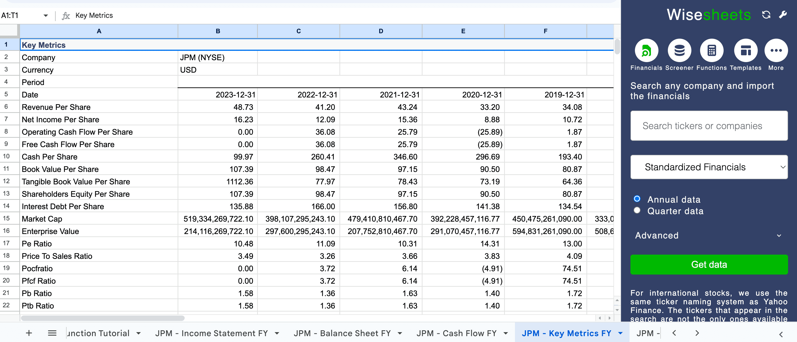

## Table of Contents

## What are bank stocks and why are they important to investors?

Bank stocks are shares of companies that provide banking services, like taking deposits and giving loans. These companies can be big national banks or smaller local ones. When you buy bank stocks, you become a part-owner of the bank and can earn money if the bank does well. The price of bank stocks can go up and down based on how well the bank is doing and what's happening in the economy.

Bank stocks are important to investors because they can be a good way to make money. Banks often pay dividends, which are regular payments to shareholders, and these can provide a steady income. Also, if the economy is doing well, bank stocks can grow in value. But, they can also be risky because banks can have problems if the economy is bad or if they make bad loans. So, investors need to think carefully about the risks and rewards when they decide to invest in bank stocks.

## What are the basic financial metrics used to evaluate any stock?

When people want to understand how a company is doing, they look at some basic financial numbers called metrics. These help them decide if a stock is a good buy. One important metric is the price-to-earnings ratio, or P/E ratio. This tells you how much you're paying for a company's earnings. A lower P/E might mean the stock is a good deal, but it depends on the industry and other factors. Another key metric is earnings per share (EPS), which shows how much money the company made for each share of its stock. A higher EPS usually means the company is doing well.

Another useful metric is the dividend yield, which shows how much money you get back from the company as a percentage of the stock's price. This is important if you want to earn regular income from your investment. The debt-to-equity ratio is also important because it shows how much the company is borrowing compared to what the shareholders own. A high ratio might mean the company is risky because it has a lot of debt. Finally, the return on equity (ROE) measures how well the company is using the money shareholders have invested to make a profit. A higher ROE is usually better, but you need to compare it with other companies in the same industry to know if it's really good.

These metrics give you a basic idea of a company's health and potential as an investment. But remember, no single number tells the whole story. You need to look at all these metrics together and think about what's happening in the world and the company's industry. That way, you can make a smarter choice about whether to buy, hold, or sell a stock.

## How do price-to-earnings (P/E) ratios apply specifically to bank stocks?

The price-to-earnings (P/E) ratio is a useful tool for looking at bank stocks, just like it is for other kinds of stocks. For banks, the P/E ratio tells you how much investors are willing to pay for each dollar of the bank's earnings. A lower P/E ratio might mean that the bank stock is cheaper compared to its earnings, which could be a good sign if you think the bank will keep making money. But a high P/E ratio might mean that the stock is expensive, and you might want to think twice before buying it, unless you believe the bank's earnings will grow a lot in the future.

When you're looking at P/E ratios for bank stocks, it's important to compare them with other banks in the same industry. Banks can have different P/E ratios because of things like how much they earn from loans, how much they pay in interest, and how well they manage their money. So, even if a bank's P/E ratio looks high or low, you need to see how it stacks up against other banks to really understand if it's a good deal. This way, you can make a smarter choice about whether to invest in that bank stock.

## What is the significance of the price-to-book (P/B) ratio for banks?

The price-to-book (P/B) ratio is really important when looking at bank stocks. It tells you how much investors are willing to pay for the bank's assets minus its debts. You find the P/B ratio by dividing the bank's stock price by its book value per share. The book value is what the bank would be worth if it sold all its assets and paid off all its debts. A low P/B ratio might mean the bank's stock is a good deal because you're paying less for its assets. But a high P/B ratio could mean the stock is pricey, and you might want to be careful before buying it.

When you're checking out the P/B ratio for a bank, it's a good idea to compare it with other banks. Banks can have different P/B ratios because of things like how they make money, how much risk they take, and how well they manage their money. So, even if a bank's P/B ratio looks high or low, you need to see how it stacks up against other banks to really understand if it's a good buy. This way, you can make a smarter choice about whether to invest in that bank stock.

## How can return on assets (ROA) be used to assess the efficiency of a bank?

Return on assets (ROA) is a useful way to see how well a bank is using its money to make a profit. ROA is found by dividing the bank's net income by its total assets. This number shows how much profit the bank makes for each dollar of assets it has. A higher ROA means the bank is doing a good job at turning its assets into profits. For example, if a bank has an ROA of 1%, it makes one cent of profit for every dollar of assets it owns.

When you're looking at a bank's ROA, it's important to compare it with other banks. Different banks can have different ROAs because of things like how they make money, what kind of loans they give out, and how well they manage their money. If a bank's ROA is higher than other banks in the same industry, it might mean that bank is more efficient and better at making money from its assets. So, ROA can help investors decide if a bank is a good investment by showing how efficiently it uses its resources to generate profits.

## What does return on equity (ROE) tell us about a bank's profitability?

Return on equity (ROE) is a key number that shows how good a bank is at making money from the money its shareholders have put in. You find ROE by dividing the bank's net income by the total equity, which is the money shareholders have invested. A high ROE means the bank is doing a great job at using that money to make profits. For example, if a bank has an ROE of 15%, it makes 15 cents of profit for every dollar shareholders have invested.

When you're looking at a bank's ROE, it's helpful to compare it with other banks. Different banks can have different ROEs because of things like how they make money, how much they pay in interest, and how well they manage their money. If a bank's ROE is higher than other banks in the same industry, it might mean that bank is more profitable and better at using its shareholders' money to make profits. So, ROE can help investors decide if a bank is a good investment by showing how well it turns shareholder money into profits.

## How do net interest margins (NIM) influence the evaluation of bank stocks?

Net interest margin (NIM) is an important number that helps investors understand how well a bank is doing with its main job: making money from the difference between what it charges for loans and what it pays for deposits. NIM is found by taking the difference between the interest income from loans and the interest expense on deposits, then dividing that by the bank's total earning assets. A higher NIM means the bank is doing a good job at making money from its loans and managing the cost of its deposits. When investors see a high NIM, it can make them feel more confident about the bank's ability to earn profits.

When looking at bank stocks, investors often compare the NIM of different banks to see which ones are better at making money from their main business. A bank with a higher NIM might be seen as a better investment because it shows the bank is efficient and good at managing its money. But, it's important to remember that NIM can be affected by things like changes in interest rates or the economy. So, investors need to look at NIM along with other numbers like ROE and ROA to get a full picture of how well a bank is doing and whether its stock is a good buy.

## What role do loan loss provisions play in analyzing the health of a bank?

Loan loss provisions are the money banks set aside to cover loans that might not be paid back. This is important because it shows how careful a bank is being about the risk of people not paying their loans. If a bank has a lot of loan loss provisions, it might mean they think a lot of loans won't be paid back. This can be a sign that the bank is being cautious, but it can also mean they are worried about their loans and the health of the economy. Investors look at loan loss provisions to see if a bank is managing its risks well.

When analyzing the health of a bank, loan loss provisions give investors a clue about how the bank is doing. If a bank suddenly increases its loan loss provisions, it might mean they are seeing more problems with their loans. This can make investors worried because it could mean the bank's profits will go down. On the other hand, if a bank keeps its loan loss provisions steady or lowers them, it might mean they feel good about their loans and the economy. So, loan loss provisions are a key part of understanding a bank's financial health and how risky it might be as an investment.

## How can the efficiency ratio help in comparing different banks?

The efficiency ratio is a simple way to see how well a bank is doing its job. It tells you how much it costs the bank to make one dollar of money. You find it by dividing the bank's expenses by its revenue. A lower efficiency ratio means the bank is good at keeping its costs down and making more money from what it does. When you want to compare different banks, looking at their efficiency ratios helps you see which ones are better at managing their money and running their business.

When you compare the efficiency ratios of different banks, you can see which ones are doing a better job. If one bank has a lower efficiency ratio than another, it means they are spending less to make the same amount of money. This can make you feel more confident about investing in that bank because it shows they are good at keeping costs low and making profits. But remember, you should also look at other numbers like ROE and NIM to get a full picture of how well a bank is doing overall.

## What advanced metrics should be considered when conducting a deep dive into bank stocks?

When you want to really understand how a bank is doing, you need to look at some advanced numbers that give you more details about its health and how it's making money. One important number is the Tier 1 Capital Ratio, which shows how strong and safe a bank is. It tells you how much of the bank's money is in safe, easy-to-sell assets. A higher Tier 1 Capital Ratio means the bank is better at handling tough times. Another useful number is the net charge-off rate, which shows how much money the bank loses from loans that people don't pay back. A lower net charge-off rate means the bank is doing a good job at making sure people pay their loans.

You should also look at the loan-to-deposit ratio, which tells you how much of the money the bank gets from deposits it is lending out. A high loan-to-deposit ratio might mean the bank is taking more risks, but it can also mean they're doing a good job at making money from loans. Another number to consider is the cost of funds, which shows how much the bank is paying for the money it uses. If the cost of funds is low, it means the bank is doing well at keeping its costs down. Finally, the non-interest income ratio tells you how much money the bank makes from things other than loans, like fees for services. A higher non-interest income ratio can mean the bank is good at making money in different ways, which can make it a stronger investment.

## How do regulatory environments affect the metrics used to evaluate bank stocks?

The rules and laws that banks have to follow can change the numbers we use to look at how well they're doing. For example, if the government says banks need to keep more money safe and not lend it out, this can make the Tier 1 Capital Ratio go up. That's because the bank has to keep more money in safe places, which makes it look stronger. But, it might also mean the bank makes less money from loans, which can make other numbers like the net interest margin go down. So, when we look at these numbers, we need to think about what the rules are saying banks can and can't do.

Also, if the rules change a lot, it can make it hard to compare banks from different countries or even different times. For example, if one country has really strict rules about how much money banks need to keep safe, their numbers might look different from banks in a country with looser rules. This means that when we're trying to decide if a bank stock is a good buy, we need to think about the rules in that bank's country and how they might change the numbers we're looking at. That way, we can get a better idea of how the bank is really doing.

## What are some sector-specific challenges and opportunities that might influence the metrics used for bank stock evaluation?

Banks face special challenges and chances that can change the numbers we use to look at their stocks. One big challenge is interest rates. When interest rates go up, banks can make more money from loans, which might make their net interest margin go up. But if rates go up too fast, it can make it harder for people to pay back their loans, which can lead to more loan loss provisions and lower profits. Another challenge is competition. If new banks or fintech companies come in, they can take away customers and make it harder for banks to make money, which can affect things like the efficiency ratio and return on equity.

On the other hand, there are also good chances for banks. Technology can help banks do things better and cheaper, which can make their efficiency ratio go down and their return on assets go up. Also, when the economy is doing well, more people want to borrow money, which can help banks make more money from loans and improve their net interest margin. But, banks need to be careful because if the economy gets bad, they might see more loan problems and higher loan loss provisions. So, when we look at bank stock numbers, we need to think about these challenges and chances to get a full picture of how the bank is doing.

## What are Bank-Specific Evaluation Metrics and How Can They Be Understood?

Banks occupy a unique position within the financial sector, primarily due to their distinct business models that revolve around accepting deposits and offering loans. Evaluating bank stocks necessitates a focus on specific financial metrics that reflect these operational dynamics. These metrics provide insights not just into a bank's current financial health, but also into its sustainable competitive position and regulatory standing.

Price-to-Earnings (P/E) and Price-to-Book (P/B) ratios are pivotal in determining a bank's valuation in comparison to its industry peers. The P/E ratio is calculated as:

$$
\text{P/E Ratio} = \frac{\text{Market Price per Share}}{\text{Earnings per Share}}
$$

This ratio indicates how much investors are willing to pay for each dollar of earnings, often revealing market sentiments about growth potential. Conversely, the P/B ratio is given by:

$$
\text{P/B Ratio} = \frac{\text{Market Price per Share}}{\text{Book Value per Share}}
$$

It helps investors understand how a bank's market value compares to its net asset value, indicating whether a bank is over or undervalued relative to its assets.

The efficiency ratio is another critical metric. It evaluates how a bank manages its expenses relative to revenues, which is crucial for assessing operational efficiency. In banking terms, a lower efficiency ratio denotes higher efficiency, as it implies that a smaller proportion of income is consumed by operational costs. This is expressed as:

$$
\text{Efficiency Ratio} = \frac{\text{Non-interest Expenses}}{\text{Revenue}}
$$

Liquidity and capital adequacy are assessed using the Loan-to-Deposit Ratio (LDR) and various capital ratios. The LDR measures a bank's ability to cover loan losses and meet withdrawal demands, calculated as:

$$
\text{LDR} = \frac{\text{Total Loans}}{\text{Total Deposits}} \times 100 \%
$$

This ratio helps determine a bank’s balance between loans and deposits, with a high LDR indicating potential [liquidity](/wiki/liquidity-risk-premium) risks, while a low LDR may suggest inefficiencies in putting funds to work profitably.

Capital ratios, such as the Common Equity Tier 1 (CET1) ratio, are vital for assessing a bank's financial strength and regulatory compliance. These ratios ensure that the bank has sufficient capital to absorb losses in times of financial distress, promoting stability within the financial system. The CET1 ratio is defined as:

$$
\text{CET1 Ratio} = \frac{\text{CET1 Capital}}{\text{Risk-Weighted Assets}}
$$

Banks must maintain these capital ratios above minimum regulatory thresholds to mitigate systemic risks and ensure ongoing operational viability.

In summary, these bank-specific evaluation metrics are indispensable tools in the analysis of bank stocks, providing comprehensive insights into their valuation, operational efficiency, liquidity, and regulatory compliance.

## What are the key performance metrics for algorithmic trading strategies?

Algorithmic trading employs predefined algorithms to execute trades, leveraging speed and frequency that surpass human capabilities. Evaluating the performance of these strategies requires specific metrics to ensure they are both profitable and sustainable over time. Key metrics include the Sharpe Ratio, Maximum Drawdown, Win Rate, and Profit Factor.

The Sharpe Ratio is a fundamental metric used to assess the risk-adjusted returns of an [algorithmic trading](/wiki/algorithmic-trading) strategy. It is defined as:

$$
\text{Sharpe Ratio} = \frac{R_p - R_f}{\sigma_p}
$$

where $R_p$ represents the expected return of the portfolio, $R_f$ is the risk-free rate, and $\sigma_p$ is the standard deviation of the portfolio's excess return. A higher Sharpe Ratio indicates better risk-adjusted performance.

Maximum Drawdown is another critical metric that measures the largest peak-to-trough decline in a trading strategy's value before a new peak is achieved. It is vital for understanding the potential risk and resilience of a strategy during periods of market downturns. A strategy with a lower Maximum Drawdown is considered safer and more robust.

Additional metrics such as Win Rate and Profit Factor provide insights into a strategy's effectiveness. The Win Rate reflects the proportion of profitable trades to total trades, offering a simple measure of accuracy. Meanwhile, Profit Factor is calculated as:

$$
\text{Profit Factor} = \frac{\text{Gross Profit}}{\text{Gross Loss}}
$$

This ratio helps in determining the overall profitability by comparing the gains from winning trades to the losses incurred from losing trades.

Together, these metrics are essential for evaluating the success and reliability of algorithmic trading strategies. Understanding and optimizing them can lead to improved performance and better risk management in competitive financial markets.

## References & Further Reading

[1]: ["Advances in Financial Machine Learning"](https://www.amazon.com/Advances-Financial-Machine-Learning-Marcos/dp/1119482089) by Marcos Lopez de Prado

[2]: ["Evidence-Based Technical Analysis: Applying the Scientific Method and Statistical Inference to Trading Signals"](https://www.amazon.com/Evidence-Based-Technical-Analysis-Scientific-Statistical/dp/0470008741) by David Aronson

[3]: ["Machine Learning for Algorithmic Trading"](https://github.com/stefan-jansen/machine-learning-for-trading) by Stefan Jansen

[4]: ["Quantitative Trading: How to Build Your Own Algorithmic Trading Business"](https://www.amazon.com/Quantitative-Trading-Build-Algorithmic-Business/dp/1119800064) by Ernest P. Chan

[5]: Fabozzi, F. J., & Mercurio, A. (2019). ["Interest Rate Models: Expectations, Future Insights and Interest Rate Modeling."](https://www.bayes.city.ac.uk/__data/assets/pdf_file/0010/763336/Russo_Bayes_08-11-23.pdf) John Wiley & Sons.

[6]: Damodaran, A. (2012). ["Investment Valuation: Tools and Techniques for Determining the Value of Any Asset."](https://books.google.com/books/about/Investment_Valuation.html?id=5SRHAAAAQBAJ) Wiley Finance.

[7]: ["The Handbook of Mortgage-Backed Securities"](https://www.amazon.com/Handbook-Mortgage-Backed-Securities-7th/dp/0198785771) by Frank J. Fabozzi

