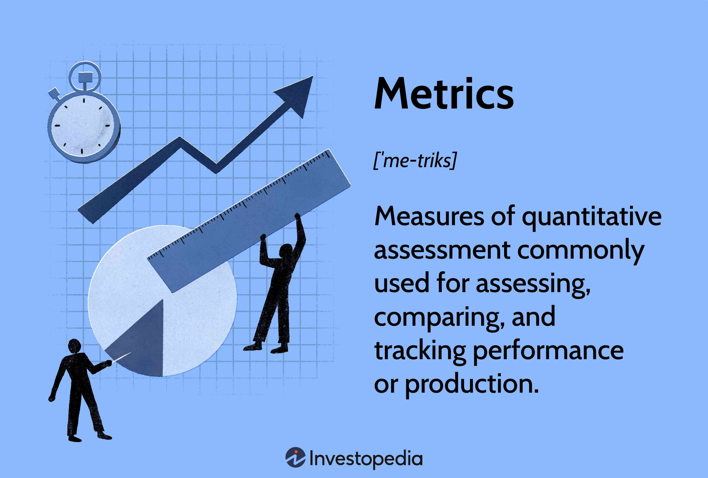

Evaluating bank stocks and employing algorithmic trading strategies are crucial activities for investors and analysts within financial markets. By integrating financial metrics that are specific to banks with key performance indicators derived from algorithmic trading strategies, decision-making processes can be significantly enhanced. This article focuses on critical evaluation metrics for bank stock analysis and essential tools for assessing the performance of algorithmic trading strategies. The insights offered are designed to assist both traditional equity investors and participants in the burgeoning field of algorithmic trading. These methodologies, grounded in robust analytical frameworks, serve as pivotal resources in navigating the complexities of modern financial markets.

## Table of Contents

## Understanding Bank-Specific Evaluation Metrics

Banks occupy a unique position within the financial sector, primarily due to their distinct business models that revolve around accepting deposits and offering loans. Evaluating bank stocks necessitates a focus on specific financial metrics that reflect these operational dynamics. These metrics provide insights not just into a bank's current financial health, but also into its sustainable competitive position and regulatory standing.

Price-to-Earnings (P/E) and Price-to-Book (P/B) ratios are pivotal in determining a bank's valuation in comparison to its industry peers. The P/E ratio is calculated as:

$$
\text{P/E Ratio} = \frac{\text{Market Price per Share}}{\text{Earnings per Share}}
$$

This ratio indicates how much investors are willing to pay for each dollar of earnings, often revealing market sentiments about growth potential. Conversely, the P/B ratio is given by:

$$
\text{P/B Ratio} = \frac{\text{Market Price per Share}}{\text{Book Value per Share}}
$$

It helps investors understand how a bank's market value compares to its net asset value, indicating whether a bank is over or undervalued relative to its assets.

The efficiency ratio is another critical metric. It evaluates how a bank manages its expenses relative to revenues, which is crucial for assessing operational efficiency. In banking terms, a lower efficiency ratio denotes higher efficiency, as it implies that a smaller proportion of income is consumed by operational costs. This is expressed as:

$$
\text{Efficiency Ratio} = \frac{\text{Non-interest Expenses}}{\text{Revenue}}
$$

Liquidity and capital adequacy are assessed using the Loan-to-Deposit Ratio (LDR) and various capital ratios. The LDR measures a bank's ability to cover loan losses and meet withdrawal demands, calculated as:

$$
\text{LDR} = \frac{\text{Total Loans}}{\text{Total Deposits}} \times 100 \%
$$

This ratio helps determine a bank’s balance between loans and deposits, with a high LDR indicating potential [liquidity](/wiki/liquidity-risk-premium) risks, while a low LDR may suggest inefficiencies in putting funds to work profitably.

Capital ratios, such as the Common Equity Tier 1 (CET1) ratio, are vital for assessing a bank's financial strength and regulatory compliance. These ratios ensure that the bank has sufficient capital to absorb losses in times of financial distress, promoting stability within the financial system. The CET1 ratio is defined as:

$$
\text{CET1 Ratio} = \frac{\text{CET1 Capital}}{\text{Risk-Weighted Assets}}
$$

Banks must maintain these capital ratios above minimum regulatory thresholds to mitigate systemic risks and ensure ongoing operational viability.

In summary, these bank-specific evaluation metrics are indispensable tools in the analysis of bank stocks, providing comprehensive insights into their valuation, operational efficiency, liquidity, and regulatory compliance.

## Algorithmic Trading Strategies: Key Performance Metrics

Algorithmic trading employs predefined algorithms to execute trades, leveraging speed and frequency that surpass human capabilities. Evaluating the performance of these strategies requires specific metrics to ensure they are both profitable and sustainable over time. Key metrics include the Sharpe Ratio, Maximum Drawdown, Win Rate, and Profit Factor.

The Sharpe Ratio is a fundamental metric used to assess the risk-adjusted returns of an [algorithmic trading](/wiki/algorithmic-trading) strategy. It is defined as:

$$
\text{Sharpe Ratio} = \frac{R_p - R_f}{\sigma_p}
$$

where $R_p$ represents the expected return of the portfolio, $R_f$ is the risk-free rate, and $\sigma_p$ is the standard deviation of the portfolio's excess return. A higher Sharpe Ratio indicates better risk-adjusted performance.

Maximum Drawdown is another critical metric that measures the largest peak-to-trough decline in a trading strategy's value before a new peak is achieved. It is vital for understanding the potential risk and resilience of a strategy during periods of market downturns. A strategy with a lower Maximum Drawdown is considered safer and more robust.

Additional metrics such as Win Rate and Profit Factor provide insights into a strategy's effectiveness. The Win Rate reflects the proportion of profitable trades to total trades, offering a simple measure of accuracy. Meanwhile, Profit Factor is calculated as:

$$
\text{Profit Factor} = \frac{\text{Gross Profit}}{\text{Gross Loss}}
$$

This ratio helps in determining the overall profitability by comparing the gains from winning trades to the losses incurred from losing trades.

Together, these metrics are essential for evaluating the success and reliability of algorithmic trading strategies. Understanding and optimizing them can lead to improved performance and better risk management in competitive financial markets.

## Tools and Techniques for Performance Evaluation in Algo Trading

Backtesting platforms are essential tools for simulating the historical performance of algorithmic trading strategies by applying them to past market data. Such platforms allow traders to assess how their strategies would have performed in various market conditions, providing an opportunity to optimize and refine them before deployment in live trading. Popular [backtesting](/wiki/backtesting) platforms like QuantConnect and MetaTrader enable users to test strategies across different timeframes and assets, incorporating factors such as slippage and spread variations that affect real-world trading outcomes.

Visualization tools play a fundamental role in interpreting complex data associated with algorithmic trading strategies. By using charts and graphs, traders can gain deeper insights into performance metrics, discover patterns, and make informed decisions. Tools such as matplotlib and seaborn in Python facilitate the creation of detailed visual representations, allowing analysts to track parameters like cumulative returns, drawdowns, and [volatility](/wiki/volatility-trading-strategies) over time. These visual aids are critical for communicating findings to stakeholders and guiding strategic adjustments.

Statistical analysis software is vital for assessing the performance metrics of algorithmic strategies, including their probabilities and statistical significance. By applying tools like R or Python's scipy.stats, traders can conduct detailed statistical tests to validate that observed performances are not due to random chance. Techniques such as hypothesis testing and regression analysis can evaluate the stability and effectiveness of trading strategies, ensuring they are reliable when moving from historical to live environments.

A crucial aspect of evaluating algorithmic strategies is the understanding of overfitting—where a model performs excellently on training data but poorly on unseen data. Overfitting can lead to inflated expectations of a strategy's profitability. To combat this, practitioners must employ cross-validation techniques, ensure their models have simplicity, and favor robust algorithms like regularized linear models or decision trees with pruning.

Accounting for transaction costs is another critical consideration. These costs include bid-ask spreads, commissions, and taxes, all of which can significantly impact overall strategy profitability. For accurate evaluation, these costs must be integrated into backtesting models, giving a realistic picture of potential returns. Traders often use sensitivity analysis to assess how different levels of transaction costs might influence strategy viability.

These tools and techniques collectively provide a robust framework for evaluating algorithmic trading strategies, helping traders achieve performance optimization and risk management in increasingly complex financial markets.

## Comparative Analysis: Traditional vs. Algorithmic Metrics in Financial Analysis

In financial analysis, understanding the distinct yet complementary roles of traditional bank-specific metrics and algorithmic trading metrics is crucial for investors aiming to optimize their decision-making processes. Traditional metrics such as profitability ratios and risk indicators focus primarily on the financial health and sustainability of banks. These measures provide insights into a bank's efficiency, risk management capacity, and overall valuation in the context of its peers. Metrics like the Price-to-Earnings (P/E) ratio reflect a bank's market valuation relative to its earnings, while the Loan-to-Deposit Ratio (LDR) and Capital Ratios examine liquidity and capital adequacy, essential for maintaining operational stability.

Conversely, algorithmic trading metrics concentrate on assessing the performance and efficiency of trading strategies executed through automated systems. Metrics such as the Sharpe Ratio, which evaluates risk-adjusted returns, and Maximum Drawdown, which indicates the potential risk by measuring the peak-to-trough loss, are central in examining trading strategy efficacy. These metrics help quantify the trade-off between risk and reward, guiding the refinement and development of algorithmic models.

While both sets of metrics serve the overarching goal of maximizing financial gain and minimizing risk, they approach this goal from distinct angles. Traditional metrics offer a snapshot of intrinsic value and financial robustness, imperative for long-term strategic planning and regulatory compliance. In contrast, algorithmic metrics prioritize short-term profit opportunities and risk management within volatile market scenarios, demanding rapid adaptation and precision.

Investors increasingly recognize the importance of integrating these two approaches to foster a comprehensive understanding of market dynamics. A holistic perspective that encompasses both traditional evaluation methods and algorithmic trading insights can yield more nuanced analyses. By considering fundamental financial health alongside advanced trading performance metrics, investors can better navigate the complexities of the financial landscape and make well-informed decisions. As the financial sector evolves, this integrative approach will likely become more critical in achieving sustained investment success.

## Conclusion

The integration of bank-specific evaluation metrics with algorithmic performance metrics offers investors a robust analytical framework, equipping them to address the demands of a dynamic financial landscape. As markets evolve, the ability to synthesize diverse data points becomes crucial, granting insights into both the fundamental and technical aspects of financial analysis.

Bank-specific metrics such as the Price-to-Earnings (P/E) and Loan-to-Deposit Ratios provide foundational understanding of a bank's financial health, enabling investors to assess profitability, liquidity, and risk. These metrics lay the groundwork for judging a bank’s stability and growth potential. Concurrently, algorithmic performance metrics like the Sharpe Ratio and Maximum Drawdown offer a quantitative lens through which the efficiency and robustness of trading strategies are evaluated. These metrics focus on optimizing risk-adjusted returns and quantifying strategy resilience under various market conditions.

This confluence of traditional and algorithmic evaluation not only enriches the analytical process but also fosters a nuanced approach to investment. For example, combining fundamental metrics with trading strategy performance can unearth hidden opportunities and mitigate risks that might be overlooked when considering each methodology in isolation. Through data visualization and statistical analysis, investors are better positioned to interpret complex financial datasets, effectively bridging the gap between qualitative assessments and quantitative predictions.

By embracing both methodologies, investors can make more informed decisions that align with their strategic objectives. This holistic viewpoint enhances portfolio management by balancing the stability provided by bank-specific fundamentals with the dynamic opportunities afforded by algorithmic trading scrutiny. As such, the integrated framework has the potential to unlock superior investment outcomes, adapting seamlessly to the intricacies of both current market environments and future financial innovations.

## References & Further Reading

[1]: ["Advances in Financial Machine Learning"](https://www.amazon.com/Advances-Financial-Machine-Learning-Marcos/dp/1119482089) by Marcos Lopez de Prado

[2]: ["Evidence-Based Technical Analysis: Applying the Scientific Method and Statistical Inference to Trading Signals"](https://www.amazon.com/Evidence-Based-Technical-Analysis-Scientific-Statistical/dp/0470008741) by David Aronson

[3]: ["Machine Learning for Algorithmic Trading"](https://github.com/stefan-jansen/machine-learning-for-trading) by Stefan Jansen

[4]: ["Quantitative Trading: How to Build Your Own Algorithmic Trading Business"](https://www.amazon.com/Quantitative-Trading-Build-Algorithmic-Business/dp/1119800064) by Ernest P. Chan

[5]: Fabozzi, F. J., & Mercurio, A. (2019). ["Interest Rate Models: Expectations, Future Insights and Interest Rate Modeling."](https://www.bayes.city.ac.uk/__data/assets/pdf_file/0010/763336/Russo_Bayes_08-11-23.pdf) John Wiley & Sons.

[6]: Damodaran, A. (2012). ["Investment Valuation: Tools and Techniques for Determining the Value of Any Asset."](https://books.google.com/books/about/Investment_Valuation.html?id=5SRHAAAAQBAJ) Wiley Finance.

[7]: ["The Handbook of Mortgage-Backed Securities"](https://www.amazon.com/Handbook-Mortgage-Backed-Securities-7th/dp/0198785771) by Frank J. Fabozzi

