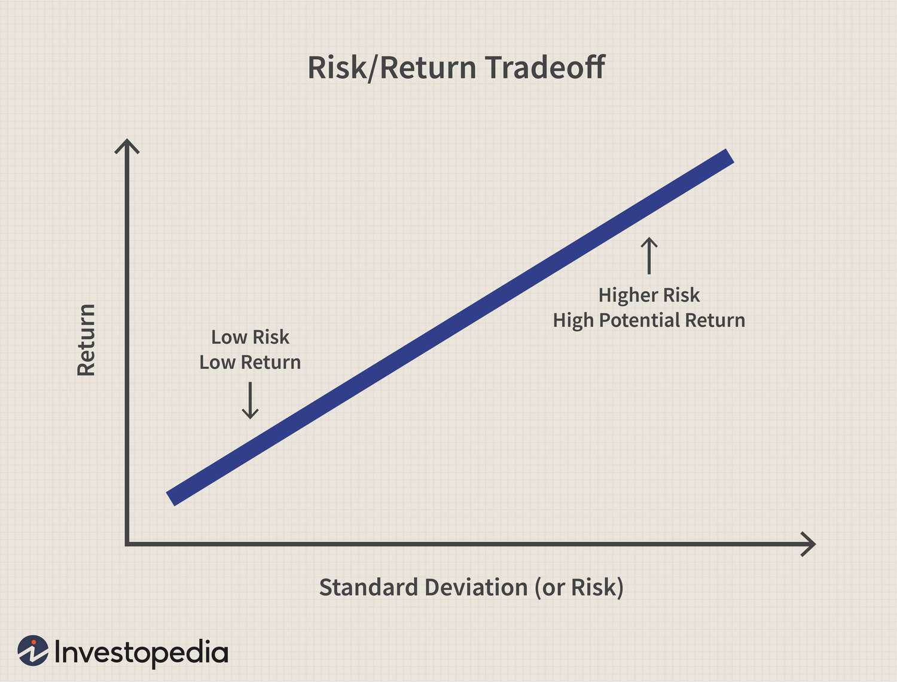

Understanding the risk-return tradeoff is crucial for any investment strategy. This fundamental concept involves balancing potential returns against the risks associated with an investment. In the domain of mutual funds and modern investment portfolios, this tradeoff plays a pivotal role in shaping investor decisions. Mutual funds, which pool money from numerous investors to purchase a diversified portfolio of stocks, bonds, or other securities, inherently carry various types of risks and opportunities for returns. 

Algorithmic trading, characterized by the use of computer algorithms to execute trades at high speed and volume, has gained prominence as a tool to manage these risks efficiently. By automating trading decisions and executing complex strategies, algorithmic trading enables investors to better quantify and manage risk, potentially leading to enhanced returns. 



This article explores how to evaluate risk-return for mutual funds using algorithmic trading. It highlights the symbiotic relationship between traditional financial analysis and cutting-edge technology, offering insights into how investors can optimize their portfolios. Through a multidisciplinary approach, combining financial metrics with the power of algorithms, investors can more effectively navigate the intricate landscape of today's financial markets.

## Table of Contents

## Understanding Mutual Fund Risk-Return Tradeoff

The risk-return tradeoff is a fundamental principle in investment, dictating that potential returns rise with an increase in risk. This concept is particularly pertinent to mutual funds, which pool resources from multiple investors to purchase a diversified portfolio of assets. The primary objective in mutual fund investment is to balance the potential for returns against the risks involved, aiming for an optimal risk-return ratio.

The idea behind the risk-return tradeoff is that high-risk investments offer the chance of higher returns but also raise the potential for substantial losses. Conversely, lower-risk investments tend to provide more stable returns but offer less opportunity for substantial gains. Therefore, understanding and managing this tradeoff is crucial for investors to align their investment strategies with their risk tolerance and financial goals.

Mutual funds encompass various types of risks that investors need to consider. Market risk is the likelihood of an investment losing value due to declines in the financial market as a whole, impacted by factors such as economic recessions or geopolitical events. For example, a mutual fund comprising primarily of equity shares is susceptible to market fluctuations.

Credit risk involves the possibility that bond issuers within a mutual fund will default, failing to meet their debt obligations. This risk is particularly relevant for mutual funds heavily invested in bonds or other debt instruments. Investors should evaluate the credit ratings of these instruments to gauge the likelihood of default.

Liquidity risk is the potential difficulty in quickly converting mutual fund holdings into cash without a significant loss in value. This risk arises when there is insufficient market demand for the fund's assets, leading to challenges in selling investments without impacting their prices.

Effectively managing these risks involves a diversified portfolio strategy, where the mutual fund invests in a mix of asset categories. Diversification limits exposure to any single asset or market, thus lowering the impact of individual asset performance on the overall fund's returns.

By understanding these risks and tailoring their mutual fund choices according to personal financial circumstances and market conditions, investors can make informed decisions that optimize their portfolios’ risk-return balance.

## Key Metrics for Evaluating Risk-Return in Mutual Funds

Mutual fund performance is largely evaluated using several key metrics that help investors understand the risk-return tradeoff. By using financial metrics such as Alpha, Beta, Standard Deviation, and Sharpe Ratio, investors can gain insights into the potential and risks associated with mutual funds.

### Alpha

Alpha measures a fund's performance on a risk-adjusted basis relative to a benchmark index, representing the excess return of an investment compared to the market return. It is expressed by the formula:

$$
\alpha = R_i - (R_f + \beta \times (R_m - R_f))
$$

where $R_i$ is the return of the investment, $R_f$ is the risk-free rate, $\beta$ is the Beta of the investment, and $R_m$ is the market return. A positive alpha indicates that the mutual fund has performed better than the market, whereas a negative alpha signifies underperformance.

### Beta

Beta assesses the [volatility](/wiki/volatility-trading-strategies) of a fund relative to the market. A beta of 1 implies that the fund's price will move with the market, a beta greater than 1 denotes higher volatility than the market, and a beta less than 1 indicates lower volatility. This metric is crucial for investors targeting funds that align with their risk tolerance.

### Standard Deviation

Standard Deviation quantifies the [dispersion](/wiki/dispersion-trading) of a fund's returns relative to its mean, offering insights into its historical volatility. A higher standard deviation indicates greater variability in past returns, suggesting higher risk.

$$
\sigma = \sqrt{\frac{1}{N} \sum_{i=1}^{N}(R_i - \bar{R})^2}
$$

where $\sigma$ is the standard deviation, $N$ is the number of observations, $R_i$ is each individual return, and $\bar{R}$ is the mean return. This measure helps investors understand the potential range of returns they might expect from a fund.

### Sharpe Ratio

The Sharpe Ratio quantifies how well a mutual fund compensates investors for the risk taken. It is calculated as:

$$
\text{Sharpe Ratio} = \frac{R_p - R_f}{\sigma_p}
$$

where $R_p$ is the return of the portfolio, $R_f$ is the risk-free rate, and $\sigma_p$ is the standard deviation of the portfolio's excess return. A higher Sharpe Ratio indicates a more attractive risk-adjusted return.

### Applicability in Real-World Scenarios

Applying these metrics can aid in selecting funds that align with specific investment goals. For instance, an investor seeking stable returns may prefer a fund with a low Beta and high Sharpe Ratio. Conversely, an aggressive investor might chase higher Alpha despite inherent volatility.

In practical scenarios, consider a mutual fund with a historical return of 12%, a market return of 10%, and a risk-free rate of 2%. If the fund's Beta is 0.9, Alpha is calculated to be:

$$
\alpha = 0.12 - (0.02 + 0.9 \times (0.10 - 0.02)) = 0.12 - (0.02 + 0.072) = 0.028
$$

This positive Alpha suggests outperformance relative to the market. Tools like Python can be used to automate these calculations for various funds to streamline analysis and decision-making processes. For example:

```python
def calculate_alpha(ri, rf, beta, rm):
    return round(ri - (rf + beta * (rm - rf)), 3)

calculate_alpha(0.12, 0.02, 0.9, 0.10)
# Output: 0.028
```

Understanding and applying these metrics allows investors to devise strategies that balance potential rewards against the risks, optimizing their investment portfolios accordingly.

## Algorithmic Trading in Mutual Funds

Algorithmic trading refers to the use of computer algorithms to manage trading processes in a systematic and automated manner. It significantly influences the efficiency and risk management in mutual fund investments by allowing for quick and precise execution of trades, minimizing manual errors, and optimizing strategies for better returns. At its core, [algorithmic trading](/wiki/algorithmic-trading) enables traders to implement data-driven decisions, leveraging large sets of financial data and analytical tools.

Algorithms in trading work to automate complex trading strategies that would be challenging to execute manually. By evaluating vast amounts of market data in real-time, algorithms can identify patterns or anomalies and execute trades at speeds and frequencies beyond human capability. This technology enhances trading efficiency by allowing mutual funds to quickly respond to changes in market conditions, achieving better accuracy in buying and selling decisions.

One key aspect of algorithmic trading is risk management. Algorithms can be programmed to follow predefined risk parameters, ensuring that exposures are maintained within acceptable levels. This involves setting stop-loss orders, employing hedging strategies, and diversifying portfolios dynamically as conditions change. By having such mechanisms in place, mutual funds can safeguard against significant market fluctuations and improve overall portfolio resilience.

In mutual funds, several algorithmic trading strategies are commonly used. Some of these include:

1. **Trend Following**: This strategy identifies and capitalizes on established price trends. Algorithms use moving averages and other indicators to detect momentum and generate buy or sell signals, exploiting the continuation of market trends.

2. **Mean Reversion**: Based on the principle that prices tend to revert to their historical averages, this strategy uses statistical models to identify price deviations from the norm and execute trades to capitalize on eventual price corrections.

3. **Arbitrage**: Algorithms find and exploit price differentials for the same asset across different markets or instruments. By buying low in one market and selling high in another, mutual funds can earn risk-free profits.

4. **Sentiment Analysis**: Utilizing natural language processing and machine learning, algorithms assess public sentiment from news or social media and forecast market movements. This strategy is increasingly being integrated into trading systems to enhance decision-making.

5. **Market Making**: Algorithms provide liquidity to markets by placing both buy and sell orders simultaneously. This strategy profits from the bid-ask spread and requires quick execution to adjust to market demand.

Python, a popular programming language in finance, is often used for implementing algorithmic trading strategies. For example, libraries like `pandas` for data manipulation, `numpy` for numerical calculations, and `[backtrader](/wiki/backtrader)` for [backtesting](/wiki/backtesting) trading strategies are instrumental in developing robust trading systems.

```python
import pandas as pd
import numpy as np
import backtrader as bt

# Example of a simple moving average crossover strategy
class SmaCrossover(bt.SignalStrategy):
    def __init__(self):
        sma1 = bt.ind.SMA(period=10)  # Short-term SMA
        sma2 = bt.ind.SMA(period=30)  # Long-term SMA
        self.signal_add(bt.SIGNAL_LONG, sma1 > sma2)  # Long if sma1 > sma2
```

As mutual funds adopt and refine algorithmic trading, these strategies enable them to optimize trade execution, manage risks effectively, and ultimately enhance the performance of their investment portfolios.

## Integrating Financial Analysis with Algo Trading

Financial analysis tools play a crucial role in enhancing the effectiveness of algorithmic trading in mutual funds. By providing quantitative and qualitative assessments of market data, these tools offer insights that algorithms can use to optimize trading strategies. This synergy allows for improved decision-making and offers a significant edge in dynamic markets.

### How Financial Analysis Tools Complement Algorithmic Trading

Financial analysis tools, such as those for technical analysis, [fundamental analysis](/wiki/fundamental-analysis), and statistical modeling, provide algorithms with necessary input parameters and constraints. For instance, algorithms can use data like moving averages, [volume](/wiki/volume-trading-strategy) indicators, and financial ratios to make informed trading decisions. By integrating financial analysis tools, algorithms gain access to historical data patterns and future market predictions, thus enabling them to make more accurate forecasts and execute strategies with precision.

### Steps to Integrate these Tools for Improved Decision-Making

1. **Data Collection and Cleansing**: Gather historical and real-time market data. Cleanse the data to remove noise and errors.

   ```python
   import pandas as pd

   # Example of loading and cleansing data
   data = pd.read_csv('market_data.csv')
   data.dropna(inplace=True)  # Dropping missing values
   ```

2. **Feature Engineering**: Extract relevant features such as moving averages, volatility indices, and sentiment scores from the cleansed data.

   ```python
   # Calculating a 20-day moving average
   data['20_MA'] = data['Close'].rolling(window=20).mean()
   ```

3. **Model Development**: Develop predictive models using machine learning techniques like regression analysis or time-series forecasting.

   ```python
   from sklearn.linear_model import LinearRegression

   # Training a simple linear regression model
   X = data[['20_MA']]
   y = data['Close']
   model = LinearRegression().fit(X, y)
   ```

4. **Algorithm Implementation**: Encode the strategy into a trading algorithm. Integrate financial analysis insights to enhance decision rules.

5. **Backtesting**: Evaluate the algorithm on historical data to test its performance.

   ```python
   # Pseudocode for a simple backtesting loop
   for i in range(len(data)):
       if data['20_MA'].iloc[i] > data['Close'].iloc[i]:
           # Buy signal
           pass
       else:
           # Sell signal
           pass
   ```

6. **Deployment**: Deploy the algorithm in a live trading environment. Continue monitoring and adjusting based on performance metrics.

### Challenges and Solutions in Implementing Such Integration

**Data Quality and Availability**: One of the major challenges is ensuring the quality and availability of data. Inconsistent or incomplete data can lead to inaccurate predictions and suboptimal trading decisions.

*Solution*: Utilize data vendors that provide high-integrity data. Implement rigorous data validation processes to ensure reliability.

**Algorithm Complexity**: Developing algorithms that can process and analyze large datasets in real-time is inherently complex.

*Solution*: Use distributed computing systems and cloud-based solutions to handle large-scale computations. Optimize code for performance and efficiency.

**Adaptability to Market Conditions**: Algorithms may struggle to adapt to sudden market changes, such as financial crises or political events.

*Solution*: Implement adaptable models that can recalibrate themselves based on changing market conditions. Employ machine learning techniques that allow the models to learn and evolve over time.

Integrating financial analysis with algorithmic trading allows mutual funds to harness the power of data-driven insights for superior decision-making. By following structured steps and addressing potential challenges, investors can leverage this integration for enhanced performance and risk management.

## Technological Advancements in Risk Assessment

Technological advancements have significantly reshaped risk assessment in mutual funds, primarily through the inclusion of big data and [machine learning](/wiki/machine-learning). These technologies have enabled a more nuanced analysis of financial data, improving both accuracy and efficiency.

Big data allows for the processing of vast amounts of information, which can uncover patterns and correlations that traditional methods might miss. This is particularly valuable for mutual fund managers in evaluating risk, as it aids in identifying market trends and external factors that can influence fund performance. Machine learning complements this capability by offering predictive analytics. Algorithms are trained on historical data to predict future trends, making them invaluable tools for anticipating market fluctuations. 

Sentiment analysis, an innovative approach leveraging natural language processing (NLP), is increasingly used to predict fund performance. By analyzing news articles, social media, and financial reports, sentiment analysis gauges public opinion and market sentiment, which can be indicative of asset price movements. For instance, a Python implementation might involve libraries like `VADER` or `TextBlob` to analyze textual sentiment and correlate it with market data to predict risk levels.

```python
from textblob import TextBlob

def analyze_sentiment(text):
    analysis = TextBlob(text)
    return analysis.sentiment.polarity

# Example usage
sentences = ["The market outlook is positive", "Economic downturn could affect returns"]
polarities = [analyze_sentiment(sentence) for sentence in sentences]
```

Future trends in technology-enhanced risk assessment will likely focus on improving the interpretability and functionality of machine learning models. There is a growing emphasis on transparency, as understanding the decision-making process of algorithms is crucial for regulatory compliance and investor trust.

Additionally, the integration of [alternative data](/wiki/best-alternative-data), such as satellite imagery and geolocation information, is expected to play a larger role in risk assessment. This data offers real-time insights that were previously unavailable, giving fund managers a more comprehensive view of market conditions.

Overall, technology is not just changing how risk is assessed but who has access to these tools. Many sophisticated systems are becoming more accessible thanks to cloud computing and open-source software, democratizing the capabilities of advanced financial analysis.

## Conclusion

Evaluating the risk-return relationship in mutual funds is an essential component of any comprehensive investment strategy. This evaluation serves as the basis for aligning investors' financial goals with appropriate risk tolerance levels, ultimately optimizing portfolio performance. Investors must continuously weigh the potential for higher returns against the possibility of encountering greater risks. By doing so, they can make informed decisions that are more likely to lead to sustainable financial growth.

In today's rapidly evolving financial landscape, adopting modern technologies is no longer a choice but a necessity for investors who seek to maintain a competitive edge. Algorithmic trading, enhanced by innovative tools like big data analytics and machine learning, offers new opportunities for managing risks and uncovering profitable investment avenues. These technologies facilitate smarter, faster decision-making processes and ensure that investment strategies remain data-driven and adaptive to changing market conditions.

Staying updated with the latest advancements in investment tools, such as sentiment analysis and machine learning-based risk assessment, is crucial for both individual and institutional investors. Keeping abreast of these developments enables investors to leverage cutting-edge techniques for optimizing portfolio performance and maintaining market relevance. In an era where technological integration into financial strategies is paramount, investors who embrace and adapt to these changes are more likely to achieve their desired investment outcomes.

## Additional Resources

### Additional Resources

For those interested in expanding their knowledge on evaluating risk-return in mutual funds and the integration of algorithmic trading, several recommended resources can provide valuable insights:

**Recommended Reading Materials:**
1. **"The Intelligent Investor" by Benjamin Graham**: A classic text that lays the foundation for understanding investment principles, including risk and return.
2. **"Quantitative Finance For Dummies" by Steve Bell**: A comprehensive guide that covers the basics of financial analysis and introduces quantitative strategies.
3. **"Algorithmic Trading: Winning Strategies and Their Rationale" by Ernest Chan**: This book offers a detailed examination of algorithmic trading strategies and the usefulness of statistical methods in financial markets.

**Tools and Platforms for Financial Analysis and Algorithmic Trading:**
1. **QuantConnect**: An open-source cloud platform that allows investors to build, backtest, and deploy algorithmic trading strategies using Python and other languages.
2. **Bloomberg Terminal**: Provides professional tools for financial data analysis and trading, offering comprehensive information on market trends, news, and analysis.
3. **MQL5 Market**: A trading platform that provides tools for algorithmic trading scripts, allowing users to create and share technical indicators and trading robots.

**Contact Details for Professional Advice and Consultations:**
- **Financial Advisors**: Utilizing certified financial advisors can be invaluable for personalized investment strategies. They can provide tailored advice considering one's specific risk tolerance and investment goals.
- **Online Consultation Services**: Websites like NerdWallet and Investopedia offer connections to financial experts for advice.
- **Professional Forums and Communities**: Platforms like LinkedIn and Reddit have investment-focused groups where professionals discuss recent developments and offer advice.

These resources should provide a solid starting point for anyone seeking to deepen their understanding of mutual fund risk-return evaluations and algorithmic trading methodologies. Staying informed and utilizing these tools can significantly enhance investment strategies and decision-making processes.

## References & Further Reading

[1]: Bergstra, J., Bardenet, R., Bengio, Y., & Kégl, B. (2011). ["Algorithms for Hyper-Parameter Optimization."](https://dl.acm.org/doi/10.5555/2986459.2986743) Advances in Neural Information Processing Systems 24.

[2]: ["Advances in Financial Machine Learning"](https://www.amazon.com/Advances-Financial-Machine-Learning-Marcos/dp/1119482089) by Marcos Lopez de Prado

[3]: ["Evidence-Based Technical Analysis: Applying the Scientific Method and Statistical Inference to Trading Signals"](https://www.amazon.com/Evidence-Based-Technical-Analysis-Scientific-Statistical/dp/0470008741) by David Aronson

[4]: ["Machine Learning for Algorithmic Trading"](https://github.com/stefan-jansen/machine-learning-for-trading) by Stefan Jansen

[5]: ["Quantitative Trading: How to Build Your Own Algorithmic Trading Business"](https://www.amazon.com/Quantitative-Trading-Build-Algorithmic-Business/dp/1119800064) by Ernest P. Chan