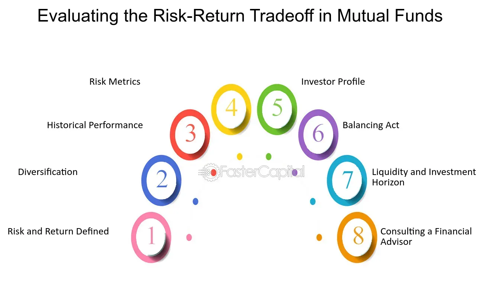

## Table of Contents

## What is a mutual fund and why is evaluating its risk-return tradeoff important?

A mutual fund is a type of investment where many people pool their money together to buy a variety of stocks, bonds, or other assets. A professional manager runs the fund and makes decisions about what to buy and sell. This makes it easier for people to invest without having to pick individual stocks themselves. Mutual funds can be a good way to diversify your investments, which means spreading your money across different types of assets to reduce risk.

Evaluating the risk-return tradeoff of a mutual fund is important because it helps you understand how much risk you are taking on for the potential reward. Every investment has some level of risk, and mutual funds are no different. Some funds might be riskier but offer the chance for higher returns, while others might be safer but with lower potential gains. By looking at the risk-return tradeoff, you can decide if a mutual fund fits your investment goals and how much risk you are comfortable with. This helps you make smarter choices about where to put your money.

## What are the basic metrics used to evaluate the performance of a mutual fund?

To evaluate the performance of a mutual fund, people often look at a few key metrics. One of the most common is the fund's total return, which shows how much the fund has grown over a certain period. This can be broken down into income return, which comes from dividends or interest, and capital return, which is the change in the price of the fund's shares. Another important metric is the fund's expense ratio, which tells you how much of your investment goes towards paying for the fund's operating costs. A lower expense ratio means more of your money stays invested and can grow over time.

Another key metric is the fund's benchmark comparison, which measures how well the fund is doing compared to a standard index like the S&P 500. If a fund consistently beats its benchmark, it might be a good performer. Additionally, the fund's risk-adjusted return, often measured by metrics like the Sharpe Ratio, helps investors understand if the fund's returns are worth the risk taken. A higher Sharpe Ratio means the fund is giving good returns for the level of risk involved. These metrics together give a clear picture of a mutual fund's performance and help investors make informed decisions.

## How does the Sharpe Ratio help in assessing the risk-adjusted return of a mutual fund?

The Sharpe Ratio is a tool that helps investors see if a mutual fund is doing well when you consider the risks involved. It does this by comparing the fund's return to the return you could get from a risk-free investment, like a U.S. Treasury bond, and then dividing that difference by the fund's volatility, which is a measure of risk. A higher Sharpe Ratio means the fund is giving you more return for the risk you're taking, which is good.

For example, if a mutual fund has a Sharpe Ratio of 1.5, it means that for every unit of risk you're taking, you're getting 1.5 units of return above what you'd get from a risk-free investment. This helps you compare different funds easily. If another fund has a Sharpe Ratio of 1.0, you might choose the first fund because it's giving you more return for the same amount of risk. By using the Sharpe Ratio, you can make smarter choices about which mutual funds to invest in based on how much risk you're willing to take.

## What is the Sortino Ratio and how does it differ from the Sharpe Ratio in evaluating mutual fund performance?

The Sortino Ratio is another way to measure how well a mutual fund is doing, but it focuses only on the bad kind of risk, called downside risk. It looks at how much the fund's returns fall below a certain target, usually the return of a risk-free investment like a U.S. Treasury bond. The Sortino Ratio divides the fund's return above this target by the standard deviation of the negative returns. A higher Sortino Ratio means the fund gives you good returns without too many big drops in value, which is what most investors want.

The main difference between the Sortino Ratio and the Sharpe Ratio is what kind of risk they look at. The Sharpe Ratio considers all kinds of risk, both good and bad, by using the total standard deviation of the fund's returns. This means it counts both the ups and downs. On the other hand, the Sortino Ratio only cares about the downs, the times when the fund loses value. This can be more useful if you're worried about losing money and want to know how a fund does during bad times. Both ratios help you see if a mutual fund is worth the risk, but they give you different pieces of the puzzle.

## Can you explain the Treynor Ratio and its significance in measuring mutual fund risk?

The Treynor Ratio is a way to see how well a mutual fund is doing when you think about the risk it's taking. It's named after Jack Treynor, who came up with it. The ratio looks at the fund's return above what you'd get from a risk-free investment, like a U.S. Treasury bond, and divides that by the fund's beta. Beta is a measure of how much the fund's returns move with the market. A higher Treynor Ratio means the fund is giving you more return for the risk it's taking, which is good.

The Treynor Ratio is different from the Sharpe Ratio and the Sortino Ratio because it uses beta instead of standard deviation to measure risk. Beta only looks at how the fund moves with the market, not all the ups and downs like standard deviation does. This makes the Treynor Ratio really useful if you want to know how a fund does compared to the overall market. It helps you see if the fund's manager is good at [picking](/wiki/asset-class-picking) investments that beat the market while taking on the right amount of risk.

## How is the Jensen's Alpha used to evaluate the performance of a mutual fund relative to a benchmark?

Jensen's Alpha is a way to see if a mutual fund is doing better than you would expect it to, compared to a benchmark like the S&P 500. It looks at the difference between the fund's actual return and the return it should have gotten based on its risk level. If a fund has a positive Jensen's Alpha, it means the fund did better than expected. If it's negative, the fund didn't do as well as it should have, given the risk it took.

This measure is really helpful because it tells you if the fund manager is good at picking investments. If a fund has a high Jensen's Alpha, it means the manager is making smart choices that are beating the market. This can be a big deal for investors because it shows that the fund is adding value beyond just following the market's ups and downs.

## What role does the Information Ratio play in assessing a fund manager's ability to generate excess returns?

The Information Ratio helps you see how good a fund manager is at making more money than a benchmark, like the S&P 500, while keeping risk in check. It does this by looking at the extra return the fund gets, called "active return," and dividing it by how much that extra return jumps around, called "tracking error." A higher Information Ratio means the manager is doing a great job at beating the benchmark without taking on too much extra risk.

This ratio is super useful because it tells you if the fund manager's choices are really adding value. If the Information Ratio is high, it shows the manager is skilled at picking investments that do better than the market. This can help you decide if it's worth paying extra fees for a managed fund, because a high Information Ratio suggests the manager is [earning](/wiki/earning-announcement) their keep by generating good returns for the risk they're taking.

## How can the Beta of a mutual fund be used to understand its market risk?

The Beta of a mutual fund tells you how much the fund's price moves up or down compared to the whole market. If a fund has a Beta of 1, it means it moves the same way as the market. A Beta higher than 1 means the fund goes up more when the market goes up, but it also goes down more when the market goes down. So, a higher Beta means more risk because the fund's price can swing a lot. On the other hand, a Beta lower than 1 means the fund doesn't move as much as the market, which can mean less risk but also less chance for big gains.

Using Beta helps you understand if a mutual fund is riskier or safer than the market. If you're okay with taking more risk for a chance at bigger returns, you might pick a fund with a high Beta. But if you want to play it safe and not see big swings in your investment, you'd go for a fund with a low Beta. Knowing the Beta can help you pick a fund that matches how much risk you're comfortable with.

## What are the limitations of using standard deviation as a measure of risk in mutual funds?

Standard deviation is a common way to measure risk in mutual funds, but it has some problems. It looks at how much the fund's returns go up and down over time. But standard deviation treats all changes the same, whether the fund goes up a lot or down a lot. For many investors, losing money is scarier than making money, but standard deviation doesn't tell you about this kind of risk. It just shows how much the returns change, not if those changes are good or bad.

Another issue is that standard deviation doesn't consider how the fund's returns relate to the market. If a fund moves a lot but in the same direction as the market, it might not be as risky as it seems. Also, standard deviation can be thrown off by a few big changes in the fund's returns, which might not happen often. This can make the fund look riskier than it really is most of the time. So, while standard deviation is useful, it's important to use other measures too to get a full picture of a fund's risk.

## How do drawdown metrics help in understanding the potential downside risk of a mutual fund?

Drawdown metrics are important because they show how much money you could lose from the highest point your investment reaches until it starts going back up. For a mutual fund, this tells you the worst-case scenario of how much your investment might drop in value. It's different from standard deviation because it only looks at the downs, not the ups. So, if you're worried about losing money, drawdowns give you a clearer picture of the risk you're taking.

For example, if a mutual fund has a maximum drawdown of 20%, it means that at some point, the value of the fund dropped 20% from its highest value before it started to recover. This information can help you decide if you're okay with that level of risk. By knowing the drawdown, you can better prepare for the possible ups and downs of your investment and choose a mutual fund that matches how much risk you're comfortable with.

## What advanced statistical models can be used to better predict the risk-return profile of mutual funds?

Advanced statistical models like the Capital Asset Pricing Model (CAPM) and the Fama-French Three-Factor Model can help predict the risk-return profile of mutual funds better. CAPM looks at how a fund moves with the market and uses something called beta to measure this. It tries to guess how much return you might get for the risk you're taking. The Fama-French model goes a bit further by adding two more things to think about: the size of the companies the fund invests in and how much they grow. These models can give you a clearer picture of what to expect from a fund's performance.

Another useful model is the Black-Litterman Model, which mixes what you believe about the market with what the market thinks. This can help you make better guesses about how a mutual fund might do. Also, using something called Monte Carlo simulations can be helpful. These simulations run lots of different scenarios to see how a fund might perform under different conditions. By using these advanced models, you can get a better idea of the risks and rewards of investing in a mutual fund, helping you make smarter choices.

## How do multi-factor models enhance the evaluation of mutual fund performance and risk?

Multi-[factor](/wiki/factor-investing) models help you understand a mutual fund's performance and risk better by looking at more than just how it moves with the market. They consider different things that can affect a fund's returns, like the size of the companies it invests in, how much those companies grow, and even things like how much they invest in value stocks versus [growth stocks](/wiki/growth-stocks). By looking at all these factors, multi-factor models give you a fuller picture of why a fund might do well or not so well. This can help you see if the fund's performance is because of smart choices by the fund manager or just because it's riding the market's ups and downs.

Using multi-factor models can also help you figure out the risks a mutual fund might face. For example, if a fund invests a lot in small companies, it might be riskier because small companies can be more affected by economic changes. Multi-factor models can show you how sensitive the fund is to these different risks. This way, you can pick a fund that matches your comfort level with risk and your investment goals. By considering more than just one factor, these models give you a clearer idea of what to expect from your investment.

## What are the key metrics for evaluating risk-return in mutual funds?

Mutual fund performance is largely evaluated using several key metrics that help investors understand the risk-return tradeoff. By using financial metrics such as Alpha, Beta, Standard Deviation, and Sharpe Ratio, investors can gain insights into the potential and risks associated with mutual funds.

### Alpha

Alpha measures a fund's performance on a risk-adjusted basis relative to a benchmark index, representing the excess return of an investment compared to the market return. It is expressed by the formula:

$$
\alpha = R_i - (R_f + \beta \times (R_m - R_f))
$$

where $R_i$ is the return of the investment, $R_f$ is the risk-free rate, $\beta$ is the Beta of the investment, and $R_m$ is the market return. A positive alpha indicates that the mutual fund has performed better than the market, whereas a negative alpha signifies underperformance.

### Beta

Beta assesses the [volatility](/wiki/volatility-trading-strategies) of a fund relative to the market. A beta of 1 implies that the fund's price will move with the market, a beta greater than 1 denotes higher volatility than the market, and a beta less than 1 indicates lower volatility. This metric is crucial for investors targeting funds that align with their risk tolerance.

### Standard Deviation

Standard Deviation quantifies the [dispersion](/wiki/dispersion-trading) of a fund's returns relative to its mean, offering insights into its historical volatility. A higher standard deviation indicates greater variability in past returns, suggesting higher risk.

$$
\sigma = \sqrt{\frac{1}{N} \sum_{i=1}^{N}(R_i - \bar{R})^2}
$$

where $\sigma$ is the standard deviation, $N$ is the number of observations, $R_i$ is each individual return, and $\bar{R}$ is the mean return. This measure helps investors understand the potential range of returns they might expect from a fund.

### Sharpe Ratio

The Sharpe Ratio quantifies how well a mutual fund compensates investors for the risk taken. It is calculated as:

$$
\text{Sharpe Ratio} = \frac{R_p - R_f}{\sigma_p}
$$

where $R_p$ is the return of the portfolio, $R_f$ is the risk-free rate, and $\sigma_p$ is the standard deviation of the portfolio's excess return. A higher Sharpe Ratio indicates a more attractive risk-adjusted return.

### Applicability in Real-World Scenarios

Applying these metrics can aid in selecting funds that align with specific investment goals. For instance, an investor seeking stable returns may prefer a fund with a low Beta and high Sharpe Ratio. Conversely, an aggressive investor might chase higher Alpha despite inherent volatility.

In practical scenarios, consider a mutual fund with a historical return of 12%, a market return of 10%, and a risk-free rate of 2%. If the fund's Beta is 0.9, Alpha is calculated to be:

$$
\alpha = 0.12 - (0.02 + 0.9 \times (0.10 - 0.02)) = 0.12 - (0.02 + 0.072) = 0.028
$$

This positive Alpha suggests outperformance relative to the market. Tools like Python can be used to automate these calculations for various funds to streamline analysis and decision-making processes. For example:

```python
def calculate_alpha(ri, rf, beta, rm):
    return round(ri - (rf + beta * (rm - rf)), 3)

calculate_alpha(0.12, 0.02, 0.9, 0.10)
# Output: 0.028
```

Understanding and applying these metrics allows investors to devise strategies that balance potential rewards against the risks, optimizing their investment portfolios accordingly.

## References & Further Reading

[1]: Bergstra, J., Bardenet, R., Bengio, Y., & Kégl, B. (2011). ["Algorithms for Hyper-Parameter Optimization."](https://dl.acm.org/doi/10.5555/2986459.2986743) Advances in Neural Information Processing Systems 24.

[2]: ["Advances in Financial Machine Learning"](https://www.amazon.com/Advances-Financial-Machine-Learning-Marcos/dp/1119482089) by Marcos Lopez de Prado

[3]: ["Evidence-Based Technical Analysis: Applying the Scientific Method and Statistical Inference to Trading Signals"](https://www.amazon.com/Evidence-Based-Technical-Analysis-Scientific-Statistical/dp/0470008741) by David Aronson

[4]: ["Machine Learning for Algorithmic Trading"](https://github.com/stefan-jansen/machine-learning-for-trading) by Stefan Jansen

[5]: ["Quantitative Trading: How to Build Your Own Algorithmic Trading Business"](https://www.amazon.com/Quantitative-Trading-Build-Algorithmic-Business/dp/1119800064) by Ernest P. Chan