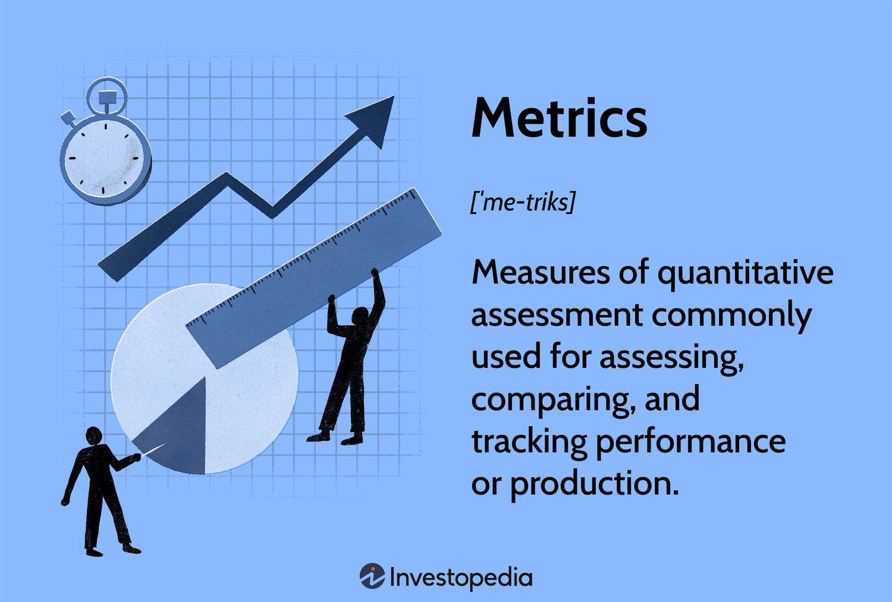

In today's fast-paced market environment, evaluating company performance in the telecommunications sector and algorithmic trading space is critical. As industries face constant technological advancements and competitive pressures, having a robust framework to measure and analyze performance becomes indispensable. Effective evaluation allows businesses to adapt and thrive by utilizing strategic metrics that not only highlight operational efficiencies but also expose areas that require improvement.

The telecommunications sector has witnessed exponential growth and transformation, necessitating metrics that reflect the dynamic nature of the industry. Metrics such as customer acquisition and retention, network performance, and revenue generation are pivotal in monitoring performance and guiding strategic decisions. In parallel, the algorithmic trading domain leverages sophisticated algorithms and high-frequency trading strategies, emphasizing the need for evaluation metrics that can assess complex trading patterns, risk management, and execution efficiency.



This article explores the evaluation metrics utilized in telecommunications and algorithmic trading to determine performance. By focusing on these crucial metrics, businesses can gain insights into their financial health, operational effectiveness, and potential for growth. For investors and stakeholders, understanding these metrics is essential for making informed decisions, fostering confidence in investment opportunities, and managing risks effectively. The ability to interpret and respond to these metrics can significantly impact a company's success in achieving competitive advantages and ensuring long-term profitability.

## Table of Contents

## Understanding Evaluation Metrics

Evaluation metrics are essential tools that objectively assess a company's performance and viability. In both the telecommunications sector and algorithmic trading, these metrics provide critical insights that guide strategic decision-making and operational adjustments. 

In the telecommunications sector, evaluation metrics offer a comprehensive view of a company's financial health and market performance. Key metrics include metrics such as Average Revenue Per User (ARPU), which measures the revenue generated per user and indicates a company's ability to monetize its subscriber base effectively. Additionally, the Churn Rate, which calculates the percentage of subscribers ending their service in a given period, helps assess customer satisfaction and retention. Another critical metric is Subscriber Growth, reflecting the company's ability to expand its market reach and indicating potential future revenue streams and market competitiveness.

For algorithmic trading, evaluation metrics play a pivotal role in optimizing trading strategies and ensuring both efficiency and profitability. Essential metrics include the Sharpe Ratio, which measures the risk-adjusted return of an investment strategy, providing insights into the profitability per unit of risk. This is calculated as:

$$
\text{Sharpe Ratio} = \frac{E[R_p] - R_f}{\sigma_p}
$$

where $E[R_p]$ is the expected portfolio return, $R_f$ is the risk-free rate, and $\sigma_p$ is the portfolio standard deviation.

Another key metric is the Win Rate, which evaluates the percentage of profitable trades relative to the total number of trades executed. This metric is crucial for understanding the frequency at which a trading strategy is successful. Lastly, the Maximum Drawdown metric offers insight into the greatest loss from a peak to a trough, emphasizing capital preservation by highlighting the potential downside risk of a trading strategy.

Overall, these metrics are indispensable for stakeholders seeking to understand and improve performance, whether they are involved in telecommunications or [algorithmic trading](/wiki/algorithmic-trading). By accurately assessing metrics, companies can make informed decisions about operational strategies and risk management, crucial for sustainable success in today's dynamic markets.

## Key Metrics for Telecommunications Companies

Telecommunication companies rely on specific metrics to assess their performance and market competitiveness. Among these, Average Revenue Per User (ARPU), Churn Rate, and Subscriber Growth are pivotal.

### Average Revenue Per User (ARPU)

ARPU is a critical metric that measures the revenue generated per user or unit. It provides insights into a company's ability to maximize revenue from its existing customer base. This metric is calculated by dividing the total revenue by the number of users. The formula for ARPU is:

$$
\text{ARPU} = \frac{\text{Total Revenue}}{\text{Average Number of Users}}
$$

ARPU helps identify trends in user spending, assess the effectiveness of pricing strategies, and gauge the financial health of a company. A higher ARPU indicates better monetization of services offered, while a declining ARPU may prompt a company to reevaluate its pricing or service strategies.

### Churn Rate

Churn Rate measures the rate at which customers discontinue their subscription or stop using a service. It provides insight into customer retention and satisfaction. Churn Rate is calculated as:

$$
\text{Churn Rate} = \frac{\text{Number of Users Lost During a Period}}{\text{Total Number of Users at the Start of the Period}} \times 100
$$

A high Churn Rate suggests issues with customer satisfaction or market competition, potentially indicating the need to improve service offerings or customer engagement strategies. Reducing churn is critical for maintaining a stable and growing customer base.

### Subscriber Growth

Subscriber Growth is an important metric indicating the change in the number of subscribers over a specific period. It reflects a company's ability to attract new customers and retain existing ones. It is expressed as:

$$
\text{Subscriber Growth} = \frac{\text{(Number of Subscribers at End of Period - Number of Subscribers at Start of Period)}}{\text{Number of Subscribers at Start of Period}} \times 100
$$

High Subscriber Growth signals effective marketing strategies and potentially new market penetration, contributing to future revenue expansion. Conversely, low or negative growth may highlight market saturation or ineffective promotional efforts.

These metrics collectively provide a comprehensive picture of a telecommunications company's performance and potential growth trajectory. By closely monitoring ARPU, Churn Rate, and Subscriber Growth, companies can make strategic decisions that enhance financial performance and market position.

## Important Algorithmic Trading KPIs

Algorithmic trading relies heavily on specific key performance indicators (KPIs) that help in assessing and optimizing trading strategies. Among these metrics, Win Rate, Maximum Drawdown, and the Sharpe Ratio are critical for evaluating a strategy's effectiveness.

**Win Rate**: This metric calculates the percentage of successful trades over a specific period. Mathematically, it is expressed as:

$$
\text{Win Rate} = \left( \frac{\text{Number of Winning Trades}}{\text{Total Number of Trades}} \right) \times 100
$$

A high win rate indicates a greater number of successful trades compared to unsuccessful ones, but it should be considered alongside other metrics as a high win rate does not necessarily equal profitability if the winning trades are small and the losing trades are large.

**Maximum Drawdown**: This measures the largest single drop from peak to trough in the account equity curve. It provides a snapshot of the worst-case scenario in terms of capital loss during a trading strategy’s life cycle. The Maximum Drawdown is calculated as:

$$
\text{Maximum Drawdown} = \max \left(\frac{\text{Peak Value} - \text{Trough Value}}{\text{Peak Value}}\right)
$$

This metric helps traders understand the risk involved in a strategy and prepares them for possible capital loss scenarios.

**Sharpe Ratio**: Developed by William F. Sharpe, this ratio is one of the most commonly used metrics for assessing the risk-adjusted return of an investment portfolio. It is calculated as:

$$
\text{Sharpe Ratio} = \frac{E[R_p - R_f]}{\sigma_p}
$$

where $E[R_p - R_f]$ is the expected return of the portfolio minus the risk-free rate, and $\sigma_p$ is the standard deviation of the portfolio's excess return. A higher Sharpe Ratio indicates that the return per unit of risk is more favorable, signaling a more efficient risk-adjusted trading strategy.

Incorporating these KPIs into algorithmic trading strategies allows traders to refine their approaches, align their risk appetite with expected returns, and enhance overall trading efficiency. The continual analysis of these metrics is essential for identifying potential improvements and achieving consistent performance.

## Integrating Metrics for Improved Performance

Combining different metrics offers a more comprehensive understanding of performance, particularly in sectors like telecommunications and algorithmic trading. This approach enables businesses to evaluate both current and projected outcomes more effectively by leveraging various data points.

In the telecommunications sector, integrating financial metrics such as revenue and profit margins with subscriber metrics like Average Revenue Per User (ARPU) and Churn Rate provides a more holistic view of a company's performance. For instance, ARPU offers insights into revenue generation per user, which can be cross-referenced with subscriber numbers to forecast financial health and market positioning. This integration facilitates better projections of growth and stability by identifying patterns and correlations between financial success and subscriber dynamics. By examining the Churn Rate alongside financial indices, companies can identify customer satisfaction levels, thereby determining risk areas and opportunities for enhancing retention strategies.

In algorithmic trading, the use of multiple Key Performance Indicators (KPIs) aids in refining trading strategies and minimizing risks. Metrics such as the Sharpe Ratio, Win Rate, and Maximum Drawdown each provide distinct insights. The Sharpe Ratio offers a risk-adjusted return metric, highlighting the strategy’s efficiency relative to [volatility](/wiki/volatility-trading-strategies). A high Sharpe Ratio indicates that returns are being achieved with a relatively low level of risk. Win Rate reveals the percentage of successful trades, contributing to overall strategy assessment. Maximum Drawdown calculates the greatest loss from a peak to a trough of a portfolio, offering insights into the worst-case scenarios traders must mitigate. By analyzing these metrics together, traders can optimize their strategies, identify strengths and weaknesses, and adapt to market fluctuations.

The integration of these metrics requires robust data analytics tools and methods to handle large datasets and extract actionable insights. Tools like Python, with libraries such as Pandas for data manipulation and Matplotlib for data visualization, allow for efficient metric integration and analysis. Leveraging such technological solutions can improve the accuracy and speed of evaluations, enhancing decision-making processes in both telecommunications and financial trading industries. For example:

```python
import pandas as pd
import matplotlib.pyplot as plt

# Sample data for demonstration
data = {
    'ARPU': [30, 32, 31, 35, 34],
    'Churn Rate': [0.02, 0.03, 0.025, 0.015, 0.02],
    'Sharpe Ratio': [1.5, 1.6, 1.7, 1.8, 1.7],
}

df = pd.DataFrame(data)

# Analyze data
df['Revenue Impact'] = df['ARPU'] * (1 - df['Churn Rate'])
df.plot()

plt.title('Integrated Metrics')
plt.xlabel('Time')
plt.ylabel('Values')
plt.show()
```

This code snippet illustrates the integration of metrics over time, highlighting the importance of such analysis in understanding and improving performance.

## Challenges in Metric Evaluation

Evaluating the performance metrics in both the telecommunications and algorithmic trading industries presents several challenges, primarily attributable to data variability and market volatility. These metrics are crucial for strategic decision-making, but understanding and interpreting them requires nuanced comprehension of underlying factors.

Data variability is a fundamental challenge. Market conditions fluctuate, affecting the reliability and consistency of data used in evaluating telecom companies and algorithmic trading strategies. This variability necessitates continuous monitoring and frequent reassessment of metrics to ensure that they remain relevant.

In algorithmic trading, sample bias and overfitting are significant concerns. Sample bias arises when historical data used to train models is not representative of future market conditions. This can lead to skewed results, potentially causing strategies to underperform in real market situations. Overfitting is another obstacle, where a model becomes too tailored to historical data, capturing noise instead of the underlying trend. This results in diminished predictive performance. To mitigate these issues, careful validation techniques such as k-fold cross-validation should be employed. Additionally, [backtesting](/wiki/backtesting), a process that involves running a trading strategy on historical data, is crucial to ascertain the robustness of a model.

Ensuring data accuracy is pivotal for reliable evaluation in both sectors. Inaccurate or incomplete data can lead to erroneous conclusions, impacting decision-making. Companies must establish stringent data collection and management protocols to maintain high data integrity. In telecommunications, this involves regular updates and validation of subscriber data. In algorithmic trading, it implies aligning trading data with real-time market feeds to prevent informational lags.

Overall, navigating these challenges demands thorough analysis, sophisticated modeling techniques, and ongoing refinement of evaluation processes to uphold data integrity and ensure that strategic insights drawn from metrics are both accurate and actionable.

## Conclusion

In both the telecommunications sector and algorithmic trading, the effective utilization of evaluation metrics is crucial for driving success and ensuring sustainable growth. These metrics serve as foundational tools that allow stakeholders to make informed decisions by highlighting key aspects of a company's performance and potential for expansion. By focusing on relevant indicators, businesses can tailor strategies that cater to both current market conditions and future growth opportunities.

For telecommunications companies, metrics like Average Revenue Per User (ARPU), Churn Rate, and Subscriber Growth offer insights into revenue streams and customer retention capabilities. Monitoring these metrics enables companies to assess their competitive standing and make strategic adjustments to maximize revenue and minimize customer attrition.

In algorithmic trading, evaluation metrics such as the Sharpe Ratio, Maximum Drawdown, and Win Rate are instrumental in refining trading strategies. These indicators help in understanding both the profitability and risks associated with trading models, allowing traders to optimize their strategies for improved returns. Continuous adaptation to these metrics enhances the capability to mitigate risks and exploit market opportunities.

Incorporating a regular cycle of monitoring and evaluating these metrics can translate to significant competitive advantages. For instance, telecommunications companies can leverage insights from ARPU trends and Churn Rates to create targeted marketing campaigns, thus enhancing subscriber retention. Similarly, algorithmic traders can adjust their algorithms based on insights from their trading metrics to reduce risk exposure and increase returns.

Ultimately, the thorough application and adaptation of evaluation metrics foster an environment conducive to long-term success. When businesses consistently track and respond to these metrics, they are better positioned to not only understand their current standing but also anticipate and strategically navigate future market challenges. By doing so, both telecommunications companies and algorithmic trading entities can achieve sustained growth and maintain a competitive edge in fast-paced markets.

## References & Further Reading

[1]: Bergstra, J., Bardenet, R., Bengio, Y., & Kégl, B. (2011). ["Algorithms for Hyper-Parameter Optimization."](https://dl.acm.org/doi/10.5555/2986459.2986743) Advances in Neural Information Processing Systems 24.

[2]: ["Advances in Financial Machine Learning"](https://www.amazon.com/Advances-Financial-Machine-Learning-Marcos/dp/1119482089) by Marcos Lopez de Prado

[3]: ["Evidence-Based Technical Analysis: Applying the Scientific Method and Statistical Inference to Trading Signals"](https://www.amazon.com/Evidence-Based-Technical-Analysis-Scientific-Statistical/dp/0470008741) by David Aronson

[4]: ["Machine Learning for Algorithmic Trading"](https://github.com/stefan-jansen/machine-learning-for-trading) by Stefan Jansen

[5]: ["Quantitative Trading: How to Build Your Own Algorithmic Trading Business"](https://www.amazon.com/Quantitative-Trading-Build-Algorithmic-Business/dp/1119800064) by Ernest P. Chan