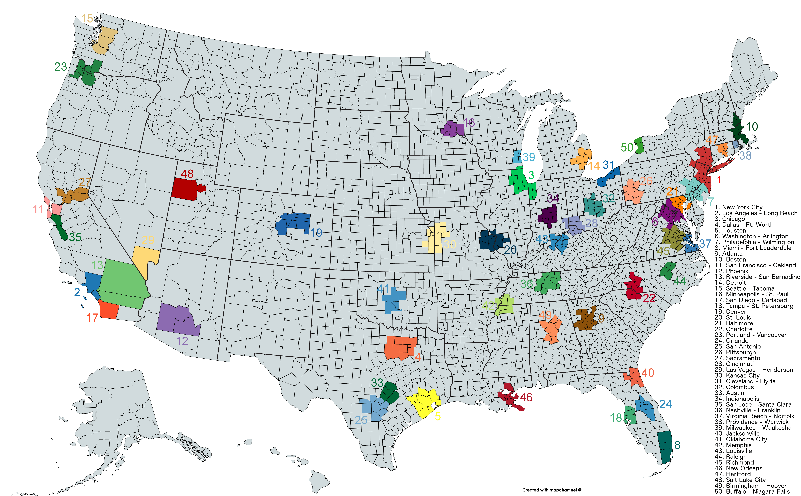

## Table of Contents

## What is a Metropolitan Statistical Area (MSA)?

A Metropolitan Statistical Area, or MSA, is a geographic region in the United States that includes a city and its surrounding suburbs. It is defined by the U.S. Office of Management and Budget to help with data collection and analysis. The main city in an MSA is called the "core" and must have at least 50,000 people. The surrounding areas are included if they have strong social and economic connections to the core city.

MSAs help government agencies, businesses, and researchers understand how people live and work in different parts of the country. By grouping cities and their suburbs together, it's easier to see trends in population, jobs, and housing. This information is important for planning services like public transportation, schools, and healthcare.

## How are MSAs defined by the U.S. Office of Management and Budget?

The U.S. Office of Management and Budget defines a Metropolitan Statistical Area (MSA) by looking at a city and its surrounding areas. The main city, called the core, must have at least 50,000 people living in it. The areas around the core city are included in the MSA if they have a strong connection to the core. This connection can be seen through people commuting to work in the core city or through other economic and social ties.

MSAs help gather and analyze data about different parts of the country. By grouping a city and its suburbs together, it's easier to see patterns in things like population growth, jobs, and housing. This information is useful for planning important services like public transportation, schools, and healthcare. It helps government agencies, businesses, and researchers understand how people live and work in different regions.

## What is the difference between a Metropolitan Statistical Area and a Micropolitan Statistical Area?

A Metropolitan Statistical Area (MSA) and a Micropolitan Statistical Area are both ways to group cities and their surrounding areas in the United States. The main difference between them is the size of the core city. For an area to be called a Metropolitan Statistical Area, the core city must have at least 50,000 people living in it. On the other hand, a Micropolitan Statistical Area has a smaller core city, with a population between 10,000 and 50,000 people.

Both types of areas include the core city and the surrounding areas that have strong connections to it, like people commuting to work there. These connections help define the boundaries of the area. While MSAs are used for larger cities and their suburbs, Micropolitan Statistical Areas are used for smaller cities and their surrounding areas. This helps government agencies, businesses, and researchers understand and plan for different regions based on their size and population.

## How many Metropolitan Statistical Areas are there in the United States?

In the United States, there are around 384 Metropolitan Statistical Areas. These areas cover big cities and the places around them where people live and work together. The number can change a bit because the government looks at the population and other things every few years to see if they need to make new areas or change the ones they have.

MSAs help us understand how people live in different parts of the country. They are important for planning things like roads, schools, and hospitals. By grouping cities and their suburbs together, we can see where more people are moving and where new jobs are being created.

## Can you list some of the largest MSAs in the U.S. by population?

Some of the largest Metropolitan Statistical Areas in the U.S. by population are New York-Newark-Jersey City, Los Angeles-Long Beach-Anaheim, and Chicago-Naperville-Elgin. The New York-Newark-Jersey City MSA is the biggest, with over 20 million people living there. It includes New York City and parts of New Jersey and Pennsylvania. The Los Angeles-Long Beach-Anaheim MSA is the second largest, with around 13 million people. It covers Los Angeles and nearby cities in California. The Chicago-Naperville-Elgin MSA comes in third, with about 9.5 million people, including Chicago and its suburbs in Illinois, Indiana, and Wisconsin.

Other big MSAs include Dallas-Fort Worth-Arlington, Houston-The Woodlands-Sugar Land, and Washington-Arlington-Alexandria. The Dallas-Fort Worth-Arlington MSA has around 7.5 million people and covers a large area in Texas. The Houston-The Woodlands-Sugar Land MSA is also in Texas and has about 7 million people. The Washington-Arlington-Alexandria MSA, which includes Washington, D.C., and parts of Maryland and Virginia, has around 6 million people. These MSAs are important because they help us understand where a lot of people live and work together, which is useful for planning things like roads, schools, and hospitals.

## How does the population size affect the classification of an MSA?

The population size is really important when it comes to deciding if a place is a Metropolitan Statistical Area, or MSA. To be an MSA, the main city, which we call the core, needs to have at least 50,000 people living there. If the core city has fewer than 50,000 people, it can't be an MSA. Instead, it might be a Micropolitan Statistical Area if it has between 10,000 and 50,000 people.

The number of people in the core city helps the government figure out how to group cities and their suburbs together. This grouping helps them understand where people live and work, which is important for planning things like roads, schools, and hospitals. By looking at the population, the government can see if a city and its surrounding areas should be part of an MSA or if it's too small and should be a Micropolitan Statistical Area instead.

## What role do MSAs play in economic and urban planning?

MSAs help people who plan cities and economies understand how things work in different areas. They group a big city and the places around it together. This way, planners can see where lots of people live and where they work. By looking at an MSA, planners can figure out where to build new roads, schools, and hospitals. They can also see where new jobs are being made and where people are moving to.

In economic planning, MSAs are important because they show where businesses and jobs are growing. Planners use this information to help businesses decide where to set up new stores or factories. They also use it to help people find jobs and to make sure there are enough workers in different areas. By understanding how people live and work in MSAs, planners can make better choices about how to help the economy grow and keep people happy.

## How often are MSAs re-evaluated and potentially redefined?

The U.S. government looks at MSAs every ten years, right after the big population count called the Census. They do this to see if the areas need to change because of new people moving in or out. Sometimes, they might add new MSAs or change the ones they already have to make sure they still show where people live and work together.

If there are big changes in population or how people live and work, the government might look at MSAs again between the big Census counts. This helps keep the information about MSAs up to date and useful for planning things like roads, schools, and jobs. By checking MSAs regularly, the government can make sure they are helping cities and their suburbs in the best way possible.

## What are Combined Statistical Areas (CSAs) and how do they relate to MSAs?

Combined Statistical Areas, or CSAs, are bigger areas that include more than one Metropolitan Statistical Area (MSA) or Micropolitan Statistical Area. They are used when these smaller areas are close to each other and have strong connections, like people commuting between them for work. CSAs help us understand how different cities and their suburbs work together as a bigger region.

CSAs are important because they show how cities and their surrounding areas can be part of a larger economic and social network. For example, the New York-Newark, NY-NJ-CT-PA CSA includes the New York-Newark-Jersey City MSA and other nearby MSAs and Micropolitan Statistical Areas. By looking at CSAs, planners can see how people move between different cities and how to plan for things like transportation and jobs across a bigger area.

## How do changes in MSA definitions impact federal funding and resource allocation?

Changes in MSA definitions can affect how the federal government gives out money and resources. When an area becomes part of an MSA or gets bigger, it might get more money for things like roads, schools, and hospitals. This is because the government uses MSA data to decide where to spend money. If an area is no longer part of an MSA or gets smaller, it might get less money. This can make a big difference in how much help a city or its suburbs get.

These changes can also impact how resources are shared within an MSA. For example, if a new suburb is added to an MSA, it might start getting money for new projects. But this could mean less money for other parts of the MSA. Planners and government officials need to keep an eye on MSA changes to make sure money and resources are used in the best way to help everyone in the area.

## What are the criteria for a county to be included in an MSA?

A county can be included in a Metropolitan Statistical Area, or MSA, if it has a strong connection to the main city, which we call the core. The core city must have at least 50,000 people living in it. If a county has a lot of people who work in the core city, it can be part of the MSA. This connection is usually shown by people commuting to work in the core city from the county.

Counties that are close to the core city and have strong social and economic ties to it can also be included in the MSA. This means that if people in the county go to the core city for shopping, healthcare, or other services, the county might be part of the MSA. The U.S. government looks at these connections every few years to make sure the MSA includes all the right counties.

## How do MSAs influence regional economic development strategies?

MSAs help shape how regions plan to grow their economies. They group a big city and the areas around it together, which lets planners see where people live and work. By understanding this, they can figure out where to build new businesses, create jobs, and attract more people to the area. For example, if an MSA shows that a lot of people commute to the main city for work, planners might decide to improve public transportation or build more housing closer to job centers. This can make the region more attractive to companies looking to set up new offices or factories.

In addition, MSAs help regions work together on economic development. When different cities and suburbs in an MSA share information and resources, they can create better plans that help everyone. For instance, if one part of the MSA has a lot of jobs but not enough workers, and another part has workers but not enough jobs, the MSA can help match them up. This teamwork can lead to stronger economic growth and a better quality of life for people living in the region.

## References & Further Reading

[1]: Bureau of Economic Analysis. (n.d.). ["Gross Domestic Product by Metropolitan Area."](https://www.bea.gov/data/gdp/gdp-county-metro-and-other-areas) Retrieved from the Bureau of Economic Analysis website.

[2]: U.S. Office of Management and Budget. (2010). ["2010 Standards for Delineating Metropolitan and Micropolitan Statistical Areas."](https://www.federalregister.gov/documents/2010/06/28/2010-15605/2010-standards-for-delineating-metropolitan-and-micropolitan-statistical-areas) Federal Register.

[3]: Florida, R. (2005). ["Cities and the Creative Class"](https://www.taylorfrancis.com/books/mono/10.4324/9780203997673/cities-creative-class-richard-florida). Routledge.

[4]: Batty, M. (2013). ["The New Science of Cities"](https://direct.mit.edu/books/monograph/3422/The-New-Science-of-Cities). MIT Press.

[5]: Lopez de Prado, M. (2018). ["Advances in Financial Machine Learning"](https://www.amazon.com/Advances-Financial-Machine-Learning-Marcos/dp/1119482089). Wiley.

[6]: Glaeser, E. L. (2011). ["Triumph of the City: How Our Greatest Invention Makes Us Richer, Smarter, Greener, Healthier, and Happier"](https://www.jstor.org/stable/41474071). Penguin Books.

[7]: Graham, S., & Marvin, S. (2001). ["Splintering Urbanism: Networked Infrastructures, Technological Mobilities and the Urban Condition"](https://www.taylorfrancis.com/books/mono/10.4324/9780203452202/splintering-urbanism-steve-graham-simon-marvin). Routledge.

[8]: IMF Staff. (2002). ["Cities and Economies."](https://www.imf.org/en/Publications/AREB/Issues/2016/12/30/International-Monetary-Fund-Annual-Report-2002-Making-the-Global-Economy-Work-for-All-15967) International Monetary Fund Working Papers 02/12.