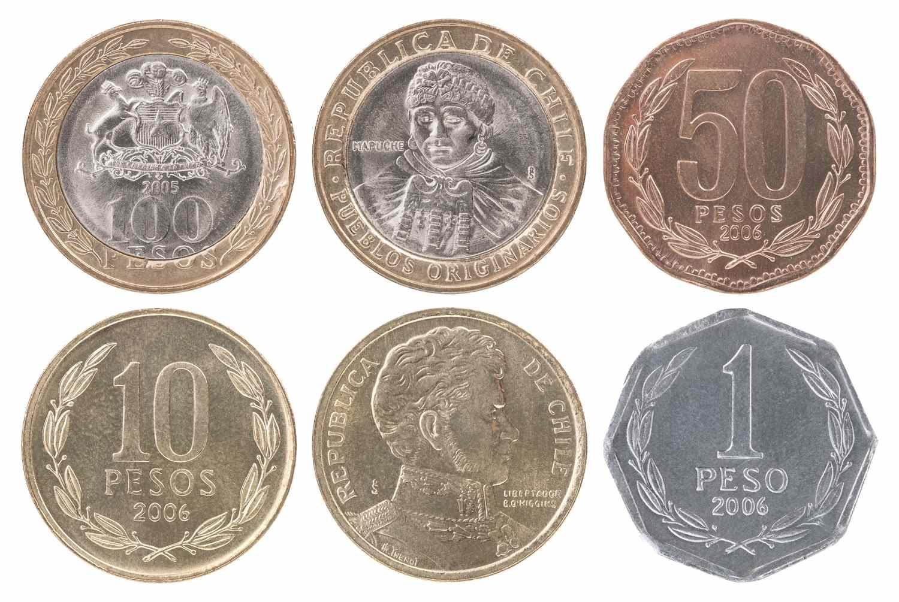

## Table of Contents

## What is the Mexican Peso Crisis?

The Mexican Peso Crisis, also known as the Tequila Crisis, happened in late 1994 and early 1995. It was a big financial problem for Mexico. The value of the Mexican peso dropped a lot very quickly. This made things very expensive for people in Mexico because they had to pay more pesos for things that were priced in dollars. The crisis started because Mexico had a lot of debt and not enough money coming in to pay it back. Also, people were worried about the economy, so they started taking their money out of Mexico.

To fix the problem, the Mexican government and the United States worked together. The U.S. gave Mexico a big loan to help them pay their debts. This loan was important because it helped stop the peso from losing more value. The Mexican government also made changes to their economy to make it stronger. Over time, these actions helped Mexico recover from the crisis. But it was a hard time for many people in Mexico, and it showed how important it is for countries to manage their money carefully.

## When did the Mexican Peso Crisis occur?

The Mexican Peso Crisis happened in late 1994 and early 1995. It was a big problem for Mexico because the value of their money, the peso, went down a lot very quickly. This made things more expensive for people in Mexico because they needed more pesos to buy things that cost dollars.

The crisis started because Mexico had a lot of debt and not enough money coming in to pay it back. People were worried about the economy, so they started taking their money out of Mexico. To fix the problem, the Mexican government and the United States worked together. The U.S. gave Mexico a big loan to help them pay their debts. This loan helped stop the peso from losing more value. The Mexican government also made changes to make their economy stronger. Over time, these actions helped Mexico recover from the crisis.

## What were the immediate causes of the Mexican Peso Crisis?

The Mexican Peso Crisis was caused by a few big problems. One big problem was that Mexico had borrowed a lot of money. They had taken loans in dollars, but their money, the peso, was not as strong. When people started to worry that Mexico might not be able to pay back these loans, they wanted to take their money out of Mexico. This made the peso lose value even faster because everyone was trying to change their pesos into dollars.

Another cause was that the Mexican government had been keeping the value of the peso artificially high. They did this to make it seem like their economy was doing better than it really was. But this couldn't last forever. When they finally let the peso's value drop, it fell a lot all at once. This sudden drop made everything more expensive for people in Mexico and made the crisis even worse.

## How did the devaluation of the peso affect the Mexican economy?

The devaluation of the peso made everything more expensive for people in Mexico. Since many things they needed, like food and gas, were priced in dollars, they had to use more pesos to buy them. This meant that people's money didn't go as far as it used to. Many people found it hard to afford the things they needed. Businesses also had a hard time because it cost them more to buy the things they needed to make their products. Some businesses had to close, and many people lost their jobs.

The crisis also made it hard for Mexico to pay back its loans. Because the peso was worth less, it took more pesos to pay back the same amount of dollars they had borrowed. This made Mexico's debt even bigger. The government had to make big changes to try to fix the problem. They got help from the United States, which gave them a big loan to help pay back their debts. Over time, these changes and the help from the U.S. helped Mexico's economy start to get better, but it was a tough time for many people.

## What role did international factors play in the crisis?

International factors played a big role in the Mexican Peso Crisis. One important [factor](/wiki/factor-investing) was the global interest rates. When the U.S. raised its interest rates, it made it more expensive for Mexico to borrow money in dollars. This made it harder for Mexico to pay back its loans because they had to pay more interest. Also, when the U.S. interest rates went up, investors started moving their money from Mexico to the U.S. because they could get a better return there. This made the peso lose value even faster.

Another international factor was the trade agreement between Mexico, the U.S., and Canada, called NAFTA. When NAFTA was signed, many investors thought it would be good for Mexico's economy. They put a lot of money into Mexico hoping to make a profit. But when the peso started to lose value, these investors got worried and started taking their money out of Mexico. This made the crisis worse because it put more pressure on the peso. The U.S. also played a big role in helping Mexico recover from the crisis by giving them a big loan to help pay back their debts.

## How did the Mexican government respond to the crisis?

The Mexican government took quick action to try to fix the crisis. They let the value of the peso drop, which was a big change. They also got help from the United States. The U.S. gave Mexico a big loan to help them pay back their debts. This loan was important because it helped stop the peso from losing more value. The Mexican government also made changes to their economy to make it stronger. They cut spending and raised taxes to try to balance their budget. These actions were hard for people, but they were necessary to help the country recover.

Over time, these changes started to work. The value of the peso began to stabilize, and the economy started to grow again. The government also worked on making the financial system stronger so that a crisis like this would be less likely to happen again. They made rules to control how much money the country could borrow and how it was used. These efforts helped Mexico recover from the crisis, but it was a tough time for many people. The crisis showed how important it is for countries to manage their money carefully and be ready for unexpected problems.

## What was the impact of the crisis on the average Mexican citizen?

The Mexican Peso Crisis made life very hard for the average Mexican citizen. When the peso lost a lot of its value, everything became more expensive. Things like food, gas, and medicine, which people needed every day, cost more pesos because they were priced in dollars. This meant that people's money didn't go as far as it used to. Many families had to cut back on spending, and some couldn't afford the things they needed. People who had saved money found that their savings were worth less, making it harder to plan for the future.

The crisis also led to a lot of job losses. As businesses struggled with higher costs, some had to close down, leaving many people without work. Unemployment went up, and it was harder for people to find new jobs. This made it even tougher for families to make ends meet. The government's efforts to fix the crisis, like cutting spending and raising taxes, also put more pressure on people. It was a difficult time, but over time, as the economy started to recover, things slowly began to get better for the average Mexican citizen.

## What international assistance was provided during the crisis?

The United States played a big role in helping Mexico during the Peso Crisis. They gave Mexico a big loan to help them pay back their debts. This loan was important because it helped stop the peso from losing more value. The U.S. wanted to help because they were worried that the crisis could spread to other countries and hurt the global economy. By helping Mexico, they hoped to keep the problem from getting worse.

The International Monetary Fund (IMF) also helped Mexico. They gave Mexico money to help them fix their economy. The IMF wanted to make sure that Mexico could pay back their loans and that their economy would get better. Both the U.S. and the IMF worked together to support Mexico during this tough time. Their help was important in helping Mexico recover from the crisis.

## How long did it take for Mexico to recover from the crisis?

It took Mexico a few years to recover from the Peso Crisis. The crisis started in late 1994 and early 1995, and by the end of 1995, things were starting to get better. The big loan from the United States and help from the International Monetary Fund were important in helping Mexico pay back their debts and stabilize the peso. The Mexican government also made changes to their economy, like cutting spending and raising taxes, to help balance their budget and make the economy stronger.

By 1996, the economy was growing again, and the value of the peso was more stable. It took a bit longer for people to feel the recovery in their daily lives. Unemployment went down, and businesses started to do better. By the late 1990s, Mexico had mostly recovered from the crisis, but it was a hard time for many people. The crisis showed how important it is for countries to manage their money carefully and be ready for unexpected problems.

## What economic reforms were implemented post-crisis to prevent future crises?

After the Peso Crisis, the Mexican government made a lot of changes to make sure it wouldn't happen again. They made new rules to control how much money the country could borrow and how it was used. They also worked on making the financial system stronger. This meant making banks follow stricter rules so they wouldn't take too many risks. The government also started keeping a closer eye on the economy to spot problems early. These changes were important to help prevent another big crisis.

The government also worked on making the economy more stable. They did this by keeping the budget balanced and not spending more money than they had. They also made it easier for businesses to grow by making trade easier and encouraging more investment. These efforts helped Mexico's economy get stronger over time. By making these changes, the government hoped to make the economy more stable and less likely to have another big crisis like the one in 1994-1995.

## How has the Mexican Peso Crisis influenced economic policy in Mexico today?

The Mexican Peso Crisis taught Mexico a lot about managing their money. Today, the government is very careful about how much they borrow. They keep a close eye on the economy to spot problems early. They also made rules to make sure banks don't take too many risks. These changes help keep the economy stable and prevent another big crisis like the one in 1994-1995.

The crisis also showed Mexico the importance of having a strong financial system. Now, the government works hard to make sure businesses can grow and that trade is easy. They encourage more investment and keep the budget balanced. These efforts have made Mexico's economy stronger over time. The lessons from the Peso Crisis still guide how Mexico manages its money today.

## What lessons can other countries learn from the Mexican Peso Crisis?

The Mexican Peso Crisis teaches other countries that it's important to be careful with borrowing money. When Mexico borrowed a lot and couldn't pay it back, it caused big problems. Countries should keep their debt low and make sure they can pay it back. They should also watch their economy closely to spot problems early. If they see something going wrong, they can fix it before it gets too bad.

Another lesson is that keeping the value of money stable is important. Mexico tried to keep the peso's value high, but when they couldn't do it anymore, the peso fell a lot all at once. This made everything more expensive for people. Countries should let their money's value change naturally and not try to control it too much. They should also have a strong financial system with rules to stop banks from taking big risks. This can help prevent a crisis like the one in Mexico.

## References & Further Reading

[1]: Krugman, P. (1995). ["Innocent Abroad: Mexico's Stability Crisis."](https://scholar.google.com/citations?user=D_Rebd0AAAAJ) Foreign Affairs, 73(4), 21-34.

[2]: Dornbusch, R., & Werner, A. (1994). ["Mexico: Stabilization, Reform, and No Growth."](https://www.brookings.edu/wp-content/uploads/1994/01/1994a_bpea_dornbusch_werner_calvo_fischer.pdf) NBER Working Paper No. 4569.

[3]: Sachs, J., Tornell, A., & Velasco, A. (1996). ["The Mexican Peso Crisis: Sudden Death or Death Foretold?"](https://www.sciencedirect.com/science/article/pii/S0022199696014377) Journal of International Economics, 41(3-4), 265-283.

[4]: Obstfeld, M. (1994). ["The Logic of Currency Crises."](https://www.nber.org/papers/w4640) NBER Working Paper No. 4640.

[5]: Kaminsky, G. L., & Reinhart, C. M. (1999). ["The Twin Crises: The Causes of Banking and Balance-of-Payments Problems."](https://www.aeaweb.org/articles?id=10.1257/aer.89.3.473) American Economic Review, 89(3), 473-500.