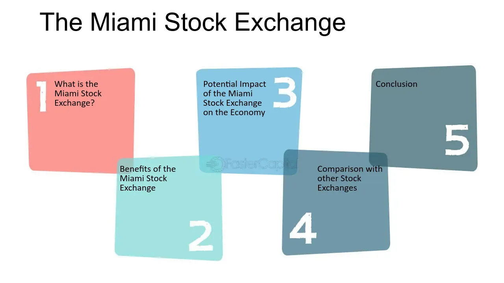

## Table of Contents

## What is the Miami Stock Exchange?

The Miami Stock Exchange, also known as the Miami SE, is a stock exchange located in Miami, Florida. It was established to provide a platform for trading securities, including stocks, bonds, and other financial instruments. The exchange aims to serve both local and international investors by offering a place to buy and sell shares of publicly traded companies.

The Miami Stock Exchange is relatively new compared to other major stock exchanges like the New York Stock Exchange or NASDAQ. It focuses on attracting companies from Latin America and the Caribbean, helping them to raise capital and expand their businesses. By doing so, it hopes to become a key player in the region's financial markets and contribute to the economic growth of the area.

## Where is the Miami Stock Exchange located?

The Miami Stock Exchange is in Miami, Florida. It is a place where people can buy and sell stocks and other financial things.

It is not as old as some other big stock exchanges. It wants to help companies from Latin America and the Caribbean to grow and make money.

## When was the Miami Stock Exchange founded?

The Miami Stock Exchange was founded in 2012. It is a newer stock exchange compared to others like the New York Stock Exchange or NASDAQ.

The Miami Stock Exchange is in Miami, Florida. It helps companies from Latin America and the Caribbean to raise money and grow their businesses. It wants to be an important part of the financial markets in the region.

## What types of securities are traded on the Miami Stock Exchange?

The Miami Stock Exchange trades different types of securities. These include stocks, which are shares in a company that people can buy and sell. They also trade bonds, which are like loans that investors give to companies or governments, and the bond pays back with interest over time.

Another type of security traded on the Miami Stock Exchange is exchange-traded funds (ETFs). ETFs are like baskets of different investments that you can buy and sell like a single stock. This helps investors to easily invest in a variety of assets without having to buy each one separately.

The Miami Stock Exchange focuses on helping companies from Latin America and the Caribbean. By trading these securities, it provides a way for these companies to raise money and grow, while also giving investors a chance to invest in the region's economy.

## How does the Miami Stock Exchange operate?

The Miami Stock Exchange works like a marketplace where people can buy and sell different types of investments, like stocks, bonds, and ETFs. It's set up to help companies from Latin America and the Caribbean raise money by selling parts of their businesses to investors. When someone wants to buy or sell a security, they do it through a broker, who is like a middleman that helps make the trade happen on the exchange.

The exchange uses computers and special software to match buyers and sellers quickly. When a trade is made, the exchange makes sure everything is done fairly and follows the rules. It also keeps track of all the trades and makes sure the prices are clear and easy to see for everyone. By doing this, the Miami Stock Exchange helps companies grow and gives investors a chance to make money from the region's economy.

## Who can trade on the Miami Stock Exchange?

Anyone who wants to trade on the Miami Stock Exchange can do it through a broker. A broker is like a helper who knows how to buy and sell stocks, bonds, and other investments. You need to have an account with a broker who is allowed to trade on the Miami Stock Exchange. This way, you can tell your broker what you want to buy or sell, and they will do it for you on the exchange.

The Miami Stock Exchange is open to both people who live in the area and people from other countries. It's especially good for companies from Latin America and the Caribbean because it helps them find investors who want to put money into their businesses. By trading on the Miami Stock Exchange, these companies can grow and investors can make money from the region's economy.

## What are the trading hours of the Miami Stock Exchange?

The Miami Stock Exchange is open for trading from Monday to Friday. It starts at 9:30 AM and ends at 4:00 PM Eastern Time. These hours are the same as many other big stock exchanges in the United States.

During these hours, people can buy and sell stocks, bonds, and other investments. If you want to trade, you need to do it through a broker who can make the trades for you on the exchange. The Miami Stock Exchange helps companies from Latin America and the Caribbean to grow by connecting them with investors during these trading times.

## How does the Miami Stock Exchange contribute to the local economy?

The Miami Stock Exchange helps the local economy by giving companies a place to raise money. When companies from Latin America and the Caribbean want to grow, they can sell parts of their business on the exchange. This brings in money that they can use to build new things, hire more people, or start new projects. As these companies get bigger, they help create jobs and make the economy stronger.

Also, the Miami Stock Exchange attracts investors from all over the world. When these investors buy and sell stocks and other investments, they help keep the market active. This activity can lead to more business for local companies that help with trading, like brokers and financial advisors. By bringing in more money and keeping the market busy, the Miami Stock Exchange helps the local economy grow and stay healthy.

## What are the listing requirements for companies on the Miami Stock Exchange?

To list on the Miami Stock Exchange, companies need to meet certain rules. They need to have a certain amount of money, called the minimum market capitalization. This means the total value of all their shares should be high enough. They also need to have been in business for a while and show that they are doing well financially. This helps make sure that the companies on the exchange are strong and trustworthy.

Another important rule is that companies need to have a certain number of shareholders. This means enough people should own parts of the company. They also need to follow the exchange's rules about how they share information with the public. This includes telling everyone important news about the company quickly and honestly. By meeting these requirements, companies can show they are ready to be on the Miami Stock Exchange and help it grow.

## How does the Miami Stock Exchange compare to other major stock exchanges?

The Miami Stock Exchange is smaller and newer than big stock exchanges like the New York Stock Exchange (NYSE) and NASDAQ. It started in 2012 and focuses on helping companies from Latin America and the Caribbean. These big exchanges have been around for a long time and have many more companies listed on them. They also have more investors and more money changing hands every day. The Miami Stock Exchange is trying to grow and become more important, but it is still much smaller than these giants.

Even though it's smaller, the Miami Stock Exchange has some special things about it. It wants to be a place where companies from Latin America and the Caribbean can easily raise money. This can help these companies grow and create jobs in their home countries. The big exchanges like NYSE and NASDAQ are more focused on big companies from all over the world. The Miami Stock Exchange also has trading hours from 9:30 AM to 4:00 PM Eastern Time, which is the same as the big exchanges. This makes it easy for investors who are used to trading on those bigger exchanges to also trade on the Miami Stock Exchange.

## What technological innovations has the Miami Stock Exchange implemented?

The Miami Stock Exchange uses modern technology to help people buy and sell stocks, bonds, and other investments easily. They have a special computer system that matches buyers and sellers quickly. This system makes trading fast and smooth, so people can trade without waiting too long. The exchange also uses software that keeps everything fair and follows the rules. This helps make sure that all trades are done the right way and everyone can trust the exchange.

Another important technology the Miami Stock Exchange uses is a platform for sharing information. This platform lets companies tell investors important news quickly and clearly. By using this technology, companies can keep investors up-to-date on what's happening with their business. This helps build trust and makes it easier for investors to make good choices about buying and selling. Overall, these technologies help the Miami Stock Exchange work better and attract more companies and investors.

## What are the future growth prospects for the Miami Stock Exchange?

The Miami Stock Exchange has a good chance to grow in the future. It wants to help more companies from Latin America and the Caribbean. As more companies from these places join the exchange, it can become a bigger and more important place for trading. This can bring in more investors from around the world who want to invest in these growing companies. If the exchange keeps using new technology and making it easy for companies to list, it can attract even more business and money.

Another way the Miami Stock Exchange can grow is by working with other big exchanges. By making friends with bigger exchanges like the New York Stock Exchange or NASDAQ, it can learn from them and maybe even share some trading. This can help the Miami Stock Exchange become more known and trusted. If it keeps showing that it is a good place for companies to raise money and for investors to make money, it can keep getting bigger and help the local economy even more.

## References & Further Reading

[1]: Aldridge, I. (2013). ["High-Frequency Trading: A Practical Guide to Algorithmic Strategies and Trading Systems."](https://www.amazon.com/High-Frequency-Trading-Practical-Algorithmic-Strategies/dp/1118343506) Wiley.

[2]: Johnson, B. R. (2010). ["Algorithmic Trading & DMA: An Introduction to Direct Access Trading Strategies."](https://archive.org/details/algorithmictradi0000john) 4Myeloma Press.

[3]: Chincarini, L. B., & Kim, D. (2006). ["Quantitative Equity Portfolio Management: An Active Approach to Portfolio Construction and Management."](https://archive.org/details/quantitativeequi0000chin_c9d6) McGraw-Hill Education.

[4]: ["The Elements of Statistical Learning: Data Mining, Inference, and Prediction."](https://link.springer.com/book/10.1007/978-0-387-84858-7) by Trevor Hastie, Robert Tibshirani, and Jerome Friedman

[5]: Narang, R. K. (2013). ["Inside the Black Box: A Simple Guide to Quantitative and High-Frequency Trading."](https://onlinelibrary.wiley.com/doi/book/10.1002/9781118662717) Wiley.