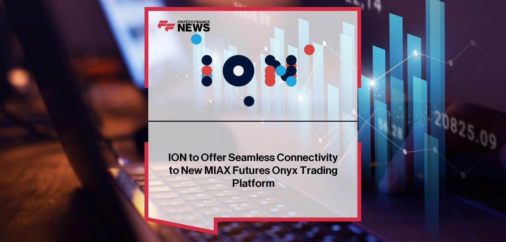

## Table of Contents

## What is the MIAX Futures Trading Platform?

The MIAX Futures Trading Platform is a place where people can buy and sell futures contracts. Futures are agreements to buy or sell something at a future date for a price agreed upon today. The platform is run by the Miami International Holdings, Inc., and it helps traders from all over the world to trade easily and quickly.

This platform is special because it focuses on making trading simple and fast. It uses modern technology to make sure that trades happen smoothly and with little delay. This is important for traders who need to make quick decisions. The platform also has tools and features that help traders understand the market better and make smarter choices.

## Who can use the MIAX Futures Trading Platform?

The MIAX Futures Trading Platform is open to anyone who wants to trade futures, but you need to meet certain rules first. You have to be a member of the platform or work with a member. Members can be big companies, smaller trading firms, or even individual traders who have the right permissions and follow the platform's rules.

Once you're a member or working with one, you can use the platform to buy and sell futures contracts. This means you can trade things like stock indexes, commodities, or currencies. The platform is designed to be easy to use, so whether you're a beginner or an expert, you can navigate it and make trades quickly and efficiently.

## How do you get started with trading on MIAX Futures?

To get started with trading on MIAX Futures, you first need to become a member or work with a member of the platform. If you want to be a member yourself, you'll need to apply and meet the platform's requirements. This might include having enough money, understanding the rules, and passing any necessary checks. If you choose to work with a member, you can find a broker or a trading firm that is already a member and can help you trade on the platform.

Once you're set up as a member or working with one, you can start trading. You'll need to log into the MIAX Futures Trading Platform, where you can see all the futures contracts available to trade. You can choose what you want to buy or sell, like stock indexes or commodities. The platform is designed to be easy to use, so you can quickly make trades and keep an eye on the market. Remember, trading futures can be risky, so it's important to learn about the market and maybe get some advice before you start.

## What types of futures contracts are available on MIAX?

The MIAX Futures Trading Platform offers a variety of futures contracts that you can trade. These include futures on stock indexes, which are like bets on how a group of stocks will do in the future. They also have futures on commodities, which are things like oil, gold, or agricultural products. This means you can trade on the future prices of these items.

In addition to stock indexes and commodities, MIAX also offers futures on currencies. This lets you trade on how the value of one country's money will change compared to another's. The platform is designed to be easy to use, so whether you're interested in trading stocks, commodities, or currencies, you can find the right futures contract for you.

## What are the fees associated with trading on MIAX Futures?

Trading on MIAX Futures comes with different fees that you need to know about. There are fees for making trades, which are called transaction fees. These fees can change depending on how much you trade and what kind of futures contract you are trading. For example, trading stock index futures might have different fees than trading commodity futures. There are also fees for being a member of the platform, which you have to pay to keep your membership active.

Besides these, there might be other costs like clearing fees, which are charged by the clearinghouse that makes sure your trades are safe and secure. If you use a broker or a trading firm to help you trade, they might also charge you extra fees for their services. It's important to understand all these fees before you start trading so you can plan your budget and know what to expect.

## How does MIAX Futures ensure the security of trades and user data?

MIAX Futures takes the security of trades and user data very seriously. They use strong encryption to protect the information that moves between users and the platform. This means that when you log in or make a trade, your data is turned into a secret code that only MIAX Futures can read. They also have strict rules about who can see your information, making sure only the right people have access.

To keep trades safe, MIAX Futures works with a clearinghouse. This is a special organization that makes sure all trades are done correctly and that everyone gets what they are supposed to get. If something goes wrong, the clearinghouse steps in to fix it. This way, you can trust that your trades will be secure and that your money is protected.

## What are the trading hours for MIAX Futures?

MIAX Futures has trading hours that let people from different time zones trade. The platform is open from Sunday evening to Friday evening, following the usual trading week. This means you can start trading at 5:00 PM Eastern Time on Sunday and keep trading until 4:00 PM Eastern Time on Friday.

During these hours, you can trade futures on stock indexes, commodities, and currencies. The long hours help make sure that traders around the world can join in at a time that works for them. This way, no matter where you are, you have a good chance to trade when you want.

## Can you explain the order types supported by MIAX Futures?

MIAX Futures supports different kinds of orders to help you trade the way you want. A market order is the simplest one. It means you want to buy or sell right away at the best price available at that moment. A limit order lets you set a specific price at which you want to trade. If the market reaches your price, your order will go through. If it doesn't, your order won't happen.

Another type is a stop order, which is used to limit losses or protect profits. You set a 'stop price,' and when the market reaches it, your order turns into a market order. There's also a stop-limit order, which combines a stop order and a limit order. When the market hits your stop price, your order turns into a limit order at the price you set. This gives you more control over the price at which your trade happens.

These order types help you trade in different ways depending on what you need. Whether you want to trade quickly, set a specific price, or protect your investments, MIAX Futures has the tools to help you do it. Knowing how to use these orders can make a big difference in how you trade and manage your risks.

## How does MIAX Futures handle market volatility and liquidity?

MIAX Futures works hard to handle market [volatility](/wiki/volatility-trading-strategies) and keep the market liquid. Volatility means the market can change a lot and quickly. To deal with this, MIAX Futures uses special systems that can handle lots of trades fast. This helps keep things smooth even when the market is moving a lot. They also have rules to make sure everyone follows the same guidelines, which helps keep the market fair and stable.

Liquidity is about how easy it is to buy or sell something without changing the price too much. MIAX Futures makes sure there are always enough buyers and sellers by working with market makers. These are people or companies that are always ready to buy or sell, which helps keep the market moving. By having these market makers, MIAX Futures makes sure you can trade whenever you want, even during busy times.

## What advanced trading tools does MIAX Futures offer to experienced traders?

MIAX Futures offers advanced trading tools that help experienced traders make smarter decisions. One of these tools is real-time market data, which shows what's happening in the market right now. This helps traders see how prices are moving and make quick trades. Another tool is the ability to use complex order types. These let traders set up trades that happen only when certain conditions are met, like if the price goes up or down to a certain point. This gives traders more control over their trades.

Another useful tool is the platform's analytics and charting features. These help traders look at past data to see patterns and trends. By understanding these patterns, traders can predict what might happen next and plan their trades better. MIAX Futures also offers algo trading, which means using computer programs to trade automatically based on rules set by the trader. This can help traders take advantage of market opportunities faster than they could by trading manually.

## How does MIAX Futures comply with regulatory requirements?

MIAX Futures makes sure it follows all the rules set by the government and other groups that watch over trading. They do this by working closely with organizations like the Commodity Futures Trading Commission (CFTC) and the National Futures Association (NFA). These groups have strict rules to make sure trading is fair and safe. MIAX Futures follows these rules by keeping good records, making sure their systems are safe, and checking that everyone trading on their platform is doing it the right way.

To stay in line with these rules, MIAX Futures also does regular checks on their own. They look at how their platform works and make changes if needed to keep everything up to standard. They also train their staff and members to know the rules and follow them. This way, MIAX Futures can keep the trust of traders and make sure everyone feels safe when they trade on their platform.

## What are some strategies for maximizing profits on MIAX Futures?

One way to make more money on MIAX Futures is by using the right trading strategies. A popular strategy is called [trend following](/wiki/trend-following). This means you watch the market to see if prices are going up or down over time. If you see a trend, you can buy or sell futures to make money from that trend. Another strategy is called hedging. This is when you use futures to protect yourself from losing money if prices change a lot. For example, if you own something and you're worried its price might go down, you can sell a future on it to make up for any loss.

Another important thing is to use the tools MIAX Futures gives you. They have real-time data and charts that can help you see what's happening in the market right now. By looking at this data, you can make better choices about when to buy or sell. Also, using algo trading can help. This is when you set up a computer program to trade for you based on rules you make. It can help you trade faster and take advantage of small changes in the market that you might miss if you were trading by hand.

## References & Further Reading

[1]: Vivius, C. (2010). ["The Grain Merchants: An Illustrated History of the Minneapolis Grain Exchange"](https://www.amazon.com/Grain-Merchants-Illustrated-Minneapolis-Exchange/dp/1890434744). Afton Historical Society Press.

[2]: Busch, L. A. (2016). ["Trading in the Global FX Market Using Algorithmic Trading Strategies."](https://www.researchgate.net/publication/378548435_Algorithmic_Trading_and_AI_A_Review_of_Strategies_and_Market_Impact) Springer Proceedings in Mathematics & Statistics.

[3]: Cartea, Á., Jaimungal, S., & Penalva, J. (2015). ["Algorithmic and High-Frequency Trading."](https://assets.cambridge.org/97811070/91146/frontmatter/9781107091146_frontmatter.pdf) Cambridge University Press.

[4]: Moosa, I. A. (2002). ["The Impact of Uncertainty on Market Performance: Evidence from Academic Literature"](https://www.scirp.org/reference/referencespapers?referenceid=3888134). Routledge.

[5]: Minas, C., & Martins, M. M. (2008). ["Technological Advancements in Financial Markets: The Role of Futures Trading and Algorithmic Trading Systems."](https://brajets.com/brajets/article/view/579) International Review of Financial Analysis.