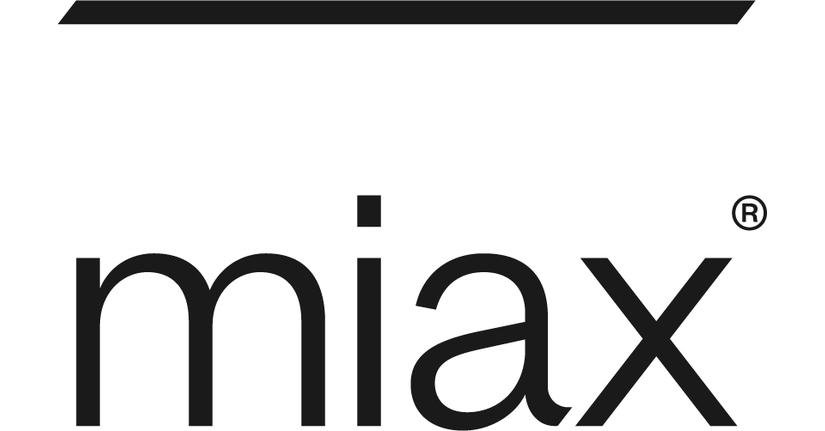

## Table of Contents

## What is the MIAX Options Exchange?

The MIAX Options Exchange, often just called MIAX, is a place where people can buy and sell options. Options are special kinds of contracts that give you the right to buy or sell something, like a stock, at a certain price before a certain date. MIAX started in 2012 and is known for using new technology to make trading faster and easier. It's based in Princeton, New Jersey.

MIAX is different from some other exchanges because it focuses a lot on technology. They use a system that can handle a lot of trades very quickly. This makes it easier for traders to do their work without waiting. MIAX also tries to keep costs low for people who use the exchange, which can help traders save money.

## When was the MIAX Options Exchange founded?

The MIAX Options Exchange was founded in 2012. It's a place where people can trade options, which are contracts that let you buy or sell things like stocks at a set price before a certain time.

MIAX is special because it uses new technology to make trading faster and easier. It's based in Princeton, New Jersey, and it tries to keep costs low for people who use it. This can help traders save money and do their work more smoothly.

## What types of options can be traded on the MIAX Options Exchange?

On the MIAX Options Exchange, you can trade different kinds of options. The main types are call options and put options. A call option gives you the right to buy something, like a stock, at a certain price before a certain date. A put option gives you the right to sell something at a set price before the date runs out. These options can be on stocks, exchange-traded funds (ETFs), or indexes.

MIAX also lets you trade options with different expiration dates. Some options expire in a week, some in a month, and others can go out even further. This variety lets traders choose options that fit their plans. Whether you want to make a quick trade or hold onto an option for a longer time, MIAX has options that can work for you.

## How does the MIAX Options Exchange differ from other options exchanges?

The MIAX Options Exchange stands out from other options exchanges mainly because of its focus on technology. MIAX uses a high-tech system that can handle a lot of trades very quickly. This makes trading faster and smoother for people who use the exchange. Unlike some other exchanges, MIAX is known for keeping up with the latest technology to make sure traders can do their work without delays.

Another way MIAX differs is by trying to keep costs low for traders. This can help people save money when they trade options on MIAX. The exchange also offers a variety of options, like call and put options on stocks, ETFs, and indexes, with different expiration dates. This gives traders more choices and flexibility compared to some other exchanges that might have fewer options or higher fees.

## What are the trading hours for the MIAX Options Exchange?

The MIAX Options Exchange is open for trading from 9:30 AM to 4:00 PM Eastern Time, Monday through Friday. These hours match the regular trading hours of the U.S. stock market, so people can trade options at the same time they trade stocks.

Sometimes, MIAX also has special trading sessions outside of these regular hours. These are called pre-market and after-hours sessions. Pre-market trading starts at 7:00 AM and goes until the regular session begins at 9:30 AM. After-hours trading runs from 4:00 PM to 5:30 PM. These extra sessions give traders more chances to buy and sell options when the main market is closed.

## What are the fee structures for trading on the MIAX Options Exchange?

The fee structure for trading on the MIAX Options Exchange is designed to be clear and fair. For people who want to trade options, MIAX charges fees based on the type of trade and how much you trade. If you are a market maker, which means you help make sure there are always prices to buy and sell options, you might pay less than someone who just trades for themselves. The fees can also change depending on if you are adding or taking away from the market's [liquidity](/wiki/liquidity-risk-premium). Adding liquidity means you are putting in orders that other people can trade against, and taking liquidity means you are using orders that are already there.

MIAX also offers different pricing tiers, which means the more you trade, the less you might have to pay per trade. This can help big traders save money. For example, if you trade a lot of options, you might get into a lower fee tier, which makes each trade cheaper. MIAX tries to keep these fees low to make trading easier and more affordable for everyone. You can find all the details about the fees on the MIAX website or by talking to a MIAX representative.

## How can one become a member of the MIAX Options Exchange?

To become a member of the MIAX Options Exchange, you need to go through a few steps. First, you have to fill out an application form that you can find on the MIAX website. You'll need to provide some information about yourself or your company, like your name, address, and contact details. You also need to show that you meet the financial requirements set by MIAX. This means you have to prove that you have enough money or assets to trade options safely.

Once you've sent in your application, MIAX will review it to make sure you meet all their rules. If everything looks good, they will approve your membership. After you're approved, you'll need to pay a membership fee and maybe some other costs. Then, you can start trading options on MIAX. If you ever need help, MIAX has people you can talk to who will guide you through the whole process.

## What technological features does the MIAX Options Exchange offer to enhance trading?

The MIAX Options Exchange uses a lot of cool technology to make trading easier and faster. They have a system that can handle a lot of trades very quickly. This means traders don't have to wait long to buy or sell options. MIAX also has something called a "matching engine" that helps find the best prices for trades. This makes sure that people get the best deals when they trade.

Another neat feature of MIAX is that they use technology to keep costs low for traders. They have special systems that help them offer lower fees than some other exchanges. This can save traders money. MIAX also has tools that help traders see what's happening in the market in real-time. This lets them make smart choices about when to buy or sell options.

## What are some of the key regulatory requirements for trading on the MIAX Options Exchange?

To trade on the MIAX Options Exchange, you need to follow some important rules set by regulators. One key rule is that you have to be a member of the exchange. To become a member, you need to fill out an application and show that you have enough money or assets. This is called meeting the financial requirements. The regulators want to make sure that traders can handle the risks of trading options.

Another important rule is that you have to follow the rules set by the U.S. Securities and Exchange Commission (SEC) and other regulatory bodies. This includes rules about how you trade, how you report your trades, and how you keep your customers' information safe. MIAX also has its own rules that you need to follow, like paying fees and using their trading systems correctly. These rules help keep the market fair and safe for everyone who trades on MIAX.

## How does the MIAX Options Exchange handle market volatility and ensure fair trading?

The MIAX Options Exchange uses special technology and rules to handle market ups and downs and make sure trading stays fair. When the market gets wild, MIAX's system can handle a lot of trades really fast. This helps keep things smooth even when a lot of people are trying to buy and sell at the same time. They also have a thing called a "circuit breaker" that can stop trading for a bit if prices start moving too fast. This gives everyone a chance to catch their breath and helps stop big crashes.

MIAX also works hard to make sure everyone gets a fair shot at trading. They use a system that matches up buy and sell orders in a way that's fair to everyone. This means no one gets special treatment. Plus, MIAX watches trades closely to make sure no one is doing anything sneaky or unfair. They have rules that everyone has to follow, and if someone breaks them, MIAX can step in to fix things. This helps keep the market honest and safe for all traders.

## What are the recent developments or innovations introduced by the MIAX Options Exchange?

The MIAX Options Exchange has been working on some cool new things to make trading even better. One big change is that they've made their trading system even faster. This means traders can buy and sell options more quickly, which is really important when the market is moving fast. They've also added new tools that help traders see what's happening in the market in real-time. This lets traders make smarter choices about when to trade.

Another recent change is that MIAX has started offering new types of options. These new options give traders more choices and can help them make different kinds of trades. MIAX is also trying to make trading cheaper by changing how they charge fees. They're looking at ways to lower costs so that more people can trade on their exchange. All these changes show that MIAX is always trying to get better and help traders do their best.

## How does the MIAX Options Exchange contribute to the overall options market ecosystem?

The MIAX Options Exchange plays a big role in the options market by making trading easier and faster for everyone. They use new technology to handle a lot of trades quickly, which helps keep the market running smoothly. This is really important because when the market is busy, traders need to be able to buy and sell options without waiting. MIAX also tries to keep costs low, which means more people can trade options without spending too much money. This helps make the options market bigger and more active.

MIAX also adds to the options market by offering different kinds of options and trading times. They have options on stocks, ETFs, and indexes, and they let people trade at different times of the day. This gives traders more choices and helps them find the best times and options for their needs. By doing all these things, MIAX helps make the options market a better place for everyone who trades there.

## References & Further Reading

[1]: Haugh, M. (2017). ["Introduction to Derivative Securities, Financial Markets, and Risk Management"](https://worldscientific.com/worldscibooks/10.1142/13797) MIT Press.

[2]: "Options, Futures, and Other Derivatives" by John C. Hull. A premier text on derivatives that covers options trading and provides a solid foundation in financial markets.

[3]: Hasbrouck, J. (2007). ["Empirical Market Microstructure: The Institutions, Economics, and Econometrics of Securities Trading"](https://archive.org/details/empiricalmarketm0000hasb) Oxford University Press.

[4]: "The Complete Guide to Option Pricing Formulas" by Espen Gaarder Haug. This book provides a comprehensive guide on option pricing models used by traders.

[5]: Chlistalla, M. (2011). ["High-Frequency Trading: Better than its Reputation?"](https://c.mql5.com/forextsd/forum/168/high-frequency_trading_-_better_than_its_reputation.pdf) Deutsche Bank Research.

[6]: Aldridge, I. (2013). ["High-Frequency Trading: A Practical Guide to Algorithmic Strategies and Trading Systems"](https://onlinelibrary.wiley.com/doi/pdf/10.1002/9781119203803.fmatter) Wiley.