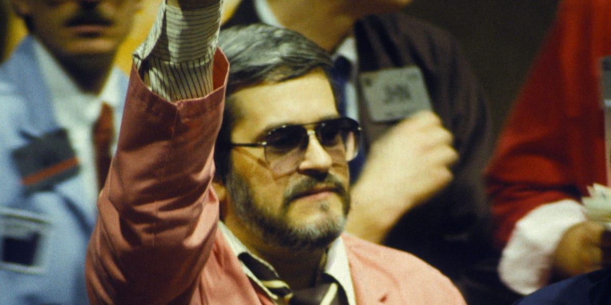

## Table of Contents

## Who is Michael Marcus and what is he known for?

Michael Marcus is a name that might refer to different people, but one well-known Michael Marcus is a trader and investor. He was born in 1950 and became famous for his work in the financial markets. Marcus started trading in the 1970s and became very successful. He worked at Commodities Corporation, a company known for training successful traders. Marcus made a lot of money trading commodities like currencies, metals, and agricultural products.

Marcus is also known for his mentorship and for sharing his knowledge with others. He helped train many other traders who later became successful. One of his famous students is Paul Tudor Jones, who is also a very successful trader. Marcus's story is often told in books and interviews about trading. He is seen as a role model for people who want to learn about trading and investing.

## What was Michael Marcus's early life and education like?

Michael Marcus grew up in a middle-class family in the United States. He was born in 1950. As a young boy, he was interested in numbers and how things worked. He liked to read a lot and was good at school. Marcus went to Johns Hopkins University, which is a good school. There, he studied psychology. He was curious about how people think and behave.

After finishing his degree, Marcus decided to go to graduate school. He went to Clark University to study more about psychology. But while he was there, he started to get interested in the stock market. He began to read [books](/wiki/algo-trading-books) about trading and investing. This new interest changed his path. Instead of becoming a psychologist, Marcus decided to try his luck in the world of finance. This was the start of his journey to becoming a famous trader.

## How did Michael Marcus start his career in trading?

Michael Marcus started his trading career after he got interested in the stock market while studying psychology at Clark University. He read books about trading and decided to try it himself. He began trading with a small amount of money. At first, he made some mistakes and lost money. But he learned from those mistakes and got better at trading.

After some time, Marcus got a job at a company called Reynolds Securities. There, he worked as a commodity futures broker. He learned a lot about trading different things like metals and agricultural products. Later, he moved to Commodities Corporation, a company known for training successful traders. At Commodities Corporation, Marcus became very good at trading and made a lot of money. This is how he started his successful career in trading.

## What were some of the key strategies Michael Marcus used in his trading?

Michael Marcus used a few key strategies in his trading. One important strategy was to always have a plan. He would think about what he wanted to do before he did it. He would decide how much money he was willing to lose on a trade. If the trade went bad, he would stop it before losing too much money. This is called setting a stop-loss. Marcus also liked to trade in different markets. He would trade things like gold, silver, and corn. By trading different things, he could make money even if one market was not doing well.

Another strategy Marcus used was to follow trends. He would look at the market and see which way prices were moving. If prices were going up, he would buy. If prices were going down, he would sell. Marcus believed that following trends was a good way to make money. He also paid attention to what other people were doing in the market. He would listen to news and read reports to understand what might happen next. By using these strategies, Marcus was able to be very successful in his trading career.

## Can you describe a significant trade that Michael Marcus is famous for?

One of the most famous trades Michael Marcus made was in the silver market. In the late 1970s, Marcus noticed that the price of silver was going up. He decided to buy a lot of silver. At the time, many people thought the price of silver would keep going up. Marcus bought silver and waited. The price did go up a lot, and Marcus made a lot of money from this trade.

This trade was important because it showed how Marcus used his strategies. He followed the trend of the market and was willing to take a big risk. By buying a lot of silver, Marcus showed that he believed in his plan. This trade helped him become very rich and well-known in the trading world.

## What were the major challenges Michael Marcus faced in his trading career?

Michael Marcus faced many challenges in his trading career. One big challenge was when he first started trading. He lost a lot of money because he did not know what he was doing. He made mistakes and did not have a good plan. But Marcus learned from these early failures. He started to study more and make better plans. This helped him become a better trader.

Another challenge Marcus faced was the ups and downs of the market. Sometimes, the market would go against what he expected. He would lose money on trades that he thought would make money. Marcus had to learn to handle these losses and not let them affect him too much. He kept a cool head and stuck to his strategies. This helped him stay successful even when the market was hard to predict.

## How did Michael Marcus's approach to risk management evolve over time?

When Michael Marcus first started trading, he did not know much about managing risk. He would make trades without thinking about how much he could lose. This led to big losses early in his career. But Marcus learned from these mistakes. He started to think more about how to protect his money. He began to use stop-loss orders, which are like safety nets. If a trade went bad, the stop-loss would stop the trade before he lost too much money.

Over time, Marcus got better at managing risk. He learned to only risk a small part of his money on each trade. This way, even if he lost on a trade, he would not lose everything. Marcus also started to spread his money across different markets. This is called diversification. By trading in different things like gold, silver, and corn, he could make money even if one market was not doing well. His approach to risk management became more careful and smart, which helped him become a very successful trader.

## What impact did Michael Marcus have on the trading community and other traders?

Michael Marcus had a big impact on the trading community. He was known for being a very good trader and for making a lot of money. Many people looked up to him and wanted to learn from him. Marcus worked at Commodities Corporation, a place known for training successful traders. He helped train many people who later became successful traders themselves. One of his famous students is Paul Tudor Jones, who is also a very successful trader. Marcus shared his knowledge and helped others learn how to trade well.

Marcus also showed other traders how to manage risk. He taught them to use stop-loss orders and to only risk a small part of their money on each trade. He also showed them the importance of following trends and diversifying their trades. Many traders learned from Marcus's strategies and became better at trading because of him. His approach to trading and risk management is still talked about and used by traders today.

## What are some of the lesser-known aspects of Michael Marcus's trading philosophy?

Michael Marcus believed that psychology was very important in trading. He thought that traders needed to understand their own feelings and not let fear or greed control them. Marcus said that being calm and patient was key. He believed that traders should not get too excited when they made money or too upset when they lost money. He also thought that traders should always keep learning. Marcus read a lot of books and talked to other traders to learn new things. He believed that being curious and open to new ideas made him a better trader.

Another lesser-known aspect of Marcus's philosophy was his focus on being flexible. He knew that the market could change quickly, so he was always ready to change his plans. Marcus did not stick to one way of trading. Instead, he would try different strategies and see what worked best at different times. He also believed in the importance of having a support system. Marcus talked to other traders and mentors to get advice and share ideas. This helped him stay strong and keep improving, even when trading was hard.

## How did Michael Marcus's mentorship influence other successful traders?

Michael Marcus's mentorship had a big impact on many traders. He worked at Commodities Corporation, a place known for teaching people how to trade well. Marcus shared what he knew with others and helped them become good traders. One of the people he taught was Paul Tudor Jones, who became very famous and successful. Marcus showed his students how to follow market trends, manage risk, and stay calm when trading. By teaching these things, Marcus helped many traders make a lot of money and do well in their careers.

Marcus also believed that learning never stops. He told his students to keep reading and talking to other traders to learn new things. He thought that being curious and open to new ideas was important for success. Marcus's students learned from his example and kept learning even after they became successful. This helped them stay ahead in the fast-changing world of trading. Marcus's influence can still be seen today in how many traders think about and approach their work.

## What are some of the books or resources where one can learn more about Michael Marcus's methods?

One of the best places to learn about Michael Marcus's methods is in the book "Market Wizards" by Jack D. Schwager. In this book, Marcus shares his story and talks about how he trades. He explains his strategies for following trends and managing risk. The book also shows how Marcus learned from his mistakes and became a successful trader. It is a good resource for anyone who wants to learn more about trading and how Marcus did it.

Another resource is "The New Market Wizards" by Jack D. Schwager. This book is a follow-up to "Market Wizards" and includes more interviews with successful traders, including Marcus. He talks about his approach to trading and how he mentored other traders. Reading these books can help you understand Marcus's methods and how he thought about trading. They are great for anyone interested in learning from one of the best traders.

## What lessons can beginner traders learn from Michael Marcus's career and experiences?

Beginner traders can learn a lot from Michael Marcus's career. One important lesson is to always have a plan before you start trading. Marcus always thought about what he wanted to do and how much money he was willing to lose. He used stop-loss orders to protect his money. This helped him not lose everything when a trade went bad. Another lesson is to keep learning. Marcus read books and talked to other traders to learn new things. He believed that being curious and open to new ideas made him a better trader.

Another key lesson from Marcus is to manage your feelings. He thought that staying calm and patient was very important. Marcus did not let fear or greed control him. He stayed cool even when he made or lost money. This helped him make better decisions. Marcus also showed the importance of being flexible. He was always ready to change his plans if the market changed. By trying different strategies, he could find what worked best at different times. These lessons can help beginner traders do well and avoid big mistakes.

## References & Further Reading

[1]: Schwager, J. D. (1989). ["Market Wizards: Interviews with Top Traders"](https://www.amazon.com/Market-Wizards-Jack-D-Schwager/dp/0887306101). John Wiley & Sons, Inc.

[2]: ["Trend Following: Learn to Make Millions in Up or Down Markets"](https://www.amazon.com/Trend-Following-Updated-Millions-Markets/dp/013702018X) by Michael W. Covel

[3]: ["Educational Economic Perspectives that Enhanced Michael Marcus' Trading Approach"](https://www.tandfonline.com/doi/full/10.1080/09645292.2015.1059801) by Harvard Business Review

[4]: ["Technical Analysis of the Financial Markets: A Comprehensive Guide to Trading Methods and Applications"](https://www.amazon.com/Technical-Analysis-Financial-Markets-Comprehensive/dp/0735200661) by John J. Murphy

[5]: Jackson, M. O., & Sellars, M. P. (Eds.). (2009). ["Algorithmic Choice and Strategic Communication"](https://books.google.com/books/about/Reflective_Practice_for_Teachers.html?id=sKzDDgAAQBAJ). Springer Series in Operations Research and Financial Engineering.