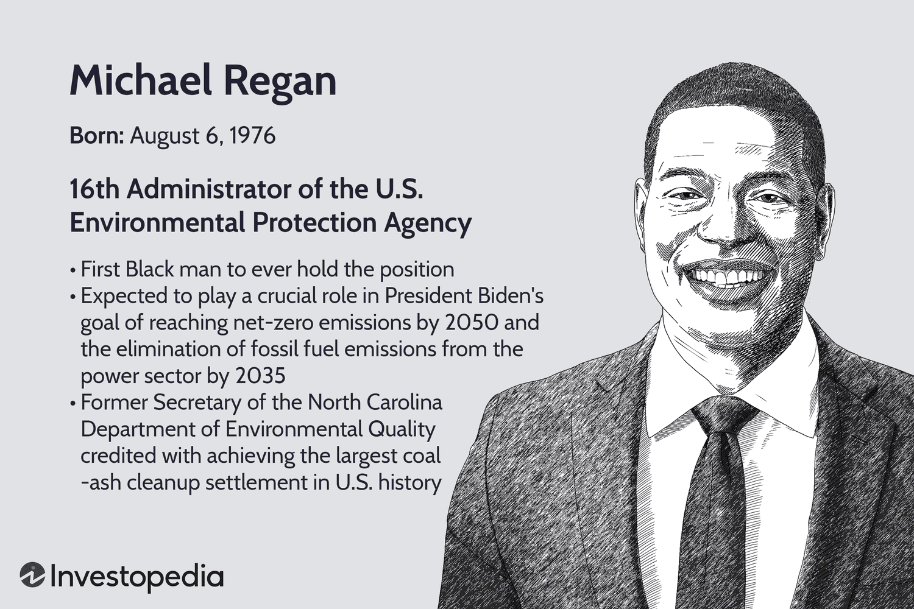

In recent years, the synergy between environmental justice, sustainability, and technological advancements has become increasingly apparent. At the forefront of addressing environmental justice issues is Michael Regan, the leader of the Environmental Protection Agency (EPA). His tenure signifies a pivotal moment in aligning environmental policy with modern technological capabilities. Concurrently, the financial sector witnesses a significant shift as algorithmic trading—a technology-driven approach—becomes a vital component in financial markets. With growing interest, analysts explore how this intersection of finance and environmental regulation can promote sustainable development.

Michael Regan's leadership at the EPA is poised to influence not only the agency's policies but also the broader aspects of how financial mechanisms can support environmental objectives. The potential integration of algorithmic trading with environmental regulation signifies a transformative approach to sustainable investing. These automated systems can leverage vast datasets and sophisticated algorithms to align financial decision-making with environmental, social, and governance (ESG) criteria, subsequently steering investments towards sustainable ventures.



As we examine Regan's contributions and the EPA's evolving challenges, it is essential to consider the role of automated trading technologies in advancing sustainable practices. By understanding these dynamics, we can appreciate the coupling of environmental justice initiatives with innovative financial tools designed to meet sustainability targets. This exploration highlights the ongoing efforts to harmonize economic growth with ecological preservation, potentially paving the way for a sustainable future facilitated by technological innovation.

## Table of Contents

## Overview of the Environmental Protection Agency (EPA)

The Environmental Protection Agency (EPA) is a pivotal federal institution in the United States, charged with the mission of safeguarding both human health and the natural environment. Established in 1970 in response to growing concerns over environmental pollution, the EPA's primary role involves enforcing regulations derived from a wide range of environmental legislation enacted by Congress. This includes major laws such as the Clean Air Act, the Clean Water Act, and the Toxic Substances Control Act.

Under the leadership of Michael Regan, appointed as the Administrator of the EPA in 2021, the agency has embarked on a series of ambitious initiatives aimed at promoting environmental justice. Regan's approach focuses on addressing long-standing inequities that have resulted in marginalized communities bearing a disproportionate share of environmental risks and pollution. His leadership underscores a commitment to ensuring clean air and water for all communities, particularly those historically burdened by environmental neglect.

The EPA's role extends beyond mere regulation; it is integral in shaping the national discourse on climate change and environmental inequality. The agency actively works to mitigate pollution through various programs and partnerships designed to reduce greenhouse gas emissions and promote sustainable practices. This includes improving air and water quality, managing chemical safety, and revitalizing contaminated sites through the Superfund program.

Moreover, the EPA engages in scientific research to understand environmental challenges better and provide evidence-based solutions. Through initiatives like the Environmental Justice Small Grants Program, the EPA empowers communities to participate in local environmental decision-making processes, ensuring their voices are heard in shaping policies that impact their lives.

In conclusion, the EPA, guided by its legislative mandate and visionary leadership, continues to play a crucial role in addressing some of the most pressing environmental challenges of our time. Its efforts are essential in promoting public health, protecting ecosystems, and ensuring a just and sustainable future for all.

## Michael Regan's Impact on the EPA

Michael Regan, appointed as the first Black Administrator of the Environmental Protection Agency (EPA), has brought a renewed emphasis on environmental justice, particularly for marginalized and overburdened communities. His leadership marks a significant shift in the agency's direction, focusing on reversing prior deregulations and advocating for robust environmental protections. Under his guidance, the EPA has embarked on initiatives that aim to address systemic inequalities in environmental policy.

Regan’s strategy includes the “Journey to Justice” tour, a series of visits to overburdened regions that face significant environmental challenges. This initiative is designed to engage directly with communities disproportionately affected by pollution and climate change. By prioritizing firsthand understanding, the tour seeks to tailor EPA policies and actions to the unique needs of these communities.

Regan’s approach involves reinstating and strengthening regulations that were weakened in previous administrations. These efforts include reinforcing air and water quality standards and tackling industrial emissions. By emphasizing transparency and accountability, Regan aims to rebuild public trust in the EPA. His administration is also committed to incorporating scientific research and data-driven methodologies to inform policymaking, ensuring that environmental decisions are grounded in empirical evidence.

To support these objectives, Regan has sought increased funding for the EPA, aspiring to enhance the agency's capacity to enforce environmental laws effectively. This includes bolstering the agency’s ability to respond to environmental disasters and mitigating the impacts of climate change on vulnerable communities. Through collaborative efforts with other governmental and non-governmental organizations, Regan aims to foster a more inclusive and equitable approach to environmental protection.

Michael Regan's leadership signifies a pivotal moment for the EPA, aligning the agency’s efforts with broader goals of sustainability and justice. By addressing past regulatory gaps and actively engaging with affected communities, Regan's tenure aims to set new standards for environmental stewardship and social equity.

## Algorithmic Trading and Environmental Sustainability

Algorithmic trading refers to the use of computer algorithms to automate decision-making in financial markets. These algorithms are designed to follow a predetermined set of rules and can execute trades at speeds and frequencies that would be impossible for a human trader. The automation and efficiency provided by these systems have made [algorithmic trading](/wiki/algorithmic-trading) a dominant force in modern finance.

In recent years, the financial industry has placed increasing emphasis on sustainable investing—an investment discipline that considers environmental, social, and governance ([ESG](/wiki/esg-investing)) criteria to generate long-term competitive financial returns and positive social impact. Algorithmic trading systems have been instrumental in supporting this trend by enabling the analysis and integration of vast datasets related to ESG criteria. This allows investors and fund managers to identify and prioritize investments that align with sustainable practices.

Algorithmic trading systems are particularly adept at processing and analyzing large volumes of data, which is critical for evaluating ESG factors. These factors can include a company's carbon footprint, water usage, and social practices, among others. By employing sophisticated data analysis techniques, algorithms can assess and rank companies based on their ESG performance, thus facilitating the investment in companies that demonstrate strong commitments to sustainability.

For instance, consider an algorithm designed to optimize a portfolio based on ESG scores. This Python snippet demonstrates a basic model for selecting investments with high ESG ratings:

```python
import pandas as pd

# Sample data representing companies and their ESG scores
companies = pd.DataFrame({
    'Company': ['A', 'B', 'C', 'D'],
    'ESG_Score': [75, 82, 67, 90]
})

# Set a threshold for desirable ESG score
esg_threshold = 80

# Filter companies with ESG scores above the threshold
sustainable_investments = companies[companies['ESG_Score'] > esg_threshold]

print(sustainable_investments)
```

In this example, the algorithm filters out companies with ESG scores below the threshold, selecting only those deemed sustainable. This basic approach can be expanded to incorporate a variety of financial metrics, optimize risk, and balance portfolios while maintaining a focus on sustainability.

Furthermore, algorithmic trading systems can be programmed to react to real-time ESG-related news or events, adjusting investment strategies dynamically based on new data. This flexibility and adaptability ensure that sustainable investing through algorithmic trading remains responsive to emerging trends and challenges in environmental sustainability. By aligning financial strategies with environmental goals, algorithmic trading stands as a critical tool in promoting and achieving sustainable investment objectives.

## Intersection of EPA Policies and Finance

The Environmental Protection Agency (EPA) under Michael Regan's leadership is uniquely positioned to influence the financial sector towards more sustainable practices, particularly through algorithmic trading strategies concentrated on Environmental, Social, and Governance (ESG) criteria. Regan's policies emphasizing environmental justice and stringent regulations provide a framework within which financial markets can reevaluate and adjust their investment strategies to align with environmental objectives.

Algorithmic trading, which utilizes programmed computers to make trading decisions based on predefined criteria, is increasingly employed in facilitating sustainable investing. The intersection of EPA's policies and finance becomes apparent when considering how these algorithmic systems incorporate ESG factors into their models. By integrating large datasets that reflect EPA regulations and sustainability metrics, traders can make informed decisions that not only satisfy financial returns but also contribute to positive environmental outcomes.

For instance, if the EPA introduces new regulations that enhance emissions standards, these changes can be codified into algorithmic trading models, prompting shifts in investment towards compliant companies. This kind of integration ensures that financial incentives are closely aligned with environmental outcomes—a critical component of long-term sustainability.

Consider a simple model where an algorithm weights investments based on a company's adherence to emission standards ($E$), social impact ($S$), and governance quality ($G$):

$$

\text{Score} = w_1 \cdot E + w_2 \cdot S + w_3 \cdot G 
$$

where $w_1$, $w_2$, and $w_3$ are weights reflecting the importance of each component. Adjustments can be made dynamically in response to evolving EPA standards and policies, effectively embedding environmental justice into financial decision-making processes.

Furthermore, financial institutions can leverage these data-driven insights to create investment portfolios that not only seek traditional profit but also mitigate environmental and social risks, thus promoting broader regulatory compliance and incentivizing sustainable business practices. This approach requires continuous collaboration and data sharing between the EPA and financial entities to ensure relevance and accuracy in ESG assessments.

By bridging the gap between policy and finance, Regan's leadership could potentially transform how investment strategies are developed. This symbiotic relationship enables a proactive pursuit of environmental goals while aligning with financial growth, ensuring that both sectors can collectively address the pressing challenges of climate change and resource sustainability.

## Challenges and Criticism

Michael Regan's leadership at the Environmental Protection Agency (EPA) has been marked by a significant focus on environmental justice and sustainability. However, despite some successes, Regan has faced criticism, particularly concerning the pace of the agency's environmental justice initiatives. Critics argue that the progress has been slower than necessary to address the urgent needs of marginalized communities disproportionately affected by pollution and environmental hazards. The complex legal and political landscape poses substantial obstacles to the implementation of comprehensive environmental policies. Conservative entities have often criticized and legally challenged the EPA's regulatory actions, attempting to roll back or delay enforcement measures. These attacks are rooted in concerns over regulatory overreach and the economic impact of stringent environmental protections.

Algorithmic trading, while increasingly used as a tool for sustainable investing, has itself been subject to scrutiny regarding its environmental impact and ethical considerations. The large-scale computations involved in algorithmic trading systems consume significant energy resources, contributing to the environmental challenges they aim to mitigate. Critics point out the paradox wherein technology intended to foster sustainability may inadvertently exacerbate climate issues if not managed with a focus on minimizing its carbon footprint.

Moreover, ethical concerns arise over the automated nature of these trading systems. The reliance on algorithms for decision-making can lead to unintended consequences, such as reinforcing existing inequalities in financial markets. There is a growing call for transparency and accountability in algorithmic trading to ensure that these technologies align with the broader goals of environmental and social responsibility.

Addressing these challenges requires a balanced approach that considers both the potential and pitfalls of technologically driven solutions, ensuring they contribute positively to environmental and social sustainability.

## Conclusion

The collaboration between technology and environmental regulation is increasingly recognized as a promising pathway to achieving sustainable development. Under Michael Regan’s leadership, the Environmental Protection Agency (EPA) is positioned to make significant strides in integrating technology with environmental policy to address complex ecological challenges effectively. Regan’s tenure emphasizes an opportunity to implement broader systemic changes that prioritize environmental justice and support marginalized communities affected by pollution and climate change. By pushing for more stringent environmental protections and reversing previous deregulations, the EPA under Regan aims to initiate transformative changes in how environmental issues are tackled.

The financial sector is pivotal in this transformation, especially through advances like algorithmic trading. Algorithmic trading has evolved to incorporate Environmental, Social, and Governance (ESG) criteria, enabling investors and financial institutions to align their portfolios with sustainable and ethically responsible practices. The automation and data analysis capabilities inherent in algorithmic trading systems allow for rapid assessment and optimization of investment strategies that support environmental goals. This technological edge can facilitate the flow of capital towards industries and projects that adhere to rigorous environmental standards, reinforcing the positive impact of the EPA’s regulations.

For sustainable development to be truly achieved, it is crucial to align financial incentives with environmental outcomes. The synergy between technological innovations in finance and regulatory efforts by the EPA can establish a robust framework, ensuring that economic activities contribute positively to ecological sustainability. The financial sector, with its substantial influence and resources, must actively support regulatory goals by enhancing transparency and accountability in investments. By doing so, it can play a crucial supportive role in realizing the environmental objectives set forth by Michael Regan and the EPA, ultimately contributing to a healthier, more equitable planet.

## References & Further Reading

[1]: Bullard, R. D. (1994). ["Dumping in Dixie: Race, Class, and Environmental Quality."](https://www.taylorfrancis.com/books/mono/10.4324/9780429495274/dumping-dixie-robert-bullard) Westview Press.

[2]: ["Investing with Impact: Why Finance Is a Force for Good"](https://www.taylorfrancis.com/books/mono/10.4324/9781315230290/investing-impact-jeremy-balkin) by Jeremy K. Balkin

[3]: Mazur, A. (1999). ["Environmental Justice and the American Experience: A Quantitative Analysis."](https://css.umich.edu/publications/factsheets/sustainability-indicators/environmental-justice-factsheet) Environment and Behavior, 31(2), 202-225.

[4]: ["Machine Learning for Asset Managers"](https://www.cambridge.org/core/books/machine-learning-for-asset-managers/6D9211305EA2E425D33A9F38D0AE3545) by Marcos Lopez de Prado

[5]: Graves, W. (2021). ["The Environmental Protection Agency: Protecting Our Right to Breathe Clean Air and Drink Clean Water."](https://www.epa.gov/newsreleases/epa-issues-final-rule-strengthen-water-protections-support-clear-and-timely-reviews) Lucent Press.

[6]: Portney, K. E. (2020). ["Sustainability."](https://books.google.com/books/about/Sustainability.html?id=WXr6CgAAQBAJ) MIT Press.