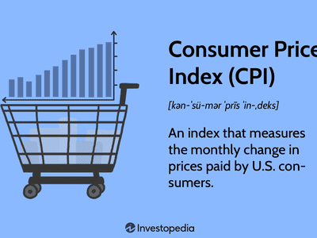

In the world of financial markets, both consumer sentiment and algorithmic trading play pivotal roles in shaping investment strategies. Consumer sentiment can greatly influence economic activity, as it reflects the confidence individuals have in their financial well-being and the broader economic landscape. The Michigan Consumer Sentiment Index (MCSI) offers valuable insights into consumer confidence in the United States, which in turn impacts economic indicators such as consumer spending—a significant component of the U.S. Gross Domestic Product (GDP).

Algorithmic trading, on the other hand, utilizes computer algorithms to execute trades at speeds unimaginable by human standards. This trading method leverages patterns and data analysis to optimize decision-making processes, enabling traders to capitalize on market inefficiencies. Algorithms analyze vast datasets to identify trading opportunities, often considering various economic indicators, including consumer sentiment metrics like the MCSI.



This article explores how the Michigan Consumer Sentiment Index influences algorithmic trading strategies. By incorporating MCSI data, traders can potentially forecast market shifts and adjust their strategies accordingly. For example, a rise in consumer confidence might suggest an impending increase in consumer spending, leading algorithms to favor equity markets. Conversely, a drop in consumer sentiment may prompt a more defensive approach, such as increasing holdings in bonds.

Understanding these dynamics can empower investors to make informed decisions in an ever-changing market environment. By combining insights from consumer sentiment with advanced computational methods, market participants can better navigate market fluctuations, ultimately striving for optimized investment outcomes.

## Table of Contents

## Understanding the Michigan Consumer Sentiment Index (MCSI)

The Michigan Consumer Sentiment Index (MCSI) is a pivotal economic indicator used to gauge consumer confidence across the United States. Originating from the University of Michigan's Surveys of Consumers, the MCSI measures how consumers perceive their financial situation, the economic environment, and potential business conditions. This sentiment is assessed through household surveys, which inquire about personal financial expectations, prospective business conditions, and planned purchasing behaviors.

Each month, the MCSI is published in two stages: a preliminary report released mid-month followed by a final report at month's end. This timeline ensures that the index reflects the most current consumer attitudes, allowing for timely economic analysis and insights.

The MCSI's significance emerges from the fact that consumer spending constitutes a substantial portion of the U.S. Gross Domestic Product (GDP). This relationship posits MCSI as a critical predictor of economic health. Higher consumer confidence generally translates to increased consumer spending, which can stimulate economic growth. Conversely, a decline in consumer sentiment might suggest potential reductions in consumer outlays, potentially signaling economic contraction.

Through its monthly updates, the MCSI provides a dynamic overview of consumer perspectives, enabling investors, policymakers, and business leaders to adjust their strategies based on anticipated consumer behavior trends. Its influence extends into various sectors, making it an invaluable tool in the broader landscape of economic forecasting and investment strategy formulation.

## The Role of MCSI in Economic Forecasting

The Michigan Consumer Sentiment Index (MCSI) serves as a prominent economic indicator, shedding light on consumer behavior trends. Its role in economic forecasting rests on its ability to capture shifts in consumer sentiment, which directly influence consumer spending patterns. As consumer sentiment improves, individuals are likely to increase their expenditures, reflecting optimism about their financial prospects and the broader economy. This surge in consumer spending acts as a stimulant to economic growth, as consumption drives a substantial portion of the Gross Domestic Product (GDP).

On the other hand, declining consumer sentiment can serve as a bellwether for economic slowdowns. When consumers are apprehensive about economic conditions, they tend to curtail spending, leading to reduced demand for goods and services. This contraction in consumer outlay can signal potential downturns, as businesses may respond to diminished demand with scaled-back production and investment.

For policymakers, the MCSI offers a window into the collective consumer psyche, enabling them to craft monetary and fiscal policies that preemptively address emerging economic challenges. Investors utilize the index as a barometer to gauge potential market shifts, adapting their strategies to align with anticipated consumer behavior. Similarly, businesses leverage insights from the MCSI to guide their strategic planning, ranging from inventory management to marketing initiatives.

In essence, the Michigan Consumer Sentiment Index empowers various stakeholders with the foresight needed to make informed, strategic decisions by anticipating the economic ripple effects of changing consumer confidence.

## Algorithmic Trading: An Overview

Algorithmic trading, commonly known as algo trading, encompasses the use of computer programs to automate trading decisions and execute trades according to pre-established criteria and identified patterns. These sophisticated algorithms can process and analyze massive volumes of financial data at speeds that far surpass the capabilities of human traders, enabling the quick identification of potentially profitable trading opportunities. By leveraging mathematical models and statistical analyses, these algorithms make informed decisions about entry and [exit](/wiki/exit-strategy) points in the market.

Algo trading thrives in financial markets where speed and precision are paramount. This [high frequency](/wiki/high-frequency-trading) and low latency environment allow algorithmic traders to capitalize on minute price movements that would be imperceptible to human traders. For example, high-frequency trading ([HFT](/wiki/high-frequency-trading-strategies)) is a subclass of [algorithmic trading](/wiki/algorithmic-trading) characterized by rapid transaction execution and small holding periods. HFT strategies often exploit bid-ask spreads and [arbitrage](/wiki/arbitrage) opportunities, contributing significantly to [liquidity](/wiki/liquidity-risk-premium) in the markets.

A core strength of algorithmic trading lies in its ability to integrate various data sources to enhance trading performance. Algorithms typically incorporate data such as historical price data, real-time market data, and newsfeed inputs. Moreover, advanced [machine learning](/wiki/machine-learning) techniques enable these programs to adapt to evolving market conditions and continuously optimize their trading strategies.

Consider the following Python code snippet, which illustrates the basic framework of an algorithmic trading strategy:

```python
import numpy as np
import pandas as pd

# Example of a moving average crossover strategy
def trading_strategy(prices, short_window=40, long_window=100):
    # Calculate moving averages
    signals = pd.DataFrame(index=prices.index)
    signals['price'] = prices
    signals['short_mavg'] = prices.rolling(window=short_window, min_periods=1, center=False).mean()
    signals['long_mavg'] = prices.rolling(window=long_window, min_periods=1, center=False).mean()

    # Generate signals
    signals['signal'] = 0.0
    signals['signal'][short_window:] = np.where(
        signals['short_mavg'][short_window:] > signals['long_mavg'][short_window:], 1.0, 0.0
    )

    # Generate trading orders
    signals['positions'] = signals['signal'].diff()

    return signals

# Sample usage with market data
prices = pd.Series([/* some price data */])
signals = trading_strategy(prices)
```

In this simplified example, a moving average crossover strategy generates buy/sell signals based on the relationship between short-term and long-term moving averages of asset prices. When the short-term average exceeds the long-term average, the strategy issues a buy signal, indicating potential upward [momentum](/wiki/momentum). Conversely, a sell signal arises when the short-term average falls below the long-term average.

Overall, algorithmic trading transforms the investment landscape by enhancing the efficiency, consistency, and accuracy of trade execution. As markets continue to evolve with technological advancements, algo trading is expected to maintain its pivotal role in shaping modern financial markets.

## Incorporating MCSI into Algorithmic Trading

Investors leverage the Michigan Consumer Sentiment Index (MCSI) within algorithmic trading systems to anticipate market dynamics and refine strategies. Algorithms, designed to interpret and react to changes in consumer sentiment, can modify asset allocations and adjust risk management protocols accordingly.

Positive shifts in consumer sentiment, as indicated by rising MCSI values, often imply increased consumer spending, which may lead to bullish market trends. Algorithms take advantage of this information by increasing exposure to equity markets, which are typically buoyant during such periods. For instance, an algorithm might increase the weight of stocks in a portfolio when the MCSI shows a significant uptick, anticipating upward pressure on stock prices due to enhanced economic activity.

Conversely, a decline in the MCSI suggests waning consumer confidence, potentially foretelling an economic slowdown or market downturn. In response, algorithms might adopt a defensive stance, decreasing equity positions and reallocating to more stable asset classes such as bonds or cash. This reallocation serves to reduce risk and capitalize on more secure investments during volatile periods.

The integration of MCSI data into algorithmic trading requires careful calibration of algorithms to identify when sentiment changes are statistically significant enough to warrant a shift in strategy. This often involves setting thresholds for MCSI changes that trigger specific trading actions. For example, algorithms might be programmed to switch asset classes when MCSI changes by a certain percentage, ensuring that trading decisions are responsive to meaningful fluctuations in consumer sentiment.

Additionally, machine learning techniques can be employed to enhance these algorithms by recognizing patterns in historical MCSI data and market responses. This can refine the accuracy of predictions and improve the timing of trades. Implementing such advanced techniques allows for dynamically adjusting strategies in real-time, aligning trading decisions closely with the economic signals provided by consumer sentiment data.

By effectively incorporating MCSI into algorithmic trading processes, investors aim to leverage consumer-driven economic indicators, optimizing their portfolios in response to evolving market conditions. This strategic adaptation helps in maximizing returns while managing risks within the ever-volatile landscape of financial markets.

## Benefits and Challenges of Using MCSI in Trading

Utilizing the Michigan Consumer Sentiment Index (MCSI) in algorithmic trading can significantly enhance the ability to predict market movements and refine investment approaches. The alignment of trading strategies with consumer-driven economic trends offered by MCSI provides a distinct advantage by supplying quantifiable insights into consumer behavior, which is a vital component of economic performance. As consumer sentiment historically correlates with spending patterns and economic growth, integrating MCSI into trading algorithms allows for a more responsive and adaptive trading strategy. For example, positive swings in the MCSI could prompt algorithms to increase exposure to equities, banking on the likelihood of increased consumer spending and economic expansion.

However, the incorporation of MCSI also presents a set of challenges, potentially affecting the reliability and effectiveness of trading strategies. One of the primary challenges is the lag that can exist in consumer sentiment data. While the index is released twice a month, reflecting consumer perspectives mid-month and at month-end, the rapidly changing market environment might render some data less timely or relevant. Another complexity arises from the variations in market reactions to consumer sentiment shifts. Market participants may interpret and respond to changes in sentiment differently, influenced by concurrent economic indicators or geopolitical events. This could lead to mismatches between the expectations set by consumer sentiment data and actual market movements.

Balancing these elements—harnessing the predictive power of MCSI while accounting for possible lags and reaction variations—is essential for the effectiveness of algorithmic trading strategies that utilize consumer sentiment data. Successful implementation requires algorithms that can not only react to shifts in sentiment as indicated by MCSI but also incorporate a broader set of economic data and contextual factors to mitigate risks associated with data lag and interpretation. By fine-tuning these trading models, investors can navigate the complexities of the market more effectively, leveraging consumer insight for optimal investment outcomes.

## Conclusion

The fusion of Michigan Consumer Sentiment Index (MCSI) insights with algorithmic trading symbolizes a powerful synergy within modern finance. This integration capitalizes on the influential role consumer sentiment plays in dictating market conditions. As consumer confidence can have significant predictive power over economic behavior, incorporating these insights into algorithmic strategies enhances the robustness of investment decisions.

Investors who adeptly utilize these combined tools gain a competitive edge, positioning themselves to effectively navigate market [volatility](/wiki/volatility-trading-strategies) and seize emerging opportunities. For instance, by applying sentiment analysis algorithms, traders can adjust their strategies in real-time to reflect changes in consumer sentiment, thus potentially optimizing investment returns.

Understanding the interplay between consumer confidence and algorithmic trading translates to actionable insights that drive informed investment outcomes. Market participants equipped with this dual-layered strategy are better prepared to anticipate fluctuations, manage risk, and align investment portfolios with macroeconomic trends, ultimately leading to more strategic allocation of resources in ever-evolving markets. 

In conclusion, by merging the predictive insights of the MCSI with the precision and adaptability of algorithmic trading, investors can better align their strategies with economic shifts and enhance their ability to capitalize on dynamic market conditions.

## References & Further Reading

[1]: Curtin, R. T. (2019). ["The Impact of Consumer Sentiment on Consumption: An Analysis of Robust Causal Relationships."](https://psycnet.apa.org/record/2019-24531-000) University of Michigan.

[2]: ["Advances in Financial Machine Learning"](https://www.amazon.com/Advances-Financial-Machine-Learning-Marcos/dp/1119482089) by Marcos Lopez de Prado

[3]: Cosimano, T. F., & Mhaskar, H. N. (1996). ["Predicting the Stock Market Using Financial and Economic Data: An Application of Neural Networks."](https://www.jstor.org/stable/2331070) Journal of Financial and Quantitative Analysis.

[4]: ["Machine Learning for Algorithmic Trading"](https://github.com/stefan-jansen/machine-learning-for-trading) by Stefan Jansen

[5]: Barsky, R. B., & Sims, E. R. (2012). ["Information, Animal Spirits, and the Meaning of Innovations in Consumer Confidence."](https://www.aeaweb.org/articles?id=10.1257/aer.102.4.1343) American Economic Review.

[6]: ["Quantitative Trading: How to Build Your Own Algorithmic Trading Business"](https://www.amazon.com/Quantitative-Trading-Build-Algorithmic-Business/dp/1119800064) by Ernest P. Chan