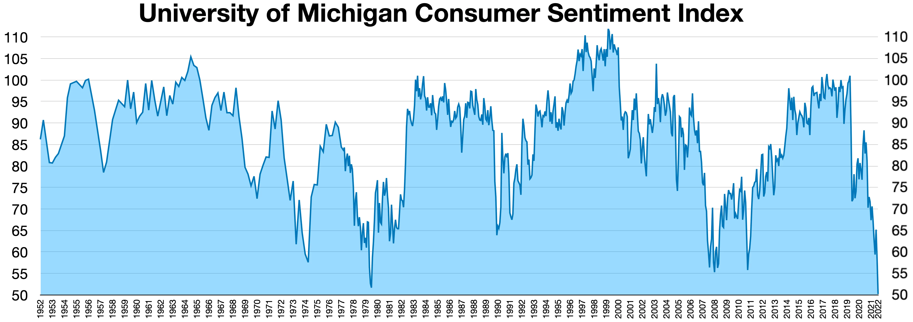

## Table of Contents

## What is the Michigan Consumer Sentiment Index?

The Michigan Consumer Sentiment Index is a survey that measures how people in the United States feel about their financial situation and the economy. It asks people questions about their current financial condition and what they think will happen in the future. The survey is done by the University of Michigan and is released monthly. It's important because it helps economists and policymakers understand how confident people are about their money and the economy.

The index is made up of two parts: the Current Economic Conditions and the Index of Consumer Expectations. The Current Economic Conditions part looks at how people feel about their finances right now. The Index of Consumer Expectations part asks about what people think will happen in the future, like if they think they will be better off financially in a year or if they think the economy will do well. When the index number is high, it means people feel good about their money and the economy. When it's low, it means people are worried.

## Who conducts the Michigan Consumer Sentiment Index survey?

The Michigan Consumer Sentiment Index survey is conducted by the University of Michigan. They have a special group called the Survey Research Center that does the work. This group calls people all over the United States and asks them questions about their money and what they think about the economy.

The survey is done every month. They talk to a lot of people to make sure they get a good picture of how everyone feels. The University of Michigan then puts all the answers together and makes the index. This helps people like economists and government leaders understand how confident Americans are about their money and the economy.

## How often is the Michigan Consumer Sentiment Index released?

The Michigan Consumer Sentiment Index is released every month. This means that once a month, the University of Michigan shares the results of their survey with everyone. They do this so people can see how Americans are feeling about their money and the economy at that time.

The monthly release is important because it helps people like economists and government leaders make decisions. If the index number is high, it means people feel good about their money and the economy. If it's low, it means people are worried. By knowing this, leaders can try to help make things better if people are feeling bad about the economy.

## What components make up the Michigan Consumer Sentiment Index?

The Michigan Consumer Sentiment Index is made up of two main parts: the Current Economic Conditions and the Index of Consumer Expectations. The Current Economic Conditions part looks at how people feel about their money right now. It asks questions like if people think they are better off financially than they were a year ago. This part helps show how people see their current financial situation.

The other part, the Index of Consumer Expectations, asks people about what they think will happen in the future. It includes questions about whether people think they will be better off financially in a year and if they think the economy will do well over the next few years. This part is important because it shows how hopeful or worried people are about their future money and the economy. Together, these two parts make up the Michigan Consumer Sentiment Index, giving a full picture of how people feel about their money and the economy.

## How is the Michigan Consumer Sentiment Index calculated?

The Michigan Consumer Sentiment Index is calculated by asking a lot of people in the United States questions about their money and the economy. They use a special group of questions to find out how people feel right now and what they think will happen in the future. The survey is done over the phone by the University of Michigan's Survey Research Center. They talk to about 500 people every month to get a good idea of what everyone thinks.

The answers to these questions are then turned into numbers. The index is made up of two parts: the Current Economic Conditions and the Index of Consumer Expectations. The Current Economic Conditions part looks at how people feel about their money right now. The Index of Consumer Expectations part asks about what people think will happen in the future. Both parts are added together to make the final index number. A high number means people feel good about their money and the economy, while a low number means they are worried.

## What does a high Michigan Consumer Sentiment Index indicate?

A high Michigan Consumer Sentiment Index means that people in the United States feel good about their money and the economy. It shows that they think things are going well right now and they are hopeful about the future. When people feel this way, they are more likely to spend money, which can help the economy grow.

Economists and leaders pay attention to this number because it can tell them a lot about what people are thinking. If the index is high, it might mean that people are willing to buy things like cars or houses, which can make businesses do better. A high index can be a sign that the economy is strong and that people are confident about their financial future.

## What does a low Michigan Consumer Sentiment Index suggest?

A low Michigan Consumer Sentiment Index means that people in the United States are not feeling good about their money and the economy. They might be worried about their jobs or think that prices are too high. When people feel this way, they are less likely to spend money on things they don't need, like new clothes or going out to eat.

This can make the economy slow down because when people don't spend money, businesses don't make as much. Economists and leaders watch this number closely because it can tell them if people are feeling scared or unsure about the future. If the index is low, it might be a sign that the government or businesses need to do something to help people feel better about their money and the economy.

## How can the Michigan Consumer Sentiment Index be used to predict economic trends?

The Michigan Consumer Sentiment Index can help people see what might happen with the economy in the future. When the index is high, it means people feel good about their money and the economy. This can be a sign that they will spend more money, which can help the economy grow. Businesses might see more people buying their things, and this can lead to more jobs and more money moving around in the economy.

On the other hand, when the index is low, it means people are worried about their money and the economy. This can be a warning that people might spend less money, which can slow down the economy. If people are not buying as much, businesses might sell less and might not need as many workers. This can lead to fewer jobs and less money moving around. By watching the Michigan Consumer Sentiment Index, economists and leaders can try to guess what might happen next and make plans to help the economy.

## What are the limitations of the Michigan Consumer Sentiment Index?

The Michigan Consumer Sentiment Index is a helpful tool, but it has some limits. One big limit is that it only asks a small group of people, about 500 each month. This small group might not be the same as everyone in the whole country. So, the index might not show exactly how everyone feels about their money and the economy. Also, the way people answer the questions can change because of things like the news or big events happening at the time. This can make the index go up or down even if people's real feelings about the economy haven't changed much.

Another limit is that the index only looks at what people think and feel, not at real numbers like how much money people are spending or how many jobs there are. People's feelings can be different from what is really happening in the economy. For example, people might feel bad about the economy because of bad news, but the economy might still be doing okay. So, the index can give a good guess about what might happen, but it's not perfect and should be used with other information to get a full picture of the economy.

## How does the Michigan Consumer Sentiment Index compare to other consumer confidence indicators?

The Michigan Consumer Sentiment Index is one of several tools that measure how people feel about their money and the economy. Another popular one is the Conference Board's Consumer Confidence Index. Both surveys ask people about their current financial situation and what they think will happen in the future, but they do it in slightly different ways. The Michigan Index is done by the University of Michigan and asks about 500 people each month, while the Conference Board's Index talks to about 3,000 people. The Conference Board's survey also has a bit more focus on people's plans to buy things like houses and cars.

Even though both indexes measure similar things, they can sometimes show different results. This is because they ask different questions and talk to different numbers of people. For example, the Michigan Index might go up because people feel better about their jobs, but the Conference Board's Index might not go up as much because people are still worried about buying big things. Economists often look at both indexes to get a better idea of how people feel about the economy. By comparing them, they can see if there are any big differences and get a more complete picture of what's going on.

## What historical events have significantly impacted the Michigan Consumer Sentiment Index?

Big events like the Great Recession in 2008 really changed the Michigan Consumer Sentiment Index. During that time, a lot of people lost their jobs and their homes, so they felt very worried about their money and the economy. The index went down a lot because people were scared and didn't know what would happen next. It took a long time for the index to go back up because people were still worried even after the recession was over.

Another event that affected the index was the COVID-19 pandemic in 2020. When the virus started spreading, people were told to stay home and a lot of businesses had to close. This made people lose their jobs and feel unsure about the future. The Michigan Consumer Sentiment Index dropped a lot because people were worried about their money and the economy. But as things started to get better and people got help from the government, the index started to go up again, showing that people were feeling a bit better about their money and the economy.

## How can investors and policymakers use the Michigan Consumer Sentiment Index in decision-making?

Investors and policymakers can use the Michigan Consumer Sentiment Index to help them make choices about money and the economy. When the index is high, it means people feel good about their money and the economy. This can be a sign for investors to put their money into things like stocks or real estate because people are more likely to spend money and help the economy grow. Policymakers might see a high index as a good time to make changes that help keep the economy strong, like investing in new projects or lowering taxes.

On the other hand, when the index is low, it means people are worried about their money and the economy. This can be a warning for investors to be careful with their money and maybe not buy as many risky things. Policymakers might see a low index as a sign that they need to help people feel better about the economy, like by giving out money to help people or making rules to help businesses. By watching the Michigan Consumer Sentiment Index, both investors and policymakers can try to guess what might happen next and make plans to help the economy.

## References & Further Reading

[1]: Curtin, R. T. (2019). ["The Impact of Consumer Sentiment on Consumption: An Analysis of Robust Causal Relationships."](https://psycnet.apa.org/record/2019-24531-000) University of Michigan.

[2]: ["Advances in Financial Machine Learning"](https://www.amazon.com/Advances-Financial-Machine-Learning-Marcos/dp/1119482089) by Marcos Lopez de Prado

[3]: Cosimano, T. F., & Mhaskar, H. N. (1996). ["Predicting the Stock Market Using Financial and Economic Data: An Application of Neural Networks."](https://www.jstor.org/stable/2331070) Journal of Financial and Quantitative Analysis.

[4]: ["Machine Learning for Algorithmic Trading"](https://github.com/stefan-jansen/machine-learning-for-trading) by Stefan Jansen

[5]: Barsky, R. B., & Sims, E. R. (2012). ["Information, Animal Spirits, and the Meaning of Innovations in Consumer Confidence."](https://www.aeaweb.org/articles?id=10.1257/aer.102.4.1343) American Economic Review.

[6]: ["Quantitative Trading: How to Build Your Own Algorithmic Trading Business"](https://www.amazon.com/Quantitative-Trading-Build-Algorithmic-Business/dp/1119800064) by Ernest P. Chan