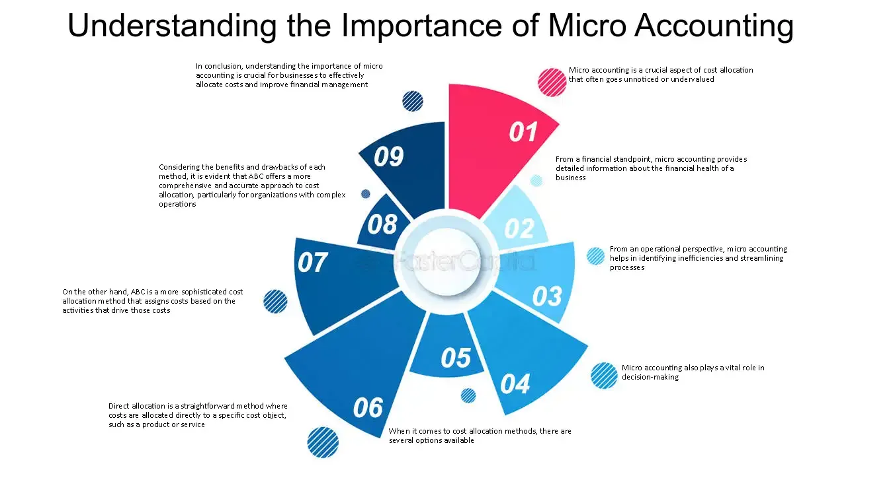

## Table of Contents

## What is micro accounting?

Micro accounting is a way of keeping track of very small and detailed financial transactions. It is often used by small businesses or individuals who want to have a clear picture of where every penny is going. Instead of just looking at big totals, micro accounting involves recording and analyzing even the tiniest expenses and incomes. This can help in understanding spending patterns better and making more informed financial decisions.

For example, if you run a small coffee shop, micro accounting would mean recording not just the daily sales total, but also the cost of each coffee bean, milk carton, and sugar packet used. By doing this, you can see exactly which items are costing you more and where you might be able to save money. It's like using a magnifying glass on your finances to spot the little details that can add up over time.

## How does micro accounting differ from traditional accounting?

Micro accounting and traditional accounting are both ways to keep track of money, but they do it differently. Traditional accounting looks at the big picture. It records things like total sales, total expenses, and overall profits or losses. It's like looking at a whole forest from far away. This method is good for big businesses or when you need to see the general health of your finances quickly.

On the other hand, micro accounting zooms in on the tiny details. It's like looking at each tree in the forest up close. With micro accounting, you record and analyze every small transaction, no matter how tiny. This can help you see exactly where your money is going and coming from, which is great for small businesses or people who want to save money by understanding their spending better. While traditional accounting gives you a broad overview, micro accounting gives you a detailed look at your finances.

## What are the basic principles of micro accounting?

Micro accounting is all about paying attention to the small stuff when it comes to money. The first principle is to record every single transaction, no matter how small. If you buy a pen for a dollar or sell a cup of coffee for three dollars, you write it down. This helps you see exactly where your money is going and coming from. By keeping track of these tiny details, you can spot patterns and make better decisions about how to spend or save your money.

The second principle is to analyze these small transactions regularly. Instead of just looking at big totals at the end of the month, you look at the little numbers every day or week. This way, you can see if you're spending too much on certain things or if there are small ways you can save money. For example, if you notice you're buying a lot of coffee out, you might decide to make it at home instead. By focusing on the details, micro accounting helps you manage your money more carefully and effectively.

## What are the key components of a micro accounting system?

A micro accounting system has a few key parts that help you keep track of your money in detail. The first part is a detailed record-keeping system. This means you need a way to write down every single transaction, no matter how small. You can use a notebook, a spreadsheet, or special software to do this. The important thing is that you record everything, from buying a candy bar to selling a single item in your store. This helps you see exactly where your money is going and coming from.

The second part is regular analysis. In a micro accounting system, you don't just look at your money once a month. You check your records every day or week to see what's happening. This way, you can spot patterns and make quick changes if you need to. For example, if you see you're spending a lot on snacks, you might decide to cut back. By looking at the small details often, you can make better decisions about how to use your money.

The third part is categorization. In micro accounting, you sort your transactions into different groups, like food, utilities, or supplies. This helps you see where you're spending the most money and where you might be able to save. By breaking down your spending into categories, you can focus on the areas that need the most attention and make your money work better for you.

## How can micro accounting benefit small businesses?

Micro accounting can really help small businesses by letting them see exactly where their money is going and coming from. When you keep track of every little transaction, you can spot small problems before they turn into big ones. For example, if you run a small bakery, micro accounting can show you if you're spending too much on sugar or if you're not making enough money from selling cupcakes. By knowing these details, you can make smart choices about what to buy and how to price your products.

Another way micro accounting helps small businesses is by helping them save money. When you look at your spending closely, you can find little ways to cut costs. Maybe you see that you're buying too many paper towels or that you can get a better deal on flour if you buy it in bulk. These small savings can add up over time and make a big difference to your bottom line. Plus, by understanding your spending patterns, you can plan better for the future and make sure your business stays healthy and grows.

## What are the common tools and software used in micro accounting?

For micro accounting, many people use simple tools like notebooks or spreadsheets. A notebook is good because you can write down every tiny transaction as it happens. You just need to be organized and make sure you write everything clearly. Spreadsheets are also popular because they let you sort your spending into different groups and see it all in one place. Programs like Microsoft Excel or Google Sheets are easy to use and help you keep track of every penny.

There are also special software programs made just for micro accounting. QuickBooks and FreshBooks are two examples that many small businesses use. These programs make it easy to record every transaction and sort them into categories. They also have features that help you see where you're spending the most money and where you might be able to save. Some of these programs even let you do your micro accounting on your phone, so you can keep track of your money no matter where you are.

Overall, the best tool for micro accounting depends on what you need. If you just want to keep things simple, a notebook or spreadsheet might be enough. But if you want more features and help analyzing your spending, special software could be a better choice.

## What are the steps to implement a micro accounting system in a small business?

To start using micro accounting in your small business, you first need to choose a way to keep track of your money. You can use a simple notebook where you write down every single transaction, no matter how small. Or you can use a spreadsheet on your computer, like Microsoft Excel or Google Sheets, to record your spending and income. If you want something more advanced, you can use special software like QuickBooks or FreshBooks. These programs help you sort your money into different groups and see where you're spending the most. Pick the tool that works best for you and your business.

Once you have your tool, start recording every transaction as it happens. If you buy a pen for a dollar or sell a cup of coffee for three dollars, write it down right away. Make sure to sort your spending into categories like supplies, utilities, or food. This helps you see where your money is going and where you might be able to save. Every day or week, take some time to look at your records and see if there are any patterns or problems. By keeping a close eye on the little details, you can make smart choices about how to use your money and help your business grow.

## How does micro accounting handle transactions and record-keeping?

Micro accounting is all about keeping track of every tiny bit of money that comes in and goes out. When you use micro accounting, you write down every single transaction, no matter how small. If you buy a pen for a dollar or sell a cup of coffee for three dollars, you record it right away. You can use a notebook, a spreadsheet, or special software to keep these records. The important thing is to be very detailed and make sure you don't miss anything. By recording everything, you can see exactly where your money is going and coming from.

Once you have all your transactions written down, you sort them into different groups, like supplies, utilities, or food. This helps you understand your spending better. You also need to look at your records regularly, maybe every day or week, to see if there are any patterns or problems. By paying close attention to the little details, you can spot small issues before they become big ones. This way, you can make smart choices about how to spend or save your money and keep your business running smoothly.

## What are the challenges and limitations of micro accounting?

Micro accounting can be really hard because it takes a lot of time and work. You have to write down every single tiny transaction, which can feel like a big job. If you miss even one little thing, your records won't be right. This means you need to be very careful and organized all the time. For small businesses, this can be tough because they might not have a lot of people to help with the work. Plus, if you're using a notebook or a simple spreadsheet, it can be hard to keep everything neat and easy to understand.

Another problem with micro accounting is that it can be too detailed. Sometimes, looking at every tiny bit of money can make it hard to see the big picture. You might get lost in all the small numbers and forget to think about the overall health of your business. Also, the tools you use for micro accounting, like special software, can cost money. If you're a small business, you might not want to spend extra on these tools when you're already trying to save money. So, while micro accounting can help you understand your spending better, it comes with some challenges that you need to think about.

## How can micro accounting be integrated with other financial systems?

Micro accounting can be integrated with other financial systems by using software that can handle both detailed and big-picture financial tracking. For example, if you use a program like QuickBooks for your micro accounting, you can also use it to do your regular accounting. This means you can record every tiny transaction and also see the overall health of your business in one place. The software can sort your spending into categories and help you see where you're spending the most money, while also giving you reports on your total sales and profits.

Another way to integrate micro accounting with other financial systems is by using a spreadsheet. You can use one part of the spreadsheet to keep track of every small transaction, and another part to add up the totals and see the big picture. This way, you can switch between looking at the tiny details and the overall numbers easily. By connecting your micro accounting with your regular accounting, you can get a complete view of your finances and make better decisions for your business.

## What advanced techniques can be used to optimize a micro accounting system?

To optimize a micro accounting system, you can use automation to make things easier. Many software programs, like QuickBooks or FreshBooks, let you set up rules so that certain transactions are recorded automatically. For example, if you always buy coffee from the same place, you can set up the software to record that expense without you having to do it every time. This saves you time and helps make sure you don't miss any transactions. You can also use data analysis tools to look at your spending patterns and find ways to save money. These tools can show you where you're spending the most and help you make smart choices about where to cut costs.

Another advanced technique is to use integration with other financial systems. By connecting your micro accounting software with your regular accounting system, you can see both the small details and the big picture at the same time. This helps you make better decisions because you can understand how the tiny transactions add up to affect your overall finances. You can also use cloud-based systems to access your micro accounting records from anywhere, making it easier to keep track of your money no matter where you are. By using these advanced techniques, you can make your micro accounting system more efficient and helpful for your business.

## What future trends are expected in the field of micro accounting?

In the future, micro accounting is expected to become more automated and easier to use. Software will get better at recording transactions automatically, so you won't have to write down every little thing yourself. This will save time and make sure you don't miss any transactions. Also, more businesses will use [artificial intelligence](/wiki/ai-artificial-intelligence) (AI) to look at their spending patterns. AI can help find ways to save money by spotting small problems before they become big ones. This means micro accounting will become even more helpful for understanding where your money is going and how to use it better.

Another trend in micro accounting is that it will be more connected with other financial systems. This means you'll be able to see both the tiny details and the big picture of your finances in one place. This will help you make smarter decisions because you can understand how the small transactions affect your overall money situation. Plus, more businesses will use cloud-based systems for micro accounting. This lets you access your records from anywhere, making it easier to keep track of your money no matter where you are. By being more connected and easier to use, micro accounting will become a powerful tool for managing your finances in the future.

## References & Further Reading

1. **Books:**
   - "Financial Accounting: An Introduction" by Pauline Weetman provides a comprehensive overview of the principles that underpin accounting practices, making it a great read for understanding the various methods and their applications.
   - "Algorithmic Trading: Winning Strategies and Their Rationale" by Ernie Chan investigates into the intricacies of algorithmic trading, exploring both the technical and strategic elements involved.

2. **Online Articles:**
   - Investopedia is an excellent resource for understanding the different accounting methods such as FIFO (First-In, First-Out), LIFO (Last-In, First-Out), and Weighted Average Cost. Articles on Investopedia provide easy-to-understand explanations and practical examples. 
   - Articles from the Journal of Accountancy provide in-depth discussions on micro accounting and its applications in various business settings.

3. **Industry Publications:**
   - The "Journal of Finance" frequently publishes research articles on the convergence of finance, accounting, and technology, offering detailed insights into the latest trends and practices.
   - "Financial Times" and "The Wall Street Journal" often feature articles on the impacts of algorithmic trading on global markets and accounting practices.

4. **Academic Journals:**
   - "The Accounting Review" is a top-tier journal offering empirical research studies on accounting and financial management issues.
   - "Journal of Financial and Quantitative Analysis" includes research on the techniques and impacts of algorithmic trading and financial strategies.

5. **Online Resources:**
   - Websites like Coursera or edX offer courses on accounting and financial management, providing practical and theoretical knowledge.
   - The U.S. Securities and Exchange Commission (SEC) website offers resources and reports on regulatory compliance, impacting accounting standards and financial operations.

6. **Tools and Software:**
   - Python libraries like `pandas` and `numpy` are widely used in financial data analysis. Tutorials and documentation on these libraries can help understand computational methods for handling large datasets, which are critical in algo trading and micro accounting.

