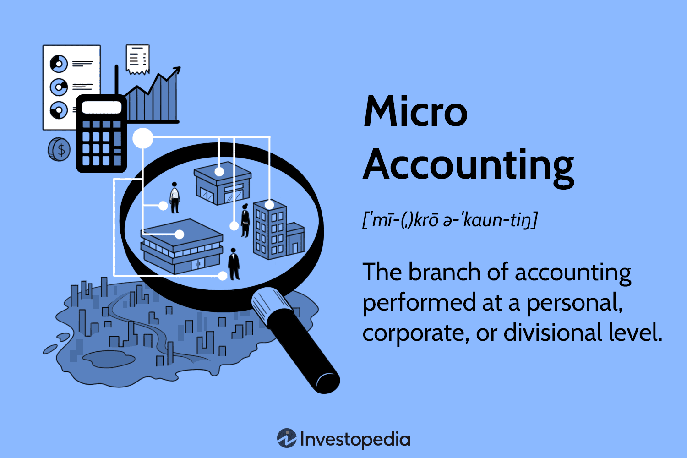

In the rapidly evolving landscape of finance, accounting methods and financial processes play a pivotal role in ensuring effective management and compliance with regulatory standards. As financial transactions become increasingly complex and voluminous, particularly with the advent of digitalization and automation, the importance of robust accounting frameworks has never been more pronounced. This article explores the intersection of accounting, micro accounting, and algorithmic trading, which are key components that influence modern financial operations.

Accounting methods such as the cash basis and accrual basis are fundamental to financial reporting, each offering distinctive advantages and catering to different business needs. The effectiveness of these accounting methods in encapsulating the financial health of an organization sets the foundation for accurate reporting and strategic planning. As businesses strive for greater transparency and accountability, understanding and selecting the appropriate accounting method becomes critical.

Micro accounting, which focuses on detailed financial analysis at a personal or corporate level, contrasts with macro accounting that deals with the economy as a whole. This granularity allows businesses, particularly smaller enterprises and subsidiaries, to gain more precise insights into their financial status. By scrutinizing micro-level financial data, organizations can make informed decisions that drive growth and efficiency.

Algorithmic trading, a relatively recent development, leverages sophisticated computer algorithms to execute trades at speeds unattainable by human traders. This technology has revolutionized financial markets by introducing efficiencies and reducing transactional errors but also introduces unique accounting challenges. High transaction volumes and rapid trading necessitate innovative accounting practices to ensure that financial statements remain accurate and compliant with evolving regulations.

In this article, we will explore various accounting methods and their implications in the context of micro accounting and algorithmic trading. The synergy between these accounting practices and emerging technologies not only enhances financial management but also empowers organizations to navigate the complexities of modern markets. This exploration will serve as a guide for financial professionals seeking to harness the potential of accounting methods, micro accounting, and algorithmic trading to maintain competitive advantage and compliance.

## Table of Contents

## Understanding Accounting Methods

Accounting methods play a critical role in shaping the framework for financial reporting and compliance, ensuring businesses adhere to regulatory standards while effectively communicating their financial health. Several accounting methods are utilized globally, each tailored to meet specific business requirements and industry norms.

The cash basis and accrual basis are two foundational accounting methods. Cash basis accounting recognizes revenue and expenses only when money changes hands. This method is straightforward and beneficial for small businesses and individuals who seek simplicity in financial tracking. However, it may not accurately represent a company's financial position at any given time, as it doesn't account for receivables and payables.

In contrast, accrual basis accounting records revenues and expenses when they are earned or incurred, regardless of when cash is exchanged. This approach provides a more accurate financial picture by matching income with the expenses incurred to generate it, thus adhering to the matching principle. It's predominantly used by larger businesses and is in compliance with Generally Accepted Accounting Principles (GAAP).

Mark-to-market accounting, another impactful method, involves valuing assets and liabilities at their current market value rather than their book value. This approach is prevalent in industries where market values fluctuate significantly, such as finance and commodities trading. While it offers a real-time valuation of financial positions, it can introduce [volatility](/wiki/volatility-trading-strategies) into financial statements during periods of market instability.

In addition to these overarching methods, specific inventory accounting techniques are employed across industries to manage inventory costs effectively. The First-In, First-Out (FIFO) method assumes the oldest inventory items are sold first. This approach is advantageous in times of rising prices as it results in lower cost of goods sold and higher profitability. Conversely, during deflationary periods, FIFO may not be as beneficial.

The Last-In, First-Out (LIFO) method operates under the assumption that the most recently acquired inventory is sold first. This method is particularly useful for companies experiencing rising costs, as it leads to higher cost of goods sold and lower taxable income. However, LIFO may not reflect the actual physical flow of inventory and is not permitted under International Financial Reporting Standards (IFRS).

The Weighted Average Cost method smooths out price fluctuations by averaging the cost of all inventory items irrespective of purchase date. It is a method preferred by companies that deal with large volumes of undifferentiated goods. By providing a consistent measure of inventory cost, it simplifies the valuation process but may not accurately reflect current market conditions.

Understanding these accounting methods and their implications is vital for businesses to navigate financial reporting complexities and achieve regulatory compliance. Each method offers unique advantages and challenges, influencing a company's financial strategies and outcomes across diverse industries.

## Micro Accounting: A Focused Approach

Micro accounting refers to the practice of accounting at an individual or corporate level, distinguishing itself significantly from macro accounting, which deals with the accounting concepts and policies applied at a national or economy-wide scale. This branch of accounting focuses specifically on the detailed recording, analysis, and reporting of financial data pertinent to either an individual or a smaller business entity such as a subsidiary.

In small businesses, micro accounting involves comprehensive management of financial records, hence supporting effective decision-making and strategic planning. By focusing on the minutiae of a company's financial activities, micro accounting provides granular insights into revenue streams, cost structures, and profit margins. Typically, this would include maintaining ledgers, managing payrolls, handling taxes, and developing budgets. The objective is to offer a detailed and real-time snapshot of the financial health of the business, which is crucial for daily operations and long-term sustainability.

The preparation of financial statements at the subsidiary level is another critical application of micro accounting. Subsidiaries, as entities controlled by parent corporations, often require detailed financial reporting to ensure compliance with internal and external accounting standards. Micro accounting practices enable subsidiaries to produce accurate financial statements that reflect their financial status, including balance sheets, income statements, and cash flow statements. These documents are indispensable for parent companies in consolidating financial data and analyzing the subsidiary's performance in relation to the group’s overall financial objectives.

Key differences between micro and macro accounting lie mainly in the scope and application. While micro accounting addresses internal financial processes and aims to help business owners and managers make informed economic decisions, macro accounting is concerned with the overarching economic reporting and policy development at a national level. Macro accounting typically includes activities such as measuring economic activity in terms of gross domestic product (GDP), inflation rates, and national income, leading to economic analysis and policy formulation by governments and international bodies.

As businesses increasingly operate in complex and dynamic environments, understanding both accounting types is crucial. Micro accounting provides the detailed data needed for tactical and strategic business decisions, while macro accounting offers insights into broader economic trends and policies that might impact business operations. Together, they form an integrated approach to financial analysis and reporting, supporting both operational success and strategic growth in businesses.

## Algorithmic Trading and Accounting Practices

Algorithmic trading, often referred to as algo trading, employs complex computer algorithms to make trading decisions at speeds and frequencies beyond human capacity. This method of trading brings numerous advantages, such as increased market [liquidity](/wiki/liquidity-risk-premium) and reduced transaction costs. However, it also introduces unique accounting challenges, primarily due to the high transaction volumes and the need for precise financial tracking and compliance.

A major accounting consideration in [algorithmic trading](/wiki/algorithmic-trading) is regulatory compliance. Financial markets are subject to stringent regulations, and algo trading systems must adhere to these rules to ensure market integrity and protect investors. For instance, the Markets in Financial Instruments Directive (MiFID II) in the European Union requires comprehensive reporting of trade data, including information about orders and transactions. Ensuring compliance with such regulations demands robust accounting practices capable of capturing and organizing high-frequency data efficiently.

Financial integrity is another critical aspect. Accurate recording of transactions is essential not only for compliance but also for financial analysis and reporting. Errors or discrepancies in transaction records can lead to inaccurate financial statements, impacting decision-making and potentially leading to regulatory penalties. Therefore, integrating automated accounting systems with trading platforms becomes crucial. These systems record real-time data on trades executed, fees paid, and other pertinent financial information, significantly reducing the risk of errors.

Strategic alignment is also enhanced through efficient accounting practices integrated into algorithmic trading. Financial performance metrics derived from consistent and accurate accounting data help assess trading strategies and adjust them to optimize returns. For example, calculating the average trading costs using real-time transaction data allows traders to refine their algorithms for better cost efficiency.

The integration of automated accounting systems with trading platforms is paramount in managing the vast amount of data generated in algorithmic trading. Automated systems can quickly adapt to changes in trading environments, capturing and processing data continuously to fulfill reporting needs and support strategic financial management. Technologies such as APIs (Application Programming Interfaces) allow seamless data flow between trading and accounting software, facilitating accuracy and timeliness in financial reporting.

In conclusion, the intersection of algorithmic trading and accounting practices highlights the necessity for sophisticated automated accounting systems that ensure compliance, maintain financial integrity, and support strategic decision-making in an increasingly fast-paced trading environment.

## Synergies Between Accounting, Financial Management, and Algo Trading

The synergy between accounting methods, financial management, and algorithmic trading is crucial for enhancing strategic decision-making within financial markets. Accounting plays a foundational role by ensuring that financial data is both accurate and timely, thereby providing the critical insights needed for effective performance evaluation and risk management.

In algorithmic trading, real-time data processing is paramount. Algorithms make trading decisions based on large sets of data, including stock prices, market indicators, and historical financial records. Accounting methods such as mark-to-market accounting allow for the real-time valuation of assets and liabilities, which is essential for maintaining the integrity and accuracy of the financial information used by trading algorithms.

The integration of accounting systems with trading platforms facilitates instant access to financial data, enabling firms to monitor their financial health continuously. This integration is often achieved through automated accounting systems that record transactions and create financial reports in real-time, thus aligning accounting functions with the rapid pace of trade executions typical of algorithmic environments.

Performance evaluation and risk management strategies benefit significantly from this synergy. Accurate accounting data allows traders and financial managers to assess return on investment (ROI) effectively and adjust strategies accordingly. Risk management is further supported by these precise data points, enabling firms to model potential market scenarios and preemptively mitigate risks.

Case studies of leading algorithmic trading firms demonstrate successful integration of accounting, financial management, and trading platforms. Firms like Renaissance Technologies and Two Sigma have established robust financial frameworks that leverage this synergy. They utilize sophisticated accounting practices, coupled with cutting-edge technology, to facilitate strategic decision-making processes that are both agile and data-driven.

In conclusion, the convergence of accounting methods, financial management practices, and algorithmic trading is a vital aspect of modern financial markets. It enhances transparency, ensures compliance, and supports strategic initiatives by providing real-time, accurate financial insights.

## Conclusion

In contemporary finance, selecting suitable accounting methods is vital for ensuring financial transparency and enabling strategic planning. As businesses increasingly leverage technological advancements, the adoption of automated accounting systems has become essential to remain competitive and compliant. This shift is driven by the need for efficiency, accuracy, and real-time data processing, which traditional accounting methods may not sufficiently provide.

Automated systems integrate seamlessly with various financial processes and trading platforms, facilitating rapid data analysis and reporting. This integration is crucial for algorithmic trading environments, where high transaction volumes necessitate swift and accurate financial accounting. These systems also support enhanced financial management by offering insights that inform strategic decision-making and risk management.

Furthermore, financial professionals must enhance their understanding of the intersection between accounting, financial management, and technology. Emerging technologies such as blockchain, [artificial intelligence](/wiki/ai-artificial-intelligence), and [machine learning](/wiki/machine-learning) are reshaping accounting practices, offering novel opportunities for innovation and efficiency. Mastery of these tools is essential to harness their full potential in optimizing financial operations.

In conclusion, the thoughtful selection and implementation of accounting methods, coupled with a keen awareness of technological advancements, position businesses to maintain transparency, compliance, and a competitive edge in the financial market. Professionals who invest in developing these competencies will play a critical role in navigating the complexities of modern finance.

## References & Further Reading

1. **Books:**
   - "Financial Accounting: An Introduction" by Pauline Weetman provides a comprehensive overview of the principles that underpin accounting practices, making it a great read for understanding the various methods and their applications.
   - "Algorithmic Trading: Winning Strategies and Their Rationale" by Ernie Chan investigates into the intricacies of algorithmic trading, exploring both the technical and strategic elements involved.

2. **Online Articles:**
   - Investopedia is an excellent resource for understanding the different accounting methods such as FIFO (First-In, First-Out), LIFO (Last-In, First-Out), and Weighted Average Cost. Articles on Investopedia provide easy-to-understand explanations and practical examples. 
   - Articles from the Journal of Accountancy provide in-depth discussions on micro accounting and its applications in various business settings.

3. **Industry Publications:**
   - The "Journal of Finance" frequently publishes research articles on the convergence of finance, accounting, and technology, offering detailed insights into the latest trends and practices.
   - "Financial Times" and "The Wall Street Journal" often feature articles on the impacts of algorithmic trading on global markets and accounting practices.

4. **Academic Journals:**
   - "The Accounting Review" is a top-tier journal offering empirical research studies on accounting and financial management issues.
   - "Journal of Financial and Quantitative Analysis" includes research on the techniques and impacts of algorithmic trading and financial strategies.

5. **Online Resources:**
   - Websites like Coursera or edX offer courses on accounting and financial management, providing practical and theoretical knowledge.
   - The U.S. Securities and Exchange Commission (SEC) website offers resources and reports on regulatory compliance, impacting accounting standards and financial operations.

6. **Tools and Software:**
   - Python libraries like `pandas` and `numpy` are widely used in financial data analysis. Tutorials and documentation on these libraries can help understand computational methods for handling large datasets, which are critical in algo trading and micro accounting.

