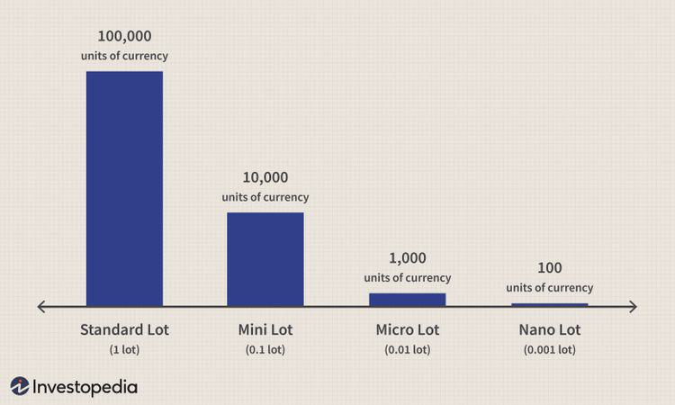

## Table of Contents

## What is a micro account in forex trading?

A micro account in forex trading is a type of trading account that allows traders to trade with smaller amounts of money. It is designed for beginners or those who want to trade with less risk. In a micro account, the standard lot size is smaller, usually 1,000 units of the base currency, compared to a standard account where a lot is 100,000 units. This means that each pip movement is worth less money, making it easier for traders to manage their risk.

Micro accounts are popular because they allow traders to get started with a smaller initial deposit, often as low as $1 or $5 per trade. This lower entry barrier makes forex trading more accessible to people who might not have a lot of money to invest. Additionally, micro accounts help traders to practice and gain experience without risking large sums of money. As traders become more confident and skilled, they can move to larger account types if they choose to do so.

## How does a micro account differ from other types of forex trading accounts?

A micro account in forex trading is different from other types of accounts mainly because it lets you trade with smaller amounts of money. In a micro account, one lot is 1,000 units of the base currency, while in a standard account, one lot is 100,000 units. This means that the value of each pip movement is much smaller in a micro account. Because of this, micro accounts are great for beginners or anyone who wants to start trading without risking a lot of money.

Other types of accounts, like mini and standard accounts, have larger lot sizes and higher minimum deposits. A mini account has a lot size of 10,000 units, and a standard account has a lot size of 100,000 units. These accounts are better for experienced traders who can handle bigger trades and are willing to risk more money. Micro accounts, on the other hand, allow you to start with a small deposit, sometimes as low as $1 or $5 per trade, making [forex](/wiki/forex-system) trading more accessible to everyone.

## What are the benefits of using a micro account for beginners?

Using a micro account is great for beginners because it lets them start trading with very little money. You can open a micro account with a small deposit, sometimes as low as $1 or $5 per trade. This means you don't need a lot of money to get started, which makes it easier for new traders to try out forex trading without worrying about losing a lot of money.

Another benefit is that micro accounts have smaller lot sizes, usually 1,000 units of the base currency. This makes each trade less risky because the value of each pip movement is smaller. Beginners can practice trading and learn how the market works without risking big amounts of money. As they get better and more confident, they can move to bigger accounts if they want to.

## What are the typical lot sizes available in a micro account?

In a micro account, the typical lot size is 1,000 units of the base currency. This means that when you trade, you are trading in smaller amounts compared to other types of accounts. For example, if you are trading the EUR/USD pair, one micro lot would be 1,000 Euros.

This smaller lot size makes micro accounts great for beginners. It allows them to start trading with less money and take smaller risks. Each pip movement in a micro account is worth less money, so even if the market moves against you, you won't lose as much as you would with a larger lot size.

## How much capital is required to open a micro account?

Opening a micro account in forex trading doesn't need a lot of money. You can start with a small amount, often as low as $1 or $5 per trade. This makes it easy for beginners to get into trading without worrying about losing a lot of money.

Because the lot sizes in a micro account are small, usually 1,000 units of the base currency, you can trade with less risk. This means that even if you make a mistake, you won't lose as much money as you would with bigger accounts. It's a great way to learn and practice trading before moving on to larger accounts.

## What are the risks associated with trading using a micro account?

Trading with a micro account still has risks, even though you're using less money. One risk is that you might lose all the money you put in. Even though each trade is small, if you make a lot of bad trades, those small losses can add up. Another risk is that you might get too confident because you're trading with small amounts. You might start taking bigger risks than you should, which can lead to bigger losses.

Another thing to watch out for is that the smaller lot sizes in a micro account can make it harder to make a profit. Because each pip movement is worth less money, you need to make more successful trades to see a good return. This can be frustrating and might make you want to trade more often, which increases your risk of losing money. It's important to have a good trading plan and stick to it, no matter how small your trades are.

## Can experienced traders benefit from using a micro account?

Yes, experienced traders can benefit from using a micro account. One way they can benefit is by testing new trading strategies without risking a lot of money. Since micro accounts have smaller lot sizes, experienced traders can try out new ideas and see how they work in real market conditions without putting a lot of money on the line. This can help them refine their strategies and make better decisions when they move to larger trades.

Another benefit for experienced traders is that micro accounts can be used for diversifying their trading portfolio. By using a micro account, they can trade in smaller amounts across different currency pairs or markets. This can help spread out their risk and potentially increase their overall returns. Even though the profits from each trade might be small, the combined effect of many small successful trades can add up over time.

## How do leverage and margin work in a micro account?

In a micro account, leverage and margin work the same way as in other types of forex accounts, but with smaller amounts. Leverage lets you control a larger position with less money. For example, if you have a leverage of 100:1, you can control a $1,000 position with just $10 of your own money. This means you can trade bigger amounts than what you actually have in your account. But remember, while leverage can increase your profits, it can also increase your losses if the market moves against you.

Margin is the amount of money you need to have in your account to open and keep a trade open. In a micro account, the margin requirement is smaller because you're trading smaller lot sizes. For example, if you want to trade one micro lot (1,000 units) with a leverage of 100:1, you might need a margin of just $10. This makes it easier to start trading with less money, but you still need to be careful. If your trades go against you and your account balance falls below the required margin, your broker might close your trades to protect themselves, which is called a margin call.

## What are the best strategies for trading with a micro account?

When trading with a micro account, one of the best strategies is to focus on small, consistent gains rather than trying to make big profits quickly. Since each trade in a micro account is small, you need to be patient and trade often to see good results. A good approach is to use a simple trading strategy like [trend following](/wiki/trend-following). This means you look for trends in the market and trade in the same direction as the trend. For example, if the price is going up, you buy, and if it's going down, you sell. By sticking to a clear plan and not getting too greedy, you can slowly build up your account over time.

Another helpful strategy is to use stop-loss orders to manage your risk. A stop-loss order automatically closes your trade if the price moves against you by a certain amount. This can help you limit your losses and protect your account balance. Since micro accounts have smaller lot sizes, the impact of each loss is smaller, but it's still important to keep your losses small. By setting a stop-loss for each trade, you can trade more confidently and avoid big losses that could wipe out your account. Remember, the key to success with a micro account is to be patient, stick to your plan, and manage your risk carefully.

## How can one effectively manage risk in a micro account?

Managing risk in a micro account is important to protect your money and trade successfully. One good way to do this is by using stop-loss orders. A stop-loss order automatically closes your trade if the price moves against you by a certain amount. This helps you limit how much money you can lose on each trade. Since micro accounts have smaller lot sizes, each loss is smaller, but you still need to keep your losses small. By setting a stop-loss for each trade, you can trade more confidently and avoid big losses that could wipe out your account.

Another way to manage risk is to not use too much leverage. Leverage lets you control bigger positions with less money, but it can also increase your losses if the market moves against you. In a micro account, it's best to use lower leverage so you don't risk losing too much. Also, it's important to only risk a small part of your account on each trade. A common rule is to risk no more than 1-2% of your account balance on any single trade. By following this rule, you can keep trading even if you have a few losing trades. The key to managing risk in a micro account is to be patient, stick to your plan, and keep your losses small.

## What are the common pitfalls to avoid when trading with a micro account?

One common pitfall when trading with a micro account is overtrading. Because the lot sizes are small, you might think it's okay to trade a lot more often. But this can lead to more losses if you're not careful. It's important to stick to your trading plan and not get too excited about making quick profits. Another mistake to avoid is using too much leverage. Leverage can help you make bigger trades with less money, but it can also make your losses bigger if the market moves against you. It's better to use lower leverage in a micro account to keep your risk small.

Another pitfall is not setting stop-loss orders. Stop-loss orders help you limit your losses by automatically closing your trade if the price moves against you. Without them, you could lose more money than you planned. Also, some traders might get too confident because they're trading with small amounts. This can lead them to take bigger risks than they should. It's important to stay disciplined and manage your risk carefully, no matter how small your trades are.

## How do the features of micro accounts vary across different forex brokers?

The features of micro accounts can be different depending on which forex broker you choose. Some brokers might let you start trading with a very small amount of money, like $1 or $5 per trade. Others might need a bit more, like $50 or $100. Also, the amount of leverage you can use can be different. Some brokers might offer high leverage, like 500:1, while others might keep it lower, like 50:1. This can affect how much money you need to open a trade and how much risk you're taking.

Another thing that can vary is the trading platform and tools the broker offers. Some brokers might have special tools or charts that can help you make better trading decisions. Others might have simpler platforms that are easier for beginners to use. Also, the fees and spreads can be different. Some brokers might charge lower fees or have smaller spreads, which can save you money on each trade. It's a good idea to look at what different brokers offer and pick the one that fits your needs best.

## References & Further Reading

[1]: Bergstra, J., Bardenet, R., Bengio, Y., & Kégl, B. (2011). ["Algorithms for Hyper-Parameter Optimization."](https://dl.acm.org/doi/10.5555/2986459.2986743) Advances in Neural Information Processing Systems 24.

[2]: ["Advances in Financial Machine Learning"](https://www.amazon.com/Advances-Financial-Machine-Learning-Marcos/dp/1119482089) by Marcos Lopez de Prado

[3]: ["Evidence-Based Technical Analysis: Applying the Scientific Method and Statistical Inference to Trading Signals"](https://www.amazon.com/Evidence-Based-Technical-Analysis-Scientific-Statistical/dp/0470008741) by David Aronson

[4]: ["Machine Learning for Algorithmic Trading"](https://github.com/stefan-jansen/machine-learning-for-trading) by Stefan Jansen

[5]: ["Quantitative Trading: How to Build Your Own Algorithmic Trading Business"](https://github.com/LucindaYa/quant-resources/blob/master/Quantitative%20Trading%20How%20to%20Build%20Your%20Own%20Algorithmic%20Trading%20Business.pdf) by Ernest P. Chan