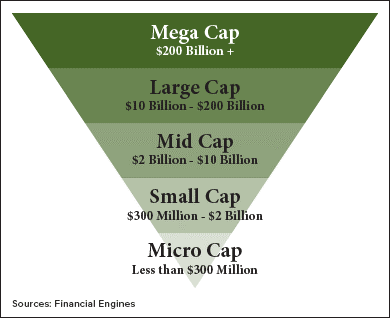

## Table of Contents

## What are micro-cap stocks?

Micro-cap stocks are shares of very small companies, usually with a market value between $50 million and $300 million. These companies are often newer or less established than bigger companies. Because they are small, they can grow a lot if they do well, but they can also be riskier. People who invest in micro-cap stocks are often looking for big gains, but they need to be ready for the chance that the stock might not do well.

Investing in micro-cap stocks can be exciting because these companies might be the next big thing. They might have new ideas or products that could change their industry. However, because they are small, they might not have as much money or resources as bigger companies. This means they can be more affected by problems in the economy or their industry. So, while there is a chance for big rewards, there is also a bigger chance of losing money.

## How do micro-cap stocks differ from larger capitalization stocks?

Micro-cap stocks are different from larger capitalization stocks mainly because of their size and the amount of money they have. Micro-cap companies are much smaller, usually with a market value between $50 million and $300 million. Larger cap stocks, on the other hand, can have market values in the billions. Because micro-cap companies are smaller, they often have less money to spend on things like research, marketing, and growing their business. This can make them more vulnerable to economic changes or problems in their industry.

Another big difference is the level of risk and potential reward. Micro-cap stocks can offer bigger gains if the company does well because they have more room to grow. For example, a new technology or product from a micro-cap company could make it very successful. But, because they are smaller and have less money, they are also riskier. If something goes wrong, like a drop in sales or a problem with their product, it can hurt the company a lot more than it would a larger company. So, while investors might see big rewards with micro-cap stocks, they also need to be ready for the chance of losing money.

## What are the potential benefits of investing in micro-cap stocks?

One big benefit of investing in micro-cap stocks is the chance for big gains. Because these companies are small, they have a lot of room to grow. If a micro-cap company does well, its stock price can go up a lot. This means that if you buy the stock when it's cheap and the company becomes successful, you could make a lot of money. For example, if a micro-cap company comes up with a new product that everyone wants, its stock could go up a lot.

Another benefit is that micro-cap stocks can be a way to find the next big thing. These companies are often newer and might have new ideas or technologies that could change their industry. By investing in micro-cap stocks, you might be able to get in on the ground floor of a company that could become very successful in the future. This can be exciting for investors who like to take risks and look for new opportunities.

## What are the common risks associated with micro-cap stocks?

One big risk with micro-cap stocks is that they can be very unpredictable. Because these companies are small, they don't have a lot of money or resources. This means they can be easily affected by problems in the economy or their industry. If something goes wrong, like a drop in sales or a problem with their product, it can hurt the company a lot more than it would a bigger company. So, while there's a chance for big gains, there's also a bigger chance of losing money.

Another risk is that micro-cap stocks can be harder to buy and sell. Because they are small, fewer people might want to trade them. This can make it harder to find someone to buy your shares if you want to sell them. It can also mean that the price of the stock can change a lot in a short time. This can be stressful for investors who like to know they can sell their stocks quickly if they need to.

Lastly, micro-cap stocks can be more likely to be involved in fraud or scams. Because they are small and not as well-known, it can be easier for people to make false claims about the company or its products. This can trick investors into buying the stock, only to find out later that the company wasn't as good as they thought. So, it's important to do a lot of research before investing in micro-cap stocks to make sure the company is honest and has a good chance of doing well.

## How does the liquidity of micro-cap stocks compare to larger cap stocks?

Micro-cap stocks usually have less [liquidity](/wiki/liquidity-risk-premium) than larger cap stocks. Liquidity means how easy it is to buy or sell a stock. Because micro-cap companies are small, fewer people want to trade their stocks. This means that if you want to sell your micro-cap stocks, it might take longer to find someone who wants to buy them. On the other hand, larger cap stocks are traded by a lot more people, so it's usually easier and quicker to buy or sell them.

The lower liquidity of micro-cap stocks can also make their prices change a lot. If there are only a few people trading the stock, even a small trade can make the price go up or down a lot. This can be risky for investors because the price of the stock might not be as stable as it would be for a larger cap stock. So, while micro-cap stocks can offer big gains, their lower liquidity is something investors need to think about.

## What role does market volatility play in micro-cap stocks?

Market [volatility](/wiki/volatility-trading-strategies) means how much the prices of stocks go up and down. For micro-cap stocks, this can be a big deal. Because these companies are small, their stock prices can change a lot even with small events. If there's good news about the company, the stock price might go up a lot. But if there's bad news, the price can drop quickly too. This makes micro-cap stocks more risky because their prices can be all over the place.

Volatility can be both good and bad for investors in micro-cap stocks. On the good side, if you buy the stock at the right time, you could make a lot of money if the price goes up. But on the bad side, if the market is going down or there's bad news about the company, you could lose money fast. So, people who invest in micro-cap stocks need to be ready for big changes in the stock price and be okay with the risk that comes with it.

## How can an investor assess the financial health of a micro-cap company?

To assess the financial health of a micro-cap company, an investor should start by looking at the company's financial statements. These include the income statement, balance sheet, and cash flow statement. The income statement shows how much money the company is making and spending. If the company is making more money than it spends, that's a good sign. The balance sheet shows what the company owns and what it owes. A healthy company usually has more assets than liabilities. The cash flow statement shows how much cash is coming in and going out. If the company has positive cash flow, it means it's bringing in more cash than it's using, which is a good thing.

Another important thing to look at is the company's debt. Micro-cap companies often have less money, so too much debt can be a big problem. Check how much debt the company has compared to its assets and earnings. If the debt is too high, it might be hard for the company to pay it back, especially if things go wrong. Also, look at the company's growth. Is it making more money over time? Are more people buying its products or services? If the company is growing, that's a good sign for its future. By looking at these things, an investor can get a better idea of whether a micro-cap company is in good financial shape.

## What regulatory challenges do micro-cap stocks face?

Micro-cap stocks often face more regulatory challenges than bigger companies. One big challenge is that they have to follow the same rules as larger companies, but they don't have as much money or people to help them do it. This can make it hard for them to keep up with all the paperwork and reporting they need to do. If they don't follow the rules, they can get in trouble with the government, which can hurt their business and stock price.

Another challenge is that micro-cap stocks can be more likely to be involved in fraud or scams. Because they are small and not as well-known, it can be easier for people to make false claims about the company or its products. This can trick investors into buying the stock, only to find out later that the company wasn't as good as they thought. The government tries to stop this by watching micro-cap stocks more closely, but it can still be a problem. So, it's important for investors to do a lot of research before investing in micro-cap stocks to make sure the company is honest and has a good chance of doing well.

## How does the information availability for micro-cap stocks compare to larger cap stocks?

Information about micro-cap stocks is usually harder to find than information about larger cap stocks. Big companies have to share a lot of information with the public because they are watched closely by the government and investors. They have to tell everyone about their money, their plans, and any big changes. This information is easy to find on their websites or in news articles. But micro-cap companies are smaller and don't have as much attention. They might not have big websites or be in the news as much, so it can be harder to find out what's going on with them.

Because there's less information about micro-cap stocks, it can be riskier to invest in them. Investors have to do more work to find out if a micro-cap company is doing well or if it's a good investment. They might have to look at the company's financial reports, read about the industry, and even talk to people who know about the company. This can take a lot of time and effort. On the other hand, with larger cap stocks, there's so much information available that it's easier to make a decision about whether to invest.

## What strategies can be used to mitigate risks when investing in micro-cap stocks?

One way to lower the risks when investing in micro-cap stocks is to do a lot of research. Because these companies are small and don't have as much information out there, it's important to look at their financial reports, read about the industry, and even talk to people who know about the company. By understanding the company better, you can make smarter choices about whether to invest. Another strategy is to not put all your money into just one micro-cap stock. Instead, spread your money across different stocks. This way, if one stock does badly, you won't lose all your money.

Another good idea is to keep an eye on the market and be ready to sell if things start to go wrong. Micro-cap stocks can be very up and down, so it's important to watch them closely. If you see the stock price dropping a lot or if there's bad news about the company, it might be time to sell. Also, think about setting a limit on how much you're willing to lose. If the stock goes down to that limit, sell it to stop losing more money. By using these strategies, you can lower the risks of investing in micro-cap stocks and have a better chance of making money.

## How do economic cycles affect the performance of micro-cap stocks compared to larger cap stocks?

Economic cycles, like times when the economy is growing or shrinking, can really affect micro-cap stocks more than larger cap stocks. When the economy is doing well, micro-cap stocks can do really well too. They can grow a lot because they have more room to get bigger. But when the economy is not doing so well, micro-cap stocks can have a harder time. They don't have as much money or resources to handle problems, so they can get hurt more by things like less people buying stuff or higher costs.

Larger cap stocks, on the other hand, are usually more stable during different economic cycles. Because they are bigger, they have more money and resources to help them through tough times. They might not grow as fast as micro-cap stocks when the economy is doing well, but they also don't fall as hard when things are bad. So, while micro-cap stocks can be exciting because they might grow a lot, they are also riskier because they can be affected more by what's happening in the economy.

## What advanced analytical tools or metrics are particularly useful for evaluating micro-cap stocks?

When looking at micro-cap stocks, some special tools and numbers can help you understand them better. One useful tool is the Price-to-Earnings (P/E) ratio. This number tells you how much you're paying for the company's earnings. A lower P/E ratio might mean the stock is a good deal, but you need to compare it with other companies in the same industry. Another helpful number is the Price-to-Book (P/B) ratio, which shows how much the stock costs compared to what the company owns. If the P/B ratio is low, it might mean the stock is undervalued. Also, looking at the company's debt-to-equity ratio can tell you if it has too much debt, which can be risky for small companies.

Another important tool is the cash flow statement. This shows how much cash is coming in and going out of the company. For micro-cap companies, having good cash flow is really important because they don't have a lot of money to start with. If a company has positive cash flow, it means it's making more money than it's spending, which is a good sign. Also, using technical analysis can help. This means looking at charts and patterns to see how the stock price has moved in the past. It can give you clues about where the price might go next. By using these tools and numbers, you can get a better idea of whether a micro-cap stock is a good investment.

## References & Further Reading

[1]: Illanes, G., Lorenz, J., & Reiß, J. P. (2022). ["The Role of Liquidity in Volatility Prediction Models for Micro-Caps."](https://arxiv.org/abs/2112.10752) Journal of Financial Economics.

[2]: Agarwal, V., McCabe, R., & Ruenzi, S. (2019). ["A Study of Algorithmic Trading and Its Impact on Market Volatility."](https://www.semanticscholar.org/paper/Unobserved-Performance-of-Hedge-Funds-Agarwal-Ruenzi/559b84168ee5c09592c0bdcfab97a575ece81ee2) Review of Financial Studies.

[3]: Zhang, X. F. (2021). ["Micro-Cap Stocks and the Information Disadvantage."](https://www.sciencedirect.com/science/article/pii/S0360319924052996) Journal of Empirical Finance.

[4]: Aldridge, I. (2013). ["High-Frequency Trading: A Practical Guide to Algorithmic Strategies and Trading Systems."](https://onlinelibrary.wiley.com/doi/pdf/10.1002/9781119203803.fmatter)

[5]: Byrne, J. P., & Brooks, C. (2018). ["Understanding Micro-Cap Stocks: Liquidity, Analyst Coverage, and Investor Behavior."](https://www.semanticscholar.org/paper/Behavioral-Finance%3A-Theories-and-Evidence-Byrne-Brooks/df112b17bae1d58ac096c1b4782b7810427cacbb) International Review of Financial Analysis.