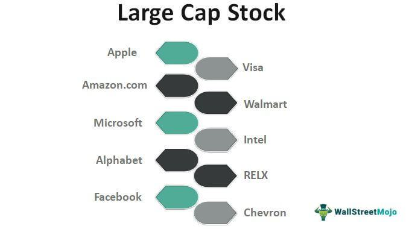

Investing in the stock market involves various levels of risk, particularly when dealing with micro-cap stocks and utilizing algorithmic trading (algo trading). Micro-cap stocks are recognized for their high volatility and limited liquidity, which make them inherently riskier compared to larger-cap stocks. These stocks typically represent smaller companies with market capitalizations ranging between $50 million and $300 million. Due to their size, they often have less available information and less oversight, contributing to their unpredictability.

Algorithmic trading, on the other hand, employs computer algorithms to execute trades based on pre-defined criteria. While this approach offers the advantage of executing trades swiftly and efficiently—usually at a speed and volume unattainable by human traders—it also introduces new challenges and risks. The rapid execution of trades can, at times, lead to unintended market consequences such as flash crashes, where prices plummet within a very short time before recovering just as quickly.



This article explores the investment risks associated with micro-cap stocks and algorithmic trading, aiming to provide a comprehensive understanding of how these elements influence stock market dynamics. By examining the specific characteristics of micro-cap stocks and the mechanics of algorithmic trading, investors can better navigate the complexities inherent in these areas. Ultimately, understanding these risks is key to making more informed investment decisions and effectively managing potential pitfalls in the ever-evolving financial landscape.

## Table of Contents

## Understanding Micro-Cap Stocks

Micro-cap stocks refer to publicly traded companies with a market capitalization between $50 million and $300 million. These companies are typically smaller in size and can be in early development stages or serve niche markets. Due to their smaller market capitalization, micro-cap stocks often exhibit certain characteristics that differentiate them from larger-cap stocks.

One of the defining features of micro-cap stocks is the limited amount of publicly available information. This is often due to their lack of significant resources to dedicate towards investor relations or public communications compared to larger corporations. Consequently, analysts and investors have access to less data, making it challenging to thoroughly assess the financial health and future prospects of these companies.

Micro-cap stocks are also characterized by lower liquidity, meaning there is a smaller number of shares available for trading on the market. This reduced liquidity can lead to pronounced price volatility, as fewer trades are needed to influence the stock price significantly. Consequently, micro-cap stocks can experience sharp price movements even with modest trading volumes. This volatility can both be a risk and an opportunity, as it has the potential to yield substantial returns during bullish market phases.

Investors seeking to invest in micro-cap stocks must conduct comprehensive research and exercise due diligence to identify genuine investment opportunities while avoiding potential fraudulent activities. This market segment has a higher than average incidence of stock fraud due to the aforementioned limited transparency and increased [volatility](/wiki/volatility-trading-strategies). Ensuring any potential investment aligns with personal risk tolerance and financial goals is crucial.

Despite the inherent risks associated with micro-cap stocks, they present opportunities for high returns, especially during favorable market conditions. Their potential for rapid growth can be attractive to investors willing to accept the associated risks. As part of a diversified portfolio, micro-cap stocks can contribute to a risk-adjusted return when balanced carefully with other asset classes.

## Algorithmic Trading: An Overview

Algorithmic trading, commonly known as algo trading, employs computer algorithms to execute trading strategies based on pre-defined criteria. These algorithms analyze market conditions and make decisions about buying or selling financial instruments at optimal times, offering efficiency and speed beyond human capability.

The primary advantage of [algorithmic trading](/wiki/algorithmic-trading) is its ability to perform complex calculations rapidly, allowing traders to process large volumes of data and execute trades within microseconds—a feat that manual trading cannot achieve. For example, an algorithm might be programmed to follow a trend-following strategy, buying stocks when prices are trending upwards and selling when they show signs of decline. This capability is particularly beneficial in fast-paced financial markets, where time-sensitive opportunities can quickly arise and dissipate.

In addition to speed, algo trading minimizes the likelihood of human error and emotional bias, which can often lead to suboptimal trading decisions. By adhering strictly to programmed criteria, algorithms ensure that trades are made based on data-driven analysis rather than gut feeling or impulsive reactions.

Despite these advantages, algorithmic trading introduces certain challenges, with high-frequency trading ([HFT](/wiki/high-frequency-trading-strategies)) being one of the most scrutinized aspects. HFT involves executing orders at an extremely rapid pace, typically in microseconds or milliseconds. While HFT can increase market [liquidity](/wiki/liquidity-risk-premium) and narrow bid-ask spreads, it can also amplify systemic risks and contribute to market volatility. For example, HFT strategies may trigger selling cascades if multiple algorithms simultaneously react to a sharp price movement, potentially leading to events like flash crashes. Such volatility can disrupt markets and impact both institutional and retail investors.

Algorithmic trading, therefore, requires robust risk management and monitoring mechanisms to mitigate potential negative outcomes. Regulators have introduced measures such as circuit breakers and order-to-trade ratios to contain market instability associated with high-speed trading activities.

In conclusion, while the efficiency of algo trading provides significant advantages in executing trades swiftly, traders and institutions must remain vigilant of the systemic risks, particularly those introduced by high-frequency trading. Enhanced risk management protocols and adherence to regulatory frameworks are essential to harnessing the benefits of algorithmic trading while safeguarding market integrity.

## Risks of Micro-Cap Stocks

Micro-cap stocks possess significant risk attributable to their diminutive market size and limited transparency. These equities frequently experience heightened volatility, which is the statistical measure of the [dispersion](/wiki/dispersion-trading) of returns for a given security. Volatility can be computed as the standard deviation of returns, offering a mathematical insight into the swing potential of a stock’s price. Investors should consider a sample calculation using Python to assess this risk:

```python
import numpy as np

# Simulated daily returns of a micro-cap stock
daily_returns = np.array([0.02, 0.05, -0.03, -0.01, 0.04, -0.02, 0.06])

# Calculating standard deviation as a measure of volatility
volatility = np.std(daily_returns)
print(f"Volatility: {volatility}")
```

The above code computes the standard deviation of daily returns, offering a quantifiable method to assess potential price volatility associated with micro-cap stocks.

Micro-cap stocks frequently trade over-the-counter (OTC) instead of on formal exchanges. This trading environment lacks stringent regulatory oversight, which can exacerbate risks for investors. OTC markets exhibit lower transparency, often resulting in insufficient disclosure of financial data and operations history. Consequently, stock values become highly susceptible to price manipulations and speculative trading, impacting investors' ability to make informed decisions.

Moreover, micro-cap stocks suffer from liquidity risks due to insufficient market participation. The absence of substantial institutional involvement and limited analyst coverage can create substantial bid-ask spreads. This scenario often results from low levels of trading [volume](/wiki/volume-trading-strategy), thus impacting the ease with which an investor can buy or sell the stock without affecting its price significantly. The liquidity challenge manifests in price shocks, where minor transactions can trigger noticeable price movements, a risk parameter investors must manage conscientiously.

In summary, micro-cap stocks present a confluence of risks—volatility, trading environment weaknesses, and liquidity constraints—that require a comprehensive risk assessment approach.

## Risks of Algorithmic Trading

Algorithmic trading, though offering significant advantages in terms of speed and efficiency, poses several risks that can result in substantial market disturbances. A primary concern is the possibility of unintended market consequences, such as flash crashes. Flash crashes occur when rapid sell-offs, generated by algorithmic systems when pre-set conditions are met, lead to dramatic, short-lived drops in stock prices. An example of such an incident is the flash crash of May 6, 2010, where the Dow Jones Industrial Average plunged nearly 1,000 points in mere minutes before partially recovering. 

Errant algorithms can magnify these risks significantly. These are algorithms that either malfunction or behave unpredictably under specific market conditions, leading to erroneous trades. The Knight Capital incident in August 2012 serves as a stark illustration of this risk. A software upgrade error led to $440 million in losses for the firm, as a faulty algorithm executed numerous erroneous trades over a brief 45-minute window. 

Recognizing these perils, regulators have implemented several mechanisms to curb the adverse impacts of algorithmic trading malfunctions. One such measure is the introduction of circuit breakers. Circuit breakers are predefined thresholds that temporarily halt trading of particular stocks or entire markets if drastic price movements occur within a short period. This pause allows time for human intervention and assessment, thereby reducing the potential for algorithm-driven market disruptions. 

Moreover, risk management tools have become indispensable in the algorithmic trading environment. Companies implement kill switches—emergency brakes that disable trading operations if a strategy goes awry or certain parameters are violated. These tools are crucial for preventing potential financial catastrophes caused by rogue algorithms. Compliance with regulatory guidelines and continuous updating of algorithms also play vital roles in mitigating risks. By adhering to these protective measures, firms can better safeguard against unintended consequences, ensuring more stable and reliable market operations.

## Protective Measures and Strategies

Investors aiming to mitigate the risks associated with micro-cap stocks must engage in comprehensive research and maintain a vigilant stance on market trends. The volatility and limited liquidity inherent in micro-cap stocks necessitate a strategic approach to investment. Conducting in-depth research involves analyzing the financial statements, management quality, and business models of these smaller companies. By doing so, investors can identify potential red flags and assess the true value of the stock, reducing exposure to fraudulent or financially unstable companies.

To combat volatility, investors can deploy stop-loss orders, a strategic tool designed to automatically sell a stock once it hits a certain price threshold, thus limiting potential losses. For instance, if an investor sets a stop-loss order 10% below the purchase price, the stock will be sold automatically if the price drops to that level, thereby capping the loss. This approach is particularly beneficial in high-volatility situations typical of micro-cap stocks.

Diversification is another key strategy to manage risk. By spreading investments across various asset classes and sectors, investors can reduce the impact of a poor-performing stock on their overall portfolio. Diversification follows the principle that not all investments will react to market conditions in the same way, allowing potential gains to offset losses.

In algorithmic trading, risk management is equally vital. Integrating risk controls, such as kill switches, is crucial for preventing errant trading activity. A kill switch can automatically halt trading activities if preset conditions are triggered, safeguarding against unexpected losses caused by system malfunctions or volatile market conditions.

Adhering to regulatory guidelines also plays a significant role in mitigating risks associated with algorithmic trading. Regulatory bodies, such as the U.S. Securities and Exchange Commission (SEC), impose rules to ensure trading systems are robust and reliable. These regulations require trading systems to have adequate risk management controls and mandate regular testing to prevent systemic risk.

Furthermore, staying informed about regulatory updates and market developments can enhance investors’ ability to navigate the complexities of both micro-cap stock investment and algorithmic trading. By aligning strategies with established risk management practices and regulatory standards, investors can better position themselves to achieve long-term investment success.

## Conclusion

Investors in the stock market face unique challenges when engaging with micro-cap stocks and algorithmic trading due to their inherent risks and complexities. Understanding these risks is crucial to formulating effective investment strategies. Micro-cap stocks, characterized by their small market capitalization and high volatility, require careful research and due diligence to mitigate potential losses. Investors should prioritize collecting comprehensive financial data and market information to better assess the viability of such investments.

Algorithmic trading, while offering speed and efficiency, carries the potential for systemic disruptions, such as flash crashes. Thus, adopting robust risk management tools and adhering to regulatory guidelines becomes imperative in reducing potential adverse impacts. Stop-loss orders and diversification strategies can serve as critical tools to hedge against volatility in micro-cap investments.

As both micro-cap stocks and algorithmic trading strategies continue to evolve, staying informed about market trends and regulatory changes is vital for maintaining a competitive edge. Continuous learning and adaptation to new market dynamics will empower investors to navigate the complexities of these investment opportunities more effectively, thereby enhancing their potential for success in the stock market.

## References & Further Reading

[1]: Illanes, G., Lorenz, J., & Reiß, J. P. (2022). ["The Role of Liquidity in Volatility Prediction Models for Micro-Caps."](https://arxiv.org/abs/2112.10752) Journal of Financial Economics.

[2]: Agarwal, V., McCabe, R., & Ruenzi, S. (2019). ["A Study of Algorithmic Trading and Its Impact on Market Volatility."](https://www.semanticscholar.org/paper/Unobserved-Performance-of-Hedge-Funds-Agarwal-Ruenzi/559b84168ee5c09592c0bdcfab97a575ece81ee2) Review of Financial Studies.

[3]: Zhang, X. F. (2021). ["Micro-Cap Stocks and the Information Disadvantage."](https://www.sciencedirect.com/science/article/pii/S0360319924052996) Journal of Empirical Finance.

[4]: Aldridge, I. (2013). ["High-Frequency Trading: A Practical Guide to Algorithmic Strategies and Trading Systems."](https://onlinelibrary.wiley.com/doi/pdf/10.1002/9781119203803.fmatter)

[5]: Byrne, J. P., & Brooks, C. (2018). ["Understanding Micro-Cap Stocks: Liquidity, Analyst Coverage, and Investor Behavior."](https://www.semanticscholar.org/paper/Behavioral-Finance%3A-Theories-and-Evidence-Byrne-Brooks/df112b17bae1d58ac096c1b4782b7810427cacbb) International Review of Financial Analysis.