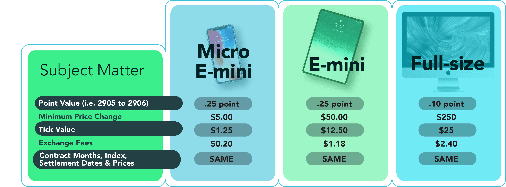

## Table of Contents

## What are Micro E-Mini Futures?

Micro E-Mini Futures are smaller versions of the regular E-Mini Futures contracts. They are designed for traders who want to trade in the stock market but with less risk and less money. Each Micro E-Mini contract represents a smaller amount of the underlying asset, like the S&P 500, compared to the regular E-Mini. This makes them more affordable and easier to manage for smaller investors.

These futures are popular because they allow traders to gain exposure to major stock indexes without needing a lot of money upfront. They are traded on the Chicago Mercantile Exchange (CME) and can be used for both speculating on market movements and hedging against potential losses. With Micro E-Mini Futures, traders can take advantage of market opportunities with lower financial risk, making them a good choice for beginners and those with limited capital.

## How do Micro E-Mini Futures differ from standard E-Mini Futures?

Micro E-Mini Futures and standard E-Mini Futures are both financial tools used for trading, but they have some key differences. The main difference is their size. A Micro E-Mini contract is much smaller than a standard E-Mini contract. For example, a Micro E-Mini S&P 500 contract is worth one-tenth the value of a standard E-Mini S&P 500 contract. This means that Micro E-Mini Futures require less money to trade, making them more accessible to people who don't have a lot of money to invest.

Another difference is the level of risk involved. Because Micro E-Mini Futures are smaller, they [carry](/wiki/carry-trading) less financial risk. If the market moves against you, your potential losses will be smaller with a Micro E-Mini than with a standard E-Mini. This makes Micro E-Mini Futures a good choice for beginners or those who want to trade with less risk. Both types of futures are traded on the same exchange, the Chicago Mercantile Exchange (CME), and can be used for speculating on market movements or hedging against potential losses.

## What are the advantages of trading Micro E-Mini Futures for beginners?

Trading Micro E-Mini Futures is great for beginners because they are smaller and cheaper than regular E-Mini Futures. This means you don't need a lot of money to start trading. For example, if you want to trade the S&P 500, a Micro E-Mini contract is one-tenth the size of a standard E-Mini contract. So, you can start trading with less money and still get experience in the market.

Another advantage is that Micro E-Mini Futures have less risk. Because they are smaller, any losses you might have will be smaller too. This makes it easier for beginners to learn without losing too much money. Plus, you can still use these futures to guess how the market will move or to protect yourself from losing money in other investments.

## What are the contract specifications of Micro E-Mini Futures?

Micro E-Mini Futures have different types, like the S&P 500, Nasdaq-100, Dow Jones, and Russell 2000. Each type has its own contract size. For example, a Micro E-Mini S&P 500 contract is worth $5 times the S&P 500 index value. If the S&P 500 is at 4,000, one contract is worth $20,000. The contracts are traded on the Chicago Mercantile Exchange (CME) and are available almost 24 hours a day, from Sunday evening to Friday afternoon.

The contracts have a set expiration date, usually every third Friday of March, June, September, and December. You can trade them up to the last trading day, which is the Thursday before the third Friday of the expiration month. The minimum price change, or tick size, for Micro E-Mini Futures is small. For the S&P 500, it's 0.25 index points, which equals $1.25 per contract. This small tick size allows for more precise trading and helps beginners manage their money better.

## How can one start trading Micro E-Mini Futures?

To start trading Micro E-Mini Futures, you first need to open an account with a brokerage firm that offers futures trading. Make sure the firm is reputable and has good customer support. Once you have an account, you'll need to deposit money into it. The amount you need depends on the broker's requirements and the type of Micro E-Mini Futures you want to trade. After funding your account, you can start placing trades through the broker's trading platform.

Next, you should learn how to use the trading platform. Most platforms have tools and charts that can help you make better trading decisions. It's a good idea to practice with a demo account before using real money. This way, you can get used to the platform and understand how Micro E-Mini Futures work without risking your money. Once you feel ready, you can start trading for real, always keeping in mind to manage your risk carefully.

## What are the risks associated with trading Micro E-Mini Futures?

Trading Micro E-Mini Futures comes with risks that you should know about. One big risk is losing money. Even though Micro E-Mini Futures are smaller than regular E-Mini Futures, you can still lose money if the market moves against you. The market can be unpredictable, and prices can change quickly. If you're not careful, you might end up losing more money than you planned.

Another risk is using too much leverage. Leverage means you can control a big contract with a small amount of money. While this can help you make more money, it can also make your losses bigger if the market goes the wrong way. It's important to use leverage carefully and not to risk more money than you can afford to lose. Always have a plan for managing your risk and stick to it.

## How do Micro E-Mini Futures impact portfolio diversification?

Adding Micro E-Mini Futures to your investment mix can help spread out your risk. When you invest in different things, like stocks, bonds, and futures, you're not putting all your money in one place. This is called diversification. If one part of your investments goes down, the other parts might go up or stay the same, which can help protect your money. Micro E-Mini Futures are smaller than regular futures, so they're easier to add to your portfolio without needing a lot of money.

Micro E-Mini Futures can also give you a way to bet on how the whole market will move, not just one company or industry. For example, if you think the S&P 500 will go up, you can buy a Micro E-Mini S&P 500 contract. This can balance out other parts of your portfolio that might not do well if the market goes down. By using Micro E-Mini Futures, you can make your investments more balanced and possibly safer.

## What strategies are effective when trading Micro E-Mini Futures?

One effective strategy for trading Micro E-Mini Futures is [trend following](/wiki/trend-following). This means you try to find out if the market is going up or down and then make your trades based on that. You can use charts and tools to see the trend. If the market is going up, you buy a contract hoping it will keep going up. If it's going down, you might sell a contract, hoping to buy it back later at a lower price. This strategy works well if you're patient and good at spotting trends.

Another strategy is called [scalping](/wiki/gamma-scalping). With scalping, you make lots of small trades in a short time, trying to make a little bit of money from each one. You need to be quick and watch the market closely. This can be good for Micro E-Mini Futures because they have small price changes, or ticks, which let you trade more often without needing a lot of money. But remember, scalping needs a lot of focus and can be stressful.

Using Micro E-Mini Futures for hedging is also a smart move. Hedging means you use futures to protect other parts of your investments. For example, if you own a lot of stocks and you're worried they might go down, you can sell Micro E-Mini Futures. If the market does go down, the money you lose on your stocks might be made up by the money you make on the futures. This can help keep your portfolio safe and balanced.

## How do market conditions affect Micro E-Mini Futures?

Market conditions can have a big impact on Micro E-Mini Futures. When the overall market is doing well, like when the economy is growing and people are feeling good about investing, the prices of Micro E-Mini Futures usually go up. This is because these futures are tied to big stock indexes like the S&P 500. If people think the market will keep going up, they buy more futures, which pushes the prices higher. On the other hand, if the market is not doing well, like during a recession or when there's a lot of uncertainty, the prices of Micro E-Mini Futures can go down. People might sell their futures to avoid losing more money, which makes the prices drop.

Another thing that affects Micro E-Mini Futures is how much the market is moving around, or its [volatility](/wiki/volatility-trading-strategies). When the market is very volatile, with prices going up and down a lot, trading Micro E-Mini Futures can be riskier. This is because the prices can change quickly, and you might lose money if you're not careful. But it can also be a chance to make money if you know how to trade in a volatile market. When the market is calm and not moving much, trading Micro E-Mini Futures might be less risky, but there might also be fewer chances to make big profits.

## What role do Micro E-Mini Futures play in modern financial markets?

Micro E-Mini Futures are important in today's financial markets because they let more people trade without needing a lot of money. They are smaller versions of regular E-Mini Futures, so they are easier for beginners and people with less money to use. This means more people can try to make money from the stock market or protect their other investments. They are traded on the Chicago Mercantile Exchange, which is a big place where people buy and sell futures. This makes it easy for anyone to start trading Micro E-Mini Futures.

These futures also help make the market more active and balanced. Because they are smaller, people can trade them more often, which can make the market move more smoothly. They also give traders a way to bet on how the whole market will do, not just one company or industry. This can help people spread out their risk and make their investments safer. Overall, Micro E-Mini Futures are a big part of modern financial markets because they help more people take part and make the market work better.

## How can advanced traders leverage Micro E-Mini Futures for greater returns?

Advanced traders can use Micro E-Mini Futures to make more money by using strategies like spread trading. This means they buy and sell different Micro E-Mini Futures at the same time, hoping to make money from the difference in their prices. For example, they might buy a Micro E-Mini S&P 500 contract and sell a Micro E-Mini Nasdaq-100 contract. If they think the S&P 500 will go up more than the Nasdaq-100, they can make money from the difference. This can be less risky than just betting on one market going up or down, because it's about the difference between two markets.

Another way advanced traders can use Micro E-Mini Futures is by using more leverage. Leverage means they can control a big contract with a small amount of money. This can help them make more money if the market moves the right way. But it's important to be careful because more leverage can also mean bigger losses if the market goes the wrong way. Advanced traders need to watch the market closely and have a good plan for managing their risk. By using these strategies, they can try to make bigger returns while still keeping their risk under control.

## What are the future trends and developments expected in the Micro E-Mini Futures market?

The Micro E-Mini Futures market is expected to keep growing as more people learn about them and start trading. Because they are smaller and cheaper than regular E-Mini Futures, more beginners and people with less money can join in. This means the market might get bigger and more active. Also, as technology gets better, trading platforms will become easier to use and have more tools to help traders make smart choices. This could make Micro E-Mini Futures even more popular.

Another trend we might see is new types of Micro E-Mini Futures being created. Right now, there are futures for big stock indexes like the S&P 500 and Nasdaq-100. In the future, we might see Micro E-Mini Futures for other markets, like commodities or foreign currencies. This would give traders more ways to make money and protect their investments. As the market grows and changes, it's important for traders to keep learning and stay up to date with new trends and developments.

## References & Further Reading

[1]: ["Micro E-Mini Futures: An Introduction"](https://www.benzinga.com/money/micro-e-mini-futures) - Chicago Mercantile Exchange

[2]: Lopez de Prado, M. (2018). ["Advances in Financial Machine Learning."](https://www.amazon.com/Advances-Financial-Machine-Learning-Marcos/dp/1119482089) Wiley.

[3]: Chan, E. P. (2009). ["Quantitative Trading: How to Build Your Own Algorithmic Trading Business."](https://github.com/ftvision/quant_trading_echan_book) Wiley Trading.

[4]: Jansen, S. (2020). ["Machine Learning for Algorithmic Trading."](https://github.com/stefan-jansen/machine-learning-for-trading) Packt Publishing.

[5]: Aronson, D.R. (2007). ["Evidence-Based Technical Analysis: Applying the Scientific Method and Statistical Inference to Trading Signals."](https://www.amazon.com/Evidence-Based-Technical-Analysis-Scientific-Statistical/dp/0470008741) Wiley.