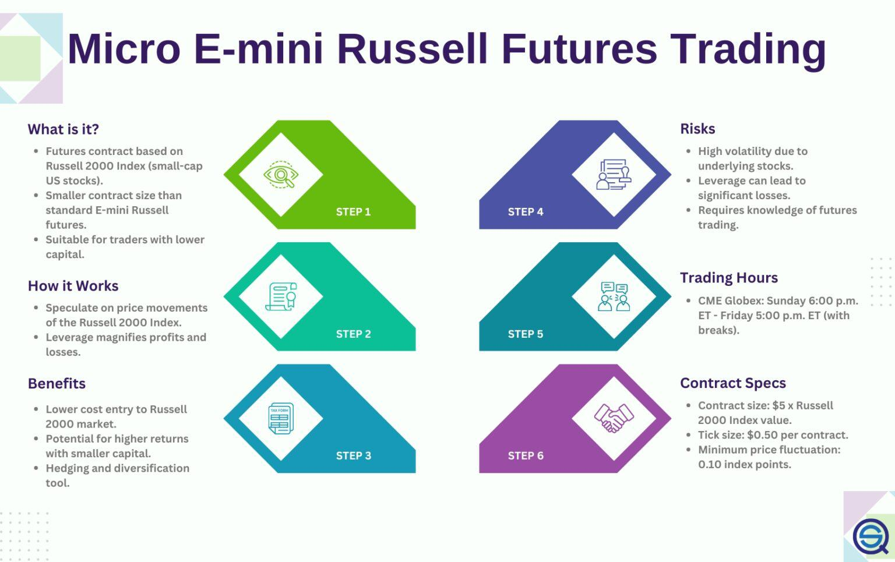

Futures trading has traditionally been a domain dominated by institutional investors due to the complexity and substantial capital requirements associated with these financial instruments. However, the landscape is undergoing a significant transformation with the introduction of Micro E-mini futures, which are smaller-sized futures contracts that offer a more accessible gateway for retail investors to participate in futures markets. These instruments, introduced by the Chicago Mercantile Exchange (CME) in 2019, are specifically designed to mimic the performance of major stock indexes at a fraction of the cost and size of traditional futures contracts. This democratization of access allows individual investors to manage their portfolios with precision, utilizing sophisticated futures strategies previously reserved for larger market players.

Concurrently, the evolution of algorithmic trading, powered by advancements in Artificial Intelligence (AI), is reshaping the efficiency and accessibility of futures trading. AI-driven algorithms are capable of processing vast amounts of market data at unprecedented speeds, allowing for real-time trading decisions that are more informed and precise. This technological advancement minimizes the influence of human emotions and biases in trading, contributing to enhanced risk management and potentially higher returns.



This article explores the dynamic interplay between Micro E-mini futures and algorithmic trading technologies. Together, they are facilitating a paradigm shift in investment strategies, leveling the playing field between seasoned institutional traders and individual retail investors. As these innovations continue to gain momentum, they hold transformative potential by combining accessibility with cutting-edge technology, reshaping how investors approach futures trading in modern financial markets.

## Table of Contents

## Understanding Futures Trading and Micro E-mini Futures

Futures trading is a cornerstone of the financial markets, offering investors the ability to hedge risk, speculate on price movements, and gain exposure to various asset classes. A futures contract is a standardized legal agreement to buy or sell an asset at a predetermined price at a specified time in the future. Historically, these instruments have been dominated by institutional investors due to their complexity and the substantial capital requirements involved.

Micro E-mini futures were introduced as a solution to make futures trading more accessible to retail investors. Launched in May 2019 by the Chicago Mercantile Exchange (CME), these contracts are a miniature version of the existing E-mini futures contracts. Micro E-mini futures maintain the same underlying asset and leverage potential as their larger counterparts, but with a contract size that is one-tenth the size of the standard E-mini contracts. 

This scaling down enables retail investors to participate in futures markets with lower margin requirements, thereby democratizing access. The key indices covered by Micro E-mini contracts include the S&P 500, Dow Jones Industrial Average, Nasdaq-100, and Russell 2000. The availability of these smaller contracts offers individual investors the flexibility to implement diversified trading strategies and manage risk more effectively.

The Chicago Mercantile Exchange played a pivotal role in the development and launch of Micro E-mini futures, leveraging its robust infrastructure and market expertise. By providing a more manageable entry point, the CME has opened new possibilities for individual traders and smaller investment accounts, allowing them to engage in the dynamic world of futures trading without the need for significant capital outlays.

In conclusion, the introduction of Micro E-mini futures is a significant advancement in making futures trading more inclusive, providing retail investors with the tools necessary to navigate and benefit from the futures markets actively.

## The Rise of Micro E-mini Futures

The introduction of Micro E-mini futures in May 2019 by the Chicago Mercantile Exchange (CME) marked a pivotal moment in the evolution of futures trading. These contracts were specifically designed to provide individual investors with a more accessible entry point into the futures markets. Before the advent of Micro E-mini futures, trading in futures contracts required substantial capital investment due to the size and margin requirements of standard E-mini futures. Micro E-mini futures, however, are ten times smaller in contract size compared to their traditional counterparts, bringing a transformative shift in accessibility for retail investors.

The difference in size between traditional E-mini futures and Micro E-mini futures can be exemplified through their respective contract sizes and margin requirements. For instance, if an E-mini S&P 500 futures contract has a notional value of $50 times the S&P 500 index level, a Micro E-mini S&P 500 futures contract is valued at $5 times the index level. This smaller contract size dramatically lowers the financial barrier to entry, allowing individual traders to engage in futures markets without the same level of capital risk involved in traditional E-mini futures trading.

The availability of Micro E-minis has opened up a plethora of opportunities for individual investors. Since their smaller size allows for more precise scaling of positions, retail investors can employ risk management strategies with greater granularity. This granularity translates to the ability to hedge against specific market movements without being over-leveraged—a challenge often encountered with larger traditional futures contracts. Moreover, smaller position sizes enable more diverse portfolio strategies, facilitating the implementation of sophisticated trading techniques like dollar cost averaging or partial position liquidation in response to market changes.

Additionally, the lower entry threshold of Micro E-mini futures enables retail investors to mimic strategies typically pursued by institutional players on a scale more suitable to their resources. This democratizes access to market strategies that were previously the domain of larger financial institutions, effectively leveling the playing field.

The popularity of Micro E-mini futures has grown significantly since their introduction, exemplified by their robust trading volumes and increasing adoption by retail traders. Their development has signified not only a step forward in making futures markets more inclusive but has also encouraged greater participation from a diverse investor base, thereby contributing to the [liquidity](/wiki/liquidity-risk-premium) and vibrancy of the futures markets overall.

## Algorithmic Trading: Enhancing Futures Trading Efficiency

Algorithmic trading, bolstered by the integration of Artificial Intelligence (AI), has significantly improved the efficiency of futures trading. AI algorithms are designed to process vast amounts of market data rapidly and accurately, enabling traders to make informed decisions in real-time. The use of [machine learning](/wiki/machine-learning) and predictive analytics allows these algorithms to identify patterns and trends that might not be immediately visible to human traders, thereby providing a competitive edge. 

At the core of AI's application in [algorithmic trading](/wiki/algorithmic-trading) is its ability to analyze historical data and predict future market movements. These algorithms employ techniques such as supervised and unsupervised learning to discern intricate patterns. For instance, a common approach involves using time series analysis, where past price data serves as input to forecast future prices. A typical algorithm may employ models like ARIMA (AutoRegressive Integrated Moving Average) or neural networks to improve prediction accuracy.

Here is a simplified example using Python to demonstrate an AI algorithm analyzing market data:

```python
import pandas as pd
from sklearn.model_selection import train_test_split
from sklearn.ensemble import RandomForestRegressor

# Load market data
data = pd.read_csv('market_data.csv')
X = data[['feature1', 'feature2', 'feature3']]  # feature selection
y = data['price']

# Splitting data 
X_train, X_test, y_train, y_test = train_test_split(X, y, test_size=0.2, random_state=42)

# Train model
model = RandomForestRegressor(n_estimators=100, random_state=42)
model.fit(X_train, y_train)

# Predicting future prices
predictions = model.predict(X_test)
```

A significant advantage of AI in trading is the reduction of human emotional biases, which often lead to suboptimal decision-making under volatile market conditions. The emotional detachment inherent in algorithmic trading allows for more consistent and objective decision-making processes. This, in turn, leads to improved risk management strategies. Without emotions such as fear or greed influencing trades, algorithmic systems can implement stop-loss orders and other risk mitigation techniques more precisely and consistently.

Moreover, AI algorithms facilitate the execution of high-frequency trading strategies by analyzing high-[volume](/wiki/volume-trading-strategy) real-time data and executing orders within fractions of a second. This swift execution capability positions traders to exploit minute pricing discrepancies that occur in extremely short time frames, enhancing trade profitability.

In conclusion, the integration of AI into algorithmic trading has revolutionized futures trading by enabling data-driven decision-making and reducing emotional biases. These advancements result in more precise risk management and better trading outcomes, thereby enhancing the overall efficiency and accessibility of futures markets.

## Micro E-mini Futures and AI: A Powerful Combination

Micro E-mini futures and algorithmic trading form a powerful synergy that is transforming the landscape of futures trading. This combination leverages the accessibility of Micro E-mini contracts with the precision and speed of algorithmic trading, enabling retail investors to participate more effectively in markets traditionally dominated by institutional players.

Micro E-mini futures are smaller-sized contracts that provide a lower cost barrier for entry compared to traditional futures contracts. This smaller scale is particularly advantageous for algorithmic trading because it allows for a more granular approach to trade execution and risk management. Algorithms can operate with increased precision, allowing them to target specific market movements without the larger capital requirements traditionally associated with standard E-mini futures. This precision is crucial for executing strategies that depend on rapid adjustments and fine-grained data analysis, such as [scalping](/wiki/gamma-scalping), [arbitrage](/wiki/arbitrage), and [market making](/wiki/market-making).

Algorithmic trading, enhanced by [artificial intelligence](/wiki/ai-artificial-intelligence), processes vast quantities of market data to identify patterns and opportunities. AI algorithms utilize machine learning techniques to improve decision-making by learning from historical data, continuously optimizing trading strategies. This removes human emotions from the equation, leading to decisions that are unbiased and data-driven. The smaller size of Micro E-mini futures allows these algorithms to implement strategies with a high degree of accuracy and at reduced risk levels.

The democratization of the futures market through the introduction of Micro E-mini contracts provides retail investors with an unprecedented opportunity to compete with institutional investors. Retail traders can now access sophisticated trading strategies powered by AI, leveling the playing field. This expands the potential for individual investors to explore a range of strategies that were previously difficult to implement due to capital constraints. For instance, a retail trader might use a Python library such as `ccxt` to automate trading strategies across multiple platforms, utilizing AI [agents](/wiki/agents) to optimize contract selection and timing in the Micro E-mini space.

The convergence of these technologies signals a shift towards a more inclusive market environment where retail investors can actively participate. By harnessing the advantages of Micro E-minis and AI, traders are not only able to reduce transaction costs and manage risks more effectively but also engage with complex trading strategies historically reserved for large hedge funds and institutional investors. Through continuous innovation and learning, the synergy between Micro E-mini futures and algorithmic trading presents new avenues for growth and opportunity in the financial markets.

## Practical Applications and Examples

Traders are increasingly incorporating Micro E-mini futures into their investment strategies due to their accessibility and flexibility. These contracts are being used for hedging, speculation, and portfolio diversification. A common strategy involves leveraging Micro E-mini futures to hedge against market downturns. For instance, a trader holding a portfolio of tech stocks might sell Micro E-mini NASDAQ-100 futures as a protective measure during periods of expected [volatility](/wiki/volatility-trading-strategies). This enables the trader to mitigate potential losses from the physical stock holdings while capitalizing on market movements through futures trading.

The integration of Artificial Intelligence (AI) into futures trading has provided significant benefits but also presents notable challenges. AI algorithms, equipped with machine learning capabilities, analyze vast datasets to uncover trading opportunities. For example, an AI system might process historical price data, news sentiment, and economic indicators to predict trends in Micro E-mini futures prices. A case study involving a leading investment firm demonstrated the use of AI to enhance trade execution speed and accuracy. By automating order placement, AI reduced transaction costs and improved profitability.

However, the deployment of AI in trading is not without obstacles. Instances of algorithmic bias, where AI models inadvertently favor certain market conditions or securities, can skew trading outcomes. Additionally, there are concerns regarding market manipulation, as sophisticated algorithms might engage in activities like spoofing, manipulating market prices for short-term gains. Therefore, traders using AI must implement robust risk management systems and maintain vigilance to ensure ethical trading practices.

Brokers and trading platforms play a critical role in facilitating Micro E-mini futures trading. Leading platforms have adapted to technological advancements by offering tools that support algorithmic trading. These platforms provide real-time market data, customizable trading interfaces, and APIs for the development of automated trading strategies. Brokers also offer educational resources and analytical tools to aid retail investors in understanding and executing trades effectively. By doing so, they help narrow the gap between individual traders and institutional investors, enabling a more level trading field.

In summary, the practical use of Micro E-mini futures is expanding, fueled by algorithmic trading and the support of advanced trading platforms. Despite the challenges that accompany AI integration, the benefits of increased speed, reduced costs, and enhanced decision-making underscore the transformative impact of technology in modern futures trading.

## Navigating the Challenges and Risks

Futures trading, including Micro E-mini futures, carries inherent risks that traders must recognize and manage. One fundamental risk in futures trading is market volatility. Futures prices can fluctuate significantly due to changes in supply and demand, economic indicators, geopolitical events, or natural disasters. This volatility can lead to substantial profits or losses, depending on the trader's position and strategy.

Even Micro E-mini futures, which are designed to be more accessible and [carry](/wiki/carry-trading) lower financial requirements compared to standard contracts, do not eliminate risk. They offer smaller contract sizes, reducing the exposure per point movement, but the potential for loss remains if market movements are not accurately anticipated.

Algorithmic trading introduces additional challenges. While algorithms can enhance trading efficiency by processing large volumes of data and executing trades at high speed, they can also propagate algorithmic bias. Algorithmic bias can occur if the data or the model used by the trading algorithm is flawed, leading to skewed trading decisions that do not align with market realities. Furthermore, these systems can be susceptible to market manipulation. Sophisticated traders can exploit algorithmic weaknesses, such as latency arbitrage, where they capitalize on the time delay between different markets to gain an advantage.

Another risk associated with algorithmic trading is the potential for algorithmic errors. Coding errors or unforeseen market conditions can lead to unintended trades and significant financial loss. To mitigate these risks, traders should conduct thorough [backtesting](/wiki/backtesting) and scenario analysis of their algorithms. 

For traders engaged in futures markets, continual learning and informed decision-making are crucial. Staying informed about market trends, adjusting strategies, and understanding the underlying mechanics of trading tools are essential practices. Educational resources, technical analyses, and the use of risk management techniques like stop-loss orders can aid in minimizing potential losses.

Ultimately, while Micro E-mini futures and algorithmic trading offer opportunities to engage in futures markets with greater precision, the associated challenges and risks require diligent management. Traders should focus on developing a disciplined approach, utilizing the full suite of analytical tools available, and embracing ongoing education to navigate these complexities successfully.

## The Future of Futures Trading

The future of futures trading is poised to be highly dynamic, marked by significant advancements and innovations that continue to reshape the landscape. Central to this transformation is the increased focus on Micro E-mini futures, which have been making substantial inroads since their debut. These miniaturized contracts offer a compelling solution for retail investors seeking to participate in futures markets without the larger capital requirements traditionally associated with standard futures contracts.

One of the most notable trends is the evolution of Artificial Intelligence and technology in the futures trading arena. AI algorithms are becoming increasingly sophisticated, enabling traders to analyze vast datasets rapidly, identify patterns, and execute trades with enhanced precision. This technological advancement offers opportunities to optimize trading strategies and minimize human error, providing a competitive edge in volatile market conditions.

AI's influence extends beyond mere data analysis; it's facilitating the democratization of trading by equalizing access to complex trading tools and insights previously reserved for major institutional players. Retail investors now have the potential to leverage AI-driven platforms to compete on more equal footing with larger market participants. This shift is empowering individual investors, with platforms increasingly offering customizable algorithmic solutions tailored to the specific needs of retail traders.

The integration of AI with Micro E-mini futures, in particular, exemplifies the potential for transformative change. The relatively smaller size of these contracts aligns well with AI's capability to quickly react to market movements, allowing for nimble trading strategies that were not previously feasible for individual investors. As a result, market accessibility is expanding, enabling a more diverse range of participants to engage in futures trading and diversify their portfolios.

Looking ahead, the continued development of AI technology promises to further enhance the efficiency and effectiveness of futures trading. Emerging innovations, such as machine learning models and natural language processing, are expected to deepen the analytical capabilities available to traders, potentially unveiling new strategies and insights.

In conclusion, the combination of Micro E-mini futures and AI technologies underscores a broader trend towards the democratization of trading. This evolution not only empowers individual investors with tools to enhance their trading efficiency but also fosters a more inclusive and competitive market environment. As these innovations continue to evolve, the futures trading landscape is likely to become even more accessible and dynamic, offering new opportunities for traders of all backgrounds.

## Conclusion

Micro E-mini futures and Artificial Intelligence (AI) are reshaping the landscape of futures trading in profound ways. The introduction of Micro E-mini futures has significantly lowered the entry barriers for retail investors, offering them a scalable and manageable way to participate in the futures markets. Previously, futures trading was primarily the domain of institutional investors due to the significant capital requirements and complex risk management strategies involved. Micro E-minis, by reducing the notional value of futures contracts, enable individual investors to engage with major indexes without necessitating substantial financial commitments.

Simultaneously, the integration of AI in algorithmic trading is revolutionizing how futures markets operate. AI enhances trading efficiency by processing vast amounts of market data at unprecedented speeds, allowing for informed, rapid decision-making. The combination of AI's analytical prowess with the accessible nature of Micro E-mini futures creates a powerful toolset for individual investors. This synergy enables retail traders to make more precise trading decisions and compete more effectively against larger institutional players.

The fusion of accessibility through Micro E-mini futures and the technological advancements of AI has the transformative potential to democratize trading. It empowers individual investors by leveling the playing field, allowing them to utilize sophisticated trading strategies that were once the purview of financial giants. As these tools become more integrated and advanced, they promise to redefine investment strategies, offering transparency, precision, and reduced emotional bias in trading decisions.

For traders, embracing these innovations is not merely an option but a necessity to remain competitive in an evolving market landscape. The encouragement here is for investors to leverage these advancements, enhancing both their market understanding and their strategic execution. By doing so, they can optimize their trading outcomes and participate more fully in the opportunities offered by modern financial markets. As both the futures trading sector and AI continue to evolve, they will likely introduce further innovations, promising an exciting future for traders willing to engage with and adapt to these new paradigms.

## References & Further Reading

[1]: ["Micro E-Mini Futures: An Introduction"](https://www.benzinga.com/money/micro-e-mini-futures) - Chicago Mercantile Exchange

[2]: Lopez de Prado, M. (2018). ["Advances in Financial Machine Learning."](https://www.amazon.com/Advances-Financial-Machine-Learning-Marcos/dp/1119482089) Wiley.

[3]: Chan, E. P. (2009). ["Quantitative Trading: How to Build Your Own Algorithmic Trading Business."](https://github.com/ftvision/quant_trading_echan_book) Wiley Trading.

[4]: Jansen, S. (2020). ["Machine Learning for Algorithmic Trading."](https://github.com/stefan-jansen/machine-learning-for-trading) Packt Publishing.

[5]: Aronson, D.R. (2007). ["Evidence-Based Technical Analysis: Applying the Scientific Method and Statistical Inference to Trading Signals."](https://www.amazon.com/Evidence-Based-Technical-Analysis-Scientific-Statistical/dp/0470008741) Wiley.