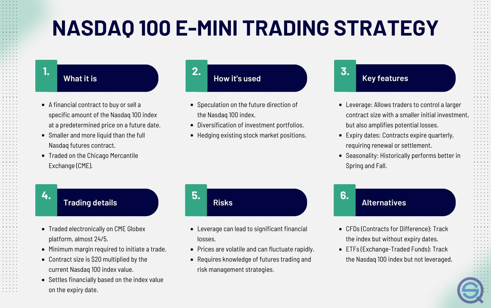

## Table of Contents

## What are Micro E-mini NASDAQ-100 futures?

Micro E-mini NASDAQ-100 futures are a type of financial contract that allows investors to bet on the future value of the NASDAQ-100 index, which is made up of the 100 largest non-financial companies listed on the NASDAQ stock exchange. These futures are called "micro" because they are smaller in size compared to the regular E-mini NASDAQ-100 futures, making them more accessible to individual investors who might not have the capital to trade the larger contracts.

These futures are traded on the Chicago Mercantile Exchange (CME) and are popular among traders because they offer a way to gain exposure to the tech-heavy NASDAQ-100 index without having to buy all the individual stocks. They can be used for hedging, which means protecting other investments from potential losses, or for speculation, where traders try to profit from predicting market movements. The smaller size of the Micro E-mini contracts makes them a useful tool for managing risk and trying out new trading strategies with less money at stake.

## How do Micro E-mini NASDAQ-100 futures differ from standard E-mini futures?

Micro E-mini NASDAQ-100 futures and standard E-mini futures both track the NASDAQ-100 index, but they differ mainly in their size and cost. A Micro E-mini contract is one-tenth the size of a standard E-mini contract. This means that if a standard E-mini contract represents $20 times the NASDAQ-100 index value, a Micro E-mini contract represents $2 times the index value. Because of this smaller size, Micro E-mini futures require less money to trade, making them more accessible to individual investors who might not have the funds to trade the larger standard E-mini contracts.

The smaller size of Micro E-mini futures also means they can be a good tool for managing risk and trying out new trading strategies. Traders can use them to take smaller positions in the market, which can help them learn and experiment without risking as much money. Both types of futures can be used for hedging or speculation, but the lower cost of entry with Micro E-mini futures makes them a popular choice for those looking to get started with futures trading or to fine-tune their trading approach.

## What are the benefits of trading Micro E-mini NASDAQ-100 futures?

Trading Micro E-mini NASDAQ-100 futures can be good for people who want to invest in the stock market but don't have a lot of money to start with. These futures are smaller than regular E-mini futures, so they cost less to trade. This means you can start trading with less money and still get a chance to make profits or protect your other investments. It's like trying a new game with smaller bets, so you can learn and practice without risking too much.

Another benefit is that Micro E-mini NASDAQ-100 futures let you trade the NASDAQ-100 index, which is made up of big tech companies. This can be easier than buying all the individual stocks in the index. You can use these futures to guess which way the market will go and try to make money from those guesses. Or, if you already own stocks, you can use these futures to protect your investments from losing value if the market goes down. This makes them a useful tool for both new and experienced traders.

## What are the key factors to consider before starting to trade Micro E-mini NASDAQ-100 futures?

Before you start trading Micro E-mini NASDAQ-100 futures, it's important to understand what you're getting into. These futures are smaller and cheaper than regular E-mini futures, so they're good for people who don't have a lot of money to start with. But, you still need to know how they work and what risks you're taking. Make sure you understand that futures trading can be risky because you can lose more money than you put in if the market moves against you. It's a good idea to learn about the NASDAQ-100 index and how it's affected by things like company news, economic reports, and world events.

Another thing to think about is your trading plan. You should know why you're trading these futures - are you trying to make money by guessing the market's direction, or are you trying to protect other investments? Also, think about how much money you can afford to lose. It's important to only trade with money you can afford to lose. Lastly, make sure you have a good broker and trading platform that can handle futures trading. This will help you trade smoothly and manage your risks better.

## How can beginners start trading Micro E-mini NASDAQ-100 futures?

To start trading Micro E-mini NASDAQ-100 futures, beginners should first find a good broker that offers futures trading. Look for a broker with a user-friendly platform and low fees. Once you have a broker, you'll need to open an account and deposit some money. This money is called margin, and it's what you use to trade futures. Make sure you understand how much margin you need and how much you can afford to lose before you start trading.

Next, it's important to learn about the NASDAQ-100 index and how futures work. The NASDAQ-100 is made up of big tech companies, and its value can go up or down based on news and economic reports. Futures let you bet on which way the index will move. You can use them to try to make money by guessing the market's direction or to protect other investments. Start with small trades to practice and learn without risking too much money. As you get more comfortable, you can try different strategies and increase your trading size.

## What basic trading strategies can be used for Micro E-mini NASDAQ-100 futures?

One simple strategy for trading Micro E-mini NASDAQ-100 futures is called trend following. This means you watch the NASDAQ-100 index to see if it's going up or down over time. If you see it's going up, you can buy a futures contract hoping it will keep going up and you can sell it later for a profit. If it's going down, you can sell a futures contract, betting that it will keep going down and you can buy it back later at a lower price. This strategy works well if you're patient and can wait for the right time to trade.

Another strategy is called range trading. This is when you notice that the NASDAQ-100 index moves between certain high and low points without going too far in either direction. If you see the index near its low point, you might buy a futures contract, expecting it to go back up to the high point. If it's near the high point, you might sell a futures contract, expecting it to drop back to the low point. This strategy can work well if the market stays stable and doesn't move too much.

A third strategy is hedging. This is useful if you already own stocks that are in the NASDAQ-100 index. If you think the market might go down, you can sell Micro E-mini NASDAQ-100 futures to protect your stocks. If the market does go down, the profit from the futures can help cover any losses from your stocks. This strategy is about protecting what you already have rather than trying to make more money.

## How does market analysis influence Micro E-mini NASDAQ-100 trading strategies?

Market analysis is really important for deciding how to trade Micro E-mini NASDAQ-100 futures. It helps you understand what's going on in the market and what might happen next. For example, if you see that the NASDAQ-100 index has been going up because a lot of tech companies are doing well, you might decide to use a trend following strategy. This means you would buy futures contracts, expecting the index to keep going up. On the other hand, if you notice that the index is moving up and down between certain points, you might choose a range trading strategy. This means you would buy when the index is low and sell when it's high, hoping to make money from these movements.

Market analysis also helps you figure out when to use a hedging strategy. If you think the market might go down because of bad economic news or other reasons, you can sell futures contracts to protect your other investments. By doing this, you can make money from the futures if the market does go down, which can help cover any losses from your stocks. So, by looking at market trends, economic reports, and news, you can choose the best strategy for trading Micro E-mini NASDAQ-100 futures and manage your risks better.

## What are some advanced trading strategies for experienced traders in Micro E-mini NASDAQ-100 futures?

One advanced strategy for experienced traders is called scalping. This involves making lots of small trades throughout the day to take advantage of tiny price changes in the Micro E-mini NASDAQ-100 futures. Scalpers need to be quick and use charts and other tools to spot these small movements. They aim to make a little bit of money on each trade, but because they do it so often, these small gains can add up. This strategy works well in markets that move a lot during the day, but it can be stressful and requires a lot of focus.

Another strategy is called spread trading. This involves buying and selling different futures contracts at the same time to take advantage of the price difference between them. For example, a trader might buy a Micro E-mini NASDAQ-100 futures contract and sell a regular E-mini NASDAQ-100 futures contract, betting that the difference in their prices will change in a way that makes money. This strategy can be less risky than trading just one futures contract because it's about the relationship between two contracts, but it still needs a good understanding of how futures markets work.

A third advanced strategy is using options on futures. This means trading options that are based on Micro E-mini NASDAQ-100 futures. Options give you the right, but not the obligation, to buy or sell a futures contract at a certain price. Experienced traders might use options to make money from big moves in the market or to protect their futures positions from losses. This strategy can be complex and involves understanding how options work, but it can offer more ways to make money and manage risk.

## How can risk management be effectively applied in Micro E-mini NASDAQ-100 trading?

Risk management is really important when trading Micro E-mini NASDAQ-100 futures. One way to manage risk is by setting stop-loss orders. A stop-loss order is like a safety net that automatically closes your trade if the price moves against you by a certain amount. This helps you limit how much money you can lose on a single trade. Another way to manage risk is by not putting all your money into one trade. Instead, spread your money across different trades so that if one trade goes bad, you won't lose everything. It's also a good idea to only trade with money you can afford to lose, so you don't end up in financial trouble if things don't go your way.

Another important part of risk management is understanding how much you can lose on each trade. This is called position sizing. You can figure out how much to trade by thinking about how much money you have and how much risk you're willing to take. For example, if you have $10,000 and you don't want to risk more than 2% on any single trade, you would only risk $200 per trade. This way, even if you lose on a few trades, you won't lose too much of your total money. Also, keeping an eye on the market and being ready to change your strategy if things change can help you manage risk better. By using these simple risk management techniques, you can trade Micro E-mini NASDAQ-100 futures more safely and confidently.

## What role do economic indicators play in shaping Micro E-mini NASDAQ-100 trading strategies?

Economic indicators are important pieces of information that help traders decide how to trade Micro E-mini NASDAQ-100 futures. These indicators tell us about the health of the economy, like how many people have jobs, how much money people are spending, and how fast the economy is growing. When these indicators are good, it can mean that the NASDAQ-100 index, which is made up of big tech companies, might go up. Traders might decide to buy futures contracts, expecting the index to keep going up. On the other hand, if the indicators show that the economy is slowing down or doing badly, traders might think the index will go down and decide to sell futures contracts to protect their money or make a profit from the falling prices.

For example, if a report shows that more people are getting jobs, traders might feel good about the economy and buy Micro E-mini NASDAQ-100 futures. This is because more jobs can mean more money for people to spend on tech products, which can help the companies in the NASDAQ-100 do well. But if a report shows that inflation is going up a lot, traders might worry that the economy is overheating and decide to sell futures contracts. They might think that high inflation could make the Federal Reserve raise interest rates, which can slow down the economy and hurt the NASDAQ-100 index. By keeping an eye on these economic indicators, traders can adjust their strategies to make the best decisions for their trades.

## How can algorithmic trading be utilized in Micro E-mini NASDAQ-100 futures?

Algorithmic trading can be a powerful tool for trading Micro E-mini NASDAQ-100 futures. It involves using computer programs to automatically buy and sell futures contracts based on certain rules or patterns. For example, a trader might set up an algorithm to buy futures when the NASDAQ-100 index goes above a certain price and sell when it drops below another price. This can help traders take advantage of market movements quickly and without having to watch the market all the time. Algorithms can also be used to spot trends or patterns in the market that might be hard for a person to see, helping traders make better decisions.

Using algorithmic trading can also help manage risk better. Traders can program their algorithms to automatically use stop-loss orders, which close trades if the price moves against them too much. This helps limit losses and protect their money. Additionally, algorithms can be set up to trade small amounts many times a day, a strategy called scalping, which can help traders make small profits that add up over time. By using algorithmic trading, traders can execute their strategies more efficiently and manage their risks more effectively when trading Micro E-mini NASDAQ-100 futures.

## What are the common pitfalls and how can they be avoided when trading Micro E-mini NASDAQ-100 futures?

One common pitfall when trading Micro E-mini NASDAQ-100 futures is not understanding the risks involved. Futures trading can be risky because you can lose more money than you put in if the market moves against you. Beginners might not know this and might trade with money they can't afford to lose. To avoid this, it's important to learn about futures trading before you start. Make sure you understand how much you can lose and only trade with money you can afford to lose. Also, using stop-loss orders can help limit your losses if the market goes the wrong way.

Another pitfall is not having a good trading plan. Some traders jump into trading without knowing why they're doing it or what they want to achieve. They might trade based on emotions instead of a clear strategy. This can lead to big losses. To avoid this, create a trading plan that says why you're trading, what your goals are, and how you'll manage risk. Stick to your plan and don't let emotions make you do things you'll regret. Also, keep learning about the market and adjusting your plan as you gain more experience.

## What is the significance of tick value in trading?

A tick in futures trading is defined as the smallest possible increment of price movement. For the Micro E-mini Nasdaq 100 (MNQ) futures contract, the tick size is 0.25 index points. This translates to a financial value of $0.50 per tick. Understanding this tick value is a pivotal aspect for traders, particularly those utilizing [algorithmic trading](/wiki/algorithmic-trading) strategies, as it directly impacts profit and loss calculations for each executed trade.

In the context of algorithmic trading, the tick value acts as a fundamental unit of measurement for evaluating potential gains or losses. Given that each tick move in the MNQ contract equates to $0.50, traders can calculate the profit or loss per contract by multiplying the number of tick movements by $0.50. For instance, a price movement of 4 ticks in the trader's favor results in a profit of $2.00 per contract, calculated as:

$$
\text{Profit} = \text{Number of Ticks} \times \text{Tick Value} = 4 \times 0.50 = 2.00
$$

This quantitative approach allows algorithmic strategies to assess trades' financial outcomes with precision. The consistency of the tick value across multiple trades ensures that algorithms can compute expected returns, develop effective strategies, and assess the trade's performance accurately.

Risk management is another vital aspect influenced by the tick value. Setting appropriate stop-loss and take-profit levels is crucial to mitigating losses and securing gains. The finite tick size enables traders to compute these thresholds in a structured way. For instance, a stop-loss of 10 ticks would equate to a financial loss of $5.00 per contract:

$$
\text{Stop-Loss Value} = \text{Stop-Loss Ticks} \times \text{Tick Value} = 10 \times 0.50 = 5.00
$$

Such calculations provide a clear framework for algorithmic trading systems to automatically execute [exit](/wiki/exit-strategy) orders when specific price points are reached, helping to protect capital and optimize trade outcomes. Monitoring tick movements gives traders the ability to adjust their strategies dynamically, aligning with market conditions to capitalize on market efficiencies or avoid downside risks.

In summary, tick value serves as a cornerstone in formulating both trading strategies and robust risk management plans for MNQ futures. The ability to precisely calculate profit and loss, along with informed decision-making on stop-loss and take-profit points, underscores its importance in a structured trading approach.

## What is the Case Study about Algorithmic Strategy Using MNQ Tick Value?

In this hypothetical algorithmic trading model, we utilize the tick value of the Micro E-mini Nasdaq 100 (MNQ) to enhance strategy performance by targeting intraday market movements. This model demonstrates the integration of tick value into decision-making processes, with emphasis on entry and exit points dictated by tick fluctuations.

### Algorithmic Model Overview

The proposed model operates on a mean-reversion strategy, capitalizing on price deviations over short time intervals. We employ the tick value as a fundamental component to set precise thresholds for trade execution. Specifically, the algorithm identifies significant price movements using a volatilty filter and executes trades when the deviation exceeds a predefined number of ticks. For MNQ, where each tick represents a 0.25 index point worth $0.50, understanding these fluctuations is crucial for profitability.

### Key Metrics

#### Win-Rate and Profitability

During backtesting, the algorithm achieved a win-rate of approximately 65%. This metric was calculated by dividing the number of profitable trades by the total number of trades executed. Our profitability analysis revealed an average return per trade of 1.8 ticks post-slippage and commission costs. The formula used to calculate the net profit is:

$$
\text{Net Profit} = (\text{Win-Rate} \times \text{Average Win}) - ((1 - \text{Win-Rate}) \times \text{Average Loss})
$$

By incorporating the tick value into our calculations, we ensured that the profit forecasts were realistic and closely mirrored actual market conditions.

#### Drawdowns

The maximum drawdown, a critical risk metric, was confined to 3.5% of the total capital, illustrating effective risk management that integrates tick value for setting stop-loss levels. Utilizing predefined tick-based thresholds helped in minimizing exposure during high [volatility](/wiki/volatility-trading-strategies) periods.

### Intraday Tick-Based Triggers

The strategy relies heavily on tick-based triggers to capture fleeting market opportunities. Below is a simplified Python code snippet illustrating how tick value might be used for generating buy/sell signals.

```python
import pandas as pd

def generate_signals(price_data, tick_value, threshold):
    signals = []
    for i in range(1, len(price_data)):
        tick_difference = (price_data[i] - price_data[i-1]) / tick_value
        if tick_difference > threshold:
            signals.append('Buy')
        elif tick_difference < -threshold:
            signals.append('Sell')
        else:
            signals.append('Hold')
    return pd.Series(signals, index=price_data.index)

# Example usage
price_data = pd.Series([12000, 12005, 11995, 12010])
signals = generate_signals(price_data, 0.25, 2)
```

### Conclusion of the Case Study

By strategically incorporating tick value into algorithmic models, we can achieve a tighter alignment between simulation results and real-world performance. This case study underscores the importance of precision in setting trade parameters, effectively utilizing tick value to optimize both profitability and risk controls.

## What is the relationship between Risk Management and Tick Value?

Effective risk management in trading Micro E-mini Nasdaq 100 (MNQ) futures requires an in-depth understanding of tick value, primarily because of its direct influence on leverage and margins. The tick value, representing the smallest price increment that a futures contract can move, holds significant implications for managing financial exposure and optimizing trading outcomes.

### Position Sizing Strategies and Tick Value

Position sizing is a pivotal component of risk management, aiming to determine the appropriate amount of capital to allocate to a trade based on the perceived risk. For MNQ futures, where the tick value is set at $0.50 per tick with a minimum price fluctuation of 0.25 index points, this becomes particularly crucial. 

An effective strategy considers both the tick value and the trader's risk tolerance. For instance, if a trader is willing to risk $100 per trade, the number of ticks they can afford to lose is calculated as follows:

$$
\text{Maximum Ticks to Risk} = \frac{\text{Account Risk per Trade}}{\text{Tick Value}}
$$

Given a tick value of $0.50, a risk of $100 allows for a maximum tick loss of:

$$
\text{Maximum Ticks to Risk} = \frac{100}{0.50} = 200
$$

This calculation helps traders set stop-loss levels that align with their risk management strategy. By understanding tick value, traders can scale their positions to fit within their predefined risk parameters, preventing over-leverage and excessive exposure.

### Monitoring Tick Value for Dynamic Risk Adjustment

Continuous monitoring of tick value is essential for dynamically adjusting risk exposure in response to market conditions. Algorithmic trading strategies often deploy risk management protocols that adjust position sizes or stop-loss levels based on real-time market volatility and tick movement.

Consider a Python snippet used in an algorithmic trading strategy that adjusts position sizes based on the latest tick data:

```python
def adjust_position_size(account_balance, risk_per_trade, tick_value=0.50):
    # Calculate maximum risk in dollars
    max_risk = account_balance * risk_per_trade
    # Determine maximum ticks to risk
    max_ticks = max_risk / tick_value
    # Set a base position size (e.g., 1 contract)
    base_position_size = 1
    # Adjust position size based on max ticks
    adjusted_position_size = int(max_ticks) * base_position_size
    return min(adjusted_position_size, account_balance / (tick_value * base_position_size))

# Example usage
account_balance = 10000
risk_per_trade = 0.02  # 2% risk
position_size = adjust_position_size(account_balance, risk_per_trade)
print(f"Adjusted position size: {position_size} contracts")
```

This code snippet illustrates how traders can maintain control over their exposure by configuring their risk according to the tick value. By employing such dynamic strategies, traders can better safeguard their portfolios against unexpected market shifts.

In conclusion, the understanding and application of tick value in risk management facilitate more precise control over trading strategies, particularly when leveraging MNQ futures. Implementing well-calculated position sizes and continuously monitoring tick value allow traders to enhance their risk management frameworks, ultimately leading to more sustainable trading performance.

## References & Further Reading

[1]: Bergstra, J., Bardenet, R., Bengio, Y., & Kégl, B. (2011). ["Algorithms for Hyper-Parameter Optimization."](https://papers.nips.cc/paper/4443-algorithms-for-hyper-parameter-optimization) Advances in Neural Information Processing Systems 24.

[2]: ["Advances in Financial Machine Learning"](https://www.amazon.com/Advances-Financial-Machine-Learning-Marcos/dp/1119482089) by Marcos Lopez de Prado

[3]: ["Evidence-Based Technical Analysis: Applying the Scientific Method and Statistical Inference to Trading Signals"](https://www.amazon.com/Evidence-Based-Technical-Analysis-Scientific-Statistical/dp/0470008741) by David Aronson

[4]: ["Machine Learning for Algorithmic Trading"](https://github.com/stefan-jansen/machine-learning-for-trading) by Stefan Jansen

[5]: CME Group. ["Micro E-mini NASDAQ-100 Futures Quotes."](https://www.cmegroup.com/markets/equities/nasdaq/micro-e-mini-nasdaq-100.html) 

[6]: ["Quantitative Trading: How to Build Your Own Algorithmic Trading Business"](https://books.google.com/books/about/Quantitative_Trading.html?id=j70yEAAAQBAJ) by Ernest P. Chan