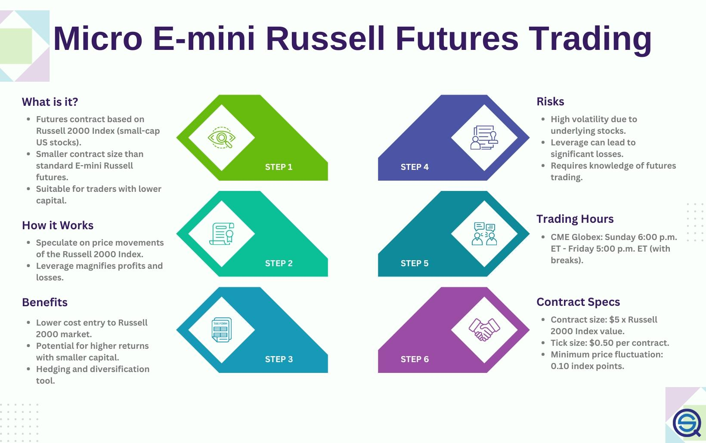

## Table of Contents

## What are Micro E-mini Russell futures?

Micro E-mini Russell futures are small contracts that let people trade the Russell 2000 index, which tracks small U.S. companies. These futures are a smaller version of the regular E-mini Russell futures, making them more affordable and easier for more people to trade. Each contract represents just one-tenth the size of the standard E-mini Russell futures, which means less money is needed to start trading.

These futures are popular because they allow traders to bet on the overall direction of the stock market without having to buy actual stocks. They can be used to hedge against other investments or to speculate on future market movements. Trading Micro E-mini Russell futures can be done through various online platforms, making it accessible for both new and experienced traders looking to diversify their portfolios.

## Why might someone choose to trade Micro E-mini Russell futures?

Someone might choose to trade Micro E-mini Russell futures because they are smaller and cheaper than regular futures. This means you don't need a lot of money to start trading. It's easier for regular people to get into trading without spending too much. Plus, these futures let you trade the Russell 2000 index, which is all about small U.S. companies. So, if you think small companies will do well, you can try to make money from that.

Another reason is that Micro E-mini Russell futures can be used to hedge or protect other investments. If you have other stocks or investments that could lose value, trading these futures can help balance that out. They can also be used to guess or speculate on where the market is going. If you think the market will go up or down, you can trade these futures to try to make a profit. It's a flexible way to trade and can be done online, making it convenient for many people.

## How does the Micro E-mini Russell differ from the standard E-mini Russell?

The Micro E-mini Russell and the standard E-mini Russell are both futures contracts that let you trade the Russell 2000 index, but they are different in size and cost. The Micro E-mini Russell is much smaller, being only one-tenth the size of the standard E-mini Russell. This makes the Micro version a lot cheaper to trade. If you want to start trading without spending a lot of money, the Micro E-mini Russell is a good choice because it's more affordable.

Another big difference is how much money you need to start trading. Because the Micro E-mini Russell is smaller, you need less money to open a position. This makes it easier for more people to trade, including those who might not have a lot of money to invest. Both types of futures let you trade the same index, but the Micro version gives you a more accessible way to get into the market and try to make money from small U.S. companies.

## What are the basic steps to start trading Micro E-mini Russell futures?

To start trading Micro E-mini Russell futures, the first thing you need to do is open an account with a futures broker. You can find many online brokers that offer futures trading. Once you pick a broker, you'll need to fill out an application and provide some personal information. After your account is approved, you'll need to deposit money into it. This money is called margin, and it's what you'll use to trade the futures.

After setting up your account, the next step is to learn how to use the trading platform your broker provides. This is where you'll place your trades. You can practice trading without risking real money by using a demo account, which many brokers offer. Once you feel ready, you can start placing real trades. When trading Micro E-mini Russell futures, you'll be betting on whether the Russell 2000 index will go up or down. If your guess is right, you can make money; if it's wrong, you could lose money. So, it's important to keep learning and stay updated on market news.

## What are some common trading strategies for Micro E-mini Russell futures?

One common strategy for trading Micro E-mini Russell futures is called [trend following](/wiki/trend-following). This means you watch the market to see if it's going up or down over time. If you see the Russell 2000 index going up, you might buy futures because you think it will keep going up. If it's going down, you might sell futures because you think it will keep going down. This strategy works well if the market keeps moving in one direction for a while.

Another strategy is called mean reversion. This is when you think the market will go back to its average price after it moves too far away. If the Russell 2000 index goes up a lot, you might think it will come back down to its normal level, so you could sell futures. If it goes down a lot, you might think it will go back up, so you could buy futures. This strategy can work well if the market tends to bounce back to its average.

A third strategy is called [scalping](/wiki/gamma-scalping). This is when you make a lot of small trades to try to make small profits quickly. You might buy and sell Micro E-mini Russell futures many times in a day, trying to make a little money each time. This strategy needs you to watch the market closely and act fast. It can be exciting but also risky because small mistakes can add up.

## How do market hours and session times affect Micro E-mini Russell trading?

Market hours and session times can really change how you trade Micro E-mini Russell futures. These futures trade almost all the time, from Sunday evening to Friday afternoon, with just a short break each day. But the times when the market is most active are during the regular U.S. stock market hours, from 9:30 AM to 4:00 PM Eastern Time. During these hours, more people are trading, which can make the market move more and create more chances to make money. But it can also be riskier because prices can change a lot.

Outside of these main hours, like in the evenings or early mornings, trading can be slower and less busy. This can be good if you want to trade without a lot of ups and downs, but it might be harder to make big profits because fewer people are trading. Knowing when the market is busy and when it's quiet can help you pick the best times to trade based on your strategy. If you like to make quick trades, you might do better during the busy times. If you want to take your time, trading outside the main hours might work better for you.

## What technical indicators are most useful for trading Micro E-mini Russell futures?

When trading Micro E-mini Russell futures, some of the most useful technical indicators are moving averages, the Relative Strength Index (RSI), and Bollinger Bands. Moving averages help you see the overall trend of the market. You can use a short-term moving average, like a 20-day one, and a long-term moving average, like a 50-day one. When the short-term average crosses above the long-term average, it might be a good time to buy because it could mean the market is starting to go up. When the short-term average crosses below the long-term average, it might be a good time to sell because it could mean the market is starting to go down.

The RSI is another helpful indicator that tells you if the market is overbought or oversold. If the RSI goes above 70, it means the market might be overbought and could go down soon. If it goes below 30, it means the market might be oversold and could go up soon. This can help you decide when to buy or sell. Bollinger Bands are also useful because they show you how much the market is moving around. When the price touches the upper Bollinger Band, it might be time to sell because the market could be too high. When the price touches the lower Bollinger Band, it might be time to buy because the market could be too low. Using these indicators together can give you a better idea of when to trade.

## How can fundamental analysis be applied to Micro E-mini Russell trading?

Fundamental analysis can help you trade Micro E-mini Russell futures by looking at the big picture of the economy and how it might affect small U.S. companies. The Russell 2000 index, which these futures track, is made up of small companies. So, you might look at things like employment rates, interest rates, and how much money people are spending. If the economy is doing well and people are buying more, small companies might do better, which could make the Russell 2000 index go up. On the other hand, if the economy is struggling, small companies might have a harder time, and the index could go down.

You can also use [fundamental analysis](/wiki/fundamental-analysis) to look at how different industries within the Russell 2000 are doing. For example, if tech companies are doing really well, and a lot of the small companies in the index are in tech, the index might go up. If industries like manufacturing or retail are struggling, it could pull the index down. By keeping an eye on economic reports and news about different industries, you can make better guesses about where the Russell 2000 index might be headed and decide when to buy or sell Micro E-mini Russell futures.

## What risk management techniques should be used when trading Micro E-mini Russell futures?

When trading Micro E-mini Russell futures, it's important to use risk management techniques to protect your money. One way to do this is by setting stop-loss orders. A stop-loss order is like a safety net that automatically sells your futures if the price drops to a certain level. This helps you limit how much money you could lose on a trade. Another technique is to only risk a small amount of your trading money on each trade. For example, you might decide to never risk more than 1% or 2% of your total money on any single trade. This way, even if you lose, you won't lose too much.

Another good risk management technique is to use position sizing. This means figuring out how many futures contracts to trade based on how much money you have and how much risk you're willing to take. If you have more money, you might trade more contracts, but if you have less, you'll trade fewer. This helps you keep your risk under control. Also, it's a good idea to keep learning and stay updated on market news. The more you know about what's happening in the economy and with small U.S. companies, the better you can guess where the Russell 2000 index might go. This can help you make smarter trading decisions and manage your risks better.

## How do economic reports and news events impact Micro E-mini Russell futures?

Economic reports and news events can really shake up Micro E-mini Russell futures. These futures follow the Russell 2000 index, which is all about small U.S. companies. When big economic reports come out, like ones about jobs, interest rates, or how much people are spending, they can change how people feel about the economy. If a report shows the economy is doing well, people might think small companies will do better too, and that can push the Russell 2000 index up. But if a report shows the economy is struggling, people might worry about small companies, and that can pull the index down.

News events can also make a big difference. For example, if there's news about new laws that help small businesses, the Russell 2000 index might go up because people think those companies will do better. On the other hand, if there's bad news, like a big company going bankrupt or a natural disaster, it can make people worried about the economy and small companies, which can make the index go down. So, keeping an eye on economic reports and news can help you guess where the Russell 2000 index might be headed and make better trading decisions with Micro E-mini Russell futures.

## What advanced strategies can be employed to optimize returns in Micro E-mini Russell trading?

One advanced strategy for optimizing returns in Micro E-mini Russell trading is called [pair trading](/wiki/pair-trading). This involves trading two related assets at the same time, like the Micro E-mini Russell futures and another index future, such as the S&P 500. You might buy Micro E-mini Russell futures if you think small companies will do better than big companies, while also selling S&P 500 futures. This way, you're betting on the difference between the two, which can help you make money even if the overall market isn't moving much. It can also help reduce risk because you're balancing out your trades.

Another strategy is using options along with futures. Options give you the right, but not the obligation, to buy or sell futures at a certain price. You can use options to protect your futures trades, which is called hedging. For example, if you own Micro E-mini Russell futures and you're worried the market might go down, you can buy put options to limit your losses. Or, if you think the market will go up a lot, you can buy call options to make more money if you're right. Using options can help you manage risk and possibly make bigger profits, but it's more complex and needs a good understanding of how options work.

## How can algorithmic trading be used to enhance Micro E-mini Russell trading strategies?

Algorithmic trading can really help make your Micro E-mini Russell trading better by using computer programs to do your trading for you. These programs can look at a lot of data really fast and make trades based on rules you set up. For example, you can tell the program to buy futures when the price goes above a certain level and sell them when it goes below another level. This can help you make trades more quickly than you could by yourself, and it can take the emotion out of trading, which can lead to better decisions.

You can also use [algorithmic trading](/wiki/algorithmic-trading) to test out different trading strategies without risking real money. You can set up the program to try different ways of trading and see which ones work best over time. This is called [backtesting](/wiki/backtesting). Once you find a strategy that works well, the program can keep using it to trade for you. This can help you find and use strategies that might make you more money and help you manage your risks better.

## What are the benefits of trading M2K futures with algorithms?

Trading M2K futures using algorithms presents a multitude of benefits, particularly in the areas of risk management, position sizing, speculation, and portfolio diversification.

### Risk Management and Position Sizing Automation

Effective risk management and optimal position sizing are critical in futures trading. Algorithms can automate these tasks, ensuring disciplined adherence to risk parameters. By defining predefined rules, algorithms adjust position sizes in real time based on market conditions and inherent risk levels. This automation minimizes human error and emotional biases, leading to more consistent trading outcomes.

For instance, an algorithm could be programmed to cap the total exposure of a trading portfolio to a certain percentage of equity, dynamically adjusting positions in M2K futures accordingly. Consider the Kelly Criterion for position sizing, a notable mathematical formula:

$$
f^* = \frac{bp - q}{b}
$$

where $f^*$ is the fraction of the capital to bet, $b$ is the odds received on the wager (i.e., the net odds received), $p$ is the probability of winning, and $q$ is the probability of losing ( $q = 1 - p$ ). Algorithms can implement such formulas to optimize the risk-to-reward ratio continually.

### Advantages for Speculative Purposes

The use of algorithms in speculative trading of M2K futures offers significant advantages. Algorithms can execute trades faster than human traders, capitalizing on fleeting market inefficiencies. They allow speculative strategies to be tested, fine-tuned, and deployed at scale without the limitations of human capability and emotional decision-making.

Speculative algorithms can analyze vast amounts of market data to identify patterns or anomalies, executing trades in milliseconds. Strategies like trend following or mean reversion can be intensively backtested on historical M2K futures data, enhancing predictive accuracy.

### Diversification Opportunities

M2K futures represent small-cap stocks within the U.S. market, offering diversification benefits to a wider investment portfolio. The small-cap sector traditionally exhibits higher [volatility](/wiki/volatility-trading-strategies) and growth potential compared to large-cap indices, providing a balance of risk-return characteristics. 

Trading M2K futures through algorithms allows investors to diversify their strategies across multiple asset classes efficiently. This diversification can be programmed into a trading algorithm to allocate capital dynamically according to pre-set criteria or real-time market conditions, spreading risk across various market sectors.

Moreover, algorithmic trading facilitates portfolio rebalancing automatically in response to market movements or changes in asset correlations, optimizing the diversification benefits of including M2K futures in an investment portfolio.

In summary, the integration of algorithms in trading M2K futures enhances risk management, optimizes speculative strategies, and increases diversification opportunities, thereby elevating the overall efficacy and potential of investment portfolios.

## References & Further Reading

[1]: Bergstra, J., Bardenet, R., Bengio, Y., & Kégl, B. (2011). ["Algorithms for Hyper-Parameter Optimization."](https://papers.nips.cc/paper/4443-algorithms-for-hyper-parameter-optimization) Advances in Neural Information Processing Systems 24.

[2]: ["Advances in Financial Machine Learning"](https://www.amazon.com/Advances-Financial-Machine-Learning-Marcos/dp/1119482089) by Marcos Lopez de Prado

[3]: ["Evidence-Based Technical Analysis: Applying the Scientific Method and Statistical Inference to Trading Signals"](https://www.amazon.com/Evidence-Based-Technical-Analysis-Scientific-Statistical/dp/0470008741) by David Aronson

[4]: ["Machine Learning for Algorithmic Trading"](https://github.com/stefan-jansen/machine-learning-for-trading) by Stefan Jansen

[5]: ["Quantitative Trading: How to Build Your Own Algorithmic Trading Business"](https://books.google.com/books/about/Quantitative_Trading.html?id=j70yEAAAQBAJ) by Ernest P. Chan