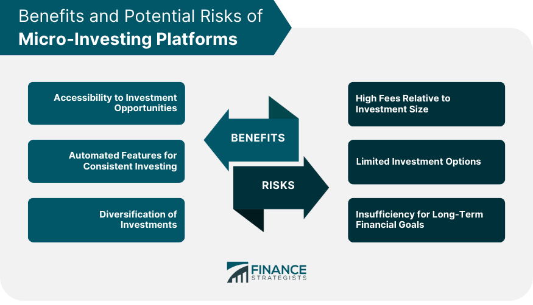

## Table of Contents

## What is micro-investing and how does it work?

Micro-investing is a way for people to start investing with small amounts of money. Instead of needing a lot of money to buy stocks or other investments, you can start with just a few dollars or even less. This makes investing easier for people who don't have a lot of money to start with. Apps and platforms that offer micro-investing often let you invest your spare change from everyday purchases or set up small, regular investments.

These platforms work by rounding up the cost of your purchases to the nearest dollar and investing the difference. For example, if you buy a coffee for $2.75, the app might round it up to $3 and invest the $0.25. Over time, these small amounts can add up. Some micro-investing apps also let you choose where your money goes, like into a mix of stocks or other investments. This way, even small investments can grow over time, helping you build wealth little by little.

## What are the benefits of using micro-investing platforms?

Micro-investing platforms make it easy for anyone to start investing, even if they don't have a lot of money. You can begin with just a few dollars or even your spare change. This is great for people who want to invest but feel like they can't because they don't have enough money to start. It helps break down the barrier that makes investing seem like it's only for rich people.

Another benefit is that micro-investing can help you get into the habit of saving and investing regularly. By setting up automatic investments, even small amounts, you can slowly build up your savings over time. This can be a good way to learn about investing without risking a lot of money. Plus, many platforms offer tools and resources to help you understand more about how investing works, which can be really helpful if you're new to it.

## How do micro-investing platforms differ from traditional investment methods?

Micro-investing platforms are different from traditional investment methods in a few key ways. The biggest difference is how much money you need to start. With traditional investing, you often need a lot of money to buy stocks or other investments. But with micro-investing, you can start with just a few dollars or even your spare change. This makes it easier for more people to get into investing, even if they don't have a lot of money to start with.

Another way they differ is how they work. Traditional investing usually means buying whole stocks or bonds, and you might need to do a lot of research to pick the right ones. Micro-investing platforms often let you invest small amounts automatically, like rounding up your purchases to the nearest dollar and investing the difference. They also often use something called fractional shares, which means you can own a small part of a stock instead of having to buy a whole one. This can make investing feel less complicated and more accessible.

## What are some popular micro-investing platforms available today?

Some popular micro-investing platforms today are Acorns, Stash, and Robinhood. Acorns is well-known for its round-up feature, where it takes the spare change from your purchases and invests it for you. It's easy to use and helps you start investing without needing a lot of money. Stash is another popular choice that lets you invest small amounts in a variety of stocks and ETFs. It also offers educational tools to help you learn more about investing as you go.

Robinhood is different because it started as a commission-free trading app but now also offers micro-investing options. With Robinhood, you can buy fractional shares, which means you can own part of a stock even if you can't afford to buy a whole one. All these platforms make it easier for people to start investing, even if they only have a little bit of money to spare. They help break down the barriers to investing and make it more accessible to everyone.

## How do micro-investing platforms generate revenue?

Micro-investing platforms make money in a few different ways. One way is by charging fees. For example, some platforms charge a monthly subscription fee, like Acorns, which might cost a few dollars each month. This fee helps the platform keep running and offering its services. Another way they make money is by taking a small cut from the interest or returns that come from the investments they manage. This is often called a management fee, and it's usually a small percentage of the money you have invested.

Another way micro-investing platforms generate revenue is through something called payment for order flow. This happens when the platform gets paid by other companies for sending them your trades. For example, Robinhood uses this method to make money. They send your trade orders to other firms, and those firms pay Robinhood for the business. This helps the platform offer services for free or at a low cost to you, the investor. So, even though you might not pay directly for each trade, the platform still makes money in other ways.

## What are the typical fees associated with micro-investing platforms?

Micro-investing platforms usually charge fees to make money. One common fee is a monthly subscription fee. For example, Acorns charges around $3 to $5 each month, depending on the plan you choose. This fee helps the platform cover its costs and keep offering its services. Another type of fee is a management fee, which is a small percentage of the money you have invested. This fee is taken from the interest or returns your investments make, so it's a way for the platform to earn money from managing your investments.

Some micro-investing platforms also make money through payment for order flow. This means they get paid by other companies for sending them your trades. Robinhood, for example, uses this method. They send your trade orders to other firms, and those firms pay Robinhood for the business. This helps Robinhood offer its services for free or at a low cost to you. So, even if you don't pay directly for each trade, the platform still makes money in other ways.

## How can someone start investing with a micro-investing platform?

To start investing with a micro-investing platform, you first need to choose a platform that fits your needs. Popular options include Acorns, Stash, and Robinhood. Once you've picked a platform, you'll need to download their app or visit their website and sign up for an account. You'll usually need to provide some personal information and link a bank account or debit card to fund your investments. After setting up your account, you can start investing right away. Some platforms let you set up automatic investments, like rounding up your everyday purchases to the nearest dollar and investing the change.

Once you're set up, you can decide how you want to invest your money. Many micro-investing platforms offer pre-made investment portfolios that are based on your goals and how much risk you're willing to take. For example, you might choose a portfolio that focuses on growth or one that's more conservative. Some platforms also let you pick specific stocks or funds to invest in. As you start investing, even small amounts can add up over time. It's a good idea to keep an eye on your investments and learn more about how they work, so you can make the best choices for your financial future.

## What are the risks involved in micro-investing?

Micro-investing, like any kind of investing, comes with some risks. One big risk is that the value of your investments can go up and down. This means you might lose money if the stocks or funds you invest in don't do well. Even though you're investing small amounts, it's still important to understand that there's no guarantee you'll make money. It's a good idea to only invest money you can afford to lose and to think about how much risk you're okay with taking.

Another risk is that micro-investing platforms charge fees, which can eat into your returns. For example, if you're paying a monthly subscription fee or a management fee, these costs can add up over time. It's important to know what fees you're paying and how they might affect your investment growth. Also, some platforms make money through payment for order flow, which can sometimes lead to less favorable trade prices for you. So, it's a good idea to do your research and pick a platform that's clear about its fees and how it makes money.

## How do micro-investing platforms handle fractional shares?

Micro-investing platforms make it easy for you to own part of a stock by using something called fractional shares. This means you can buy a small piece of a stock instead of having to buy a whole one. For example, if a stock costs $100 and you only have $10, you can still invest in that stock by buying a tenth of it. This is great because it lets you invest in expensive stocks without needing a lot of money.

These platforms handle fractional shares by dividing up the stock into smaller parts. When you invest, the platform keeps track of how much of the stock you own. If the stock goes up or down in value, your fractional share will change in value too. This way, you can still benefit from the stock's performance even if you can't afford to buy a whole share. It makes investing more accessible and helps you build a diverse portfolio with less money.

## What investment options are available on micro-investing platforms?

Micro-investing platforms offer a variety of investment options to help you start investing with small amounts of money. You can choose from pre-made portfolios that are designed based on your goals and how much risk you're comfortable with. These portfolios might include a mix of stocks, bonds, and other types of investments. Some platforms also let you invest in specific stocks or exchange-traded funds (ETFs), which are like baskets of stocks that you can buy and sell like a single stock.

Another option on many micro-investing platforms is to invest in fractional shares. This means you can buy a small part of a stock instead of having to buy a whole one. It's great for investing in expensive stocks without needing a lot of money. Some platforms also offer the chance to invest in other assets like real estate investment trusts (REITs) or even cryptocurrencies, depending on the platform. This variety helps you build a diverse investment portfolio, even if you're just starting with small investments.

## How do micro-investing platforms incorporate automated investing features?

Micro-investing platforms make it easy to invest without having to do much work yourself. They use automated investing features to help you save and invest money automatically. One common way they do this is by rounding up your everyday purchases to the nearest dollar and investing the spare change. For example, if you buy something for $2.75, the platform might round it up to $3 and invest the $0.25 for you. This way, you can start investing without even thinking about it.

Another way these platforms use automation is by setting up regular investments. You can choose to have a certain amount of money taken from your bank account and invested at set times, like every week or every month. This helps you build the habit of investing regularly, which can add up over time. Some platforms also automatically adjust your investment portfolio based on your goals and how the market is doing, so you don't have to worry about making changes yourself.

## What advanced strategies can be used on micro-investing platforms to maximize returns?

To maximize returns on micro-investing platforms, you can start by choosing the right investment mix. This means [picking](/wiki/asset-class-picking) a portfolio that matches your goals and how much risk you're okay with. Some platforms let you choose between different types of portfolios, like ones that focus on growth or ones that are more conservative. If you're comfortable with more risk, you might want to go for a growth-focused portfolio that includes more stocks. Over time, as you learn more, you can start picking specific stocks or funds that you think will do well. This can help you take advantage of different opportunities in the market and potentially earn more money.

Another strategy is to use the automated features of the platform wisely. Many platforms let you set up regular investments, so you can invest a little bit of money every week or month. This helps you build the habit of saving and investing, and it can add up over time. You can also use the round-up feature to invest your spare change from everyday purchases. By combining these small, regular investments with a well-chosen portfolio, you can slowly build up your investments and potentially see better returns. Remember, though, that all investing comes with risk, so it's important to only invest money you can afford to lose and to keep learning about how investing works.

## References & Further Reading

[1]: Deloitte. (2021). ["The Deloitte Wealth Management Centre Ranking 2021."](https://www2.deloitte.com/sg/en/pages/financial-services/articles/wealth-management-centre-ranking-2021.html) Deloitte.

[2]: PwC. (2020). ["Embracing the Future: How Financial Service Companies Can Harness FinTech Innovation."](https://www.pwc.com/gx/en/financial-services/assets/pdf/technology2020-and-beyond.pdf) PricewaterhouseCoopers.

[3]: Lopez de Prado, M. (2018). ["Advances in Financial Machine Learning."](https://www.amazon.com/Advances-Financial-Machine-Learning-Marcos/dp/1119482089) John Wiley & Sons.

[4]: Chan, E. (2008). ["Quantitative Trading: How to Build Your Own Algorithmic Trading Business."](https://github.com/ftvision/quant_trading_echan_book) John Wiley & Sons.

[5]: Jansen, S. (2020). ["Machine Learning for Algorithmic Trading: Second Edition."](https://www.amazon.com/Machine-Learning-Algorithmic-Trading-alternative/dp/1839217715) Packt Publishing.