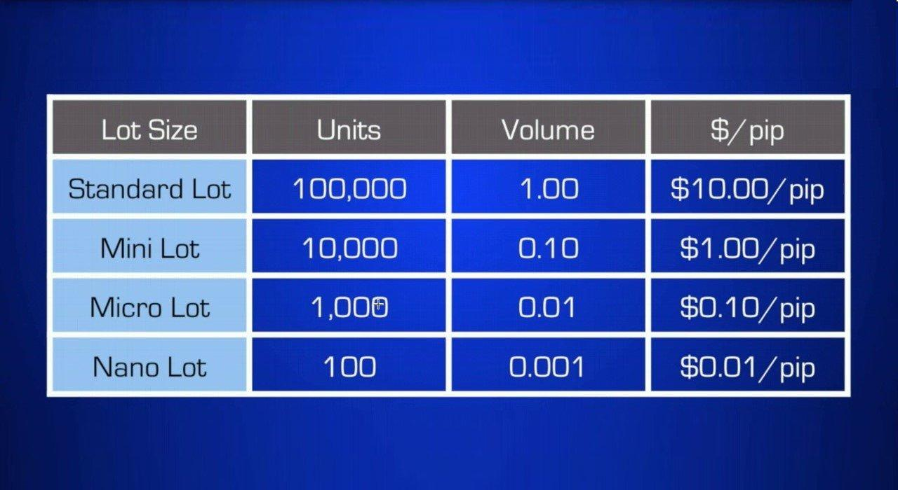

## Table of Contents

## What is a micro lot in trading?

A micro lot in trading is a small unit of currency that traders can buy or sell. It is equal to 1,000 units of the base currency in a forex trade. For example, if you are trading the EUR/USD pair, a micro lot would be 1,000 euros. This size is much smaller than a standard lot, which is 100,000 units, making it easier for traders with less capital to participate in the market.

Using micro lots is great for beginners or those who want to trade with less risk. Because the size of the trade is smaller, the amount of money you can lose or gain is also smaller. This allows traders to practice their strategies and get comfortable with the market without risking too much money. It's a good way to learn and grow as a trader.

## What is a standard lot in trading?

A standard lot in trading is a big unit of currency that traders use to buy or sell. It is equal to 100,000 units of the base currency in a forex trade. For example, if you are trading the EUR/USD pair, a standard lot would be 100,000 euros. This size is much larger than a micro lot, which is only 1,000 units, and it's used by traders who have more money to invest and are willing to take on more risk.

Using standard lots can be good for experienced traders who want to make bigger trades and potentially earn more money. However, it also means that the amount of money you can lose or gain is much larger. This makes it important for traders to be careful and have a good understanding of the market before using standard lots. It's a way for traders to make bigger moves in the market, but it comes with higher risks.

## How do micro lots and standard lots differ in size?

Micro lots and standard lots are different in how much of a currency you can trade. A micro lot is a small amount, just 1,000 units of the base currency. For example, if you're trading the EUR/USD pair, a micro lot means you're trading 1,000 euros. This size is good for people who are new to trading or don't want to risk a lot of money.

On the other hand, a standard lot is much bigger. It's 100,000 units of the base currency. So, if you're trading the EUR/USD pair with a standard lot, you're dealing with 100,000 euros. This size is better for experienced traders who have more money to invest and are okay with taking bigger risks. The main difference is that standard lots let you trade much larger amounts than micro lots.

## What are the advantages of trading with micro lots for beginners?

Trading with micro lots is great for beginners because it lets them start with small amounts of money. If you're new to trading, you might not want to risk a lot of money right away. With micro lots, you can trade just 1,000 units of a currency, which means you won't lose a lot if things don't go your way. This small size helps you learn the ropes without worrying about big losses.

Another advantage is that micro lots help you practice your trading strategies. When you're starting out, it's important to try different ways of trading to see what works best for you. Since micro lots are small, you can make more trades and test your ideas without using up all your money. This way, you can get better at trading and feel more confident before you start using bigger amounts.

## How does the use of standard lots affect potential profits and losses?

When you trade with standard lots, you're dealing with a lot more money than with micro lots. A standard lot is 100,000 units of the base currency, so if you're trading EUR/USD, you're trading 100,000 euros. This means your potential profits can be much bigger because you're moving more money around. If the market moves in your favor, you could make a lot more money than you would with a smaller lot size.

But, the flip side is that your potential losses are also much bigger. Since you're trading such a large amount, even a small change in the market can lead to big losses. This makes standard lots riskier, and it's important for traders to be careful and really understand the market before using them. It's not just about the chance to make more money; it's also about being ready to handle bigger losses if things don't go your way.

## Can you explain the impact of leverage when trading micro lots versus standard lots?

Leverage is like borrowing money from your broker to make bigger trades. When you trade micro lots, which are small at 1,000 units, using leverage can still let you control a bigger position without needing a lot of your own money. For example, with a leverage of 1:100, you can control a $100,000 position with just $1,000. This means you can make bigger profits if the market moves your way, but you can also lose more than you put in if it goes against you. So, even with small micro lots, leverage can make your trades riskier.

When you trade standard lots, which are much bigger at 100,000 units, leverage has an even bigger impact. With the same 1:100 leverage, you'd need $1,000 to control a $100,000 position, but now you're dealing with a lot more money. This means your potential profits and losses are much larger. If the market moves in your favor, you could make a lot more money, but if it goes against you, you could lose a lot more too. So, using standard lots with leverage can be very risky, and it's important to be careful and understand the market well.

## What are the typical minimum account balances required to trade micro lots and standard lots?

To trade micro lots, you usually need a smaller amount of money in your trading account. Most brokers let you start trading micro lots with a minimum account balance of around $50 to $100. This low amount makes it easier for beginners to get started because they don't need a lot of money upfront. With micro lots, you can trade small amounts like 1,000 units of a currency, which helps you learn and practice without risking too much.

Trading standard lots requires a much bigger minimum account balance. Brokers often ask for at least $1,000 to $2,000 to start trading standard lots. This is because standard lots are much larger, at 100,000 units of a currency, so you need more money to cover potential losses. Standard lots are better for experienced traders who have more money to invest and are comfortable with the higher risks that come with trading larger amounts.

## How do brokers' commission structures vary between micro and standard lot trading?

Brokers often have different commission structures for trading micro lots and standard lots. When you trade micro lots, which are small at 1,000 units, brokers might charge a fixed commission per trade or include the commission in the spread, which is the difference between the buy and sell price. Because micro lots are smaller, the commissions are usually lower, making it easier for beginners to start trading without spending a lot on fees.

For standard lots, which are much bigger at 100,000 units, the commission structure can be different. Brokers might charge a higher fixed commission per trade or a commission based on the size of the trade. Since standard lots involve trading larger amounts, the commissions can be higher, but they might also be negotiable for traders who trade a lot. This means experienced traders need to be aware of the costs and how they can affect their profits and losses.

## In what scenarios would an experienced trader choose to use micro lots over standard lots?

An experienced trader might choose to use micro lots over standard lots when they want to test a new trading strategy. Since micro lots are smaller, they let the trader try out new ideas without risking a lot of money. This can be really helpful when the market is moving in unpredictable ways or when the trader is not sure how a new strategy will work. By using micro lots, the trader can learn and adjust their approach without big losses.

Another scenario where an experienced trader might prefer micro lots is when they want to manage their risk better. Even though they are experienced, they might not want to put all their money into one big trade. Using micro lots allows them to spread their money across more trades, which can help them stay safer if the market goes against them. This way, they can keep trading without losing too much money at once.

## What are the psychological impacts of trading with different lot sizes?

Trading with different lot sizes can affect how you feel and think while trading. When you trade with micro lots, which are small, you might feel less stressed because you're not risking a lot of money. This can make you feel more relaxed and confident, especially if you're new to trading. You can try different things and learn without worrying too much about losing a big amount. This smaller size can help you stay calm and make better decisions because the pressure is lower.

On the other hand, trading with standard lots, which are much bigger, can make you feel more nervous and stressed. Since you're dealing with a lot more money, the risk of losing a big amount is higher. This can make you feel more pressure and might cause you to make quick decisions that you might not make if you were trading smaller amounts. Experienced traders might feel this pressure too, but they might be better at handling it because they know the market well. Still, the size of the trade can affect how you feel and think, no matter how experienced you are.

## How do market volatility and lot size influence trading strategy?

Market [volatility](/wiki/volatility-trading-strategies) and lot size can really change how you trade. When the market is moving a lot, it's more unpredictable. If you're trading with micro lots, which are small, you might feel okay with this because you're not risking a lot of money. You can try different things and see how the market reacts without worrying too much. But if you're using standard lots, which are big, the same market moves can make you feel more nervous. You might want to be more careful and maybe not trade as much because the risk of losing a lot of money is higher.

Your trading strategy can also change based on how big your lots are. With micro lots, you might decide to trade more often because each trade is small and you can learn from your mistakes without losing too much. This can help you get better at trading over time. But with standard lots, you might choose to trade less often and be more careful about when you trade. You might look for times when the market is less likely to move a lot, so you can feel safer about your big trades. So, both market volatility and lot size can make you think differently about how and when to trade.

## What are some advanced risk management techniques when dealing with micro and standard lots?

When trading with micro lots, one advanced risk management technique is to use stop-loss orders. A stop-loss order is like a safety net that automatically closes your trade if the market moves against you by a certain amount. Since micro lots are small, you can set tight stop-losses to limit your losses without getting out of the trade too soon. Another technique is to use position sizing, where you decide how much of your account to risk on each trade. With micro lots, you can spread your money across many trades, which helps you stay in the game even if some trades go bad.

For standard lots, risk management gets more important because you're dealing with a lot more money. One technique is to use a smaller percentage of your account for each trade. For example, instead of risking 2% of your account on a micro lot trade, you might only risk 0.5% on a standard lot trade. This way, even if you lose, you won't lose too much of your money. Another technique is to use hedging, where you open another trade that can help you make money if the market moves against your main trade. This can be tricky but can help you manage the bigger risks that come with trading standard lots.

## References & Further Reading

[1]: Bergstra, J., Bardenet, R., Bengio, Y., & Kégl, B. (2011). ["Algorithms for Hyper-Parameter Optimization."](https://papers.nips.cc/paper/4443-algorithms-for-hyper-parameter-optimization) Advances in Neural Information Processing Systems 24.

[2]: ["Advances in Financial Machine Learning"](https://www.amazon.com/Advances-Financial-Machine-Learning-Marcos/dp/1119482089) by Marcos Lopez de Prado

[3]: ["Evidence-Based Technical Analysis: Applying the Scientific Method and Statistical Inference to Trading Signals"](https://www.amazon.com/Evidence-Based-Technical-Analysis-Scientific-Statistical/dp/0470008741) by David Aronson

[4]: ["Machine Learning for Algorithmic Trading"](https://github.com/PacktPublishing/Machine-Learning-for-Algorithmic-Trading-Second-Edition) by Stefan Jansen

[5]: ["Quantitative Trading: How to Build Your Own Algorithmic Trading Business"](https://www.amazon.com/Quantitative-Trading-Build-Algorithmic-Business/dp/1119800064) by Ernest P. Chan