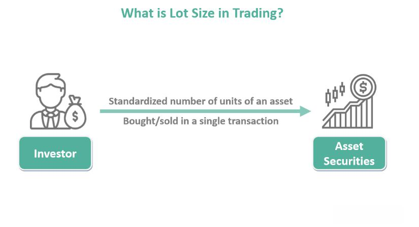

Understanding lot sizes is crucial for managing risk and optimizing trading strategies in forex trading. Both new and experienced traders must choose between different lot sizes, such as standard and micro lots, to tailor their trades according to their financial situations and risk tolerance. As forex trading is highly dynamic, mastering these concepts is integral for success. This article explores standard lot trading, micro lot trading, and the role of algorithmic trading in enhancing these strategies. By examining the benefits and limitations of different lot sizes, traders can make informed decisions about their positions. We will also discuss how leveraging technology, specifically algorithmic trading, can maximize profit opportunities by providing consistent execution and minimizing emotional biases. With a comprehensive understanding of these elements, traders can effectively navigate the complexities of forex markets and enhance their trading outcomes.

## Table of Contents



## Understanding Forex Lot Sizes

Forex trading involves various lot sizes, each tailored to specific trading goals and risk management strategies. Understanding these different lot sizes is fundamental for traders to align their trades with their financial circumstances and risk tolerance levels. The commonly utilized lot sizes in forex trading are standard lots, mini lots, micro lots, and nano lots.

A standard lot represents 100,000 units of the base currency. This large volume is commonly chosen by experienced traders who possess significant capital and are comfortable with higher levels of risk. Standard lot trading allows for considerable potential profits but also comes with the risk of substantial losses, necessitating strong risk management skills.

Mini lots, consisting of 10,000 units of the base currency, are often preferred by traders with an intermediate level of experience and a moderate risk appetite. This lot size offers a balanced approach, providing opportunity for meaningful market participation while cushioning against the volatility one would experience with a standard lot.

Micro lots, representing 1,000 units of the base currency, cater to those new to forex trading or wishing to reduce financial exposure. By trading in smaller increments, newcomers can gain valuable market experience and develop trading strategies without facing the high risk associated with larger lot sizes. Micro lots also allow for more granular control over position sizing.

For traders with very small accounts or who wish to trade with minimal risk, some forex brokers offer nano lots, consisting of 100 units of the base currency. Nano lots are particularly useful for testing new strategies or trading in volatile markets without substantial financial exposure. While not as widely offered as other lot sizes, they provide a valuable option for ultra-low risk trading.

Choosing the appropriate lot size is a crucial step in establishing a successful trading strategy, as it directly impacts how a trader manages risk and [volatility](/wiki/volatility-trading-strategies) in the [forex](/wiki/forex-system) market.

## Standard Lot Trading

Trading in standard lots allows traders to leverage high positions and potentially increase their profitability. A standard lot, involving 100,000 units of the base currency, is primarily utilized by experienced traders due to its substantial size and impact on both profits and losses. When engaging in forex markets with standard lots, even small price movements can lead to significant financial outcomes, necessitating careful risk management.

The high stakes nature of standard lot trading means that it magnifies profits when the market moves favorably. For example, if a trader is dealing with the EUR/USD currency pair and the exchange rate moves by 1 pip (0.0001), the change in value for a standard lot is approximately $10. This calculation arises because one pip in a standard lot equates to $10 in most major currency pairs.

However, the amplification of potential profits also translates into increased risks of losses. Rapid adverse movements can deplete account balances swiftly, thus standard lot trading is generally advisable only for those with ample risk capital and a sound understanding of market dynamics.

For successful standard lot trading, maintaining a substantial account balance is often necessary. This financial buffer not only supports larger position sizes but also provides room to weather market volatility without forcing premature closes on positions, which can lead to realized losses. Risk management strategies become a crucial component for traders to ensure that their exposure remains aligned with market conditions and their financial goals.

Those who engage in standard lot trading typically implement thorough analysis and refined trading strategies. Such traders often use technical, fundamental, or a combination of analytical methods to predict market movements and establish entry and [exit](/wiki/exit-strategy) points, thereby maximizing the chances of profitable trades while minimizing potential risks.

## Micro Lot Trading

Micro lot trading in the forex market focuses on trading positions composed of 1,000 units of the base currency. This smaller lot size is an effective way for novice traders to access the forex market while minimizing financial exposure and associated risks. This approach aligns well with beginners who need to build confidence and hone their trading skills without the pressure of managing large capital.

One of the primary advantages of micro lot trading is the capacity for precise position sizing. Traders can adjust their positions with greater granularity, allowing them to test various strategies within real market settings. This feature is particularly beneficial for developing and refining trading strategies before increasing trading volumes.

Moreover, micro lot trading is not limited to novices; experienced traders find it useful for diversifying their trades and testing new trading algorithms. By engaging in micro lot trading, experienced traders can experiment with minimal risk, ensuring that their primary capital remains safeguarded while exploring potential strategies.

The potential losses incurred from trading micro lots are significantly lower compared to larger lot sizes such as mini or standard lots. This reduction in potential loss allows traders to maintain a comfort zone and focus on the mechanics of trading rather than the emotional toll of larger losses. This environment encourages learning and experimentation, essential components for developing a successful trading career in forex.

In summary, micro lot trading serves as a foundation for both new and seasoned traders, offering a controlled environment where risk is minimized while still providing the opportunity to experience the dynamics of the forex market.

## Algorithmic Trading in Forex

Algorithmic trading, commonly known as algo trading, is the process of using computer programs to execute trades based on a set of pre-defined criteria. In the forex market, this approach allows traders to enhance trading efficiency and effectiveness. By using algorithms, traders can implement complex strategies, perform rapid calculations, and execute trades at speeds far beyond human capabilities, thus enabling precise entry and exit points in the market.

A significant advantage of [algorithmic trading](/wiki/algorithmic-trading) lies in its ability to minimize the impact of human emotions and errors in decision-making. By automating trade decisions, traders can ensure consistency and discipline across standard and micro lot trading. This is particularly beneficial in environments where high-frequency trades are the norm and market conditions can change rapidly.

Algorithmic trading strategies might include statistical [arbitrage](/wiki/arbitrage), [trend following](/wiki/trend-following), and mean reversion, among others. These strategies are based on quantitative analysis and mathematical models, which can analyze vast amounts of market data to recognize profitable trading opportunities. This computational prowess enables the execution of strategies that require fast and precise operations. For instance, an algorithm might be designed to buy a currency when certain moving averages converge or to sell when a specific [momentum](/wiki/momentum) indicator reaches a threshold.

The use of algorithms also allows traders to backtest strategies against historical data to evaluate their effectiveness before applying them in live trading. Backtesting can help refine strategies to ensure they are robust under various market conditions. Algorithms can be coded in languages such as Python, which is popular for its extensive libraries and ease of handling data. 

Here is an example using Python for a simple moving average crossover strategy:

```python
import pandas as pd

def moving_average_crossover_strategy(data, short_window=10, long_window=50):
    data['short_mavg'] = data['Close'].rolling(window=short_window, min_periods=1).mean()
    data['long_mavg'] = data['Close'].rolling(window=long_window, min_periods=1).mean()

    data['signal'] = 0
    data['signal'][short_window:] = np.where(
        data['short_mavg'][short_window:] > data['long_mavg'][short_window:], 1, -1
    )

    data['position'] = data['signal'].diff()

    return data

# Assuming 'forex_data' is a DataFrame with historical forex price data including a 'Close' column
strategy = moving_average_crossover_strategy(forex_data)
```

This script sets up a strategy using two moving averages—a short-term and a long-term one—to generate trading signals. The signal is positive when the short-term moving average is above the long-term average, indicating a buy signal, and negative otherwise, indicating a sell signal. The 'position' column helps identify changes in these signals and decide on new trades.

In summary, algorithmic trading in forex offers the ability to execute complex and effective trading strategies swiftly, all while reducing the potential for human error. Its application to both standard and micro lot trading makes it a versatile tool for traders with different risk appetites and experience levels.

## Integrating Algo Trading with Different Lot Sizes

Using algorithmic trading with different lot sizes offers tailored solutions that can accommodate a wide range of trading goals and risk profiles. In the context of standard lot trading, algorithms provide a powerful tool for identifying high-probability trades while managing significant exposure efficiently. This is achieved by utilizing algorithms that can process large volumes of data in real time, identifying patterns and trends that may not be immediately apparent to human traders. These algorithms can swiftly execute trades based on predefined criteria, allowing traders to capitalize on favorable market conditions while mitigating the risk of large losses common with substantial lot sizes. For instance, traders can implement algorithms to identify technical indicators such as moving averages or RSI (Relative Strength Index) crossovers to recognize optimal entry and exit points.

In micro lot trading, algorithms are equally valuable by enabling traders to backtest and refine strategies within a low-risk environment. Given the smaller financial commitment associated with micro lots, traders can employ algorithmic trading for experimentation and learning without the fear of incurring large losses. Algorithms can be used to simulate thousands of potential trades using historical data, refining trading strategies based on statistical performance metrics. The reduced financial exposure inherent in micro lot trading makes it an ideal playground for traders to evaluate new algorithms or strategies before scaling up to larger lot sizes. 

Furthermore, traders can program algorithms to automatically adjust lot sizes in response to dynamic market conditions and account balances. This flexibility allows for a responsive trading approach where risk exposure is meticulously controlled. By setting specific rules within the algorithm, such as adjusting the lot size based on the volatility index (VIX) or altering exposure when account equity increases or decreases by a certain percentage, traders can ensure their trading activities are aligned with their risk tolerance and market conditions. An example of a simple Python snippet for adjusting lot sizes based on account balance could be:

```python
def adjust_lot_size(account_balance, base_lot_size):
    # Define thresholds for adjusting lot sizes
    increase_threshold = 20000
    decrease_threshold = 10000
    lot_size_multiplier = 0.1

    # Adjust the lot size based on account balance
    if account_balance >= increase_threshold:
        return base_lot_size * (1 + lot_size_multiplier)
    elif account_balance <= decrease_threshold:
        return base_lot_size * (1 - lot_size_multiplier)
    else:
        return base_lot_size

# Example usage
current_balance = 15000
base_lot = 1.0
new_lot_size = adjust_lot_size(current_balance, base_lot)
```

By integrating algorithmic trading with varying lot sizes, forex traders can exploit the advantages of both technology and financial management to achieve optimal trading performance. This integration maximizes profit opportunities while ensuring that risk is consistently monitored and controlled across different trading scenarios.

## Conclusion

Choosing the right lot size is crucial in forex trading for optimizing profits and managing risk. Traders must carefully select between different lot sizes, such as standard and micro lots, to align their trading strategies with their risk tolerance levels. Standard lots, comprising 100,000 units of currency, cater to traders who possess significant capital and are comfortable with higher exposure. On the other hand, micro lots, representing 1,000 units, are suitable for those who prefer to trade with less risk and capital.

Integrating algorithmic trading into the process offers significant advantages in terms of execution efficiency, consistency, and reducing emotional biases. Algorithms, through predefined criteria, enable precise decision-making at speeds beyond human capability, enhancing the effectiveness of trades. This approach is beneficial for both risk-tolerant and cautious traders, as it allows for real-time adjustments based on market conditions and account balances.

Embracing the interplay between appropriate lot sizing and algorithmic trading can vastly influence trading success. By leveraging technology and understanding one’s financial position and risk appetite, traders can navigate the complexities of the forex market more effectively, optimizing their chances of achieving desired financial outcomes.

## References & Further Reading

[1]: Bergstra, J., Bardenet, R., Bengio, Y., & Kégl, B. (2011). ["Algorithms for Hyper-Parameter Optimization."](https://papers.nips.cc/paper/4443-algorithms-for-hyper-parameter-optimization) Advances in Neural Information Processing Systems 24.

[2]: ["Advances in Financial Machine Learning"](https://www.amazon.com/Advances-Financial-Machine-Learning-Marcos/dp/1119482089) by Marcos Lopez de Prado

[3]: ["Evidence-Based Technical Analysis: Applying the Scientific Method and Statistical Inference to Trading Signals"](https://www.amazon.com/Evidence-Based-Technical-Analysis-Scientific-Statistical/dp/0470008741) by David Aronson

[4]: ["Machine Learning for Algorithmic Trading"](https://github.com/PacktPublishing/Machine-Learning-for-Algorithmic-Trading-Second-Edition) by Stefan Jansen

[5]: ["Quantitative Trading: How to Build Your Own Algorithmic Trading Business"](https://www.amazon.com/Quantitative-Trading-Build-Algorithmic-Business/dp/1119800064) by Ernest P. Chan