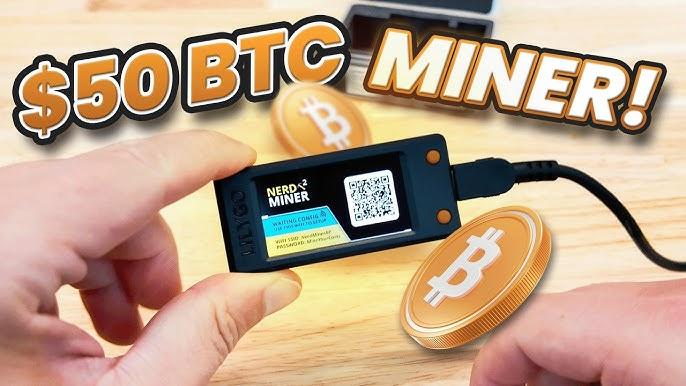

## Table of Contents

## What is micro mining in cryptocurrency?

Micro mining in cryptocurrency refers to the process of mining small amounts of cryptocurrency using minimal resources. Unlike traditional mining, which often requires powerful and expensive equipment, micro mining can be done with everyday devices like smartphones or low-power computers. This makes it more accessible to people who might not have the resources for large-scale mining operations. By using these smaller devices, people can still participate in the mining process and earn small amounts of cryptocurrency over time.

The concept of micro mining is particularly appealing because it democratizes the mining process. It allows more people to get involved in cryptocurrency without needing to invest a lot of money upfront. However, the rewards from micro mining are generally smaller compared to traditional mining. This means it might take longer to earn a significant amount of cryptocurrency. Still, for those interested in the technology and wanting to contribute to the network, micro mining offers a low-barrier entry point into the world of cryptocurrency.

## How does micro mining differ from traditional mining?

Micro mining and traditional mining are two different ways to earn cryptocurrency. Micro mining uses small devices like smartphones or low-power computers. It doesn't need a lot of power or special equipment. This makes it easy for anyone to start mining without spending much money. On the other hand, traditional mining uses big, powerful machines that can be very expensive. These machines need a lot of electricity and can only be used for mining.

The amount of [cryptocurrency](/wiki/cryptocurrency) you can earn is different too. With micro mining, you earn small amounts of cryptocurrency over time. It's like saving a little bit of money every day. Traditional mining can earn you more cryptocurrency, but it takes a lot more work and money to set up. Micro mining is good for people who want to try mining without a big investment, while traditional mining is for those who can afford to spend more and want to earn more cryptocurrency faster.

## What are the basic requirements to start micro mining?

To start micro mining, you need a device like a smartphone or a low-power computer. These devices should be able to connect to the internet and run a mining app or software. You also need to choose a cryptocurrency that supports micro mining. Some popular ones are Bitcoin, Ethereum, and Litecoin. Make sure you have a wallet to store the cryptocurrency you earn.

Once you have your device and wallet set up, you need to download and install the mining app or software. These programs are usually free and easy to find online. After installing the software, you can start mining right away. Just remember that micro mining earns you small amounts of cryptocurrency, so it might take some time to see big results. But it's a simple way to get started with mining without spending a lot of money.

## Can micro mining be profitable for beginners?

Micro mining can be profitable for beginners, but it depends on a few things. It's good for people who want to start mining without spending a lot of money. You can use your smartphone or a small computer to mine small amounts of cryptocurrency. Over time, these small amounts can add up. But remember, it might take a long time to earn a lot of cryptocurrency this way.

The profit you make from micro mining also depends on the price of the cryptocurrency you are mining. If the price goes up, the small amounts you earn can become more valuable. But if the price goes down, it might not be worth it. So, for beginners, micro mining is a good way to learn about cryptocurrency and mining without a big investment. Just be patient and keep an eye on the market.

## What are the most common cryptocurrencies suitable for micro mining?

The most common cryptocurrencies suitable for micro mining are Bitcoin, Ethereum, and Litecoin. These cryptocurrencies have been around for a while and have strong networks that support mining. Bitcoin is the most well-known and widely used, but it can be hard to mine with small devices because it needs a lot of computing power. Ethereum is another popular choice because it's easier to mine with smaller devices and has a lot of people using it. Litecoin is similar to Bitcoin but is designed to be mined more easily, making it a good option for micro mining.

When choosing a cryptocurrency for micro mining, it's important to think about how much power your device can use and how much cryptocurrency you can earn. Bitcoin might not be the best choice for micro mining because it needs a lot of power, but you can still try it if you have a good device. Ethereum and Litecoin are better options because they are easier to mine with smaller devices. No matter which cryptocurrency you choose, remember that micro mining earns you small amounts over time, so it might take a while to see big results.

## How does the energy consumption of micro mining compare to large-scale mining?

Micro mining uses a lot less energy than large-scale mining. When you micro mine, you use small devices like smartphones or low-power computers. These devices don't need a lot of power to work, so they use less electricity. This makes micro mining a good choice for people who want to save on energy costs and help the environment by using less power.

Large-scale mining, on the other hand, uses big machines that need a lot of electricity. These machines are made just for mining and can use as much power as a whole house. Because they use so much energy, large-scale mining can be expensive and not good for the environment. So, if you want to mine cryptocurrency without using a lot of energy, micro mining is the better choice.

## What software and hardware are recommended for efficient micro mining?

For efficient micro mining, you should use a smartphone or a small computer as your hardware. Smartphones are easy to use and don't need a lot of power. A small computer like a Raspberry Pi can also work well because it uses less electricity than a big computer. Make sure your device can connect to the internet so you can mine cryptocurrency.

For software, you need to download a mining app or program. Some good apps for smartphones are MinerGate and Crypto Miner. If you are using a computer, you can try software like EasyMiner or CGMiner. These programs are free and easy to set up. They will help you start mining right away without needing a lot of technical knowledge.

## What are the security risks associated with micro mining?

Micro mining can be risky because you need to download apps or software to mine cryptocurrency. These apps can sometimes have viruses or other bad things in them. If you download a bad app, it could steal your personal information or damage your device. It's important to only download apps from trusted places and to check reviews from other users to make sure the app is safe.

Another risk is that some mining apps might ask for access to your device's data or settings. If you give them too much access, they could use your device for other things without you knowing. Always be careful about what permissions you give to apps and make sure you understand what they are asking for. By being careful and using safe apps, you can lower the risks of micro mining.

## How can one optimize the performance of a micro mining setup?

To optimize the performance of a micro mining setup, you should first choose the right hardware. A smartphone or a small computer like a Raspberry Pi works well because they use less power. Make sure your device is always connected to the internet and has enough storage space. Also, keep your device cool because mining can make it hot, and overheating can slow it down. If you can, use a device with a good processor to mine faster.

Next, pick the right software for your device. Apps like MinerGate and Crypto Miner are good for smartphones, while EasyMiner and CGMiner work well on computers. Make sure the software is set up correctly and is always updated to the latest version. This can help you mine more efficiently. Also, try to mine during times when the network is less busy, as this can help you earn more cryptocurrency. By choosing the right hardware and software, and keeping everything running smoothly, you can get the most out of your micro mining setup.

## What are the legal and regulatory considerations for micro mining?

When you start micro mining, it's important to know the rules in your country or area. Some places have laws about mining cryptocurrency, and you need to follow them. For example, some countries might need you to pay taxes on the cryptocurrency you earn from mining. It's a good idea to check with your local government or a lawyer to make sure you're doing everything right. Not following the rules can get you in trouble, so it's better to be safe and know the laws before you start.

Also, think about how micro mining might affect your electricity bill. Some places have rules about how much electricity you can use, and mining can use a lot, even if you're using a small device. If you use too much, you might have to pay more or even get in trouble. It's good to look at your energy use and see if micro mining fits within the rules where you live. By understanding the legal and regulatory considerations, you can mine cryptocurrency without any problems.

## How does the scalability of micro mining operations work?

Scalability in micro mining means how easily you can grow your mining operation. If you start with just one smartphone or a small computer, you can add more devices over time to mine more cryptocurrency. This is easy because you don't need special equipment or a lot of money to start. You can keep adding more devices as you go, and each one will help you earn a little more. But remember, the more devices you use, the more electricity you'll need, so you have to think about your energy costs and the rules in your area.

As you add more devices, you also need to make sure they all work well together. You might need to use software that can manage multiple devices at once. This can help you mine more efficiently and keep track of how much cryptocurrency you're [earning](/wiki/earning-announcement). But even with more devices, micro mining will still earn you small amounts compared to big mining operations. So, while it's easy to scale up, it might take a long time to earn a lot of cryptocurrency this way.

## What advanced strategies can experts use to maximize returns from micro mining?

Experts can maximize returns from micro mining by carefully choosing which cryptocurrencies to mine. They should look at the market and pick cryptocurrencies that are likely to go up in value. This means keeping an eye on news and trends to see which ones might be good to mine. Also, experts can use different mining software to see which one works best on their devices. By trying out different software, they can find the one that mines the most cryptocurrency with the least amount of power.

Another strategy is to mine during times when the network is less busy. This can help them earn more cryptocurrency because there's less competition. Experts can also join mining pools, where many people work together to mine. This can help them earn more because they share the rewards with others. By using these strategies, experts can make the most out of their micro mining setup and increase their chances of earning more cryptocurrency.

## References & Further Reading

[1]: Antonopoulos, A. M. (2017). ["Mastering Bitcoin: Unlocking Digital Cryptocurrencies."](https://books.google.com/books/about/Mastering_Bitcoin.html?id=IXmrBQAAQBAJ) O'Reilly Media.

[2]: Narayanan, A., Bonneau, J., Felten, E., Miller, A., & Goldfeder, S. (2016). ["Bitcoin and Cryptocurrency Technologies: A Comprehensive Introduction."](https://press.princeton.edu/books/hardcover/9780691171692/bitcoin-and-cryptocurrency-technologies) Princeton University Press.

[3]: Peters, G. W., & Panayi, E. (2016). "Understanding Modern Banking Ledgers through Blockchain Technologies: Future of Transaction Processing and Smart Contracts on the Internet of Money." In: Tasca P. et al. (eds) Banking Beyond Banks and Money, Springer.

[4]: Biais, B., Bisière, C., Bouvard, M., & Casamatta, C. (2019). ["The Blockchain Folk Theorem."](https://www.jstor.org/stable/48568938) Journal of Economic Theory, 177, 1-23.

[5]: Davis, J. (2011). ["The Crypto-Currency: Bitcoin and its mysterious inventor."](https://www.newyorker.com/magazine/2011/10/10/the-crypto-currency) The New Yorker.

[6]: [Nakamoto, S. (2008). "Bitcoin: A Peer-to-Peer Electronic Cash System."](https://nakamotoinstitute.org/library/bitcoin/)  

[7]: Silver, N. (2012). ["The Signal and the Noise: Why So Many Predictions Fail—but Some Don't."](https://onlinelibrary.wiley.com/doi/abs/10.1111/risa.12177) Penguin Press.