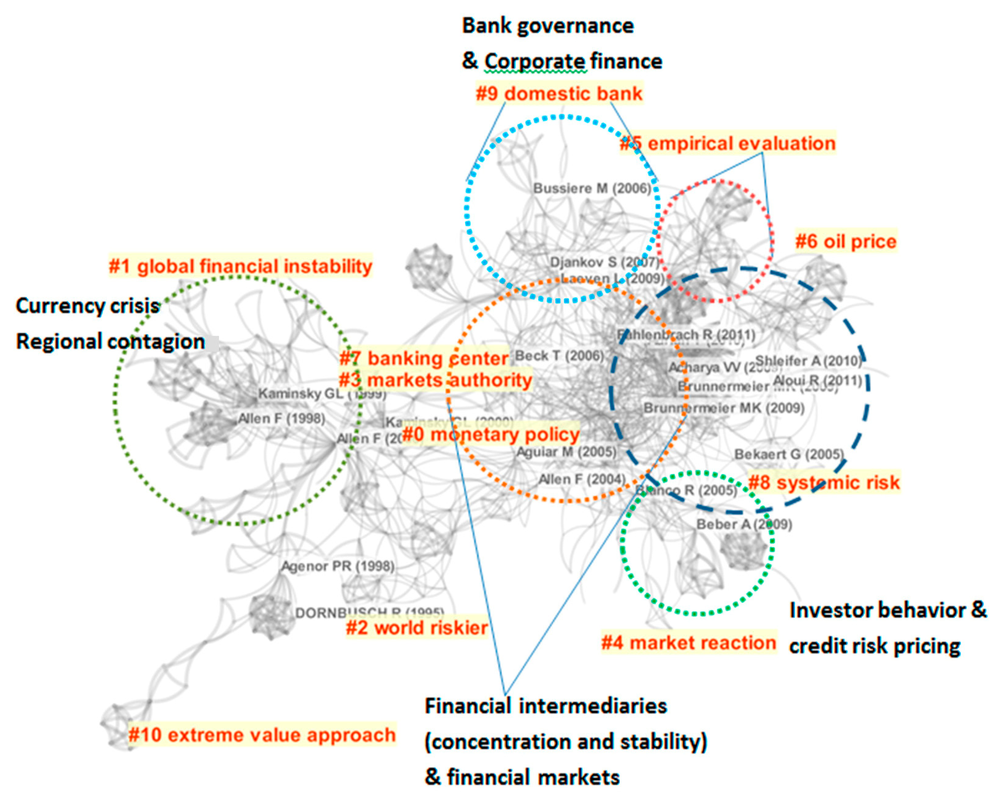

## Table of Contents

## What is micro risk?

Micro risk refers to the small, specific risks that can affect a single company or a small group of companies. These risks can come from things like a company's management making bad decisions, a new competitor entering the market, or a product failing. For example, if a company's main product is found to be unsafe, it could face a lot of lawsuits and lose customers, which would be a micro risk for that company.

On the other hand, micro risks are different from macro risks, which affect a whole industry or the entire economy. While macro risks, like a recession or a change in government policy, can impact many companies at once, micro risks are more focused and usually only affect one company or a small number of companies. Understanding micro risks is important for investors and managers because it helps them make better decisions about where to put their money and how to run their businesses.

## How does micro risk differ from macro risk?

Micro risk and macro risk are two different types of risks that can affect businesses. Micro risk is about the small, specific problems that can hurt just one company or a few companies. For example, if a company's CEO does something wrong, or if a new competitor starts taking away customers, that's a micro risk. These risks are usually about things that happen inside a company or in its immediate surroundings.

On the other hand, macro risk is about bigger problems that can affect many companies or even whole industries. These are things like a big economic downturn, changes in government rules, or a natural disaster. Macro risks are outside the control of any single company and can impact a lot of businesses at the same time. For instance, if the government raises taxes, it could make it harder for many companies to make money.

Understanding the difference between micro and macro risks is important for people who invest in companies or run them. By knowing about micro risks, they can make better choices about which companies to invest in or how to manage their own business. And by understanding macro risks, they can prepare for big changes that might affect everyone in their industry.

## What are common examples of micro risk?

Micro risks are small problems that can hurt just one company or a few companies. A common example is when a company's leader makes a bad decision. For instance, if the CEO decides to spend a lot of money on a new product that doesn't sell well, it can cause the company to lose money. Another example is when a company faces a lawsuit. If a customer gets hurt using a product and sues the company, it can cost a lot of money and damage the company's reputation.

Another type of micro risk is when a new competitor comes into the market. If a new company starts selling a similar product for less money, it can take away customers from the original company. Also, if a company's main supplier suddenly stops providing materials, it can cause big problems. The company might not be able to make its products anymore, which can lead to lost sales and unhappy customers.

These examples show how micro risks can come from different places, like inside the company or from outside factors that affect just a few companies. Understanding these risks helps companies and investors make better decisions to protect themselves from these small but important problems.

## What are the primary sources of micro risk?

Micro risks come from problems that can hurt just one company or a few companies. One big source of micro risk is the people who run the company. If the CEO or other leaders make bad choices, like spending too much money on a product that doesn't sell, it can cause the company to lose money. Another source is when something goes wrong with the company's products or services. For example, if a product is found to be unsafe and customers get hurt, the company might have to pay for lawsuits and could lose customers.

Another source of micro risk is competition. If a new company starts selling a similar product for less money, it can take away customers from the original company. Also, problems with suppliers can be a big source of micro risk. If a company's main supplier suddenly stops providing materials, the company might not be able to make its products anymore, which can lead to lost sales and unhappy customers. These sources of micro risk show how small problems can have a big impact on a single company or a few companies.

## How can micro risk impact individual investors?

Micro risk can have a big impact on individual investors because it can affect the value of the companies they invest in. If a company faces a micro risk, like a bad decision by its leaders or a lawsuit, its stock price might go down. This means that if an investor owns stock in that company, the value of their investment could drop. For example, if a company's CEO makes a mistake that costs the company a lot of money, the stock price might fall, and the investor could lose money.

Individual investors need to think about micro risks when they decide where to put their money. By understanding the specific risks that can affect a company, investors can make better choices about which stocks to buy or sell. For instance, if an investor knows that a company is facing a lawsuit that could cost a lot of money, they might decide to sell their stock in that company to avoid losing money. Being aware of micro risks helps investors protect their investments and make smarter decisions.

## What are the mechanisms through which micro risk operates?

Micro risk works through different ways that can hurt a company's business. One way is through bad decisions made by the people who run the company. For example, if the CEO decides to spend a lot of money on a new product that doesn't sell well, it can make the company lose money. Another way is when a company's products or services have problems. If a product is found to be unsafe and customers get hurt, the company might have to pay for lawsuits and could lose customers, which can hurt the company's value.

Another mechanism is competition. If a new company starts selling a similar product for less money, it can take away customers from the original company. This can lead to lower sales and profits for the original company. Problems with suppliers can also be a way micro risk operates. If a company's main supplier suddenly stops providing materials, the company might not be able to make its products anymore. This can cause the company to lose sales and make customers unhappy, which can affect the company's stock price and overall value.

## How can micro risk be measured and assessed?

Micro risk can be measured and assessed by looking at different parts of a company. One way is to look at the company's financial reports. These reports show how much money the company is making and spending. If the company is spending a lot of money on things that don't help it make more money, that could be a sign of micro risk. Another way is to look at what the company's leaders are doing. If they are making bad decisions, like spending too much money on a new product that doesn't sell, that's a micro risk. Also, looking at what customers and competitors are doing can help. If customers are unhappy with the company's products or if a new competitor is taking away customers, those are signs of micro risk.

Another way to assess micro risk is by using special tools and methods. For example, some people use something called a SWOT analysis, which looks at a company's Strengths, Weaknesses, Opportunities, and Threats. This can help find micro risks by showing where the company might have problems. Another tool is risk assessment software, which can help by looking at different parts of the company and figuring out where the risks are. By using these tools and methods, people can get a better idea of the micro risks a company might face and how big those risks are. This helps them make better decisions about investing in or running the company.

## What strategies can be used to mitigate micro risk?

To reduce micro risk, companies can focus on making good decisions. This means having smart leaders who think carefully before spending money or starting new projects. They should also listen to customers and make sure their products are safe and good quality. By doing this, companies can avoid problems like lawsuits or losing customers. Another way to lower micro risk is by keeping an eye on competitors. If a new company starts selling a similar product, the company can change its prices or improve its product to stay ahead.

Companies can also work on having good relationships with their suppliers. If a supplier suddenly stops providing materials, it can cause big problems. By having backup suppliers or keeping extra materials on hand, companies can keep making their products even if something goes wrong. Using tools like SWOT analysis can help too. This tool looks at a company's strengths, weaknesses, opportunities, and threats, which can help find and fix micro risks before they become big problems. By using these strategies, companies can protect themselves from small risks that can hurt their business.

## How does micro risk affect different types of financial instruments?

Micro risk can affect different types of financial instruments, like stocks and bonds, in different ways. For stocks, micro risk can make the price go up or down. If a company faces a micro risk, like a bad decision by its leaders or a lawsuit, its stock price might drop. This is because investors might think the company is riskier and not want to own its stock. On the other hand, if a company does well and avoids micro risks, its stock price might go up because investors feel more confident about the company's future.

For bonds, micro risk can affect how much interest the company has to pay. If a company faces a micro risk and its financial situation gets worse, it might have to pay higher interest rates to borrow money. This is because lenders see the company as riskier and want more money to lend to it. If the company can manage its micro risks well, it might be able to borrow money at lower interest rates because lenders see it as less risky. So, micro risk can change how much money investors make from stocks and bonds, depending on how well the company handles these small risks.

## What role does micro risk play in portfolio management?

Micro risk is important in portfolio management because it affects the value of the investments in a portfolio. When managing a portfolio, investors need to think about the small risks that can hurt just one company or a few companies. If a company in the portfolio faces a micro risk, like a bad decision by its leaders or a lawsuit, its stock price might go down. This can make the whole portfolio worth less money. So, investors need to understand these risks and pick companies that can handle them well to keep their portfolio safe.

To manage micro risk, investors can spread their money across different companies and industries. This way, if one company has a problem because of a micro risk, the whole portfolio won't be hurt too much. Investors can also keep an eye on the companies they invest in and sell the stocks of companies that start to face big micro risks. By doing this, they can protect their portfolio from losing too much value because of small problems that can affect single companies.

## How do advanced financial models account for micro risk?

Advanced financial models help investors understand micro risk by looking at the small problems that can hurt just one company or a few companies. These models use a lot of information about a company, like its financial reports, what its leaders are doing, and what customers and competitors are doing. By putting all this information together, the models can figure out how likely it is that a company will face a micro risk and how big that risk might be. For example, if a company's CEO is spending a lot of money on a new product that might not sell well, the model can show that as a risk to the company's value.

These models also help investors decide how to manage their investments to avoid losing too much money because of micro risks. They can show how spreading money across different companies and industries can protect a portfolio from the problems of just one company. If a company starts to face a big micro risk, like a lawsuit or a new competitor, the model can suggest selling that company's stock to avoid losing money. By using these advanced financial models, investors can make smarter choices about where to put their money and how to keep their investments safe from small but important risks.

## What are the latest research findings on the dynamics of micro risk?

Recent research on micro risk has shown that it's becoming more important for companies and investors to understand these small risks. Studies have found that micro risks, like bad decisions by company leaders or problems with products, can have a big impact on a company's value. Researchers are using new tools and methods, like [machine learning](/wiki/machine-learning) and big data, to better predict and manage these risks. They've discovered that by looking at lots of different information, like financial reports and social media, they can spot micro risks earlier and help companies avoid them.

Another finding from recent research is that micro risks can spread from one company to another more easily than people used to think. For example, if one company in an industry faces a micro risk, like a lawsuit, it can make investors worried about similar companies too. This can cause the whole industry to be seen as riskier. Researchers are also finding that companies that are good at managing micro risks tend to do better over time. They're using these insights to help investors pick companies that are less likely to be hurt by small problems, which can help them make better investment choices.

## References & Further Reading

[1]: Markowitz, H. M. (1952). ["Portfolio Selection"](https://onlinelibrary.wiley.com/doi/abs/10.1111/j.1540-6261.1952.tb01525.x). The Journal of Finance, 7(1), 77-91.

[2]: Hull, J. C. (2018). ["Options, Futures, and Other Derivatives."](https://www.semanticscholar.org/paper/Options%2C-Futures%2C-and-Other-Derivatives-Hull/89bdee500c8623864fc9eb7a471546aa713acc44) Pearson Education Limited.

[3]: ["Advances in Financial Machine Learning"](https://www.amazon.com/Advances-Financial-Machine-Learning-Marcos/dp/1119482089) by Marcos Lopez de Prado

[4]: ["Machine Learning for Algorithmic Trading"](https://github.com/stefan-jansen/machine-learning-for-trading) by Stefan Jansen

[5]: Chan, E. P. (2009). ["Quantitative Trading: How to Build Your Own Algorithmic Trading Business."](https://github.com/ftvision/quant_trading_echan_book) John Wiley & Sons.