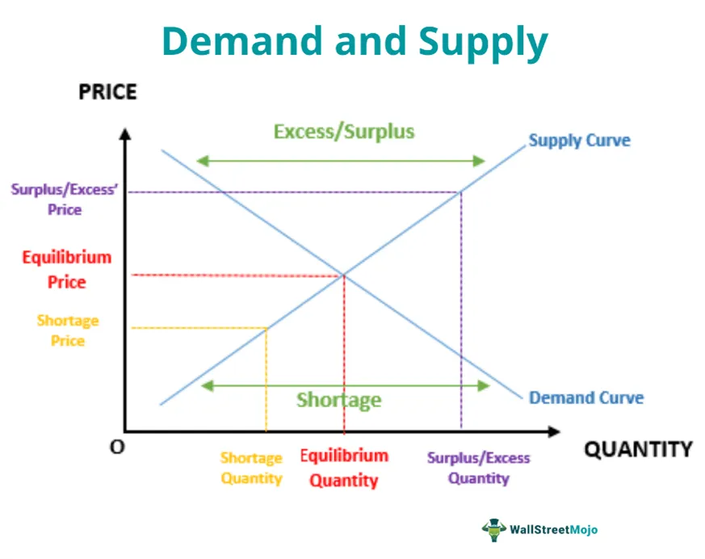

In today's fast-paced financial world, algorithmic trading has emerged as a critical tool for investors and traders. At the heart of algorithmic trading lies a complex interplay of microeconomic theories and pricing models. These models form the foundation upon which trading strategies are built, providing the necessary insights to navigate the intricacies of financial markets.

Algorithmic trading, utilizing computational algorithms, leverages these microeconomic principles to automatically execute orders at speeds and efficiencies unattainable by human traders. By incorporating elements such as supply and demand dynamics, market equilibrium, and utility maximization, these algorithms strive to optimize trade execution, improve market efficiency, and enhance portfolio performance.

Understanding the core concepts of microeconomic pricing models and their integration into economic theory is essential for maximizing the potential of algorithmic trading. These elements influence not only how prices are determined but also how markets react to changes in supply, demand, and other exogenous factors. As such, they significantly impact the development and effectiveness of trading strategies.

The article will elucidate the foundations of microeconomic pricing models, examining their core components such as supply and demand curves and the conditions for market equilibrium. It will also explore the implications of these models within broader economic theories, from the classical interpretations of market forces to modern perspectives that incorporate behavioral insights and account for market imperfections.

Finally, the article will address the challenges of implementing these theoretical models within algorithmic trading environments. Automation introduces complexities, including issues related to market volatility, data accuracy, and computational demands. By highlighting these challenges, the article aims to underscore the importance of continued research and adaptation in the rapidly evolving landscape of financial markets.

Through this exploration, the article seeks to provide valuable insights for professionals and enthusiasts, emphasizing the pivotal role that microeconomic pricing models and economic theories play in shaping algorithmic trading. This knowledge is crucial for investors and traders as they navigate the complexities of modern financial markets, where the synergy between these elements will increasingly drive market efficiency and strategy effectiveness.

## Table of Contents

## Understanding Microeconomic Pricing Models

Microeconomic pricing models play a critical role in deciphering the behavior of markets by elucidating how prices for goods and services are established. At their core, these models depend on the principles of supply and demand, which form the backbone of microeconomic analysis. The interaction between supply and demand determines the equilibrium price, where the quantity of goods supplied equals the quantity demanded.

The supply and demand curves are fundamental tools in microeconomics. The demand curve generally slopes downward, indicating that as prices decrease, the quantity demanded increases, all else being equal. Conversely, the supply curve usually slopes upward, signifying that as prices rise, the quantity supplied increases. The intersection of these curves represents the equilibrium point, providing the optimal price and quantity in a competitive market setting.

$$

Q_d = f(P, Y, T, P_s, P_c)
$$
$$

Q_s = g(P, T_e, P_r, N)
$$

Here, $Q_d$ and $Q_s$ represent the quantity demanded and supplied, respectively. $P$ is the price, $Y$ is income level, $T$ is tastes and preferences, $P_s$ and $P_c$ are the prices of substitutes and complements. $T_e$, $P_r$, and $N$ denote technological advancements, the price of resources, and the number of suppliers.

A central assumption in microeconomic pricing models is perfect competition. In such markets, numerous buyers and sellers exist, none of whom can influence the market price. Furthermore, it is assumed that products are homogenous, and there are no barriers to market entry or [exit](/wiki/exit-strategy), ensuring prices reflect all available information.

Utility maximization is another pivotal concept within these models, where consumers aim to achieve the highest possible satisfaction level given their budget constraints. The utility function $U$ reflects the consumer's preference, and the budget constraint can be expressed as a linear equation:

$$

M = P_x \cdot X + P_y \cdot Y 
$$

where $M$ is the consumer's income, and $P_x$ and $P_y$ are the prices of goods $X$ and $Y$.

Despite these assumptions, real-world disparities often lead to market imperfections. For example, information asymmetry, where one party possesses more or better information than the other, disrupts equilibrium outcomes. Additionally, external factors such as government interventions, taxes, and subsidies can alter the supply and demand dynamics, thus impacting pricing models.

Understanding these models is paramount for predicting how changes in economic conditions translate to price fluctuations. As external factors like regulatory shifts or technological advancements influence markets, pricing models adapt, offering insights into potential price movements and market trends. Through this understanding, market participants can make more informed decisions, optimizing their strategies within the intricate framework of microeconomics.

## Economic Theory: From Classical to Modern Interpretations

Economic theory, a cornerstone of economic science, provides the structural framework within which pricing models function. The evolution of this theory, from classical to modern interpretations, offers significant insights into how economies operate and markets behave. 

Classical economics, pioneered by figures such as Adam Smith, introduced the pivotal concept of market equilibrium. Smith’s proposition of the “invisible hand” suggests that individual self-interest in a competitive market leads to collective benefit and market equilibrium without any centralized coordination. In classical models, market equilibrium is achieved through the interaction of demand and supply, where resources are efficiently allocated based on individual decision-making processes. The assumption here is one of perfect competition—where there are many buyers and sellers, homogeneous products, and no barriers to entry or exit in the market.

Modern economic interpretations, however, broaden the scope by integrating behavioral insights and acknowledging market imperfections. These newer interpretations account for the fact that humans do not always act rationally, as posited by behavioral economics. Behavioral economics examines psychological, cognitive, emotional, cultural, and social factors that influence economic decisions of individuals and institutions, leading to often irrational and unpredictable consumer behavior.

Market imperfections, such as information asymmetry, where one party has more or better information than the other, challenge the classical models of perfect competition and affect pricing strategies and outcomes. The development of theories such as game theory further enhances the understanding of strategic interactions in markets. Game theory analyzes competitive situations where the outcome for each participant depends on the actions of others, highlighting the complexities of real-world market dynamics beyond the simplified assumptions of classical models.

The interaction between microeconomic pricing models and broad economic theories elucidates the dynamics of markets. For instance, microeconomic models provide detailed mechanisms of price formation through demand and supply analysis, while the wider economic theories offer insights into how these mechanisms function under different market conditions and policy environments. 

The evolution of economic theory is pivotal in understanding and applying pricing models to real-world scenarios. For instance, models initially reliant on classical assumptions of rational actors and perfect markets now adapt to include variables accounting for psychological factors, regulatory impacts, and technological changes in market dynamics. As a result, modern economic theories provide a more nuanced, realistic framework for predicting and analyzing market behavior and price formation.

In summary, the progress from classical to modern economic theories reflects a journey towards understanding the complexities of market interactions and pricing mechanisms. This evolution underscores the importance of adapting economic models to align with the diversities and imperfections observed in actual market environments.

## Algorithmic Trading: Leveraging Microeconomic Insights

Algorithmic trading involves the use of computer algorithms to automate the process of making and executing trading decisions. The rapid development in computational technologies and quantitative finance has made [algorithmic trading](/wiki/algorithmic-trading) a cornerstone of modern financial markets. 

Microeconomic pricing models serve as fundamental components in algorithmic trading systems by offering structured approaches to predict and optimize trade execution. These models, based on supply and demand principles, provide insights into market behavior, allowing algorithms to forecast price movements with a greater degree of accuracy. By leveraging the concepts of equilibrium and utility maximization, algorithms can develop more refined entry and exit strategies, reducing the likelihood of unfavorable trades.

The integration of microeconomic theories into algorithmic trading is essential for comprehensive market analysis. Algorithms utilize these theories to identify trends by assessing variables such as price elasticity, consumer preferences, and production costs. This analytically driven approach enables the algorithms to predict market trends and price [volatility](/wiki/volatility-trading-strategies), which is crucial for executing trades at optimal prices. For instance, if an algorithm identifies that a stock's supply is decreasing while demand remains stable, it may predict a price increase and execute buy orders accordingly.

Several algorithmic trading strategies incorporate microeconomic principles. Trend-following algorithms, for instance, are designed to capitalize on market [momentum](/wiki/momentum) by analyzing historical price data to identify price trends. Arbitrage strategies seek to exploit price discrepancies in different markets, adhering to the microeconomic concept of the law of one price. Moreover, market-making algorithms facilitate [liquidity](/wiki/liquidity-risk-premium) by continuously quoting prices at which they are willing to buy and sell, adjusting prices based on real-time supply and demand data.

However, the effectiveness of these strategies hinges on addressing significant challenges. Market volatility presents a considerable obstacle, as unpredictable price movements can lead to substantial financial losses. Furthermore, maintaining data accuracy is critical, as erroneous data inputs can cause flawed algorithmic decisions. The computational power required to process large datasets and execute complex calculations in real-time also poses a challenge, necessitating sophisticated hardware and software solutions.

In conclusion, while algorithmic trading greatly benefits from the application of microeconomic insights, it must navigate various complexities inherent in financial markets. Continuous advancements in technology and economic theory are essential to refine these algorithms, ensuring they remain robust and effective in ever-evolving market conditions.

## Challenges and Limitations

Microeconomic pricing models serve as valuable tools in predicting market dynamics; however, their application comes with notable challenges and limitations. One significant limitation is their foundational assumption of perfect competition, which rarely exists in real-world markets. Perfect competition assumes numerous small buyers and sellers, homogeneous products, and no barriers to entry or exit. In reality, markets often face monopolistic tendencies, differentiated products, and regulatory restrictions, which can lead to deviations from predictions.

Market anomalies and imperfect information are other factors that contribute to discrepancies between theoretical and actual outcomes. Anomalies such as sudden market shocks, investor behavior influenced by herd mentality, or speculative bubbles challenge the core assumptions of pricing models. Imperfect information, where all market participants do not have equal access to information, can also distort market equilibrium.

Algorithmic trading applications, which utilize these microeconomic models, must navigate a complex array of practical considerations. These include real-world complexities such as transaction costs, liquidity constraints, and dynamic changes in demand and supply conditions. Moreover, regulatory constraints impose additional layers of complexity, as algorithmic strategies must adhere to financial regulations which can vary significantly across jurisdictions. Ethical considerations also play a crucial role, as algorithms need to prioritize fairness and avoid manipulative trading practices.

High-frequency trading ([HFT](/wiki/high-frequency-trading-strategies)), a subset of algorithmic trading, presents its own set of challenges. Latency, or the delay in processing orders, can significantly impact the profitability and effectiveness of HFT strategies. Slippage, the difference between the expected price of a trade and the actual price, can erode potential gains. Additionally, algorithmic biases, which arise from the over-reliance on historical data or flawed decision rules, pose risks of reinforcing market trends that may not align with fundamental values.

The limitations of microeconomic pricing models and algorithmic trading necessitate continued research and adaptation. Researchers and practitioners must strive to develop more robust and adaptable models that can accommodate market imperfections and anomalies. This involves the integration of advanced data analytics, [machine learning](/wiki/machine-learning) techniques, and the inclusion of behavioral insights to refine predictions and enhance trading strategies. By actively addressing these challenges, financial markets can become more efficient, stable, and equitable for all participants.

## Conclusion

The intersection of microeconomic pricing models, economic theory, and algorithmic trading represents a compelling field of study and practice. Understanding these concepts is crucial for investors, traders, and economists aiming to navigate the sophisticated landscape of modern financial markets. Microeconomic pricing models offer insights into market behaviors by analyzing supply-demand dynamics, while economic theory provides the overarching framework that guides market operations.

As economic theory continues to evolve, integrating new technological advancements and data analytics, it introduces novel opportunities and challenges for market participants. For example, the adoption of machine learning algorithms in trading can enhance the predictive power of microeconomic models, allowing for more precise execution of trading strategies. This evolution necessitates continuous learning and adaptation, as technological changes can swiftly alter the market environment, leading to new forms of market inefficiency and risk.

The synergy between these components — pricing models, economic theory, and algorithmic trading — plays an increasingly central role in shaping both trading strategies and broader economic policies. Algorithmic trading, grounded in the principles illuminated by microeconomics, enables traders to operate in a more informed and efficient manner, maximizing returns while minimizing risks. This confluence is particularly relevant in the context of high-frequency trading, where precision and speed are pivotal.

However, recognizing the inherent limitations of these models and theories is equally vital. Markets do not always behave as models predict, due to factors such as imperfect information, regulatory changes, and behavioral biases. Algorithmic strategies must therefore be robustly designed to adapt to unexpected market conditions and anomalies. By proactively addressing these limitations, investors and traders can enhance their preparedness for future market shifts, ensuring their strategies remain relevant and effective in dynamic environments.

In conclusion, the advancing interplay between microeconomic models, economic theories, and algorithmic trading charts a path toward more nuanced and effective engagement with financial markets. By merging theoretical frameworks with cutting-edge technology, market participants can better navigate the complexities of today's financial world, fostering strategies that are both innovative and resilient.

## References & Further Reading

[1]: ["Principles of Economics"](https://open.umn.edu/opentextbooks/textbooks/32) by N. Gregory Mankiw

[2]: Fama, E. F. (1970). ["Efficient Capital Markets: A Review of Theory and Empirical Work."](https://www.jstor.org/stable/2325486) The Journal of Finance, 25(2), 383-417.

[3]: Shiller, R. J. (1981). ["Do Stock Prices Move Too Much to be Justified by Subsequent Changes in Dividends?"](https://www.jstor.org/stable/1802789) The American Economic Review, 71(3), 421-436.

[4]: Harris, L. (2003). ["Trading and Exchanges: Market Microstructure for Practitioners"](https://www.amazon.com/Trading-Exchanges-Market-Microstructure-Practitioners/dp/0195144708) by Larry Harris

[5]: Kahneman, D., & Tversky, A. (1979). ["Prospect Theory: An Analysis of Decision under Risk."](https://www.jstor.org/stable/1914185) Econometrica, 47(2), 263-291.