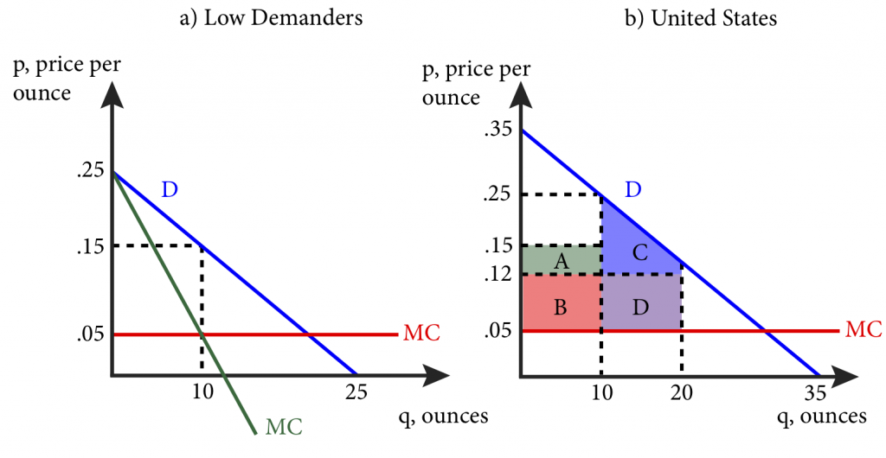

## Table of Contents

## What is a microeconomic pricing model?

A microeconomic pricing model is a way to figure out how much to charge for things like products or services. It looks at the basic ideas of supply and demand. This means it considers how many people want to buy something and how much of that thing is available. The goal is to find a price that makes both the seller and the buyer happy. If the price is too high, fewer people will buy it. If it's too low, the seller might not make enough money.

One common type of microeconomic pricing model is called "cost-plus pricing." This method starts with figuring out how much it costs to make or provide something. Then, the seller adds a little extra to that cost to make a profit. For example, if it costs $10 to make a toy, the seller might sell it for $12 to cover costs and make a small profit. This model is simple and helps ensure the seller doesn't lose money.

Another type is "value-based pricing," which focuses on how much customers think a product or service is worth. If customers believe a product is very valuable, the seller can charge more for it. For instance, a special brand of coffee might cost more than regular coffee because people think it tastes better. This model can lead to higher profits if customers are willing to pay more for what they see as a better product.

## How do microeconomic pricing models differ from macroeconomic pricing models?

Microeconomic pricing models focus on the decisions made by individual businesses and consumers. They look at how much a single company should charge for its products or services based on things like costs, demand, and what customers are willing to pay. For example, a microeconomic model might help a small bakery decide how much to charge for a cupcake by considering the cost of ingredients, how many people want to buy cupcakes, and how much those people are willing to spend. The goal is to find a price that makes the business profitable while also attracting customers.

On the other hand, macroeconomic pricing models look at the bigger picture of an entire economy. They consider factors like inflation, interest rates, and overall economic growth to understand how prices are set across different industries. For instance, a macroeconomic model might be used to predict how a rise in interest rates could affect the prices of houses or cars across the country. These models help policymakers and economists understand and manage the overall health of the economy, rather than focusing on the pricing strategies of individual businesses.

In summary, the main difference between microeconomic and macroeconomic pricing models is their scope. Microeconomic models are about the nitty-gritty details of pricing for individual businesses, while macroeconomic models are about understanding and influencing the broader trends that affect prices across the whole economy.

## What are the basic principles of microeconomic pricing?

Microeconomic pricing is all about figuring out the best price for a product or service. It looks at how much it costs to make something and how much people are willing to pay for it. The idea is to find a price that covers the costs and makes a profit, but also keeps customers happy. If the price is too high, fewer people will buy it. If it's too low, the business might not make enough money. So, it's a balancing act to find the right price.

One important principle is understanding supply and demand. If there's a lot of something and not many people want it, the price should be lower. But if there's not much of it and a lot of people want it, the price can be higher. Another principle is knowing the value that customers see in the product. If customers think something is really special or useful, they might be willing to pay more for it. This is called value-based pricing. It's all about matching the price to what customers are willing to pay.

Lastly, businesses often use different pricing strategies based on their goals. Some might use cost-plus pricing, where they add a bit to the cost to make a profit. Others might use competitive pricing, where they set their prices based on what other businesses are charging. The key is to choose a strategy that fits the business's situation and helps it succeed in the market.

## Can you explain the concept of supply and demand in relation to pricing?

Supply and demand is a key idea in figuring out how much something should cost. It's all about how many people want to buy something and how much of that thing is available. If there's a lot of something but not many people want it, the price usually goes down. This is because sellers want to sell their stuff, so they lower the price to get people interested. On the other hand, if there's not much of something but a lot of people want it, the price goes up. This is because sellers know people are willing to pay more to get it.

For example, think about strawberries. In the summer, when there are lots of strawberries, the price might be low because farmers have a big supply. But in the winter, when it's hard to grow strawberries, the price might be high because there's not much supply but people still want them. This balance between how much is available and how much people want it helps set the price. Sellers use this to decide how much to charge to make sure they sell their products and make a profit.

## What role does elasticity of demand play in pricing strategies?

Elasticity of demand is a big deal when it comes to deciding how much to charge for things. It's all about how much the amount people want to buy changes when the price changes. If a product has elastic demand, that means if you raise the price even a little bit, a lot fewer people will buy it. So, if you're selling something with elastic demand, you need to be careful about raising prices because you might lose a lot of customers. On the other hand, if you lower the price, you might sell a lot more.

If a product has inelastic demand, it means that changing the price doesn't change how much people want to buy it that much. Things like medicine or gas often have inelastic demand because people need them no matter what the price is. So, if you're selling something with inelastic demand, you can raise the price a bit without losing too many customers. Understanding whether your product has elastic or inelastic demand helps you pick the best pricing strategy to make more money and keep your customers happy.

## How do businesses use cost-based pricing in microeconomic models?

Businesses use cost-based pricing in microeconomic models to figure out how much to charge for their products or services. This method starts by figuring out all the costs to make or provide something. That includes the cost of materials, labor, and any other expenses. Once they know the total cost, they add a little extra on top of that to make a profit. This extra amount is called a markup. For example, if it costs $50 to make a jacket, a business might add a 20% markup and sell it for $60. This way, they cover their costs and make some money.

Cost-based pricing is simple and helps businesses make sure they don't lose money. It's especially useful for businesses that have a lot of fixed costs, like manufacturing companies. By using this method, they can make sure they're covering all their expenses and making a profit on each item they sell. However, this method doesn't always consider what customers are willing to pay or what competitors are charging. So, businesses need to be careful and sometimes adjust their prices based on market conditions to stay competitive and attract customers.

## What is value-based pricing and how is it implemented in microeconomics?

Value-based pricing is a way for businesses to set prices based on how much customers think a product or service is worth. Instead of just looking at the cost to make something, businesses using this method focus on what the customer values. If customers see a product as very special or useful, the business can charge more for it. This is different from cost-based pricing, where the price is set by adding a little extra to the cost of making the product. Value-based pricing tries to match the price to what customers are willing to pay, which can lead to higher profits if customers think the product is worth a lot.

To use value-based pricing, businesses first need to understand what their customers value. They might do this by talking to customers, doing surveys, or looking at what similar products are selling for. Once they know what customers value, they set a price that reflects that value. For example, a company might find out that customers are willing to pay more for a phone that has a better camera. So, they might charge more for that phone because customers see the better camera as valuable. This method can be tricky because it needs a good understanding of what customers want, but it can help businesses make more money by charging prices that match what customers are willing to pay.

## Can you describe the use of competitive pricing strategies in microeconomics?

Competitive pricing is when a business looks at what other businesses are charging for similar products or services and then sets its own prices based on that. The idea is to stay in the game by not charging too much more or too much less than others. If a business charges too much, customers might go to a competitor with lower prices. But if it charges too little, it might not make enough money to stay in business. So, businesses need to find a sweet spot where they can make a profit while still being attractive to customers.

To use competitive pricing, a business first needs to know what its competitors are doing. They might check out other stores, look at prices online, or even do secret shopping to see what others are charging. Once they have this info, they can decide if they want to match those prices, go a little lower to attract more customers, or go a bit higher if they think their product is better. It's all about keeping an eye on the competition and adjusting prices to stay competitive in the market.

## How do microeconomic pricing models account for consumer behavior?

Microeconomic pricing models take into account consumer behavior by looking at how much people want to buy something and how much they are willing to pay for it. These models consider things like how sensitive customers are to price changes, which is called price elasticity of demand. If customers are very sensitive to price changes, businesses might keep prices low to keep selling a lot. On the other hand, if customers aren't as sensitive, businesses might be able to charge more without losing too many sales. By understanding these behaviors, businesses can set prices that attract customers while still making a profit.

Another way microeconomic pricing models account for consumer behavior is by considering the value that customers place on products or services. This is known as value-based pricing. If customers think a product is really special or useful, they might be willing to pay more for it. Businesses study what customers value, maybe through surveys or by looking at what similar products are selling for. Then, they set prices that match what customers are willing to pay. This helps businesses make more money by charging prices that reflect the value customers see in their products.

## What advanced techniques are used in microeconomic pricing to optimize profits?

Advanced techniques in microeconomic pricing often involve using data and technology to find the best prices that will make the most profit. One technique is called dynamic pricing. This means changing prices based on what's happening right now, like how many people want to buy something or what the competition is doing. For example, ride-sharing apps like Uber might charge more during busy times when lots of people need rides. By using data to see what's happening in real-time, businesses can adjust their prices to make more money.

Another technique is called price discrimination, which means charging different prices to different customers for the same thing. This can be based on things like how much someone is willing to pay, where they live, or even their age. For example, airlines often charge different prices for the same seat on a plane, depending on when you buy the ticket or how flexible you are with your travel dates. By figuring out what different groups of customers are willing to pay, businesses can set prices that get the most money from each customer. These advanced techniques help businesses make more profit by being smart about how they set their prices.

## How do microeconomic pricing models adapt to different market structures?

Microeconomic pricing models change depending on the type of market a business is in. In a perfect competition market, where lots of businesses sell the same thing and no one can control the price, businesses have to set their prices at the market rate. If they try to charge more, no one will buy from them because customers can just go to another business. So, the focus here is on keeping costs low to make a profit at the set market price.

In a monopoly, where one business controls the whole market, the pricing model is different. The business can set higher prices because customers don't have other choices. But they still need to think about how much people are willing to pay. If the price is too high, people might not buy at all. In markets like oligopolies, where a few big businesses control the market, pricing can be tricky. Businesses often watch what others are doing and might match prices or start price wars to get more customers. Each market structure needs a different approach to find the best price.

## What are the current trends and future directions in microeconomic pricing research?

Current trends in microeconomic pricing research are focusing a lot on using technology and data to make better pricing decisions. One big trend is dynamic pricing, where businesses change their prices based on what's happening right now, like how many people want to buy something or what the competition is doing. This is used a lot in industries like airlines, hotels, and ride-sharing apps. Another trend is using big data and [machine learning](/wiki/machine-learning) to understand what customers want and how much they're willing to pay. This helps businesses set prices that match what customers value, which can lead to more profit. Researchers are also looking at how to use pricing to be more environmentally friendly, like charging more for products that are bad for the environment to encourage people to buy greener options.

In the future, microeconomic pricing research will likely keep moving towards using more advanced technology and data. We might see even more personalized pricing, where businesses use data about individual customers to set prices that are just right for each person. This could mean using things like your shopping history or even your location to decide what to charge you. There's also a lot of interest in how pricing can help with social goals, like making things more affordable for people who don't have a lot of money. Researchers will keep working on finding the best ways to use pricing to make businesses more successful while also helping society.

## What are Microeconomic Pricing Models and How Can We Understand Them?

Microeconomic pricing models play a critical role in deciphering the behavior of markets by elucidating how prices for goods and services are established. At their core, these models depend on the principles of supply and demand, which form the backbone of microeconomic analysis. The interaction between supply and demand determines the equilibrium price, where the quantity of goods supplied equals the quantity demanded.

The supply and demand curves are fundamental tools in microeconomics. The demand curve generally slopes downward, indicating that as prices decrease, the quantity demanded increases, all else being equal. Conversely, the supply curve usually slopes upward, signifying that as prices rise, the quantity supplied increases. The intersection of these curves represents the equilibrium point, providing the optimal price and quantity in a competitive market setting.

$$

Q_d = f(P, Y, T, P_s, P_c)
$$
$$

Q_s = g(P, T_e, P_r, N)
$$

Here, $Q_d$ and $Q_s$ represent the quantity demanded and supplied, respectively. $P$ is the price, $Y$ is income level, $T$ is tastes and preferences, $P_s$ and $P_c$ are the prices of substitutes and complements. $T_e$, $P_r$, and $N$ denote technological advancements, the price of resources, and the number of suppliers.

A central assumption in microeconomic pricing models is perfect competition. In such markets, numerous buyers and sellers exist, none of whom can influence the market price. Furthermore, it is assumed that products are homogenous, and there are no barriers to market entry or [exit](/wiki/exit-strategy), ensuring prices reflect all available information.

Utility maximization is another pivotal concept within these models, where consumers aim to achieve the highest possible satisfaction level given their budget constraints. The utility function $U$ reflects the consumer's preference, and the budget constraint can be expressed as a linear equation:

$$

M = P_x \cdot X + P_y \cdot Y 
$$

where $M$ is the consumer's income, and $P_x$ and $P_y$ are the prices of goods $X$ and $Y$.

Despite these assumptions, real-world disparities often lead to market imperfections. For example, information asymmetry, where one party possesses more or better information than the other, disrupts equilibrium outcomes. Additionally, external factors such as government interventions, taxes, and subsidies can alter the supply and demand dynamics, thus impacting pricing models.

Understanding these models is paramount for predicting how changes in economic conditions translate to price fluctuations. As external factors like regulatory shifts or technological advancements influence markets, pricing models adapt, offering insights into potential price movements and market trends. Through this understanding, market participants can make more informed decisions, optimizing their strategies within the intricate framework of microeconomics.

## References & Further Reading

[1]: ["Principles of Economics"](https://open.umn.edu/opentextbooks/textbooks/32) by N. Gregory Mankiw

[2]: Fama, E. F. (1970). ["Efficient Capital Markets: A Review of Theory and Empirical Work."](https://www.jstor.org/stable/2325486) The Journal of Finance, 25(2), 383-417.

[3]: Shiller, R. J. (1981). ["Do Stock Prices Move Too Much to be Justified by Subsequent Changes in Dividends?"](https://www.jstor.org/stable/1802789) The American Economic Review, 71(3), 421-436.

[4]: Harris, L. (2003). ["Trading and Exchanges: Market Microstructure for Practitioners"](https://www.amazon.com/Trading-Exchanges-Market-Microstructure-Practitioners/dp/0195144708) by Larry Harris

[5]: Kahneman, D., & Tversky, A. (1979). ["Prospect Theory: An Analysis of Decision under Risk."](https://www.jstor.org/stable/1914185) Econometrica, 47(2), 263-291.