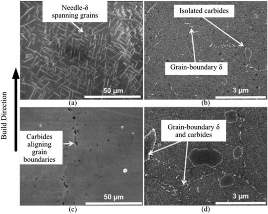

## Table of Contents

## What are microstructural features?

Microstructural features are the tiny details and patterns you can see when you look at materials like metals, ceramics, or polymers under a microscope. These features include things like grains, which are like tiny crystals, and boundaries between these grains. They also include defects like cracks or tiny holes, and sometimes even smaller particles or phases mixed into the material. These tiny details are important because they affect how strong, tough, or flexible the material is.

Understanding microstructural features helps scientists and engineers figure out how to make materials better for different uses. For example, if a material needs to be really strong, engineers might try to make the grains smaller because smaller grains often make materials stronger. Or, if a material needs to be more flexible, they might change the way the grains are arranged or add different phases to the material. By studying these microstructural features, we can learn how to control and improve the properties of materials to meet specific needs.

## Why are microstructural features important in materials science?

Microstructural features are super important in materials science because they tell us a lot about how strong, tough, or flexible a material can be. When we look at a material under a microscope, we see tiny things like grains, which are like little crystals, and the spaces between them called grain boundaries. We also see defects like cracks or tiny holes. All these tiny details can change how the material behaves. For example, smaller grains usually make a material stronger, while bigger grains might make it more flexible.

Scientists and engineers study these microstructural features to figure out how to make materials better for different jobs. If they need a material to be really strong, they might try to make the grains smaller. Or, if they need it to be more flexible, they might change the way the grains are arranged or add different stuff to the material. By understanding and controlling these tiny details, we can make materials that work better for things like building cars, airplanes, or even medical devices. This helps us make things safer and more efficient.

## How do microstructural features affect the properties of materials?

Microstructural features are really tiny things inside materials that you can see with a microscope. These tiny things, like grains and the spaces between them called grain boundaries, can change how strong or flexible a material is. For example, if the grains are small, the material usually gets stronger. That's because smaller grains mean there are more boundaries, and these boundaries can stop cracks from spreading easily. On the other hand, if the grains are big, the material might be more flexible because there are fewer boundaries to stop the movement of the material.

Defects, like tiny cracks or holes, also play a big role. These defects can make a material weaker because they can grow into bigger cracks, which might cause the material to break. But sometimes, adding certain kinds of defects on purpose can actually make a material better for a specific job. For example, adding tiny particles can help make a material tougher by stopping cracks from growing too much. So, by changing the size and type of these microstructural features, scientists can make materials that are just right for different uses, like making cars, airplanes, or medical tools.

## What are the common techniques used to observe microstructural features?

To see microstructural features, scientists use special tools that help them look at tiny details inside materials. One common technique is optical microscopy, which uses light and a microscope to look at the surface of a material. This is good for seeing bigger features like grains and grain boundaries. But for even smaller details, scientists use scanning electron microscopy (SEM). SEM uses a beam of electrons instead of light, and it can show much smaller features like tiny cracks or particles. Another technique is transmission electron microscopy (TEM), which is even more powerful and can show the tiniest details, like the structure inside the grains.

There are also techniques that don't use microscopes but still help us learn about microstructural features. X-ray diffraction (XRD) is one of these. It uses X-rays to find out about the crystal structure of a material, which tells us about the arrangement of atoms. Another method is scanning probe microscopy (SPM), which uses a tiny probe to feel the surface of a material and give us information about its texture and structure. All these techniques help scientists see and understand the tiny details inside materials, which is important for making them better for different uses.

## Can you explain the difference between microstructure and macrostructure?

Microstructure and macrostructure are two ways to look at materials, but they focus on different sizes. Microstructure is all about the tiny details inside a material that you can see with special tools like microscopes. These details include things like grains, which are like tiny crystals, the spaces between these grains called grain boundaries, and tiny defects like cracks or holes. Understanding microstructure is important because it affects how strong, tough, or flexible a material can be. For example, if you want a material to be really strong, you might want smaller grains because they make it harder for cracks to spread.

On the other hand, macrostructure is about the bigger picture of a material. It's what you can see with your eyes or with tools that don't zoom in as much. Macrostructure includes things like the overall shape of the material, any big cracks or holes, and how different parts of the material are put together. For example, if you're looking at a piece of wood, the macrostructure would show you the rings and knots, while the microstructure would show you the tiny cells that make up the wood. Both micro and macro structures are important because they help us understand how a material will behave in different situations.

## What role do grain boundaries play in microstructural features?

Grain boundaries are the spaces between the tiny crystals, called grains, inside a material. They are like the walls that separate these grains. Grain boundaries are super important because they affect how strong or tough a material can be. When a material has lots of grain boundaries, it usually means the grains are small. Small grains can make a material stronger because the grain boundaries can stop cracks from spreading easily. If a crack tries to move through the material, it has to jump from one grain to another, and the grain boundaries can slow it down or even stop it.

On the other hand, if a material has fewer grain boundaries, it means the grains are bigger. Bigger grains can make a material more flexible because there are fewer boundaries to stop the movement of the material. But, bigger grains might also make the material weaker because cracks can spread more easily without many boundaries to stop them. So, by changing the size and number of grain boundaries, scientists can control how strong, tough, or flexible a material is, which is really important for making materials work well for different jobs.

## How does heat treatment influence microstructural features?

Heat treatment is like giving a material a special kind of cooking to change its tiny details, called microstructural features. When you heat a material up and then cool it down in a certain way, you can make the grains inside it bigger or smaller, and change the way they are arranged. For example, if you heat a metal and then cool it slowly, the grains can grow bigger. Bigger grains can make the material softer and more flexible. But if you cool it down quickly, like dunking it in cold water, the grains stay small, and the material becomes harder and stronger.

These changes in the grains and grain boundaries can also affect other tiny details, like the defects in the material. Heat treatment can help get rid of some defects, making the material stronger. It can also add new kinds of defects on purpose, which might make the material better for certain jobs. By carefully controlling the heat treatment process, scientists can make the microstructural features just right for what they need, whether it's making a car part that needs to be really strong or a tool that needs to be flexible.

## What are the effects of alloying elements on microstructural features?

Alloying elements are like special ingredients that you add to a material to change its tiny details, called microstructural features. When you mix in these elements, they can change the size and shape of the grains inside the material. For example, adding certain elements can make the grains smaller, which makes the material stronger. Other elements might make the grains bigger, which can make the material softer and more flexible. These changes happen because the alloying elements mix with the main material and change how the atoms arrange themselves into grains.

Alloying elements can also create new phases inside the material. These phases are like different kinds of tiny crystals that mix with the main grains. Sometimes these new phases can make the material tougher by stopping cracks from growing too much. Other times, they can make the material more resistant to heat or corrosion. By carefully choosing which alloying elements to add and how much, scientists can control the microstructural features to make the material work better for things like building airplanes, cars, or even medical tools.

## How can microstructural features be quantitatively analyzed?

To analyze microstructural features in a detailed way, scientists use special tools and methods that help them measure and count the tiny details inside materials. One common way is to use image analysis software with pictures taken from microscopes. These pictures can show things like the size of grains, how many there are, and how they are arranged. Scientists can use the software to measure the average size of the grains, count how many grains there are in a certain area, and even figure out the length of the grain boundaries. This helps them understand how strong or flexible the material might be.

Another way to analyze microstructural features is by using techniques like X-ray diffraction (XRD). XRD can tell scientists about the crystal structure of the material, which is important for understanding how the atoms are arranged inside the grains. By looking at the patterns the X-rays make when they hit the material, scientists can find out things like the size of the crystals and any tiny defects that might be there. This information helps them predict how the material will behave under different conditions. By combining these methods, scientists can get a full picture of the microstructural features and use that to make materials better for different uses.

## What advanced imaging techniques are used to study microstructural features at the nanoscale?

To study microstructural features at the nanoscale, scientists use advanced imaging techniques like transmission electron microscopy (TEM). TEM is really powerful because it uses a beam of electrons to look at very tiny details inside materials. It can show things like the structure inside the grains, tiny defects, and even how atoms are arranged. This helps scientists understand how strong or flexible a material can be at the smallest level. They can see things that are way too small for regular microscopes, like the tiny crystals and the spaces between them.

Another technique is scanning transmission electron microscopy (STEM), which is like TEM but even better at showing the exact positions of atoms. STEM can create detailed maps of the material's structure, showing where different elements are and how they are mixed together. This is super helpful for figuring out how alloying elements change the material's properties. By using these advanced techniques, scientists can learn a lot about the tiniest details inside materials, which helps them make better materials for things like electronics, medical devices, and more.

## How do microstructural features contribute to the failure mechanisms in materials?

Microstructural features can play a big role in how materials fail. When you look at a material up close, you see tiny things like grains and the spaces between them called grain boundaries. These tiny details can affect how cracks start and grow. For example, if there are a lot of grain boundaries because the grains are small, it can be harder for cracks to spread because they have to jump from one grain to another. But if the grains are big, with fewer boundaries, cracks can spread more easily, which might make the material break faster. Also, tiny defects like holes or weak spots can start cracks, and these cracks can grow until the material fails.

Another way microstructural features can lead to failure is through things like phase changes or the way different parts of the material are mixed together. Sometimes, adding different elements to a material can create new phases that are not as strong as the main material. These weaker phases can be places where cracks start or grow more easily. Also, if the material is not mixed well, it can have areas that are weaker than others, which can lead to failure. By understanding how these tiny details affect the material, scientists can make things stronger and last longer, which is important for things like building cars, airplanes, or even bridges.

## What are the current research trends in optimizing microstructural features for advanced materials?

Scientists are always trying to make materials better by changing their tiny details, called microstructural features. One big trend in research right now is using computer models to predict how these tiny details will affect the material. By using these models, scientists can test different ways to change the grains, grain boundaries, and defects before they even make the material. This helps them find the best way to make the material strong, tough, or flexible without having to do a lot of experiments. Another trend is using new techniques like 3D printing to control the microstructural features. With 3D printing, scientists can make materials layer by layer and change the tiny details in each layer to get the properties they want.

Another important trend is looking at how adding tiny particles or different elements can change the microstructural features. Scientists are finding that adding these tiny things can make materials stronger or more resistant to heat and wear. They are also studying how to mix these elements evenly throughout the material to make it as good as it can be. By understanding how these tiny details work, scientists can make new materials that are perfect for things like electric cars, airplanes, and even tiny medical devices. These trends are helping to make materials better and more useful for all kinds of new technology.

## What is Market Microstructure?

Market microstructure is an essential aspect of financial markets, focusing on the mechanisms and structures that facilitate trading. It examines the intricacies of price formation, [liquidity](/wiki/liquidity-risk-premium), and the trading processes that occur on electronic platforms. Understanding market microstructure is critical for developing and executing effective [algorithmic trading](/wiki/algorithmic-trading) strategies.

Electronic markets have revolutionized trading, transitioning from traditional open outcry systems to automated platforms. This shift has introduced new elements in the microstructure, most notably, the Limit Order Book (LOB). The LOB is a comprehensive record of buy and sell limit orders for a particular security, providing a dynamic snapshot of market interest at different price levels. This book plays a crucial role in exhibiting market liquidity, revealing the depth and imbalances in order flow.

Two fundamental types of orders form the backbone of market microstructure: market orders (MO) and limit orders (LO). Market orders are executed immediately at the best available price, offering speed but at the risk of price slippage if liquidity is insufficient. Limit orders, on the other hand, guarantee execution at a specified price or better, yet lack the immediacy of MOs since they remain in the LOB until matched. The interplay between these orders influences market dynamics and liquidity.

The LOB itself provides invaluable insights into market conditions. It depicts the current state of demand and supply, illustrating the available liquidity at varying price points. Analyzing the LOB allows traders to gauge the market's readiness to absorb large trades without significant price movements, which is crucial for making informed trading decisions. The depth of the LOB can be represented mathematically to highlight the distribution of orders:

$$
\text{LOB} = \{(p_1, q_1), (p_2, q_2), \ldots, (p_n, q_n)\}
$$

where $p_i$ represents the price and $q_i$ the quantity available at that price level.

A thorough understanding of market microstructure equips algorithmic traders with the knowledge to navigate complex market conditions. By effectively leveraging the information within the LOB and optimizing their use of order types, traders can develop strategies that enhance profitability and mitigate risks associated with rapid price changes.

## What is the importance of liquidity?

Liquidity is a critical component of financial markets and plays a significant role in algorithmic trading. It refers to the capacity to execute trades swiftly and efficiently without causing substantial deviations in asset prices. High liquidity ensures that market orders (MOs), which are executed immediately at the best available prices, occur swiftly and at prices close to the current market levels, minimizing the risk of "walking the book"—a scenario where the execution of large orders results in cascading price changes due to insufficient liquidity at the initial price level.

For algorithmic traders, liquidity represents both a challenge and an opportunity. These traders frequently engage in strategies designed to exploit liquidity disparities by either providing liquidity through limit orders (LOs) or benefiting from the bid-ask spreads in highly liquid markets. A bid-ask spread is the difference between the highest price a buyer is willing to pay (bid) and the lowest price a seller is willing to accept (ask). By offering liquidity, traders can earn the spread as profit when their limit orders are matched.

The effectiveness of trading strategies hinges on a precise understanding of liquidity. Algorithmic trading systems utilize liquidity metrics to optimize the execution of trades. They analyze the depth and resilience of the limit [order book](/wiki/order-book-trading-strategies) (LOB), which maps out all outstanding buy and sell orders at various price levels. This analysis informs traders about potential price impacts and helps in deciding the proportion of orders to slice and execute over time. Commonly, traders aim to minimize the market impact and transaction costs by breaking down large orders into smaller slices and executing them over optimal time intervals, adjusting dynamically to the market conditions.

To mathematically quantify the liquidity impact, traders might employ measures such as market depth and the average transaction cost associated with executing trades of different sizes. As an example, if $Q$ is the quantity of the asset to be traded, and $P(q)$ provides the price impact based on the quantity $q$, the total expected market impact $I$ might be calculated as:

$$
I(Q) = \int_0^Q P(q) \, dq
$$

In practice, algorithmic trading platforms utilize real-time data analytics to constantly assess these variables and adapt trading strategies accordingly. As markets evolve, understanding liquidity is not only about grasping current conditions but also about predicting future changes and preparing to leverage them for optimal trading outcomes and reduced transaction costs.

## References & Further Reading

[1]: Harris, L. (2003). ["Trading and Exchanges: Market Microstructure for Practitioners"](https://www.amazon.com/Trading-Exchanges-Market-Microstructure-Practitioners/dp/0195144708). Oxford University Press.

[2]: Hasbrouck, J. (2007). ["Empirical Market Microstructure: The Institutions, Economics, and Econometrics of Securities Trading"](https://academic.oup.com/book/52241). Oxford University Press.

[3]: O'Hara, M. (1995). ["Market Microstructure Theory"](https://www.semanticscholar.org/paper/Market-Microstructure-Theory-O'Hara/2bd0833b023f3270a2a6bf301e86b8e02e2f28ed). Wiley-Blackwell.

[4]: Aldridge, I. (2013). ["High-Frequency Trading: A Practical Guide to Algorithmic Strategies and Trading Systems"](https://www.wiley.com/en-us/High+Frequency+Trading%3A+A+Practical+Guide+to+Algorithmic+Strategies+and+Trading+Systems-p-9780470579770). Wiley.

[5]: De Prado, M. L. (2018). ["Advances in Financial Machine Learning"](https://www.amazon.com/Advances-Financial-Machine-Learning-Marcos/dp/1119482089). Wiley.

[6]: Bouchaud, J.-P., Farmer, J. D., & Lillo, F. (2009). ["How Markets Slowly Digest Changes in Supply and Demand."](https://arxiv.org/abs/0809.0822) Handbook of Financial Markets: Dynamics and Evolution.

[7]: Foucault, T., Pagano, M., & Röell, A. (2013). ["Market Liquidity: Theory, Evidence, and Policy."](https://academic.oup.com/book/55158) Oxford University Press.