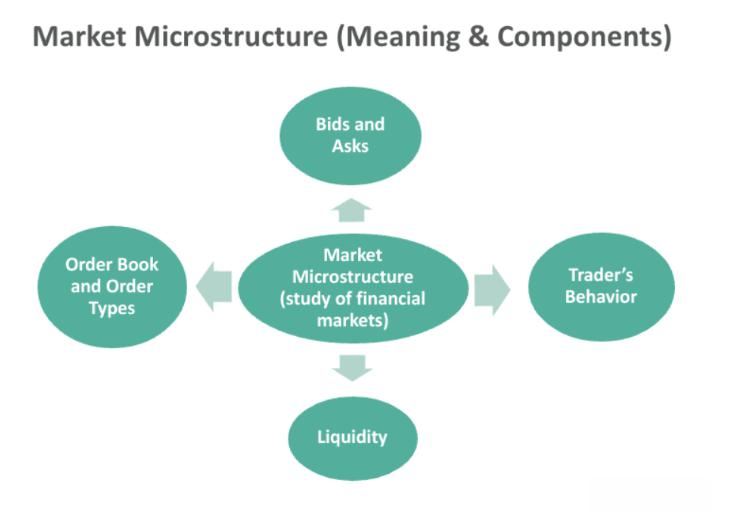

Algorithmic trading, a key component of modern financial markets, has transformed how securities are traded, becoming indispensable for institutions looking to optimize their trading strategies. Understanding market microstructure is essential within this domain, as it refers to the intricate mechanisms and systems that facilitate securities trading. This understanding is especially crucial for high-frequency trading (HFT), where the swift and accurate execution of trades is vital.

The concept of market microstructure encompasses various elements such as order types, trade execution, and the behavior of market participants. It provides a framework to analyze how these elements interact in electronic trading environments, which have largely replaced traditional floor trading due to technological advancements. These electronic platforms introduce novel microstructural components, including automated order matching, high-speed data feeds, and algorithmic execution strategies, which have reshaped the trading landscape significantly.

Algorithmic trading strategies rely heavily on mastering these microstructures to operate effectively. Traders must understand order types, market liquidity, and the dynamics of the limit order book to make informed decisions. The ability to analyze and predict these factors allows traders to optimize trade execution, minimize costs, and reduce the market impact of large trades.

This article aims to explore various microstructural features and their significance in algorithmic trading. By providing insights into these elements, we seek to highlight how they influence strategy formulation and execution, thereby shedding light on their critical role in modern financial markets. Understanding and adapting to these microstructural features is not merely an advantage but a necessity for traders operating in today's fast-paced trading environments.

## Table of Contents

## Market Microstructure

Market microstructure is an essential aspect of financial markets, focusing on the mechanisms and structures that facilitate trading. It examines the intricacies of price formation, [liquidity](/wiki/liquidity-risk-premium), and the trading processes that occur on electronic platforms. Understanding market microstructure is critical for developing and executing effective [algorithmic trading](/wiki/algorithmic-trading) strategies.

Electronic markets have revolutionized trading, transitioning from traditional open outcry systems to automated platforms. This shift has introduced new elements in the microstructure, most notably, the Limit Order Book (LOB). The LOB is a comprehensive record of buy and sell limit orders for a particular security, providing a dynamic snapshot of market interest at different price levels. This book plays a crucial role in exhibiting market liquidity, revealing the depth and imbalances in order flow.

Two fundamental types of orders form the backbone of market microstructure: market orders (MO) and limit orders (LO). Market orders are executed immediately at the best available price, offering speed but at the risk of price slippage if liquidity is insufficient. Limit orders, on the other hand, guarantee execution at a specified price or better, yet lack the immediacy of MOs since they remain in the LOB until matched. The interplay between these orders influences market dynamics and liquidity.

The LOB itself provides invaluable insights into market conditions. It depicts the current state of demand and supply, illustrating the available liquidity at varying price points. Analyzing the LOB allows traders to gauge the market's readiness to absorb large trades without significant price movements, which is crucial for making informed trading decisions. The depth of the LOB can be represented mathematically to highlight the distribution of orders:

$$
\text{LOB} = \{(p_1, q_1), (p_2, q_2), \ldots, (p_n, q_n)\}
$$

where $p_i$ represents the price and $q_i$ the quantity available at that price level.

A thorough understanding of market microstructure equips algorithmic traders with the knowledge to navigate complex market conditions. By effectively leveraging the information within the LOB and optimizing their use of order types, traders can develop strategies that enhance profitability and mitigate risks associated with rapid price changes.

## Types of Orders and the Limit Order Book (LOB)

Market Orders (MOs) and Limit Orders (LOs) are integral to market microstructure, serving as fundamental components that define trading dynamics in financial markets. A Market Order is designed to execute immediately at the best available price, thereby providing a swift and efficient means for traders to enter or [exit](/wiki/exit-strategy) positions. However, when the size of the Market Order surpasses the immediate available liquidity, it may 'walk the book', affecting the price levels as it consumes layers of orders in the Limit Order Book (LOB).

Conversely, a Limit Order specifies a particular price at which the trader is willing to buy or sell. This type of order does not guarantee immediate execution but instead enters the Limit Order Book, awaiting a counterparty willing to transact at the specified price. By doing so, Limit Orders provide liquidity to the market, and remain visible until they are either filled or canceled.

The Limit Order Book itself is a critical component, representing a complete and continuously updated list of buy and sell orders organized by price levels. The LOB visually delineates the supply and demand dynamics within a market, offering invaluable insights into liquidity and potential support and resistance levels. By examining the LOB, traders can make informed decisions based on the availability of orders at various prices, enabling them to strategically position their trades to minimize price impact and optimize execution quality.

Understanding the interplay between Market and Limit Orders, as well as analyzing the Limit Order Book, provides traders with essential tools for navigating the complexities of electronic markets. This knowledge contributes to developing effective algorithmic trading strategies by ensuring that trades are executed efficiently, minimizing costs and maximizing potential profits.

## Importance of Liquidity

Liquidity is a critical component of financial markets and plays a significant role in algorithmic trading. It refers to the capacity to execute trades swiftly and efficiently without causing substantial deviations in asset prices. High liquidity ensures that market orders (MOs), which are executed immediately at the best available prices, occur swiftly and at prices close to the current market levels, minimizing the risk of "walking the book"—a scenario where the execution of large orders results in cascading price changes due to insufficient liquidity at the initial price level.

For algorithmic traders, liquidity represents both a challenge and an opportunity. These traders frequently engage in strategies designed to exploit liquidity disparities by either providing liquidity through limit orders (LOs) or benefiting from the bid-ask spreads in highly liquid markets. A bid-ask spread is the difference between the highest price a buyer is willing to pay (bid) and the lowest price a seller is willing to accept (ask). By offering liquidity, traders can earn the spread as profit when their limit orders are matched.

The effectiveness of trading strategies hinges on a precise understanding of liquidity. Algorithmic trading systems utilize liquidity metrics to optimize the execution of trades. They analyze the depth and resilience of the limit [order book](/wiki/order-book-trading-strategies) (LOB), which maps out all outstanding buy and sell orders at various price levels. This analysis informs traders about potential price impacts and helps in deciding the proportion of orders to slice and execute over time. Commonly, traders aim to minimize the market impact and transaction costs by breaking down large orders into smaller slices and executing them over optimal time intervals, adjusting dynamically to the market conditions.

To mathematically quantify the liquidity impact, traders might employ measures such as market depth and the average transaction cost associated with executing trades of different sizes. As an example, if $Q$ is the quantity of the asset to be traded, and $P(q)$ provides the price impact based on the quantity $q$, the total expected market impact $I$ might be calculated as:

$$
I(Q) = \int_0^Q P(q) \, dq
$$

In practice, algorithmic trading platforms utilize real-time data analytics to constantly assess these variables and adapt trading strategies accordingly. As markets evolve, understanding liquidity is not only about grasping current conditions but also about predicting future changes and preparing to leverage them for optimal trading outcomes and reduced transaction costs.

## Optimal Execution Strategies

Optimal execution strategies are designed to handle large orders while minimizing market impact and associated costs. The primary objective is to execute trades in a manner that does not adversely affect the stock price, thereby achieving optimal prices for buying or selling. These strategies typically involve complex algorithms capable of analyzing the limit order book (LOB) to determine the most effective paths for execution. By leveraging data and sophisticated computations, these strategies balance the use of market orders and limit orders to achieve desired outcomes.

One fundamental approach involves the technique of order slicing, where a large order is divided into smaller segments that are executed over time. This approach helps in reducing the immediate impact of a large order on market prices. Slicing can be based on various factors, such as time intervals, [volume](/wiki/volume-trading-strategy) bands, or market liquidity conditions. For example, a time-weighted average price (TWAP) strategy disperses order execution evenly over a set period, aiming to achieve an average price over that duration.

Adapting to market conditions is another critical aspect of optimal execution strategies. Algorithms continuously assess market dynamics, such as [volatility](/wiki/volatility-trading-strategies), liquidity, and price trends to make real-time adjustments in order execution. This adaptability is crucial in ensuring that executed prices are as favorable as possible. For instance, in high volatility scenarios, a trader might prefer limit orders to control execution prices and avoid unfavorable trades.

Historical data plays a significant role in shaping these strategies. By analyzing past price movements and order flow patterns, algorithms can predict future market behavior and make informed decisions. This can involve statistical models or [machine learning](/wiki/machine-learning) algorithms that recognize patterns and adaptively modify the execution strategy based on historical insights.

Slippage, which refers to the difference between the expected price of a trade and the actual price at which it is executed, is a critical concern in trading. Effective execution strategies aim to reduce slippage by optimizing the timing and method of trade settlements. For instance, employing a volume-weighted average price (VWAP) strategy can mitigate slippage by ensuring that trades are executed proportional to the market volume at different price levels.

In conclusion, optimal execution strategies are integral to the profitability and efficiency of algorithmic trading. By utilizing advanced algorithms to analyze market conditions, balance different order types, and adapt using historical data, traders can execute large orders with minimized costs and market impact, leading to improved trading performance.

## Challenges and Future Trends

Algorithmic trading, which relies on speed and precision, faces several significant challenges. One primary concern is the rapid pace at which market conditions change. Financial markets are volatile by nature, and algorithmic trading systems must be able to adapt quickly to these fluctuations to remain effective. The ability to dynamically adjust strategies in response to live market data is crucial for the success of high-frequency trading ([HFT](/wiki/high-frequency-trading-strategies)). This is particularly challenging as unpredictable events, such as economic announcements or geopolitical developments, can lead to abrupt changes in market conditions.

Regulatory implications also present a formidable challenge for algorithmic traders. Financial markets are subject to strict regulations designed to maintain fairness and stability. These regulations are continuously evolving, often in response to technological advancements and market crises. Algorithmic traders must not only comply with existing regulations but also anticipate and adapt to new rules. This requires considerable resources devoted to legal and compliance functions, which can be a barrier to entry for smaller firms.

Looking to the future, the integration of machine learning into algorithmic trading strategies is a notable trend. Machine learning algorithms provide a mechanism for creating adaptive strategies that learn from historical data and adjust predictions based on new information. This allows traders to refine their models and improve prediction accuracy over time. However, integrating machine learning into trading systems is complex, involving challenges in data quality, feature selection, and model interpretability.

Continuous monitoring of market microstructural changes is essential to maintain a competitive edge in HFT. Microstructural changes, such as modifications in the functioning of the Limit Order Book or changes in transaction costs, can significantly impact trading strategies. Traders need sophisticated tools for analyzing microstructural patterns and developing strategies that capitalize on identified opportunities.

Advancements in technology and data analytics are expected to further transform algorithmic trading. High-performance computing, real-time data processing, and advanced analytics enable the development and execution of more sophisticated trading strategies. Increased access to vast datasets allows for deeper analysis and better-informed trading decisions. Moving forward, the integration of [artificial intelligence](/wiki/ai-artificial-intelligence), particularly in the form of [deep learning](/wiki/deep-learning) models, is likely to play a significant role in refining and enhancing the performance of algorithmic trading systems.

## Conclusion

Understanding microstructural features is indispensable for successful algorithmic trading, as these elements form the foundation upon which effective trading strategies are built. Traders must proactively adapt to evolving market conditions and leverage technological advancements to maintain a competitive edge. The dynamic nature of financial markets requires a robust comprehension of market microstructure, enabling traders to fine-tune their algorithms and respond swiftly to changes in trading environments.

Mastering market microstructure allows traders to enhance their strategies by optimizing trade execution, reducing transaction costs, and minimizing market impact. This understanding enables traders to efficiently navigate the Limit Order Book and liquidity, making informed decisions that align with their trading objectives. By skillfully managing liquidity and order types, traders can achieve significant cost savings and improve the profitability of their trading activities.

Looking ahead, the future of algorithmic trading is poised for further integration of advanced computing, data analytics, and artificial intelligence. These technologies offer unprecedented opportunities for innovation in trading strategies, allowing for more sophisticated analyses and predictive capabilities. As machine learning and AI continue to evolve, they will play an increasingly critical role in developing adaptive trading models that can anticipate market trends and optimize trade execution. Consequently, traders who embrace these advancements will be better equipped to navigate the complexities of modern financial markets, ultimately enhancing their trading performance and achieving sustainable success.

## References & Further Reading

[1]: Harris, L. (2003). ["Trading and Exchanges: Market Microstructure for Practitioners"](https://www.amazon.com/Trading-Exchanges-Market-Microstructure-Practitioners/dp/0195144708). Oxford University Press.

[2]: Hasbrouck, J. (2007). ["Empirical Market Microstructure: The Institutions, Economics, and Econometrics of Securities Trading"](https://academic.oup.com/book/52241). Oxford University Press.

[3]: O'Hara, M. (1995). ["Market Microstructure Theory"](https://www.semanticscholar.org/paper/Market-Microstructure-Theory-O'Hara/2bd0833b023f3270a2a6bf301e86b8e02e2f28ed). Wiley-Blackwell.

[4]: Aldridge, I. (2013). ["High-Frequency Trading: A Practical Guide to Algorithmic Strategies and Trading Systems"](https://www.wiley.com/en-us/High+Frequency+Trading%3A+A+Practical+Guide+to+Algorithmic+Strategies+and+Trading+Systems-p-9780470579770). Wiley.

[5]: De Prado, M. L. (2018). ["Advances in Financial Machine Learning"](https://www.amazon.com/Advances-Financial-Machine-Learning-Marcos/dp/1119482089). Wiley.

[6]: Bouchaud, J.-P., Farmer, J. D., & Lillo, F. (2009). ["How Markets Slowly Digest Changes in Supply and Demand."](https://arxiv.org/abs/0809.0822) Handbook of Financial Markets: Dynamics and Evolution.

[7]: Foucault, T., Pagano, M., & Röell, A. (2013). ["Market Liquidity: Theory, Evidence, and Policy."](https://academic.oup.com/book/55158) Oxford University Press.