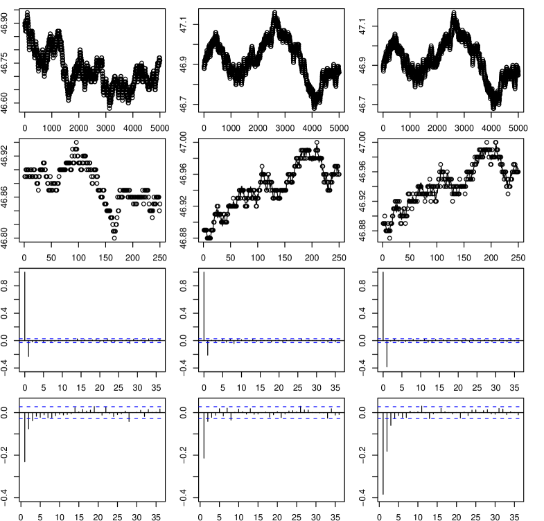

## Table of Contents

## What is microstructure noise in financial markets?

Microstructure noise in financial markets refers to the small, random fluctuations in asset prices that happen very quickly. These fluctuations are caused by things like the way orders are processed, the timing of trades, and the behavior of individual traders. This noise can make it hard to see the true value of an asset because it adds a layer of randomness to the price movements.

Even though microstructure noise might seem small, it can have a big impact on trading and investment strategies. For example, high-frequency traders, who buy and sell assets very quickly, need to account for this noise to make profitable trades. On the other hand, long-term investors might not be as affected by this noise, but it can still make it challenging to predict market trends accurately. Understanding and managing microstructure noise is important for anyone involved in financial markets.

## How does microstructure noise affect financial data analysis?

Microstructure noise can make it harder to analyze financial data accurately. When you look at price data, this noise shows up as small, random changes that don't really tell you much about the true value of an asset. For example, if you're trying to figure out the overall trend of a stock's price, these tiny ups and downs can make it difficult to see the bigger picture. This is because the noise can hide the real patterns and trends that are important for making good investment decisions.

To deal with microstructure noise, analysts often use special methods to clean up the data. They might use techniques like averaging prices over short periods of time or using more advanced statistical models to filter out the noise. By doing this, they can get a clearer view of the market trends and make better predictions. However, it's important to remember that completely removing microstructure noise is tough, so analysts always need to be careful and consider how this noise might affect their analysis.

## What are the common sources of microstructure noise?

Microstructure noise comes from many places in the financial markets. One big source is the way orders are handled. When people buy or sell stocks, their orders go through a system that matches buyers and sellers. Sometimes, the timing of these orders can cause small price changes that don't really mean anything about the stock's true value. Another source is the behavior of traders. Some traders, especially those who trade very quickly, can cause tiny price movements just by the way they place their orders.

Another common source of microstructure noise is the bid-ask spread. This is the difference between the highest price someone is willing to pay for a stock and the lowest price someone is willing to sell it for. This spread can change a lot and cause small price fluctuations. Also, the way information spreads in the market can add to the noise. If news about a company comes out, it might take a little time for everyone to react, and during that time, you can see small, random price changes. All these things together make up the microstructure noise that can make it hard to see the real trends in the market.

## What are the basic models used to describe microstructure noise?

One basic model used to describe microstructure noise is the additive noise model. This model says that the price you see in the market is the true price of the asset plus some random noise. Imagine you're trying to listen to a song, but there's static in the background. The song is like the true price, and the static is the noise. This model helps analysts understand that the prices they see might not always show the real value of an asset because of this extra noise.

Another model is the proportional noise model. This one says that the noise is a certain percentage of the true price. So, if the true price of a stock goes up, the noise goes up too, but always by the same percentage. This model is useful because it shows that the amount of noise can change depending on how much the asset is worth. Both models help people in finance understand and deal with the small, random price changes they see in the market.

## How can microstructure noise be identified in time series data?

To spot microstructure noise in time series data, you need to look closely at the tiny changes in prices over very short periods. Imagine you're watching a stock's price every second. You might see it jump up and down a little bit, even if nothing big has happened in the market. Those tiny jumps are often signs of microstructure noise. You can use special computer programs to help you see these small changes more clearly. These programs can zoom in on the data and show you the noise that's hard to see with just your eyes.

Once you think you've found the noise, you can check if it's really noise by looking at patterns. Noise usually doesn't follow any big, clear patterns. It's more like static on a radio – it's random and doesn't mean anything important about the song you're trying to listen to. To be sure, you might use math formulas to see if the tiny price changes are really just random noise and not part of a bigger trend. By doing this, you can tell the difference between the noise and the real, important changes in the market.

## What statistical methods are used to model microstructure noise?

One common statistical method to model microstructure noise is the use of autoregressive (AR) models. These models look at how past prices can help predict future prices, but they also include a part for the noise. Imagine you're trying to guess the next number in a sequence, but there's always a bit of randomness that you can't predict. AR models help by figuring out how much of the price change is just noise and how much is a real pattern. This way, you can see the bigger trends in the market more clearly.

Another method is the use of state-space models. These models break down the price into two parts: the true price and the noise. It's like trying to listen to a clear song through a noisy speaker. State-space models help by filtering out the noise, so you can hear the song better. They use fancy math to guess what the true price might be, even when there's a lot of noise in the way. This makes it easier for people to make smart decisions about buying and selling stocks.

## How does microstructure noise impact high-frequency trading strategies?

Microstructure noise can make high-frequency trading a lot harder. High-frequency traders buy and sell stocks very quickly, often within seconds or even less. They use computers to find tiny price differences and make money from them. But microstructure noise adds small, random changes to the prices, making it tricky to tell if a price move is a real chance to make money or just noise. This means high-frequency traders need to be really careful and use smart math to figure out which price changes matter and which are just noise.

To deal with microstructure noise, high-frequency traders often use special computer programs and math models. These tools help them see past the noise and find the real price changes they can use to make trades. For example, they might use filters to smooth out the tiny, random price jumps and focus on the bigger trends. Even with these tools, microstructure noise can still mess up their plans, so they always need to keep an eye on it and adjust their strategies to stay ahead in the fast-moving world of high-frequency trading.

## What are the differences between microstructure noise and other types of market noise?

Microstructure noise is the tiny, random changes in stock prices that happen very quickly. It comes from things like how orders are handled, the behavior of traders, and small differences in what people are willing to pay or sell for a stock. This type of noise is important for people who trade very quickly, like high-frequency traders, because they need to see past it to make good trades. Microstructure noise is different from other types of market noise because it happens in a very short time and is caused by the way the market works, not by big news or events.

Other types of market noise can come from things like new information, rumors, or changes in the economy. For example, if a company announces good news, the stock price might jump up and down a lot as people react to the news. This kind of noise is usually bigger and lasts longer than microstructure noise. It's also easier to see because it's tied to something specific happening in the world. While microstructure noise is more about the tiny, random movements that are always there in the background, other market noise is about the bigger, more noticeable changes that come from outside the market itself.

## How can microstructure noise be mitigated in empirical financial research?

In empirical financial research, microstructure noise can be a big problem because it makes it hard to see the real trends in stock prices. To deal with this, researchers often use special math models and computer programs to clean up the data. For example, they might use something called an autoregressive model, which looks at how past prices can help predict future prices while also figuring out how much of the price change is just noise. By using these tools, researchers can filter out the tiny, random price jumps and focus on the bigger, more important patterns in the data.

Another way to reduce microstructure noise is by averaging prices over short periods of time. Instead of looking at the price of a stock every second, researchers might look at the average price over a few minutes. This helps smooth out the small, random changes and gives a clearer picture of what's really happening with the stock's value. While it's tough to get rid of microstructure noise completely, using these methods can help researchers make better sense of the data and draw more accurate conclusions about the market.

## What advanced techniques exist for estimating microstructure noise parameters?

One advanced technique for estimating microstructure noise parameters is the use of the realized volatility approach. This method looks at how much the price of a stock moves around over very short periods of time, like every second or minute. By studying these tiny movements, researchers can figure out how much of the price change is just random noise and how much is a real change in the stock's value. This helps them understand the size and impact of microstructure noise better. The realized volatility approach is useful because it can handle a lot of data and give a good picture of the noise without needing to know a lot about the bigger market trends.

Another technique is the use of the Kalman filter. This method is like a smart tool that can separate the true price of a stock from the noise. Imagine you're trying to listen to a song on a noisy radio. The Kalman filter helps by figuring out what the song should sound like without the static. In finance, it does this by using math to guess what the real price of a stock might be, even when there's a lot of noise in the way. This makes it easier for researchers to see the important price changes and ignore the tiny, random ones that don't mean much. Both the realized volatility approach and the Kalman filter are powerful tools that help researchers deal with microstructure noise and get clearer results from their studies.

## How do different asset classes exhibit varying levels of microstructure noise?

Different types of assets, like stocks, bonds, and currencies, can have different amounts of microstructure noise. Stocks, especially those that trade a lot, often have more microstructure noise because there are so many people buying and selling them all the time. This means the price can jump around a lot, even if nothing big has changed in the company. On the other hand, bonds might have less microstructure noise because they don't trade as often. The price of a bond can be more stable because fewer people are buying and selling it, so the small, random price changes are not as big.

Currencies also show different levels of microstructure noise. In the foreign exchange market, where currencies are traded, the noise can be high because there are so many trades happening all around the world, all the time. This can lead to a lot of tiny price movements that don't really mean much about the true value of the currency. However, some less-traded currencies might have less noise because there are fewer trades, so the price doesn't jump around as much. Understanding how much microstructure noise affects different asset classes is important for anyone who wants to make smart decisions about buying and selling these assets.

## What are the current research frontiers in microstructure noise modeling?

One of the newest areas in microstructure noise modeling is using [machine learning](/wiki/machine-learning) to better understand and predict the noise. Scientists are using smart computer programs to look at lots of data and find patterns that are hard for people to see. These programs can learn from the data and get better at telling the difference between real price changes and the tiny, random ones caused by noise. This could help traders and researchers make better decisions because they can see past the noise more clearly.

Another exciting area is studying how microstructure noise affects different types of markets around the world. Researchers are looking at how the noise changes in places like the stock market in New York, the bond market in Europe, or the currency market in Asia. They want to know if the noise is bigger or smaller in some places and why. This can help people who work in these markets understand the noise better and come up with new ways to deal with it, no matter where they are trading.

## What are Quantitative Models for Microstructure Noise Analysis?

Quantitative models are essential tools for analyzing market microstructure noise and managing its impact on trading strategies. These models provide a framework for understanding and predicting the variations in observed market data due to noise. 

Autoregressive (AR) models are employed to capture the time series characteristics inherent in noisy market data. An AR model predicts future values based on a linear combination of past observations. The general form of an autoregressive model of order $p$, denoted as AR(p), is expressed as:

$$
X_t = c + \phi_1 X_{t-1} + \phi_2 X_{t-2} + \ldots + \phi_p X_{t-p} + \epsilon_t
$$

where $X_t$ represents the value of the time series at time $t$, $c$ is a constant, $\phi_1, \phi_2, \ldots, \phi_p$ are the parameters of the model, and $\epsilon_t$ is white noise. By modeling the sequential dependencies in the data, autoregressive models assist in identifying patterns that may be obscured by microstructure noise.

GARCH (Generalized Autoregressive Conditional Heteroskedasticity) models are well-suited for predicting [volatility](/wiki/volatility-trading-strategies) in asset returns in the presence of noise. These models capture the time-varying volatility often observed in financial time series. A GARCH(p, q) model can be represented as:

$$
\sigma_t^2 = \alpha_0 + \sum_{i=1}^{p} \alpha_i \epsilon_{t-i}^2 + \sum_{j=1}^{q} \beta_j \sigma_{t-j}^2
$$

where $\sigma_t^2$ denotes the conditional variance at time $t$, $\alpha_0$ is a constant term, $\alpha_i$ are the coefficients for past squared innovations, and $\beta_j$ are the coefficients for past variances. By incorporating these elements, GARCH models provide a robust framework for adjusting to variations in financial data volatility induced by market noise.

The Kalman filter, a powerful algorithm in signal processing, is utilized for filtering non-informative noise from observed data. It estimates the hidden states of a dynamic system from noisy measurements. The Kalman filter operates recursively, producing estimates of system parameters that evolve over time. The algorithm consists of two main processes: prediction and update. The prediction step estimates the state at the next time point, while the update step adjusts these predictions with new measurements. This dynamic adjustment makes it a vital tool for real-time signal extraction from noisy financial data, enhancing the clarity and accuracy of the information used for trading decisions.

By integrating these quantitative models, traders and analysts can better navigate the complexities of microstructure noise, facilitating improved decision-making and strategy development in financial markets.

## References & Further Reading

[1]: Hasbrouck, J. (2007). ["Empirical Market Microstructure: The Institutions, Economics, and Econometrics of Securities Trading."](https://academic.oup.com/book/52241) Oxford University Press.

[2]: Gatheral, J., & Oomen, R. (2010). ["Zero-intelligence realized variance estimation."](https://link.springer.com/article/10.1007/s00780-009-0120-1) Review of Financial Studies, 23(11), 4321-4348.

[3]: Zhang, L., Mykland, P. A., & Aït-Sahalia, Y. (2005). ["A Tale of Two Time Scales: Determining Integrated Volatility with Noisy High-Frequency Data."](https://www.princeton.edu/~yacine/twoscales.pdf) Journal of the American Statistical Association, 100(472), 1394-1411.

[4]: Brownlees, C., & Gallo, G. M. (2006). ["Financial econometric analysis at ultra-high frequency: Data handling concerns."](https://www.sciencedirect.com/science/article/abs/pii/S0167947306003458) Computational Statistics & Data Analysis, 50(9), 2319-2340.

[5]: Bouchaud, J.-P., & Potters, M. (2003). ["Theory of Financial Risk and Derivative Pricing: From Statistical Physics to Risk Management."](https://www.cambridge.org/core/books/theory-of-financial-risk-and-derivative-pricing/5BBBA04CE72ED9E5E7C1C028D9A94FCB) Cambridge University Press.