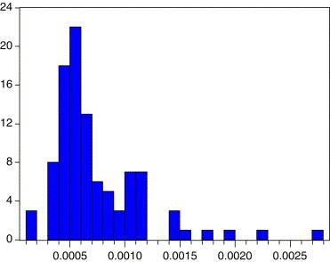

## Table of Contents

## What is microstructure noise?

Microstructure noise is a term used in finance to describe small, random price movements in the stock market. These movements happen because of the way trading works, like when people buy and sell stocks quickly or when there are small delays in getting price information. This noise can make it hard to see the real trends in stock prices because it adds extra, unwanted changes to the data.

Think of it like trying to listen to a quiet conversation in a noisy room. The conversation is the true price movement you want to understand, but the background noise, or microstructure noise, makes it difficult. Researchers and traders try to find ways to filter out this noise so they can make better decisions based on the actual trends in the market.

## How does microstructure noise affect financial markets?

Microstructure noise can make it hard for people in the financial markets to see the real value of stocks. When you look at stock prices, you want to see the big trends that show if a company is doing well or not. But microstructure noise adds little, random changes to these prices. This noise comes from things like quick trades, small delays in price information, or when big orders are split into smaller ones. These small changes can confuse investors and traders, making it tough to tell if a stock is going up or down because of the company's performance or just because of the noise.

Because of microstructure noise, people in the markets have to be careful. They use special tools and methods to try to see past the noise and find the true trends. For example, they might use math formulas to smooth out the data or look at prices over longer periods of time. This helps them make better decisions about buying and selling stocks. If they didn't try to deal with the noise, they might end up making bad choices based on the small, random price movements instead of the real value of the stocks.

## What are the common sources of microstructure noise?

Microstructure noise comes from many small things that happen when people trade stocks. One big source is high-frequency trading, where computers buy and sell stocks very quickly. These quick trades can cause small, random changes in stock prices that don't really show what's happening with the company. Another source is bid-ask spreads, which is the difference between the highest price someone is willing to pay for a stock and the lowest price someone is willing to sell it for. When this spread changes a lot, it can add noise to the price data.

Another source of microstructure noise is the way big orders are handled. Sometimes, if someone wants to buy or sell a lot of stocks, they might break their order into smaller pieces to not affect the market too much. But this can still cause small price changes that look like noise. Also, delays in getting price information can add to the noise. If the price you see is a little out of date, it might not match what's happening in the market right now, adding more random changes to the data.

Overall, microstructure noise comes from the tiny details of how trading works. It's like static on a radio that makes it hard to hear the music clearly. Traders and researchers use special tools to try to filter out this noise so they can see the real trends in stock prices.

## Can you explain the difference between microstructure noise and market noise?

Microstructure noise and market noise are both things that can make it hard to understand what's happening with stock prices, but they come from different places. Microstructure noise is all about the tiny details of how trading works. It comes from things like quick computer trades, the difference between what people are willing to pay and sell stocks for, and small delays in getting price information. These little things can cause random changes in stock prices that don't really show what's happening with the company.

Market noise, on the other hand, is a broader term. It includes all sorts of things that can affect stock prices in ways that don't show the real value of a company. This can include big news events, changes in the overall economy, or even rumors that make people buy or sell stocks. Market noise can make stock prices go up and down a lot, even if the company itself hasn't changed much. So, while microstructure noise is about the small details of trading, market noise is about bigger, more general things that can move the market.

## How can microstructure noise be measured?

Measuring microstructure noise involves looking at the small, random changes in stock prices that happen because of how trading works. One common way to do this is by using something called the realized variance. This method looks at the differences between the prices of stocks over very short periods of time, like seconds or minutes. If these differences are big, it might mean there's a lot of microstructure noise. Researchers can then compare these short-term changes to longer-term trends to see how much of the price movement is just noise.

Another way to measure microstructure noise is by using a tool called the Autocorrelation Function (ACF). This tool helps see if the small price changes are random or if they follow a pattern. If the changes are truly random, it's a sign of microstructure noise. By looking at the ACF over different time periods, researchers can get a better idea of how much noise is in the data. Both of these methods help traders and researchers filter out the noise so they can focus on the real trends in stock prices.

## What are the impacts of microstructure noise on high-frequency trading?

Microstructure noise can be a big problem for high-frequency trading because these traders rely on very small price changes to make quick profits. High-frequency trading uses computers to buy and sell stocks in just a few seconds or even milliseconds. But microstructure noise, which comes from tiny, random price movements, can make it hard for these traders to tell if a price change is real or just noise. If they can't tell the difference, they might make bad trades and lose money.

To deal with microstructure noise, high-frequency traders use special tools and math formulas to try to see past the noise. They might use things like realized variance or autocorrelation functions to measure how much noise is in the data. By understanding and filtering out this noise, they can make better decisions about when to buy and sell stocks. Even though microstructure noise makes things harder, high-frequency traders keep working to find ways to deal with it so they can keep trading quickly and profitably.

## What techniques are used to mitigate the effects of microstructure noise?

To deal with microstructure noise, people in the financial markets use special math formulas and tools. One common way is to use something called realized variance. This method looks at the small changes in stock prices over very short times, like seconds or minutes. By comparing these short-term changes to longer-term trends, traders can figure out how much of the price movement is just noise. Another tool they use is the autocorrelation function, which helps them see if the small price changes are random or if they follow a pattern. If the changes are truly random, it's a sign of microstructure noise, and traders can use this information to filter it out.

Another technique to reduce the impact of microstructure noise is to use something called time-series smoothing. This means looking at stock prices over longer periods of time to smooth out the small, random changes. By doing this, traders can see the bigger trends more clearly. Some traders also use something called volume-weighted average price (VWAP) to help them. VWAP takes into account how many stocks are being traded at different prices, which can help reduce the effect of noise from quick trades or small delays in price information. All these methods help traders make better decisions by focusing on the real value of stocks instead of the noise.

## How does microstructure noise influence asset pricing models?

Microstructure noise can make it harder for asset pricing models to work well. These models try to figure out what a stock is really worth by looking at things like how much money a company makes or how the economy is doing. But when there's a lot of microstructure noise, the small, random changes in stock prices can mess up these models. The noise can make it look like a stock's price is going up or down for no good reason, which can lead to wrong guesses about what the stock is really worth.

To deal with this, people who make asset pricing models use special math tricks to try to see past the noise. They might use methods like realized variance or autocorrelation functions to figure out how much of the price movement is just noise. By filtering out this noise, they can make their models more accurate. This helps them get a better idea of a stock's true value, even when the market is full of small, random price changes.

## What role does microstructure noise play in the estimation of volatility?

Microstructure noise can make it tricky to figure out how much a stock's price might go up and down, which is called volatility. When you're trying to guess how much a stock's price might change, you look at past price movements. But if there's a lot of microstructure noise, these small, random changes can make it look like the stock is more or less volatile than it really is. This can lead to wrong guesses about how much risk there is in buying or selling the stock.

To deal with this, people use special math tricks to try to see past the noise. They might use something called realized variance, which looks at the small price changes over very short times. By comparing these short-term changes to longer-term trends, they can figure out how much of the price movement is just noise and how much is real volatility. This helps them make better guesses about the stock's true risk, even when the market is full of little, random price changes.

## How do different market structures contribute to microstructure noise?

Different market structures can add to microstructure noise in various ways. In markets with lots of high-frequency trading, computers buy and sell stocks very quickly. This can cause small, random changes in stock prices that don't show what's really happening with the company. Also, in markets where there are many different trading places, like stock exchanges and electronic platforms, the prices can be a bit different in each place. This can lead to more noise because it's harder to get a clear picture of the stock's true value.

Another way market structures contribute to microstructure noise is through the way orders are handled. In some markets, big orders might be broken into smaller pieces to not affect the market too much. But this can still cause small price changes that look like noise. Also, if there are delays in getting price information, this can add more noise. For example, if the price you see is a little out of date, it might not match what's happening in the market right now, adding more random changes to the data.

## What are the latest research findings on microstructure noise?

Recent research on microstructure noise has focused on better ways to measure and reduce its impact on stock prices. One big finding is that using machine learning can help a lot. Researchers have found that machine learning models can spot patterns in the noise that other methods might miss. This helps traders and investors see the real trends in stock prices more clearly. Another important finding is that microstructure noise can be different in different markets. For example, it might be more of a problem in markets with a lot of high-frequency trading than in markets where trading is slower.

Another area of recent research is looking at how microstructure noise affects different types of trading strategies. Studies have shown that noise can make some strategies, like high-frequency trading, riskier because these traders rely on very small price changes. But other strategies, like those that look at longer-term trends, might not be affected as much. Researchers are also working on new math formulas to help filter out the noise. These formulas can help traders make better decisions by focusing on the real value of stocks instead of the random changes caused by microstructure noise.

## How can advanced statistical models help in understanding and reducing microstructure noise?

Advanced statistical models can really help people understand and reduce microstructure noise by sorting out the tiny, random changes in stock prices from the real trends. These models use math to look at price data over short times, like seconds or minutes, and figure out how much of the movement is just noise. One way they do this is with something called realized variance, which compares these short-term changes to longer-term trends. By doing this, the models can tell traders which price movements they should pay attention to and which ones they can ignore as noise. This helps traders make better decisions about when to buy and sell stocks, without getting confused by the little, random changes.

Another way advanced statistical models help is by using machine learning to spot patterns in the noise that other methods might miss. These models can learn from past data to predict how much noise there might be in the future. This is really helpful for traders because it lets them see past the noise and focus on the real value of stocks. By using these models, traders can make their strategies less risky and more profitable. Overall, advanced statistical models are important tools that help people in the financial markets deal with microstructure noise and make smarter trading choices.

## What are Quantitative Models for Studying Microstructure Noise?

Quantitative models play a crucial role in analyzing and mitigating microstructure noise in financial markets. These models help traders and investors better understand price fluctuations and improve decision-making processes.

**Autoregressive Models** are fundamental in capturing the time series characteristics of asset prices influenced by microstructure noise. These models describe how the current value of a time series depends on its previous values, thereby highlighting serial correlations between asset prices. The basic form of an autoregressive model of order $p$, AR(p), is:

$$

X_t = c + \phi_1 X_{t-1} + \phi_2 X_{t-2} + \cdots + \phi_p X_{t-p} + \epsilon_t 
$$

where $X_t$ represents the value of the series at time $t$, $c$ is a constant, $\phi_1, \phi_2, \ldots, \phi_p$ are the coefficients, and $\epsilon_t$ is a white noise error term.

**GARCH Models (Generalized Autoregressive Conditional Heteroskedasticity)** are employed to model and predict asset return volatility in the presence of microstructure noise. These models help in understanding the volatility clustering often observed in financial time series, where large changes tend to be followed by large changes, and small changes by small ones. The GARCH(1,1) model is a common specification expressed as:

$$
\sigma_t^2 = \alpha_0 + \alpha_1 \epsilon_{t-1}^2 + \beta_1 \sigma_{t-1}^2
$$

where $\sigma_t^2$ is the conditional variance, $\epsilon_{t-1}^2$ represents the lagged squared residual from the mean equation, and $\alpha_0$, $\alpha_1$, and $\beta_1$ are parameters to be estimated.

**Kalman Filter** is an algorithm widely used to filter out noise from observed price series, providing an estimate of the true asset price by minimizing the mean squared error. It functions by predicting future states of a system and updating predictions based on observed data. The filter operates in two steps: prediction and update. The prediction step formulates the estimated state and error covariance, while the update step revises these estimates with new observations. The Kalman Filter is defined through the following set of equations:

**Prediction:**

- State prediction: $\hat{x}_{t|t-1} = A \hat{x}_{t-1|t-1} + B u_t$
- Covariance prediction: $P_{t|t-1} = A P_{t-1|t-1} A^T + Q$

**Update:**

- Innovation or measurement residual: $y_t = z_t - H \hat{x}_{t|t-1}$
- Innovation covariance: $S_t = H P_{t|t-1} H^T + R$
- Kalman Gain: $K_t = P_{t|t-1} H^T S_t^{-1}$
- State update: $\hat{x}_{t|t} = \hat{x}_{t|t-1} + K_t y_t$
- Covariance update: $P_{t|t} = (I - K_t H) P_{t|t-1}$

Employing these quantitative models, practitioners can enhance their understanding of the complexities introduced by microstructure noise, optimizing trading and investment decision-making in financial markets.

## What is the conclusion?

Microstructure noise is an intrinsic feature of financial markets, playing a dual role by presenting both challenges and opportunities for market participants. The complexity of trading environments necessitates sophisticated strategies to navigate this noise effectively. By employing quantitative models and trading techniques, traders can address the noise effects and enhance the performance of their strategies. These models, such as autoregressive models, GARCH models, and Kalman filters, are instrumental in filtering out unnecessary noise, allowing for clearer analysis and more accurate decision-making.

Quantitative models help delineate the line between genuine market signals and noise, ensuring better-informed trading decisions. For instance, the implementation of the Kalman filter provides a method to estimate the unobserved true price by minimizing the mean squared error, assisting traders in identifying the genuine signals amidst the noise. The equation formulated for a basic Kalman filter can be represented as:

$$
\hat{x}_k = \hat{x}_{k-1} + K_k (z_k - H \hat{x}_{k-1})
$$

where $\hat{x}_k$ represents the estimated true price, $K_k$ is the Kalman gain, $z_k$ is the observed price, and $H$ is the observation matrix.

Moreover, continuous refinement in noise filtering techniques remains pivotal for developing robust and effective [algorithmic trading](/wiki/algorithmic-trading) strategies. As market dynamics evolve, so too must the tools and approaches employed by traders. The incorporation of machine learning techniques, for instance, offers promising advancements in adapting to these changes, by continuously updating models based on new data patterns.

In conclusion, understanding and mitigating microstructure noise is essential for enhancing trading strategy performance. By leveraging advanced quantitative models and consistently refining these approaches, traders can better navigate the complexities of the market, transforming potential challenges into opportunities for profit and strategic advantage.

## References & Further Reading

[1]: Hasbrouck, J. (2007). ["Empirical Market Microstructure: The Institutions, Economics, and Econometrics of Securities Trading."](https://academic.oup.com/book/52241) Oxford University Press.

[2]: Keim, D. B, & Madhavan, A. (1998). ["The Upstairs Market for Large-Block Transactions: Analysis and Measurement of Price Effects."](https://faculty.wharton.upenn.edu/wp-content/uploads/2014/03/KM-RFS1996_1.pdf) The Review of Financial Studies, 11(1), 1-36.

[3]: Cont, R. (2001). ["Empirical properties of asset returns: stylized facts and statistical issues."](http://rama.cont.perso.math.cnrs.fr/pdf/empirical.pdf) Quantitative Finance, 1(2), 223-236.

[4]: Hasbrouck, J. (2009). ["Trading costs and returns for U.S. equities: Estimating effective costs from daily data."](https://pages.stern.nyu.edu/~jhasbrou/Research/GibbsCurrent/HasbrouckJF.pdf) Journal of Finance Economics, 4(12), 213-249.

[5]: O’Hara, M. (1997). ["Market Microstructure Theory."](https://www.wiley.com/en-us/Market+Microstructure+Theory-p-9780631207610) Blackwell Publishers.