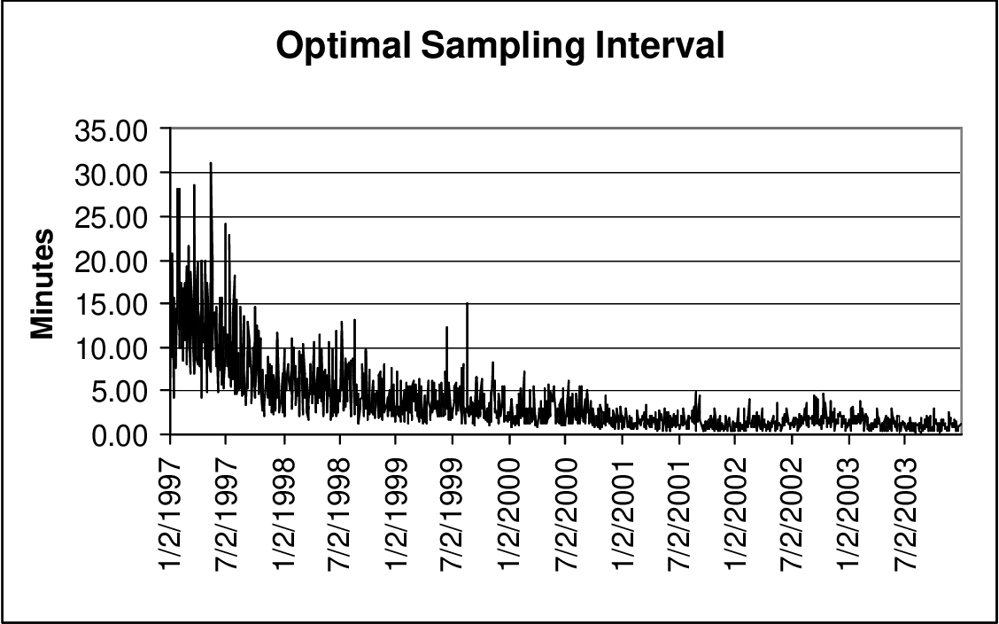

Microstructure noise is a pivotal concept in algorithmic trading, characterized by the deviations observed between asset prices in the market and their intrinsic values or fundamental prices. These discrepancies commonly stem from various market frictions and inefficiencies that can obscure true price signals. Notable contributors to microstructure noise include order processing delays, transaction costs, and strategic or manipulative practices by market participants. For example, order processing delays occur when there is a lag between when a trade order is placed and when it is executed, leading to potential price changes during this interval. Transaction costs, encompassing bid-ask spreads, commissions, and other fees, introduce a wedge between buying and selling prices, thereby creating price discrepancies. Additionally, strategic behaviors such as spoofing—where traders place orders with the intent to cancel before execution—can artificially influence prices without reflecting genuine supply-demand dynamics.

For algorithmic traders, distinguishing between true market signals and microstructure noise is critical for accurate decision-making. The presence of noise complicates the interpretation of price data, making it challenging to extract meaningful information for trading strategies. Thus, it is essential for traders to employ sophisticated models and techniques to filter out noise and identify authentic price movements.



This article will explore the origins of microstructure noise in depth, examining its impact on trading strategies and the methodologies employed to mitigate its effects. By understanding the nuances of microstructure noise, traders can refine their approaches to improve execution quality, reduce market impact, and ultimately enhance trading performance.

## Table of Contents

## Sources of Microstructure Noise

Microstructure noise originates from several sources within financial markets, including order processing delays, transaction costs, strategic behavior of market participants, and the discrete nature of price changes. These elements collectively contribute to the divergences observed between asset prices and their intrinsic values.

Order processing delays result from the time taken between the placement of an order and its execution. During this interval, market conditions may change, causing the executed price to differ from the expected price at the time of order submission. Such delays can arise from limitations in technology infrastructure, congestion in trading volumes, or inefficient order routing systems.

Transaction costs constitute another significant source of microstructure noise. These costs include bid-ask spreads, commissions, and taxes, which create a separation between buying and selling prices. The bid-ask spread, in particular, acts as a primary component of transaction costs, as it represents the difference between the highest price a buyer is willing to pay and the lowest price a seller is willing to accept. This spread leads to noise as it introduces a deviation between the transaction price and the asset's perceived fair value.

Strategic behavior by market participants introduces further noise into the system. Practices such as spoofing and [arbitrage](/wiki/arbitrage) take advantage of temporary inefficiencies or anomalies within the market. Spoofing involves placing large buy or sell orders with no intention of executing them, aiming to manipulate asset prices. Arbitrage exploits minor price discrepancies between markets or related financial instruments, leading to price movements not aligned with fundamental values.

Lastly, the discrete nature of price changes also contributes to microstructure noise. In most trading systems, asset prices move in minimum price increments, known as ticks. These discrete units can result in rounding errors and discrepancies between observed prices and their true economic value. Such rounding can lead to inefficiencies, especially in high-frequency trading scenarios where even slight price differences can be significant. Here is a basic illustration in Python to show how rounding errors might accumulate in a hypothetical trading scenario:

```python
# Python code to simulate rounding issues
price_changes = [0.01, -0.02, 0.03, -0.015, 0.025]  # hypothetical price changes in ticks
actual_changes = [0.011, -0.019, 0.029, -0.014, 0.026]  # actual changes in real value

rounded_cumulative = sum([round(change, 2) for change in price_changes])  # rounding effects
true_cumulative = sum(actual_changes)

print(f"Rounded Cumulative: {rounded_cumulative}")
print(f"True Cumulative: {true_cumulative}")
```

This simulation highlights how consistent rounding to the nearest tick can result in a cumulative error, further illustrating the impact of microstructure noise on asset pricing.

## Quantitative Models for Studying Microstructure Noise

Quantitative models play a crucial role in analyzing and mitigating microstructure noise in financial markets. These models help traders and investors better understand price fluctuations and improve decision-making processes.

**Autoregressive Models** are fundamental in capturing the time series characteristics of asset prices influenced by microstructure noise. These models describe how the current value of a time series depends on its previous values, thereby highlighting serial correlations between asset prices. The basic form of an autoregressive model of order $p$, AR(p), is:

$$

X_t = c + \phi_1 X_{t-1} + \phi_2 X_{t-2} + \cdots + \phi_p X_{t-p} + \epsilon_t 
$$

where $X_t$ represents the value of the series at time $t$, $c$ is a constant, $\phi_1, \phi_2, \ldots, \phi_p$ are the coefficients, and $\epsilon_t$ is a white noise error term.

**GARCH Models (Generalized Autoregressive Conditional Heteroskedasticity)** are employed to model and predict asset return volatility in the presence of microstructure noise. These models help in understanding the volatility clustering often observed in financial time series, where large changes tend to be followed by large changes, and small changes by small ones. The GARCH(1,1) model is a common specification expressed as:

$$
\sigma_t^2 = \alpha_0 + \alpha_1 \epsilon_{t-1}^2 + \beta_1 \sigma_{t-1}^2
$$

where $\sigma_t^2$ is the conditional variance, $\epsilon_{t-1}^2$ represents the lagged squared residual from the mean equation, and $\alpha_0$, $\alpha_1$, and $\beta_1$ are parameters to be estimated.

**Kalman Filter** is an algorithm widely used to filter out noise from observed price series, providing an estimate of the true asset price by minimizing the mean squared error. It functions by predicting future states of a system and updating predictions based on observed data. The filter operates in two steps: prediction and update. The prediction step formulates the estimated state and error covariance, while the update step revises these estimates with new observations. The Kalman Filter is defined through the following set of equations:

**Prediction:**

- State prediction: $\hat{x}_{t|t-1} = A \hat{x}_{t-1|t-1} + B u_t$
- Covariance prediction: $P_{t|t-1} = A P_{t-1|t-1} A^T + Q$

**Update:**

- Innovation or measurement residual: $y_t = z_t - H \hat{x}_{t|t-1}$
- Innovation covariance: $S_t = H P_{t|t-1} H^T + R$
- Kalman Gain: $K_t = P_{t|t-1} H^T S_t^{-1}$
- State update: $\hat{x}_{t|t} = \hat{x}_{t|t-1} + K_t y_t$
- Covariance update: $P_{t|t} = (I - K_t H) P_{t|t-1}$

Employing these quantitative models, practitioners can enhance their understanding of the complexities introduced by microstructure noise, optimizing trading and investment decision-making in financial markets.

## Implications for Trading and Investment Strategies

High-Frequency Trading ([HFT](/wiki/high-frequency-trading-strategies)) leverages rapid execution speeds and sophisticated algorithms to capitalize on minute price fluctuations. However, microstructure noise presents both challenges and opportunities for these firms. Noise-induced price discrepancies can lead to false signals and increased execution risks, potentially degrading strategy performance. Yet, adept traders can exploit noise by executing arbitrage strategies that profit from temporary mispricings. High-frequency traders develop algorithms capable of distinguishing between transient noise and meaningful price shifts, thereby enhancing strategy resilience and profitability.

For long-term investors, understanding microstructure noise is essential in minimizing transaction costs and optimizing trade execution. By recognizing and accounting for the intraday [volatility](/wiki/volatility-trading-strategies) introduced by noise, investors can develop strategies to execute large orders more efficiently. Reducing slippage and timing trades to avoid peak noise periods may lead to improved portfolio performance over time. Employing execution algorithms that break down large trades into smaller, less market-impacting parts helps in achieving better pricing and reducing overall transaction expenses.

Risk management is another critical area where discerning between noise and genuine market signals is crucial for traders and investors. Misinterpreting noise for real market trends can lead to poor decision-making and exposure to undue risk. Accurate risk assessment hinges on the ability to filter out this noise, ensuring portfolio optimizations are based on reliable data. Quantitative models, like the Kalman filter, can assist in differentiating noise from informational signals by estimating the true underlying price, enhancing the integrity of risk models and leading to more robust portfolio management strategies.

Incorporating advanced statistical techniques and leveraging [machine learning](/wiki/machine-learning) algorithms help traders and investors refine their approaches to managing microstructure noise. As markets evolve and become more complex, ongoing adaptation and refinement of strategies remain paramount in ensuring optimal trading and investment performance.

## Strategies to Mitigate Microstructure Noise

Sophisticated algorithms are essential for effectively navigating microstructure noise in financial markets. Statistical arbitrage and [market making](/wiki/market-making) are two prominent strategies that robust algorithms can implement to account for the inherent noise in price data.

Statistical arbitrage involves taking advantage of pricing inefficiencies by employing quantitative models to predict asset returns. By monitoring short-term deviations from historical relationships between asset prices, these strategies can identify profitable trading opportunities amidst noise. Market making, on the other hand, entails providing [liquidity](/wiki/liquidity-risk-premium) by simultaneously offering to buy and sell an asset. By exploiting the bid-ask spread, market makers can profit from frequent trades, thereby mitigating the impact of noise.

Advanced models play a crucial role in improving signal detection amid microstructure noise. Kalman filters, for instance, are powerful tools for filtering time series data to estimate the true underlying asset prices. By minimizing the mean squared error between observed and estimated prices, Kalman filters help traders distinguish genuine market signals from noise. Additionally, machine learning techniques enhance model robustness by training on vast datasets to refine noise filtering and prediction accuracy. These methods can adaptively capture nonlinearities and complex patterns that traditional statistical models may overlook.

Continuous refinement of trading strategies is vital to staying attuned to the dynamically changing trading environments and noise characteristics. Algorithmic traders must frequently update their models and strategies to incorporate new data, regulatory changes, and evolving market behaviors. Adaptive algorithms, capable of learning from live market data, further improve performance by adjusting parameters in real time.

Overall, the effective mitigation of microstructure noise is crucial for the development of robust trading strategies. By integrating sophisticated algorithms, advanced modeling techniques, and continual strategy refinement, traders can reduce the adverse effects of noise and improve their decision-making accuracy in volatile markets.

## Conclusion

Microstructure noise is an intrinsic feature of financial markets, playing a dual role by presenting both challenges and opportunities for market participants. The complexity of trading environments necessitates sophisticated strategies to navigate this noise effectively. By employing quantitative models and trading techniques, traders can address the noise effects and enhance the performance of their strategies. These models, such as autoregressive models, GARCH models, and Kalman filters, are instrumental in filtering out unnecessary noise, allowing for clearer analysis and more accurate decision-making.

Quantitative models help delineate the line between genuine market signals and noise, ensuring better-informed trading decisions. For instance, the implementation of the Kalman filter provides a method to estimate the unobserved true price by minimizing the mean squared error, assisting traders in identifying the genuine signals amidst the noise. The equation formulated for a basic Kalman filter can be represented as:

$$
\hat{x}_k = \hat{x}_{k-1} + K_k (z_k - H \hat{x}_{k-1})
$$

where $\hat{x}_k$ represents the estimated true price, $K_k$ is the Kalman gain, $z_k$ is the observed price, and $H$ is the observation matrix.

Moreover, continuous refinement in noise filtering techniques remains pivotal for developing robust and effective [algorithmic trading](/wiki/algorithmic-trading) strategies. As market dynamics evolve, so too must the tools and approaches employed by traders. The incorporation of machine learning techniques, for instance, offers promising advancements in adapting to these changes, by continuously updating models based on new data patterns.

In conclusion, understanding and mitigating microstructure noise is essential for enhancing trading strategy performance. By leveraging advanced quantitative models and consistently refining these approaches, traders can better navigate the complexities of the market, transforming potential challenges into opportunities for profit and strategic advantage.

## References & Further Reading

[1]: Hasbrouck, J. (2007). ["Empirical Market Microstructure: The Institutions, Economics, and Econometrics of Securities Trading."](https://academic.oup.com/book/52241) Oxford University Press.

[2]: Keim, D. B, & Madhavan, A. (1998). ["The Upstairs Market for Large-Block Transactions: Analysis and Measurement of Price Effects."](https://faculty.wharton.upenn.edu/wp-content/uploads/2014/03/KM-RFS1996_1.pdf) The Review of Financial Studies, 11(1), 1-36.

[3]: Cont, R. (2001). ["Empirical properties of asset returns: stylized facts and statistical issues."](http://rama.cont.perso.math.cnrs.fr/pdf/empirical.pdf) Quantitative Finance, 1(2), 223-236.

[4]: Hasbrouck, J. (2009). ["Trading costs and returns for U.S. equities: Estimating effective costs from daily data."](https://pages.stern.nyu.edu/~jhasbrou/Research/GibbsCurrent/HasbrouckJF.pdf) Journal of Finance Economics, 4(12), 213-249.

[5]: O’Hara, M. (1997). ["Market Microstructure Theory."](https://www.wiley.com/en-us/Market+Microstructure+Theory-p-9780631207610) Blackwell Publishers.