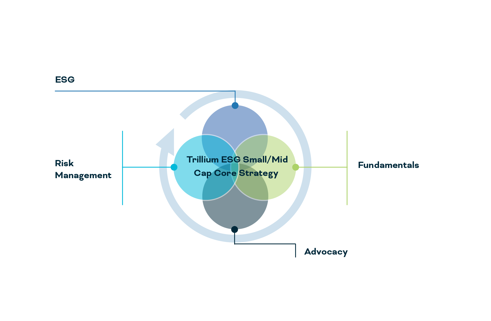

## Table of Contents

## What is a mid-cap company?

A mid-cap company is a business that has a market value, or market capitalization, that is in the middle range. Specifically, mid-cap companies usually have a market value between $2 billion and $10 billion. They are bigger than small-cap companies but smaller than large-cap companies. Investors often see mid-cap companies as a good balance between growth potential and stability.

These companies are often in a growth phase. They have moved past the startup stage but are not yet as big and established as large-cap companies. This means they might grow faster than large companies but are usually more stable than small companies. Mid-cap companies can be found in many different industries, and they offer investors a way to diversify their portfolios.

## What does ESG stand for and why is it important in investing?

ESG stands for Environmental, Social, and Governance. These are three important areas that investors look at when they want to make sure a company is doing good things for the world and is run well. Environmental factors look at how a company affects the planet, like if it pollutes or uses a lot of energy. Social factors check how a company treats people, like its workers, customers, and the community. Governance is about how the company is managed and if it follows the rules and does things in an honest way.

[ESG](/wiki/esg-investing) is important in investing because it helps investors pick companies that are not just making money, but also doing good things. When a company does well in ESG, it can be a sign that it will do well in the future too. For example, a company that takes care of the environment might avoid big fines or problems later on. Also, companies that treat people well often have happier workers who work harder, which can make the company more successful. By looking at ESG, investors can find companies that are likely to be strong and successful over time.

## How do mid-cap companies differ from small-cap and large-cap companies in terms of ESG performance?

Mid-cap companies often have different ESG performance compared to small-cap and large-cap companies. Mid-cap companies are in a growth phase, so they might not have as much money or resources as large-cap companies to put into ESG initiatives. But, they can be more flexible than large companies and can make changes more quickly. This means they might be able to improve their ESG performance faster than large companies. On the other hand, mid-cap companies might not have as much attention on ESG as large companies, which can make it harder for them to get better at it.

Small-cap companies usually have even less money and resources than mid-cap companies, which can make it hard for them to focus on ESG. They might be more focused on just staying in business and growing, so ESG might not be their top priority. But, some small companies can be very good at ESG because they are new and can start with good practices from the beginning. Large-cap companies, on the other hand, often have more resources and attention on ESG. They might have big programs to help the environment, treat people well, and make sure they are run in a good way. But, because they are so big, it can take a long time for them to make big changes in their ESG performance.

## What are the key ESG factors to consider when investing in mid-cap companies?

When investing in mid-cap companies, it's important to look at their environmental factors. This means checking if they are doing things that help or hurt the planet. For example, do they use a lot of energy or do they try to use less? Are they working to reduce pollution or waste? Mid-cap companies might not have as much money as big companies to spend on these things, but they can still make a big difference if they try. It's good to see if they have plans to get better at helping the environment over time.

Social factors are also key when looking at mid-cap companies. This involves seeing how they treat their workers, customers, and the community around them. Do they pay their workers fairly and make sure they are safe at work? Do they help the community or just take from it? Mid-cap companies can be good at this because they are not too big and can change things quickly if they need to. It's important to see if they care about these things and are trying to do better.

Lastly, governance is something to think about with mid-cap companies. This is about how the company is run and if it follows the rules. Are the people in charge honest and do they make good decisions? Do they listen to what shareholders want? Mid-cap companies might not have as many rules to follow as big companies, but they still need to be run well. It's good to see if they have clear rules and if they are trying to be better at governance.

## How can investors identify mid-cap companies with strong ESG practices?

Investors can identify mid-cap companies with strong ESG practices by looking at reports and ratings from groups that study ESG. These groups give scores to companies based on how well they do in environmental, social, and governance areas. Investors can use these scores to find mid-cap companies that are doing a good job. Also, it's helpful to read what the companies themselves say about their ESG efforts. Many companies put out reports that explain what they are doing to help the environment, treat people well, and run their business in a good way.

Another way to find mid-cap companies with strong ESG practices is to talk to the companies directly. Investors can ask questions about what the company is doing to improve its ESG performance. This can give a good idea of how serious the company is about these things. Also, looking at what other people say about the company can help. This includes news articles, reviews from workers, and comments from the community. If a lot of people say good things about the company's ESG efforts, it's a sign that the company is doing well in these areas.

## What are some common ESG investment strategies specifically tailored for mid-cap companies?

One common ESG investment strategy for mid-cap companies is to focus on companies that are making big improvements in their ESG performance. Investors look for mid-cap companies that are not just doing well now, but are also working hard to get even better. This might mean a company is trying to use less energy, treat its workers better, or make sure it follows all the rules. By investing in these companies, investors can help them grow and do more good things for the world.

Another strategy is to use ESG ratings and reports to pick mid-cap companies. There are groups that study how well companies do in environmental, social, and governance areas. They give scores to companies, and investors can use these scores to find mid-cap companies that are doing a good job. This helps investors make sure their money is going to companies that care about the planet, people, and doing things the right way.

A third strategy is to invest in mid-cap companies that are leaders in their industry when it comes to ESG. These companies might be doing things that other companies in their industry are not doing yet. For example, a mid-cap company might be the first in its industry to use clean energy or to have a program to help the community. By investing in these companies, investors can support the ones that are setting a good example for others to follow.

## How do ESG ratings and scores impact investment decisions in mid-cap companies?

ESG ratings and scores help investors decide which mid-cap companies to invest in. These ratings show how well a company is doing in taking care of the environment, treating people well, and running the business in a good way. When a mid-cap company has a high ESG score, it means they are doing a good job in these areas. Investors like this because it can mean the company will do well in the future. They might avoid companies with low ESG scores because those companies might have problems later on.

Using ESG ratings and scores can also help investors find mid-cap companies that are trying to get better. If a company is working hard to improve its ESG performance, it might be a good investment. Investors can see if a company is making plans to use less energy, treat workers better, or follow more rules. This shows that the company cares about doing things the right way and might grow and do well in the future.

## What are the potential risks and challenges associated with ESG investing in mid-cap companies?

One big challenge with ESG investing in mid-cap companies is that they might not have as much money or resources as big companies to spend on ESG efforts. This can make it hard for them to do as well in environmental, social, and governance areas. They might want to do good things, but they might not have the money to do them right away. Also, mid-cap companies might not get as much attention from groups that give ESG ratings and scores. This means it can be harder for investors to find good information about how well these companies are doing in ESG.

Another risk is that mid-cap companies can be more affected by changes in the market or the economy. If something bad happens, like a recession, these companies might have a harder time keeping up their ESG efforts. They might need to focus more on just staying in business and making money, which can make them put ESG on the back burner. This can be a problem for investors who want to make sure their money is going to companies that are doing good things for the world.

## How can ESG integration enhance the financial performance of mid-cap investments?

ESG integration can help mid-cap companies do better financially by making them more attractive to investors. When a mid-cap company does well in environmental, social, and governance areas, it can show investors that the company is run well and cares about the future. This can make more people want to invest in the company, which can help it grow and make more money. Also, companies that do well in ESG might avoid big problems like fines for polluting or lawsuits for treating workers badly. This can save them a lot of money and help them do better financially.

Another way ESG integration can help mid-cap companies is by making them more efficient and innovative. When a company tries to use less energy or waste less, it can save money and be more profitable. Also, companies that treat their workers well often have happier and more productive employees. This can help the company do better and make more money. By focusing on ESG, mid-cap companies can find new ways to grow and be successful, which can make them a good choice for investors looking for strong financial performance.

## What role do regulatory environments play in shaping ESG strategies for mid-cap companies?

Regulatory environments can have a big impact on how mid-cap companies approach ESG strategies. When there are strict rules about things like pollution or worker safety, mid-cap companies have to follow them. This can push them to do better in environmental and social areas. For example, if there are new laws about reducing carbon emissions, a mid-cap company might need to change how it does things to meet these rules. This can help the company improve its ESG performance and make it more attractive to investors who care about these things.

On the other hand, if the regulatory environment is not very strict, mid-cap companies might not feel as much pressure to focus on ESG. They might put more effort into growing their business and making money instead. But even without strict rules, some mid-cap companies might still choose to do well in ESG because it can help them in the long run. They might see that doing good things for the environment, treating people well, and following good governance practices can make them more successful and attract more investors.

## How can investors measure and track the ESG impact of their mid-cap investments over time?

Investors can measure and track the ESG impact of their mid-cap investments by using ESG ratings and scores from groups that study these things. These groups look at how well a company is doing in environmental, social, and governance areas and give them a score. Investors can check these scores over time to see if the company is getting better or worse in ESG. Also, many mid-cap companies put out their own reports about their ESG efforts. Investors can read these reports to see what the company is doing and if it is making progress.

Another way to track ESG impact is by using special tools and platforms that help investors keep an eye on their investments. These tools can show how a company's ESG performance is changing and can even give alerts if something big happens. Investors can also talk to the companies directly and ask them questions about their ESG efforts. This can give a good idea of how serious the company is about improving its ESG performance over time. By using these methods, investors can make sure their mid-cap investments are doing good things for the world and are likely to do well in the future.

## What advanced tools and methodologies are available for optimizing ESG investment strategies in mid-cap companies?

Investors can use advanced tools like ESG data analytics platforms to optimize their investment strategies in mid-cap companies. These platforms collect a lot of data about how companies are doing in environmental, social, and governance areas. They use this data to give investors detailed reports and scores. This helps investors see which mid-cap companies are doing well in ESG and which ones are not. Some platforms even use [artificial intelligence](/wiki/ai-artificial-intelligence) to find patterns and predict how a company's ESG performance might change in the future. This can help investors make smarter choices about where to put their money.

Another way to optimize ESG investment strategies is by using methodologies like the Sustainable Accounting Standards Board (SASB) framework. This framework helps investors understand which ESG issues are most important for different industries. For mid-cap companies, this can mean focusing on specific things that matter most for their type of business. For example, a mid-cap company in the energy sector might need to focus more on environmental issues, while a company in the tech sector might need to focus more on social issues like data privacy. By using these methodologies, investors can make sure their mid-cap investments are aligned with the most important ESG factors for each company.

## References & Further Reading

[1]: Friede, G., Busch, T., & Bassen, A. (2015). ["ESG and financial performance: Aggregated evidence from more than 2000 empirical studies."](https://www.tandfonline.com/doi/full/10.1080/20430795.2015.1118917) Journal of Sustainable Finance & Investment, 5(4), 210-233.

[2]: Khan, M., Serafeim, G., & Yoon, A. (2016). ["Corporate sustainability: First evidence on materiality."](https://www.semanticscholar.org/paper/Corporate-Sustainability%3A-First-Evidence-on-Khan-Serafeim/7fcd60dd4feceb576f44d138c94a04644eeb5537) The Accounting Review, 91(6), 1697-1724.

[3]: S&P Dow Jones Indices. (2020). ["Mid-Cap Investing: A Window of Opportunity."](https://www.spglobal.com/spdji/en/)

[4]: Lopez de Prado, M. (2018). ["Advances in Financial Machine Learning."](https://www.amazon.com/Advances-Financial-Machine-Learning-Marcos/dp/1119482089) Wiley.

[5]: Rizk, J. (2013). ["Algorithmic Trading and Market Dynamics."](https://www.jstor.org/stable/43303831) Journal of Trading, 9(1), 37-48.

[6]: Principles for Responsible Investment. (2018). ["A Practical Guide to ESG Integration for Equity Investing."](https://www.icgn.org/sites/default/files/2021-08/PRI_apracticalguidetoesgintegrationforequityinvesting.pdf)

[7]: Schwartz, R. A., & Peng, L. (2011). ["Algorithmic Trading: Its History and Its Future."](https://link.springer.com/content/pdf/10.1007/978-3-030-91231-4_39) Journal of Investment Management, 9(4), 1-8.

[8]: Jansen, S. (2021). ["Machine Learning for Algorithmic Trading."](https://github.com/stefan-jansen/machine-learning-for-trading) Packt Publishing.