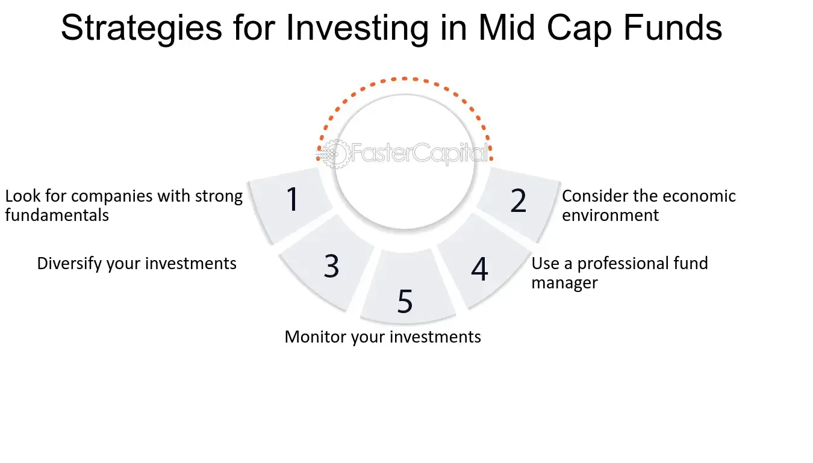

Investing in the stock market offers a broad array of opportunities to investors looking to maximize returns while managing risk. Among the various types of stocks, mid-cap stocks emerge as an intriguing segment that balances growth potential and stability. These stocks, representing companies with market capitalizations between $2 billion and $10 billion, occupy a strategic position between small-cap stocks, which are known for their high growth potential but greater volatility, and large-cap stocks, renowned for their stability but slower growth.

The advent of algorithmic trading, often referred to as algo trading, has brought about a significant transformation in how investors engage with mid-cap stocks. Algo trading utilizes complex algorithms and automated systems to make trading decisions, execute transactions, and manage portfolios. This technology has revolutionized investment strategies by enhancing trading efficiency and accuracy.



In this article, we explore investment strategies that optimally combine the potential of mid-cap stocks with the technological advantages offered by algorithmic trading. By integrating these approaches, investors can aim for improved market performance. Readers will gain valuable insights into the benefits, risks, and strategies of using algorithms to invest in mid-cap stocks, highlighting examples and practical applications within this intriguing segment of the stock market.

## Table of Contents

## Understanding Mid-Cap Stocks

Mid-cap stocks refer to shares of companies whose market capitalization ranges from $2 billion to $10 billion. They are often considered the middle ground between small-cap and large-cap stocks, offering a balanced mix of risks and returns. Investors are attracted to mid-cap stocks for several reasons.

Firstly, they are perceived as providing moderate risk with potentially high returns. This perception arises from the fact that mid-cap companies are typically in a stage of significant growth, having moved beyond the initial phases of business development typical of small-cap stocks. These companies have established business models and are often on the path to further expansion, which can lead to substantial appreciation in stock value.

Secondly, the growth trajectories of mid-cap companies make them appealing investment opportunities. With established revenue streams and proven products or services, these companies are often positioned for continued development and market penetration. This growth potential is enhanced by the fact that mid-caps are large enough to access capital markets but still small enough to be agile and responsive to market changes.

Lastly, mid-cap stocks offer resilience to economic shifts compared to small-cap stocks and promise more growth than large-cap stocks. During periods of economic [volatility](/wiki/volatility-trading-strategies), mid-caps tend to perform better than small-caps due to their established market presence and operational efficiencies. Conversely, they offer more growth opportunities than large-caps, as these larger companies are often encumbered by slower growth rates due to their already substantial market share.

As a result, mid-cap stocks present a compelling choice for investors seeking a balance between stability and growth. The ability of mid-cap companies to withstand economic volatility while providing higher growth potential than their large-cap counterparts makes them a versatile addition to diversified investment portfolios.

## Investment Strategies for Mid-Cap Stocks

Passive buy-and-hold strategies involving mid-cap exchange-traded funds (ETFs) are widely favored by risk-averse investors. These strategies typically involve purchasing shares of mid-cap ETFs and holding them over the long term, irrespective of market fluctuations. This approach benefits from the inherent diversification of ETFs, which spread investment across a variety of mid-cap stocks, thereby mitigating the risks associated with individual securities. Additionally, mid-cap ETFs offer a straightforward mechanism for gaining exposure to the potential growth of mid-sized companies, without the need for active management.

Value and growth investing strategies are also applicable within the mid-cap segment. Value investing focuses on identifying mid-cap stocks that are undervalued by the market, analyzing financial metrics such as the price-to-earnings ratio, price-to-book ratio, and dividend yield to find stocks trading for less than their intrinsic value. On the other hand, growth investing targets mid-cap stocks with above-average growth potential, often emphasizing companies with high earnings growth rates, robust revenue increases, and strong market positions in expanding industries. Combining these strategies allows investors to capitalize on both undervalued opportunities and high-growth prospects in the mid-cap space.

Custom strategy development is essential for effectively targeting mid-cap stocks. By leveraging qualitative and quantitative factors, investors can create bespoke strategies tailored to specific market conditions and individual risk tolerances. Qualitative analysis might involve assessing management quality or competitive advantage, while quantitative analysis could include financial metrics analysis or statistical models to predict stock movements. For instance, using Python, an investor could implement a quantitative strategy by developing algorithms to process historical stock data and identify patterns or anomalies that suggest potential investment opportunities:

```python
import pandas as pd
import numpy as np

# Example: Simple moving average crossover strategy
def moving_average_crossover_strategy(prices, short_window=50, long_window=200):
    signals = pd.DataFrame(index=prices.index)
    signals['price'] = prices
    signals['short_mavg'] = prices.rolling(window=short_window, min_periods=1, center=False).mean()
    signals['long_mavg'] = prices.rolling(window=long_window, min_periods=1, center=False).mean()
    signals['signal'] = 0.0
    signals['signal'][short_window:] = np.where(signals['short_mavg'][short_window:] > signals['long_mavg'][short_window:], 1.0, 0.0)
    signals['positions'] = signals['signal'].diff()
    return signals

# Assuming 'mid_cap_prices' is a DataFrame containing stock prices for mid-cap stocks
signals = moving_average_crossover_strategy(mid_cap_prices)
```

Sector-specific approaches, focusing on particular industries like technology or healthcare, can also yield substantial rewards. Mid-cap companies often operate in niche markets or emerging sectors with considerable growth potential. Industry research and trend analysis allow investors to pinpoint promising sectors and allocate resources accordingly. For example, technology mid-caps may thrive due to innovations in software or digital services, while healthcare mid-caps might benefit from advances in medical technologies or pharmaceuticals. By adopting a sector-focused strategy, investors can enhance their portfolios by tapping into the strengths of dynamic industries.

By combining these strategies, investors can tailor their approach to find an optimal balance of risk and return.

## The Role of Algo Trading in Mid-Cap Investments

Algorithmic trading, or algo trading, has become a pivotal tool for investors, particularly when dealing with mid-cap stocks. The dynamic nature of these stocks, characterized by moderate [liquidity](/wiki/liquidity-risk-premium) and price volatility, necessitates rapid and precise trading decisions. Algo trading addresses these needs by automating the trading process. 

Algorithms can swiftly execute trades at optimal prices by processing vast amounts of market data to identify advantageous conditions. For instance, an algorithm can be configured to execute a buy order when a mid-cap stock's price falls below a certain threshold and a sell order when it rises above another, ensuring timely execution that manual trading cannot match.

The core advantage of [algorithmic trading](/wiki/algorithmic-trading) lies in its ability to analyze large datasets and detect patterns that may not be immediately discernible to human traders. By leveraging statistical models and [machine learning](/wiki/machine-learning) techniques, algorithms can improve decision-making accuracy. For example, a model might use historical data to predict future price movements, allowing traders to position themselves advantageously.

Mean reversion, [momentum](/wiki/momentum) trading, and statistical [arbitrage](/wiki/arbitrage) are among the most popular strategies employed in algo trading:

1. **Mean Reversion** assumes that stock prices will return to their historical averages over time. Algorithms implementing this strategy might monitor prices and execute trades when deviations from average prices are identified.

2. **Momentum Trading** involves taking positions based on the strength of recent price trends. An algorithm might, for instance, go long on stocks that have shown upward momentum and short stocks with downward momentum, aiming to capitalize on continuing trends.

3. **Statistical Arbitrage** relies on identifying and exploiting price inefficiencies between related stock instruments. Algorithms can pinpoint discrepancies and execute trades to profit from eventual price corrections.

Incorporating algorithmic trading in mid-cap stock investments often leads to reduced transaction costs. By optimizing trade execution timing and minimizing the market impact of large orders, algo trading is instrumental in cost-efficient investment management. As a result, investors aiming to maximize returns on mid-cap stocks frequently turn to algorithmic strategies, which can balance the twin demands of speed and precision critical in today's financial markets.

## Challenges and Considerations

Mid-cap stocks, positioned between small-cap and large-cap stocks, face distinct challenges predominantly stemming from their size and operational capacity. One primary challenge is their limited market visibility compared to larger companies. This often translates to lesser analyst coverage and media attention, potentially leading to inefficient pricing and slower response to market changes. Additionally, mid-cap companies tend to have fewer resources than their larger counterparts, which might limit their ability to scale operations, invest in research and development, or absorb economic shocks.

Algorithmic trading, while offering significant advantages, demands considerable technological investment. Implementing algo trading requires advanced infrastructure capable of executing trades at high speed and precision. Furthermore, the expertise in coding and market analysis is critical to developing effective algorithms. These algorithms must process and analyze vast amounts of market data to uncover trading opportunities, which can be a resource-intensive process.

Another significant consideration is regulatory complexity. The financial markets are subject to evolving regulations, and algorithmic trading is under constant scrutiny by regulators concerned about its impact on market stability. Traders utilizing these technologies must ensure compliance with the regulatory frameworks, which can vary between jurisdictions and add another layer of complexity.

Moreover, algorithmic trading can contribute to increased market volatility, particularly in mid-cap stocks that already exhibit higher volatility than large-caps. This increased volatility can pose risks, such as sudden price swings, which may affect the stability of an investor's portfolio.

Investors must also consider the costs associated with algorithm development and maintenance, as well as the potential need for ongoing adjustments to trading strategies. This requires an ongoing commitment to monitor market conditions and refine strategy parameters to ensure they remain effective amidst changing market dynamics.

## Conclusion

Investing in mid-cap stocks with the assistance of algorithmic trading provides an effective balance between risk and return. Mid-cap stocks strike a favorable harmony, combining elements of stability and growth potential not typically found in small-cap or large-cap stocks. This dynamic makes them an appealing option for investors looking to optimize their portfolios. Algorithmic trading further enhances this balance by leveraging technology to execute trades with precision and speed, which is particularly advantageous in the relatively less liquid mid-cap space.

The integration of algorithmic trading allows investors to tap into data-driven insights, enabling them to identify optimum entry and [exit](/wiki/exit-strategy) points more accurately. By utilizing algorithms, an investor can mitigate some of the inherent risks associated with human decision-making, such as emotional bias or computational limitations. In a fast-paced market environment, reducing latency in trade executions contributes to better price execution and potentially reduces transaction costs.

For investors seeking to maximize their portfolio's performance, embedding mid-cap stocks into a diversified investment strategy offers notable benefits. Diversification not only helps in spreading risk across different asset types but also takes advantage of the unique growth characteristics of mid-caps, which can provide superior returns during certain economic cycles.

In conclusion, the coupling of mid-cap stocks with algorithmic trading techniques represents a thoughtful approach to achieving long-term investment goals. As they continue to evolve with technological advancements and market conditions, mid-caps can be an integral component of a well-rounded investment portfolio.

## FAQs

**What are the differences between mid-cap, small-cap, and large-cap stocks?**

Market capitalization classifies stocks into different categories, namely small-cap, mid-cap, and large-cap, based on the total value of a company's outstanding shares. Small-cap stocks typically have a market capitalization ranging from about $300 million to $2 billion. These stocks often represent new or smaller companies with high growth potential but are also more susceptible to market volatility and economic fluctuations. 

Mid-cap stocks have a market capitalization between $2 billion and $10 billion. They offer a balance between growth potential and stability. Mid-cap companies usually possess well-established business models and may be on the verge of expanding their market reach, making them appealing to investors looking for companies that can leverage growth opportunities more effectively than large-caps and are less volatile compared to small-caps.

Large-cap stocks have a market capitalization of $10 billion or more. They generally represent larger, well-established companies known for stability and consistent performance. While large-cap stocks tend to offer lower growth potential compared to mid and small-caps, they are perceived as safer investments, often providing regular dividends and steady appreciation.

**How can algorithmic trading enhance investment strategies in the mid-cap segment?**

Algorithmic trading, or algo trading, utilizes computer algorithms to execute trades at optimal speeds and prices, which is particularly beneficial in managing the volatility often associated with mid-cap stocks. By analyzing substantial datasets to identify and act upon market patterns swiftly, algorithms can enhance decision-making accuracy and efficiency. Common strategies like mean reversion and momentum trading can be particularly effective in the mid-cap segment as they capitalize on short-term market movements and trends, which mid-cap stocks frequently exhibit. 

For instance, a mean reversion strategy might predict that if a mid-cap stock's price deviates significantly from its historical average, it will likely revert to that average. Using Python, a simple mean reversion algorithm could be structured as follows:

```python
import pandas as pd

def moving_average(data, window_size):
    return data.rolling(window=window_size).mean()

def mean_reversion_strategy(prices, window_size, threshold):
    signals = []
    moving_avg = moving_average(prices, window_size)

    for i in range(window_size, len(prices)):
        if prices[i] < moving_avg[i] - threshold:
            signals.append('buy')
        elif prices[i] > moving_avg[i] + threshold:
            signals.append('sell')
        else:
            signals.append('hold')
    return signals

# Example usage with pandas DataFrame
prices = pd.Series([your_data]) 
signals = mean_reversion_strategy(prices, window_size=20, threshold=0.05)
```

This assists investors in executing trades based on historical price movements, optimizing timing, and potentially reducing transaction costs.

**What are the key metrics to identify potential mid-cap growth and value stocks?**

To identify growth and value opportunities within mid-cap stocks, investors examine several financial and performance metrics:

1. **Price-to-Earnings (P/E) Ratio**: This is a crucial metric in evaluating a company’s relative value. Lower P/E ratios may indicate undervaluation, while higher ratios might signify growth stocks that investors anticipate will grow earnings. 

2. **Price-to-Book (P/B) Ratio**: This ratio helps assess the market's valuation of a company compared to its book value. A low P/B could suggest a stock is undervalued, whereas a higher ratio might hint at growth potential.

3. **Earnings Growth Rate**: For growth investors, a company’s historical and projected earnings growth rate is essential as it indicates the potential for future profitability.

4. **Return on Equity (ROE)**: This measures a company's profitability relative to shareholder equity and can highlight how effectively a company uses invested funds to generate growth.

5. **Debt-to-Equity Ratio**: Lower ratios suggest a company is less reliant on borrowing, which could be crucial for stability, especially in volatile markets.

By scrutinizing these metrics, investors can better discern which mid-cap stocks possess solid fundamentals and growth trajectories, aligning with either growth or value investment strategies.

## References & Further Reading

[1]: Bergstra, J., Bardenet, R., Bengio, Y., & Kégl, B. (2011). ["Algorithms for Hyper-Parameter Optimization."](https://papers.nips.cc/paper/4443-algorithms-for-hyper-parameter-optimization) Advances in Neural Information Processing Systems 24.

[2]: ["Advances in Financial Machine Learning"](https://www.amazon.com/Advances-Financial-Machine-Learning-Marcos/dp/1119482089) by Marcos Lopez de Prado

[3]: ["Evidence-Based Technical Analysis: Applying the Scientific Method and Statistical Inference to Trading Signals"](https://www.amazon.com/Evidence-Based-Technical-Analysis-Scientific-Statistical/dp/0470008741) by David Aronson

[4]: ["Machine Learning for Algorithmic Trading"](https://github.com/stefan-jansen/machine-learning-for-trading) by Stefan Jansen

[5]: ["Quantitative Trading: How to Build Your Own Algorithmic Trading Business"](https://www.amazon.com/Quantitative-Trading-Build-Algorithmic-Business/dp/1119800064) by Ernest P. Chan