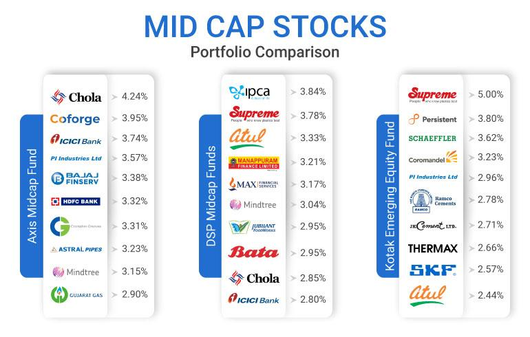

The financial landscape is continuously evolving with the emergence of innovative technologies and investment opportunities that reshape traditional market dynamics. As these advancements unfold, investors increasingly seek strategies that can maximize returns while managing risks in a complex environment. This article provides a deep dive into the intricate world of financial markets, with a particular focus on mid-cap stocks, stock indexes, and the nuances of algorithmic trading. These elements represent critical components in contemporary investment strategies, each contributing unique advantages and posing distinct challenges. 

Mid-cap stocks, defined as companies with a market capitalization typically ranging from $2 billion to $10 billion, occupy a significant niche within the investment landscape. They often offer a balance between the growth potential commonly associated with small-cap stocks and the stability typically linked to large-cap equities. Understanding how mid-cap stocks can fit into a well-diversified portfolio is essential for investors aiming to balance risk management with the pursuit of meaningful growth. The performance of these stocks is often tracked by indexes such as the S&P Mid-Cap 400, which serve as benchmarks that offer valuable insights into market trends and investor sentiment.

Stock indexes play a pivotal role in tracking and analyzing mid-cap stocks, providing a foundation for investment decisions and the development of financial products such as index funds and ETFs. These instruments enable investors to gain exposure to specific market segments efficiently, offering transparency and facilitating performance benchmarking. By examining the structure and significance of these indexes, investors can gain a better understanding of how mid-cap stocks perform relative to broader market conditions.

Algorithmic trading represents a significant technological innovation in the financial markets, utilizing computer programs to automate trading decisions based on predefined criteria. This approach to trading offers numerous advantages, including increased speed and efficiency, the ability to process vast amounts of data, and the reduction of human error. However, it also introduces complexities and challenges, notably in terms of technological dependencies and regulatory considerations. The integration of algorithmic trading strategies with mid-cap stocks opens new avenues for investors to optimize their portfolios, leveraging advanced analytics to identify promising opportunities while managing associated risks.

By examining the convergence of mid-cap stocks, stock indexes, and algorithmic trading, this article offers insights into how investors can harness these tools for optimal portfolio outcomes. As financial markets continue to grow and adapt, staying informed and agile becomes crucial for capitalizing on these dynamic investment opportunities.

## Table of Contents

## Understanding Mid-Cap Stocks

Mid-cap stocks are equities representing companies with a market capitalization generally ranging from $2 billion to $10 billion. These companies are often in a phase of growth and expansion, presenting a balanced investment choice that captures the best traits of both large-cap and small-cap stocks. Large-cap stocks are known for their stability and lower risk, while small-cap stocks offer potentially higher growth but with increased volatility. Mid-cap stocks offer a median path by providing investors with moderate growth potential along with a reasonable degree of financial stability.

### Role in a Diversified Portfolio

In a diversified investment portfolio, mid-cap stocks are considered to offer a blend of risk management and growth potential. They are essential in balancing the portfolio by reducing the [volatility](/wiki/volatility-trading-strategies) often associated with small-cap investments while simultaneously capitalizing on the growth opportunities that might be more limited with large-cap investments. This makes mid-cap stocks an attractive segment for investors seeking balanced portfolio growth while managing risk.

For instance, including a basket of mid-cap stocks in a portfolio could potentially enhance returns more than a portfolio exclusively composed of large-cap stocks, especially during periods when mid-sized companies are outperforming the market due to their agile growth strategies. Portfolio diversification, often measured by the Sharpe Ratio, can be augmented by the inclusion of mid-cap stocks, which might increase the overall return to volatility ratio of the portfolio.

### Benchmarks for Mid-Cap Market Segment

The S&P Mid-Cap 400, Russell Midcap, and Wilshire US Mid-Cap Indexes are pivotal in serving as benchmarks for mid-cap stocks. These indexes provide a hypothetical portfolio that mirrors the performance of mid-sized companies within the stock market, thus enabling investors to assess the performance of their mid-cap investments. 

- **S&P Mid-Cap 400**: This index encompasses 400 companies, chosen for their distinctive financial stability and liquidity, which typifies the broader mid-cap market. 
- **Russell Midcap Index**: Includes approximately 800 of the smallest securities in the Russell 1000 Index, representing roughly the mid-range of US stock market capitalization.
- **Wilshire US Mid-Cap Index**: Offers a broader spectrum of mid-cap activities and is often utilized for a more comprehensive assessment of the mid-cap activeness.

### Factors Influencing Mid-Cap Stock Performance

The performance of mid-cap stocks is influenced by several factors, including economic conditions, industry-specific trends, and company-specific growth initiatives. During periods of economic expansion, mid-cap companies often thrive as they are in a growth phase and are better positioned to capitalize on increased market activity compared to their larger or smaller counterparts. Conversely, in times of economic uncertainty or recession, mid-cap stocks might experience higher volatility compared to large-cap stocks due to their lower financial resilience. 

Moreover, sector-specific factors also play a crucial role. For instance, a mid-cap stock situated in a rapidly growing industry such as technology or renewable energy may perform stronger in favorable conditions than those in more stagnant sectors. Investors must, therefore, evaluate macroeconomic trends and industry dynamics as part of their analysis when investing in mid-cap stocks.

Mid-cap stocks have proven to be a rewarding middle ground for investors aiming to achieve a balanced blend of growth potential and stability within their portfolios. By leveraging the benchmarks of significant mid-cap indexes and understanding the factors influencing their performance, investors can make educated decisions that contribute to achieving their investment objectives.

## The Role of Stock Indexes in Tracking Mid-Cap Stocks

Stock indexes play a pivotal role in the evaluation and tracking of mid-cap stocks. These tools offer a systematic way of assessing the market performance of mid-sized companies by creating a representative, hypothetical portfolio that mirrors this specific sector. The S&P Mid-Cap 400 is a prominent example, serving as a benchmark for investors and providing insights into the performance metrics and overall health of mid-cap stocks.

Stock indexes such as the S&P Mid-Cap 400 facilitate the development of index funds and exchange-traded funds (ETFs), allowing investors to invest in a diverse portfolio of mid-cap stocks without having to select individual securities themselves. This structuring is achieved through carefully selected constituent stocks that are weighted according to specific criteria, usually market capitalization. For instance, in the case of capitalization-weighted indexes, each company's influence on the index corresponds to its market value relative to the total market value of all components. Mathematically, the weight $w_i$ of a stock $i$ in the index can be expressed as:

$$
w_i = \frac{C_i \cdot P_i}{\sum_{j=1}^N C_j \cdot P_j}
$$

where $C_i$ and $P_i$ denote the number of shares and price of stock $i$, respectively, and $N$ is the total number of stocks in the index.

These indexes not only contribute to the financial landscape by offering transparency in the market but also guide investment decisions. By providing a comprehensive snapshot of the market segment, these indexes help investors evaluate the performance and volatility of mid-cap stocks, offering a comparative analysis against the broader market and other asset classes.

Furthermore, stock indexes allow investors to measure the success of individual mid-cap stocks. By comparing the performance of a single stock to its index, investors can ascertain whether a stock is outperforming or underperforming its peers within the mid-cap category. This comparison is essential for identifying trends and making informed investment decisions.

The transparency provided by these indexes ensures that investors have access to timely and accurate information, which is crucial for executing strategic investment moves. By understanding the operations and structure of stock indexes like the S&P Mid-Cap 400, investors can better gauge market dynamics and optimize their portfolios to achieve desired investment outcomes.

## Algorithmic Trading: A Technological Edge

Algorithmic trading, or algo trading, employs computer programs to automate trade execution following predefined rules. This technological advancement enables high-speed, precise, and efficient trading, minimizing human intervention. Several strategies exemplify the diversity of algo trading:

1. **Trend-Following Strategies**: These involve algorithms identifying and capitalizing on market trends, moving averages, or historical price movements. For example, a common method is using the Moving Average Crossover strategy, where buy or sell signals are generated when short-term and long-term moving averages intersect.

2. **Arbitrage Opportunities**: Algo trading excels in exploiting price differentials across various markets or instruments. A simple arbitrage strategy involves buying an underpriced asset in one market while simultaneously selling it in another at a higher price to gain profit. This requires rapid execution to capitalize on fleeting price discrepancies.

3. **Mean Reversion**: This strategy is based on the hypothesis that asset prices will revert to their historical mean or average. Algorithms monitor significant deviations from this mean and trigger trades aiming to profit from the expected price correction.

The advantages of [algorithmic trading](/wiki/algorithmic-trading) are substantial. The speed of executing trades is paramount, with algorithms capable of placing orders within fractions of a second, a feat unattainable by human traders. This speed provides a competitive edge, especially within volatile markets. The efficiency of algo trading is highlighted by its ability to handle vast amounts of data and execute numerous complicated transactions flawlessly. Furthermore, it helps remove the emotional bias inherent in human trading, leading to more disciplined and consistent trading decisions.

However, algorithmic trading is not without its challenges. A significant dependency on technology renders it vulnerable to system failures, network issues, and software glitches, which can lead to substantial financial losses. Additionally, the regulatory environment poses challenges, as rapid trading can be scrutinized for market manipulation or unfair practices, leading to potential legal complications.

Algorithmic trading is transforming the trading landscape by significantly reducing human errors and enhancing transparency. Its ability to process large datasets accurately and quickly makes it an invaluable tool for modern traders. As markets continue to evolve with technological advancements, algo trading stands at the forefront, reshaping how financial markets are navigated and capitalized upon.

## Investing in Mid-Cap Stocks Through Algo Trading

The integration of algorithmic trading with mid-cap stocks represents a forward-thinking approach to maximizing investment opportunities. Mid-cap stocks, characterized by their market capitalization of approximately $2 to $10 billion, strike a balance between the promise of growth seen in small-cap stocks and the established stability of large-cap entities. When combined with algorithmic trading strategies, these stocks can offer unique advantages to investors.

Algorithmic trading leverages [artificial intelligence](/wiki/ai-artificial-intelligence) and [machine learning](/wiki/machine-learning) to process vast amounts of data and execute trades automatically, based on pre-established rules and real-time market analysis. Traders utilize AI-driven algorithms to scan market data for patterns or trends indicative of promising mid-cap stock opportunities. For example, a machine learning model might employ historical data to predict future stock movements, allowing investors to make well-informed decisions rapidly.

One primary benefit of using algo trading with mid-cap stocks is the capacity to optimize investment strategies. These algorithms can analyze and react to more data than a human ever could, thus enhancing returns while carefully managing potential risks. A common technique is to use algorithms for trend-following strategies, where the system identifies and capitalizes on sustained movements in mid-cap stock prices.

Case studies have illustrated the efficacy of algo trading in the mid-cap space. For instance, Hedge Fund A successfully utilized an AI algorithm to forecast market corrections, allowing it to adjust its portfolio swiftly and mitigate potential losses. Similarly, Investment Firm B implemented a high-frequency trading algorithm focused on [arbitrage](/wiki/arbitrage) opportunities within mid-cap stocks, leading to consistent profits by exploiting minute price differentials among exchange platforms.

Developing effective strategies for incorporating algorithmic trading into a mid-cap-focused portfolio involves several steps. Investors should start by selecting or custom-building algorithms tailored to their specific goals, whether focused on growth or risk management. Additionally, it's important to regularly backtest these algorithms using historical data to ensure reliability and performance under various market conditions.

Overall, the synergy between mid-cap stocks and algorithmic trading provides investors with a sophisticated toolset to enhance portfolio performance. By utilizing AI-driven analysis and automated execution, investors can better position themselves to capture the upward potential of mid-cap stocks while maintaining a robust approach to risk mitigation.

## Conclusion

The confluence of mid-cap stocks and algorithmic trading presents intriguing prospects for investors seeking diversification and growth within financial markets. Mid-cap stocks, with their balance of stability and growth potential, provide a fertile ground for investment strategies that can perform well in dynamic market environments. When paired with the technological prowess of algorithmic trading, these stocks not only enhance investment potential but also broaden the spectrum of opportunities available to investors.

By effectively navigating stock indexes such as the S&P Mid-Cap 400 and Russell Midcap, investors gain valuable insights into the performance and potential of mid-cap stocks. These indexes act as benchmarks, helping investors track trends and performance metrics, which are essential for making informed investment decisions. They facilitate a better understanding of how individual stocks measure against the broader market category, providing clarity and direction for investment strategies.

Algorithmic trading contributes to this landscape by offering an efficient mechanism for executing complex trading strategies. With the aid of algorithms, investors can automate the trading process, allowing for rapid execution of trades with high precision. This technological advantage reduces latency and human error, leading to increased market opportunities and profitability. Strategies such as trend-following, arbitrage, and mean reversion can be implemented seamlessly, capitalizing on market inefficiencies with minimal lag.

Despite the inherent challenges, such as market volatility and the technical complexity of algo trading, the synergy achieved by combining mid-cap stocks with algorithmic trading leads to well-balanced, high-performing portfolios. These portfolios can adapt swiftly to changing market conditions, providing a robust platform for achieving investment goals.

As the financial markets continue to evolve, staying informed and adaptable is key to capturing these dynamic investment opportunities. Investors who leverage the dual power of mid-cap stocks and algorithmic trading are well-positioned to achieve diversification and sustainable growth, navigating the complexities of modern investing with confidence and agility.

## References & Further Reading

[1]: ["Algorithmic Trading and DMA: An Introduction to Direct Access Trading Strategies"](https://www.amazon.com/Algorithmic-Trading-DMA-introduction-strategies/dp/0956399207) by Barry Johnson

[2]: Gomber, P., Arndt, B., Lutat, M., & Uhle, T. (2011). ["High-Frequency Trading."](https://papers.ssrn.com/sol3/papers.cfm?abstract_id=1858626) SpringerLink.

[3]: Bodie, Z., Kane, A., & Marcus, A. J. (2014). ["Investments"](https://books.google.com/books/about/EBOOK_Investments_Global_edition.html?id=BMsvEAAAQBAJ), McGraw-Hill Education. 

[4]: ["Mid-Cap Investing: Learn and Earn"](https://www.investopedia.com/mid-cap-investing-strategies-5225553) by David W. Callard

[5]: Jegadeesh, N., & Titman, S. (1993). ["Returns to Buying Winners and Selling Losers: Implications for Stock Market Efficiency"](https://www.jstor.org/stable/2328882). The Journal of Finance, 48(1), 65-91.