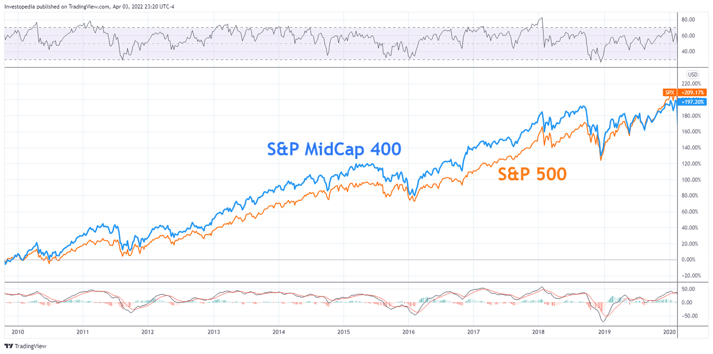

The stock market is a dynamic and multifaceted entity, encompassing a myriad of stock types, sizes, and categories. This diversity presents both opportunities and challenges for investors. Each category of stock behaves differently under varying market conditions, making it crucial for investors to understand the specific characteristics and potential of the stocks they choose to invest in. Among these categories, mid-cap stocks have become increasingly popular due to their unique advantages. Mid-cap stocks represent companies that have reached a certain level of growth and stability, exhibiting characteristics that balance the potential for substantial returns with more manageable risks compared to their small-cap counterparts.

Mid-cap stocks, typically defined by market capitalizations ranging between $2 billion and $10 billion, offer a blend of growth potential and stability, which appeals to investors seeking diversification. These stocks are positioned between the initial, volatile growth phase of small-cap companies and the stable, but often slower growth, phase of large-cap entities. This intermediary position makes mid-cap stocks an attractive option for investors looking to achieve higher returns without significantly increasing their risk exposure.



This article focuses on examining the performance of mid-cap stocks during bull market periods, which are characterized by rising stock prices and investor confidence. Historically, mid-cap stocks have shown significant outperformance during these periods, often surpassing the returns of both small-cap and large-cap stocks. Such performance can be attributed to the increased flexibility and adaptability of mid-cap companies, which allow them to capitalize on favorable market conditions effectively.

In addition to discussing stock performance, this article investigates the role of algorithmic trading in enhancing investment returns during bull markets. Algorithmic trading uses automated, pre-programmed strategies to execute trades at high speed and frequency, offering potential advantages in identifying and exploiting market patterns. Leveraging algorithmic trading tools can further optimize trading strategies involving mid-cap stocks, providing investors with a competitive edge in efficiently capturing market trends.

Understanding these elements – the defining attributes of mid-cap stocks, their historical performance in favorable market conditions, and the impactful integration of algorithmic trading – equips investors with the knowledge necessary to navigate and exploit market opportunities as they present themselves. By staying informed and strategically utilizing the tools available, investors can effectively manage portfolios and potentially achieve substantial returns.

## Table of Contents

## Understanding Mid-Cap Stocks

Mid-cap stocks are a distinct category within the stock market, representing companies with market capitalizations typically ranging from $2 billion to $10 billion. These companies sit between small-cap stocks, which have smaller market values, and large-cap stocks, which represent the largest market valuations. The categorization of mid-cap stocks can vary slightly by different financial institutions, but they generally align within this valuation range.

These mid-sized firms have often surpassed the initial survival and early growth phases of their business lifecycle. Unlike small-cap companies, which are often startups or niche players vulnerable to economic fluctuations based on limited market experience, mid-cap companies have typically demonstrated the ability to endure initial market challenges. Consequently, they offer a semblance of stability while still possessing significant growth avenues. These companies may not have the mature business models or resource wealth of large-cap firms but have established operations strong enough to sustain consistent growth.

The composition of mid-cap stocks is often diverse, spanning various sectors, from technology and healthcare to consumer goods and financial services. Such diversity aids in mitigating sector-specific risks, which adds to their attractiveness. Investors are drawn to mid-cap stocks because they offer a blend of growth potential and a degree of risk that is manageable compared to more volatile small-cap stocks. For instance, while mid-caps generally offer higher growth potential than large-caps, they do so with relatively lower risk compared to small-caps.

Another reason mid-cap stocks are favored in investment portfolios is their dynamic nature and agility. Unlike large-caps, which may face bureaucratic inertia, mid-caps have the ability to innovate and adapt swiftly to changing market conditions and competitive environments. Thus, they are often seen as companies with untapped potential, possessing both the drive and capacity to rise to large-cap status.

In investment portfolios, mid-cap stocks are often used for diversification. They bridge the gap between the high risk-high return profiles of small-cap stocks and the lower risk-low return nature of large-cap stocks. Their inclusion in a diversified portfolio can provide an investor with a balanced exposure to growth and risk, enhancing the opportunity for substantial returns without excessively increasing exposure to market [volatility](/wiki/volatility-trading-strategies). This unique blend makes mid-cap stocks a compelling choice for investors looking to balance growth and stability.

In summary, mid-cap stocks are companies with market capitalizations typically ranging from $2 billion to $10 billion, possessing both stability and growth potential. Their more established business practices compared to small-caps, alongside greater potential for growth than large-caps, make them an attractive component in investment strategies aiming for moderate risk and substantial returns.

## Performance of Mid-Cap Stocks in Bull Markets

Historically, mid-cap stocks have demonstrated significant performance during bull markets, often surpassing both small-cap and large-cap peers in periods of economic growth. The unique position of mid-cap stocks enables them to leverage market conditions effectively, balancing between the rapid growth potential typical of smaller companies and the stability generally associated with larger firms.

The S&P 400 MidCap Index, a prominent benchmark for this segment, has routinely reflected strong performance during market upturns. This index comprises companies with market capitalizations typically ranging from $2 billion to $10 billion, which allows it to capture the idiosyncratic advantages of mid-cap firms more precisely. During bull markets, mid-cap stocks frequently outstrip broader market indices, driven by several key factors.

First, sector distribution plays a pivotal role in their performance. Mid-cap firms often occupy sectors that thrive in expansion phases, such as technology, healthcare, and consumer discretionary. These sectors benefit from heightened consumer spending and technological advancements during periods of economic optimism, granting mid-caps a competitive edge. 

Moreover, the agility of mid-cap companies allows them to adapt to shifting market landscapes more nimbly than large-cap firms, which often contend with institutional inertia. This adaptability can lead to strategic opportunities, as mid-cap companies can adjust operations, capture emerging trends, and expand into new markets with relative ease.

Analyzing specific periods of notable mid-cap performance further elucidates these trends. For instance, during the bull market from 2009 to 2020, mid-cap stocks enjoyed substantial gains. The recovery following the financial crisis fostered an environment conducive to their strengths—companies with robust business models and strategic growth initiatives capitalized on favorable market conditions. The S&P 400 MidCap Index outperformed the S&P 500 and Russell 2000 indices over several significant stretches during this time, highlighting the sector's growth-oriented characteristics and market responsiveness.

Similarly, the post-pandemic recovery period from 2020 to 2022 provides another example of mid-cap resilience and adaptability. As the global economy rebounded, mid-cap stocks benefitted from fiscal stimuli, low interest rates, and a surge in consumer demand, which collectively propelled their market performance beyond many large-cap entities.

These instances underscore the advantageous position mid-cap stocks hold during bull markets, driven by strategic sector allocations, market adaptability, and inherent growth potential. For investors, understanding these dynamics is crucial to maximizing returns and crafting a well-balanced investment portfolio.

## Algorithmic Trading: A Game Changer

Algorithmic trading, often referred to as 'algo trading,' is a transformative approach in the stock market that leverages computer programs to execute buying and selling decisions. This strategy operates on pre-set rules and models, allowing trades to occur at speeds vastly exceeding those attainable by human traders. By harnessing the power of algorithms, investors can analyze vast datasets, promptly respond to market shifts, and execute trades with unparalleled precision.

In the context of mid-cap stocks, [algorithmic trading](/wiki/algorithmic-trading) holds significant promise. Mid-cap stocks, characterized by their moderate market capitalizations and growth potential, present unique opportunities that algorithmic systems can exploit efficiently. During bullish market trends, algorithms can swiftly identify and act upon lucrative patterns, capitalizing on the upward [momentum](/wiki/momentum) of mid-cap stocks to optimize returns.

One of the critical advantages of algorithmic trading is its ability to process complex data and market signals more rapidly than human analysis allows. For instance, algorithms can continuously monitor real-time stock prices, trading volumes, historical data, and market indicators to decide on buying or selling at optimal moments. This capability is particularly beneficial in a competitive market where timing and speed are crucial.

Algorithmic trading systems are designed to reduce human error, streamline trading processes, and minimize the emotional biases often associated with investing. Such systems can implement strategies that look for statistical [arbitrage](/wiki/arbitrage) opportunities, such as mean reversion strategies, where a stock's price is expected to revert to its mean over time. For example, in Python, a simple mean reversion strategy might be implemented with the help of a library such as `pandas`:

```python
import pandas as pd
import numpy as np

# Example data of mid-cap stock prices
data = {'date': pd.date_range(start='1/1/2020', periods=5, freq='D'),
        'price': [100, 102, 101, 104, 103]}
df = pd.DataFrame(data)
df.set_index('date', inplace=True)

# Calculate rolling mean and standard deviation
df['mean'] = df['price'].rolling(window=2).mean()
df['std'] = df['price'].rolling(window=2).std()

# Signal for buying: when price < mean - std
df['buy'] = np.where(df['price'] < df['mean'] - df['std'], 1, 0)

print(df)
```

This code snippet calculates a rolling mean and standard deviation for a stock, generating a buy signal when the current price is lower than one standard deviation below the mean. This strategy can be further customized to include more sophisticated rules and analytics commonly found in algorithmic trading strategies.

By employing algorithmic trading, investors in mid-cap stocks gain a strategic advantage, particularly in fast markets, where spotting and acting on opportunities quickly is crucial. The capacity to automate trades based on quantitative analysis not only enhances efficiency but also bolsters the potential for achieving superior returns in bull markets. As algorithms continue to evolve, their role in optimizing stock market activities, especially for mid-cap equities, is likely to grow, underscoring their transformative impact on investment strategies.

## Case Studies: Mid-Caps in Recent Bull Markets

Examining specific mid-cap stocks that thrived during bull markets offers revealing insights into the dynamics and potential benefits of this investment segment. The period between 2009 and 2020, known for its significant bull market trend, provides numerous examples of mid-cap companies that demonstrated exceptional performance. Similarly, the 2020-2022 post-pandemic recovery presented another opportunity to observe mid-cap stocks capitalizing on positive market conditions.

### Case Study 1: 2009-2020 Bull Market

During the prolonged bull market following the 2008 financial crisis, several mid-cap stocks outperformed expectations due to unique characteristics and strategic business decisions. A notable example includes **CoStar Group Inc. (CSGP)**, a real estate information and analytics provider. CoStar's emphasis on innovation and data-driven solutions played a crucial role in its success. The company consistently reinvested profits into expanding its database and technological capabilities, providing significant value to clients eager for comprehensive real estate data. This strategic edge, coupled with an increasing reliance on data analytics across industries, boosted CoStar's market position and investor appeal.

Another strong performer during this period was **Etsy, Inc. (ETSY)**. As an e-commerce platform that focuses on handmade and vintage items, Etsy uniquely positioned itself by catering to niche markets that giants like Amazon did not adequately serve. The rise of e-commerce and growing consumer interest in unique, artisanal products were significant tailwinds for Etsy’s growth. Strategic marketing initiatives and platform enhancements further supported an exponential increase in Etsy’s user base, driving substantial revenue and stock performance.

### Case Study 2: 2020-2022 Post-Pandemic Recovery

The post-pandemic bull market recovery created a fertile environment for mid-cap stocks to thrive. One such example is **Moderna, Inc. (MRNA)**, a biotechnology company that gained prominence with its swift and effective development of a COVID-19 vaccine. The pandemic accelerated the demand for innovative healthcare solutions, placing Moderna at the forefront. Its strong pipeline, strategic partnerships, and focus on mRNA technology were crucial for capitalizing on market demands during this period. The success of its COVID-19 vaccine not only fortified its financial position but also bolstered investor confidence, substantially elevating its stock price.

Another significant performer was **Zoom Video Communications, Inc. (ZM)**. As remote work and virtual meetings became standard, Zoom rapidly became indispensable for businesses and individuals. Its user-friendly platform and scalable infrastructure enabled swift adaptation to soaring demands, facilitating substantial stock appreciation. Furthermore, Zoom's strategic efforts to enhance security and expand service offerings helped consolidate its market lead and investor trust during this transformative period.

### Algorithmic Trading and Strategic Advantage

The success of these companies was not solely due to favorable market conditions; algorithmic trading also played a part in exploiting these trends. Trading algorithms were particularly adept at recognizing patterns and momentum in dynamic markets, often leading to tactical investment decisions that capitalized on the buoyant performance of mid-cap stocks. For instance, algorithms could identify companies like Moderna and Zoom based on their rapid growth trajectories and favorable sectoral trends, executing trades with precision and speed that heightened returns.

In conclusion, the performance successes of mid-cap stocks such as CoStar, Etsy, Moderna, and Zoom are illustrative of the potential that careful selection and strategic positioning hold in maximizing returns during bull markets. These case studies underscore the importance of market context and strategic ingenuity in harnessing mid-cap opportunities, complemented by the technological efficacy of algorithmic trading in optimizing outcomes.

## Benefits and Risks of Investing in Mid-Cap Stocks During Bull Markets

Investing in mid-cap stocks during bull markets offers a distinctive set of advantages and disadvantages, each driven by the characteristics of these companies. One of the primary benefits lies in their growth potential. Mid-cap firms, typically with market capitalizations between $2 billion and $10 billion, represent companies that have moved beyond the volatile early years into a phase of expansion and increased market presence. This positions them uniquely to capture growth opportunities that may arise from economic upswings, offering returns that potentially exceed those of larger, more established firms.

The diversification provided by mid-cap stocks is another advantage. These companies often operate across a variety of industries, offering investors a way to mitigate portfolio risk by spreading investments across different segments. Historically, mid-cap stocks have shown a tendency to outperform small-cap and large-cap stocks during bull markets, adding a layer of performance diversification that can be advantageous to investors seeking to optimize their portfolios during periods of economic growth.

However, several risks accompany the investment in mid-cap stocks. Chief among these is the higher volatility compared to large-cap stocks. While mid-cap firms have generally left behind the survival struggles of their smaller counterparts, they are still more susceptible to market fluctuations than large caps. This increased volatility can lead to sharper declines in bear markets or economic downturns. Furthermore, mid-cap companies might not have the financial flexibility or resource depth of larger firms, potentially impacting their ability to withstand economic pressures.

Moreover, while mid-cap stocks often have promising growth stories, they may lack the stability found in large-cap stocks. This can result in a more unpredictable performance trajectory, making thorough market analysis and active risk management crucial for investors. Evaluating management quality, market position, and growth strategies becomes vital in assessing the potential reward versus the inherent risks.

To navigate these trade-offs, investors should conduct robust risk management and comprehensive market analysis. This involves assessing the company's financial health, understanding industry trends, and continually monitoring market conditions. The use of quantitative tools, such as algorithms for trend analysis, can provide additional insights into the timing and scaling of investments in mid-cap stocks.

Understanding these dynamics is essential for investors to gauge whether investing in mid-cap stocks aligns with their risk tolerance and investment objectives. By carefully weighing the potential for significant returns against the risks of enhanced volatility and relative instability, investors can make informed decisions that align with their overall financial strategy.

## Conclusion

Mid-cap stocks exhibit a distinctive position within investment portfolios, especially evident during bull markets, due to their combination of growth potential and manageable risk. Their capacity to dynamically adjust in expanding markets allows investors to benefit from favorable economic conditions, garnering substantial returns. Integrating algorithmic trading systems presents an added advantage by enhancing the ability to efficiently detect and capitalize on market trends, boosting the potential profitability of these stocks.

Algorithmic trading, powered by advanced algorithms and rapid data analysis, can optimize trade execution by identifying and acting on trends faster than manual methods. This cutting-edge technology can significantly augment the traditional advantages of mid-cap stocks, allowing investors to harness both strategic foresight and technological advancements.

Understanding the behavior of mid-cap stocks, coupled with the strategic use of algorithmic tools, empowers investors to seize market opportunities effectively. Investors who leverage the blend of traditional market analysis and technological implementation stand a greater chance in navigating the intricacies of market dynamics, maximizing potential gains in mid-cap equity investments.

Continuous analysis and mindful application of these tools are imperative as market conditions evolve. By maintaining a proactive approach towards investment strategies in mid-cap equities, investors can unravel pathways to potential lucrativeness, ensuring their portfolios are not only resilient but also potentially rewarding. As the market landscape continuously shifts, informed decision-making will remain crucial in tapping into the profit-bearing potential of mid-cap stocks during bull phases.

## References & Further Reading

[1]: Bergstra, J., Bardenet, R., Bengio, Y., & Kégl, B. (2011). ["Algorithms for Hyper-Parameter Optimization."](https://papers.nips.cc/paper/4443-algorithms-for-hyper-parameter-optimization) Advances in Neural Information Processing Systems 24.

[2]: ["Advances in Financial Machine Learning"](https://www.amazon.com/Advances-Financial-Machine-Learning-Marcos/dp/1119482089) by Marcos Lopez de Prado

[3]: ["Evidence-Based Technical Analysis: Applying the Scientific Method and Statistical Inference to Trading Signals"](https://www.amazon.com/Evidence-Based-Technical-Analysis-Scientific-Statistical/dp/0470008741) by David Aronson

[4]: ["Machine Learning for Algorithmic Trading"](https://github.com/stefan-jansen/machine-learning-for-trading) by Stefan Jansen

[5]: ["Quantitative Trading: How to Build Your Own Algorithmic Trading Business"](https://github.com/LucindaYa/quant-resources/blob/master/Quantitative%20Trading%20How%20to%20Build%20Your%20Own%20Algorithmic%20Trading%20Business.pdf) by Ernest P. Chan