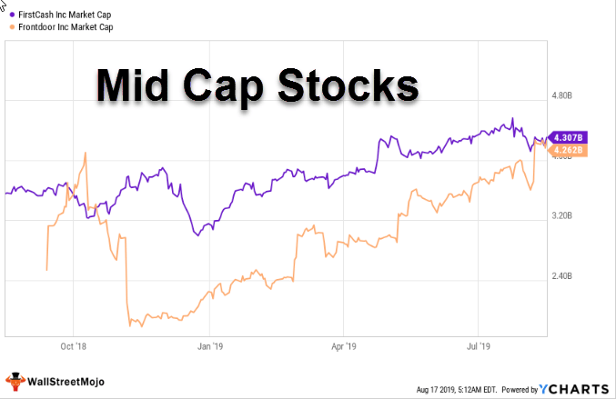

Understanding the different categories of stocks is vital for investors aiming to navigate the often unpredictable nature of stock markets effectively. Among these categories, mid-cap stocks hold a significant position. Characterized by companies with market capitalizations typically ranging from $2 billion to $10 billion, mid-cap stocks offer a blend of the growth potential seen in smaller-sized firms and the stability associated with larger enterprises. This balanced attribute makes them an intriguing component of diversified investment portfolios.

This article focuses on mid-cap stocks, particularly emphasizing their valuation limits and significance within broader investment categories. It will shed light on how algorithmic trading, an increasingly prevalent tool in modern markets, impacts the trading of mid-cap stocks. With the stabilization of technology in finance, algorithmic trading leverages computational algorithms to execute trades at speeds and frequencies unachievable by human traders alone. This capability is especially beneficial for trading mid-cap stocks, considering their liquidity and moderate volatility.



An important consideration for investors is how the inherent characteristics of mid-cap stocks can align with long-term investment strategies. Compared to their small-cap counterparts, mid-cap companies generally offer reduced risk, while still presenting opportunities for considerable growth. In contrast to large-cap stocks, they often provide higher growth potential, albeit with slightly increased risk. Therefore, including mid-cap stocks in a well-dominated portfolio can potentially enhance growth prospects while maintaining a reasonable risk level.

In conclusion, understanding mid-cap stocks involves recognizing their unique position in the stock hierarchy and their advantages for a balanced investment approach. Their potential for growth, reasonable risk, and compatibility with algorithmic trading strategies exemplify why they deserve serious consideration in portfolio construction.

## Table of Contents

## Understanding Mid-Cap Stocks

Mid-cap stocks represent a category of companies characterized by a market capitalization that ranges approximately between $2 billion and $10 billion. These companies occupy a critical position in the stock market ecosystem, offering investors a blend of growth potential and relative stability that can complement both small-cap and large-cap investments.

One defining feature of mid-cap companies is their balance between the high growth potential typical of small-cap stocks and the stability generally associated with large-cap stocks. Small-cap stocks, often defined as companies with a market capitalization below $2 billion, can offer high growth prospects but come with significant volatility and risk. In contrast, large-cap stocks, with market capitalizations exceeding $10 billion, generally provide stable returns but may have limited growth potential due to their established market positions.

Mid-cap stocks are often seen as companies in the intermediate stages of their growth lifecycle. This lifecycle positioning means they possess the potential for growth typically higher than that of large-cap stocks while maintaining a more moderate risk profile compared to smaller cap equities. The relative maturity of mid-cap companies often presents opportunities for expansion into new markets or the development of new product lines, setting the stage for potentially significant value appreciation.

Investors looking into mid-cap stocks should consider a company's market position, growth strategy, and industry trends, which are essential factors influencing their potential and risk. Additionally, many mid-cap companies operate in niche markets where they can leverage specialized expertise, providing unique investment opportunities distinct from the more homogeneous offerings of their larger counterparts.

In summary, mid-cap stocks serve as a strategic investment for those seeking a middle path between the [volatility](/wiki/volatility-trading-strategies) of small-cap investments and the conservative nature of large-cap stocks. These stocks offer the potential for substantial returns, provided investors are mindful of the specific market and corporate dynamics that drive their performance.

## Valuation Limits and Growth Potential

Mid-cap stocks present a distinctive investment proposition by sitting at a pivotal point along the company growth curve. These firms often exhibit characteristics that allow them to transcend their current market capitalization category, potentially advancing to large-cap status as they mature and expand. This progression is fueled by their ability to harness market opportunities that drive significant revenue and profit growth, qualities that catch the attention of investors seeking to capitalize on upward mobility within the stock market hierarchy.

Examining the growth trajectory of mid-cap stocks highlights their unique potential to contribute valuable returns. These companies often operate in sectors with substantial growth prospects, allowing them to capitalize on emerging markets, technological advancements, or shifts in consumer preferences. The agility of mid-cap companies to act upon these growth catalysts positions them favorably compared to their large-cap counterparts, which might encounter constraints due to their size and established market share.

Valuation limits act as informative guideposts for investors, helping them to discern companies that might be undervalued. Market capitalization, combined with other financial metrics such as price-to-earnings (P/E) ratio, earnings growth rate, and return on equity (ROE), provides a comprehensive view of a mid-cap stock's valuation. Investors equipped with this analytical framework can better identify stocks trading below their intrinsic value, thus positioning for potential gains when the broader market corrects its perception of the stock’s worth.

As investors analyze mid-cap stocks, identifying opportunities where market valuation does not yet reflect the company's growth potential is key. This discrepancy often exists because mid-cap companies are less scrutinized compared to large-cap stocks. This gap provides a fertile ground for investors to achieve substantial returns, particularly as these companies continue to demonstrate consistent growth and operational stability, eventually attracting broader market attention and potentially ascending to the large-cap category.

## Diversification Within Investment Categories

Including mid-cap stocks in a diversified investment portfolio can enhance both stability and growth potential. Their unique position between small-cap and large-cap stocks offers investors a balanced approach to capital appreciation and risk management. Mid-cap stocks tend to bridge the gap between the aggressive growth associated with small-cap stocks and the conservative stability typical of large-cap stocks. This balance allows them to offer substantial growth potential with moderated risk levels compared to their smaller counterparts, which are generally characterized by high volatility due to their reliance on favorable market conditions to sustain growth.

During periods of economic expansion, mid-cap stocks can be particularly advantageous. These companies, often in the midst of scaling their operations and market reach, are well-positioned to capitalize on increasing consumer demand and can effectively increase their market share. As the economy grows, mid-cap stocks can leverage their adaptable infrastructure and innovation capacity to expand and lock in new growth opportunities. This ability to gain market share without the administrative and operational weight that burdens larger firms can lead to significant returns for investors.

The strategic inclusion of mid-cap stocks within a diversified portfolio can mitigate systematic risks and achieve a desirable risk-return balance. By coupling the growth trajectory of mid-cap stocks with the stability of large-cap stocks and the aggressive potential of small-cap stocks, investors can create a diversified investment strategy that is both robust and adaptive to changing market conditions. This diversification can enhance the risk-to-reward ratio of the portfolio, reducing unsystematic risk through asset allocation principles.

## Algorithmic Trading and Mid-Cap Stocks

Algorithmic trading, a method utilizing computer algorithms to automate buying and selling decisions, has become increasingly significant in the management of mid-cap stocks. By streamlining repetitive processes and optimizing decision-making, [algorithmic trading](/wiki/algorithmic-trading) capitalizes on the unique characteristics of mid-cap stocks, such as [liquidity](/wiki/liquidity-risk-premium) and volatility.

Mid-cap stocks, with their notable liquidity, allow for sufficient trading activity without the restraints often found in small-cap stocks. This liquidity is crucial for algorithmic trading systems, which require the ability to execute trades rapidly and efficiently. High levels of liquidity ensure that large transactions can be conducted with minimal impact on stock prices, facilitating effective implementation of algorithmic strategies.

The inherent volatility of mid-cap stocks also presents opportunities and challenges for algorithmic trading. Volatility refers to the degree of variation in a stock's price over a given period. Algorithmic trading systems are particularly adept at leveraging this volatility by executing trades at opportune moments dictated by pre-set conditions or real-time data analysis. For instance, algorithms can be designed to detect patterns or abrupt changes in market behavior, allowing traders to capitalize on price fluctuations swiftly.

Algorithmic trading systems are equipped to monitor and adjust to quickly changing market conditions, an essential feature for trading mid-cap stocks. These systems employ complex algorithms that can analyze vast amounts of market data in real-time and identify favorable trading situations. The key advantage of algorithmic trading lies in its ability to react instantaneously to market data, significantly reducing the latency associated with human decision-making. A simple example of such a system in Python might involve the use of popular libraries like NumPy for numerical computation and Pandas for data manipulation, enabling the development of efficient trading algorithms:

```python
import numpy as np
import pandas as pd

# Example: Moving Average Crossover Strategy
def moving_average_strategy(prices, short_window=40, long_window=100):
    signals = pd.DataFrame(index=prices.index)
    signals['price'] = prices
    signals['short_mavg'] = prices.rolling(window=short_window, min_periods=1, center=False).mean()
    signals['long_mavg'] = prices.rolling(window=long_window, min_periods=1, center=False).mean()
    signals['signal'] = 0.0
    signals['signal'][short_window:] = np.where(
        signals['short_mavg'][short_window:] > signals['long_mavg'][short_window:], 1.0, 0.0
    )
    signals['positions'] = signals['signal'].diff()
    return signals

# Usage with example data
mock_prices = pd.Series([100, 101, 102, 105, 107, 110, 115, 108, 106, 111])
trading_signals = moving_average_strategy(mock_prices)
print(trading_signals)
```

This code snippet illustrates a simple moving average crossover strategy, which can form the basis of algorithmic decision-making for mid-cap stocks. In practice, algorithms can incorporate more sophisticated analysis, encompassing numerous indicators and [machine learning](/wiki/machine-learning) techniques to enhance predictive accuracy.

While algorithmic trading provides significant advantages, including the ability to handle complex trading strategies and improve execution speed, it requires robust systems and expertise. Traders must carefully design and continuously monitor these algorithms to ensure they function optimally under different market conditions, addressing potential risks such as unexpected market events or system malfunctions. Therefore, employing algorithmic trading for mid-cap stocks requires a careful balance of technical expertise, market understanding, and strategic foresight.

## Risks and Considerations

Mid-cap stocks, while attractive for their balance between growth potential and stability, come with inherent risks. Market volatility is a significant consideration for investors in mid-cap stocks. These stocks can experience price fluctuations due to broader market movements or economic changes, impacting their valuation. Unlike large-cap stocks, which often have established market positions and greater resources to weather economic downturns, mid-cap companies might be more susceptible to market volatility. 

Additionally, company-specific events can substantially affect mid-cap stock prices. Examples include changes in management, legal disputes, earnings reports, or shifts in industry trends. While these events might present opportunities for significant gains, they also pose a risk, as negative developments can lead to swift declines in stock value.

Investors should carefully assess their risk tolerance and investment goals when considering mid-cap stocks. A higher risk tolerance may accommodate the potential volatility of mid-cap stocks, whereas a conservative investor might limit their exposure. Establishing a clear investment strategy that aligns with personal financial goals and risk levels is crucial for navigating mid-cap stock investments.

Diversification remains a vital strategy to mitigate risks associated with mid-cap stocks. By spreading investments across multiple sectors or geographies, investors can reduce the impact of poor performance in a single stock or industry. Proper analysis of both the potential upside and the inherent risks of individual stocks enables a more informed investment decision.

Lastly, investors should employ rigorous financial analysis and stay informed about macroeconomic trends and company-specific developments. This involves evaluating financial statements, industry outlooks, and other analytical metrics to select mid-cap stocks with strong growth prospects and manageable risk profiles. By maintaining a diversified portfolio and regularly reviewing investment performance, investors can better manage the risks associated with mid-cap stocks while capitalizing on their growth potential.

## Conclusion

Mid-cap stocks play a crucial role in constructing a well-balanced investment portfolio by offering a combination of growth potential and stability. These stocks, representing companies with a market capitalization between $2 billion and $10 billion, can provide investors with opportunities that balance the aggressive growth seen in small-cap stocks and the stability characteristic of large-cap stocks. By understanding the unique features of mid-cap stocks and their strategic position within broader investment categories, investors can make more informed decisions regarding their investment strategies.

The appeal of mid-cap stocks lies in their ability to provide significant growth prospects while maintaining a relatively moderate risk profile. This makes them particularly attractive for investors seeking to diversify their portfolios with stocks that have the potential to transition into large-cap stocks or yield significant returns as they mature and expand. Additionally, because mid-cap stocks can adapt well to economic changes, they are particularly beneficial during economic upswings, when they can capture increased market share.

Algorithmic trading technologies offer a means to efficiently manage and optimize mid-cap stock investments. Through the use of algorithms, investors can automate repetitive trading processes, optimize buy and sell decisions, and quickly respond to market fluctuations. Algorithmic trading can leverage the liquidity and volatility of mid-cap stocks to execute strategies that maximize returns while minimizing risks. By focusing on these efficiencies, algorithms can enhance the profitability and risk management of mid-cap stock investments.

Understanding the attributes of mid-cap stocks and leveraging technologies like algorithmic trading can help investors achieve a thoughtful balance between growth and stability in their investment portfolios. This strategic approach can potentially improve portfolio performance and reduce exposure to extreme market risks, allowing investors to benefit from mid-cap stocks' unique advantages.

## References & Further Reading

[1]: ["Investing in Mid-Cap Stocks"](https://www.investopedia.com/mid-cap-investing-strategies-5225553) by CFA Institute

[2]: Lyócsa, Š., & Molnár, P. (2022). ["Volatility Risk and Returns in Mid-cap Stocks"](https://www.sciencedirect.com/science/article/abs/pii/S0140988324001592), Journal of Banking & Finance

[3]: Malkiel, B. G. (2015). ["A Random Walk Down Wall Street: The Time-Tested Strategy for Successful Investing"](https://www.amazon.com/Random-Walk-down-Wall-Street/dp/0393352242) by Burton G. Malkiel

[4]: ["Algorithmic Trading and DMA"](https://www.amazon.com/Algorithmic-Trading-DMA-introduction-strategies/dp/0956399207) by Barry Johnson

[5]: Chrismer, B. (2013). ["The Role of Mid-cap Stocks in Portfolio Diversification"](https://www.sciencedirect.com/science/article/pii/S0304405X24001958), CFA Institute Research Foundation

[6]: Hull, J. (2018). ["Options, Futures, and Other Derivatives"](https://www.amazon.com/Options-Futures-Other-Derivatives-9th/dp/0133456315) by John C. Hull

[7]: ["Introduction to Statistical Learning"](https://www.statlearning.com/) by Gareth James, et al.

[8]: Marshall, B. R., Nguyen, N. H., & Visaltanachoti, N. (2015). ["Mid-cap Stocks: Their Role and Returns in Equity Portfolios"](https://www.academia.edu/11103707/ETF_arbitrage_Intraday_evidence), Australian Journal of Management