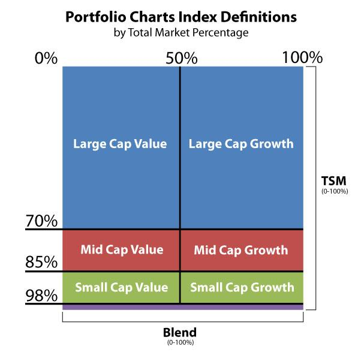

## Table of Contents

## What are mid-cap stocks?

Mid-cap stocks are shares of companies that are neither very big nor very small. They are in the middle, with a market value usually between $2 billion and $10 billion. These companies are often growing and expanding but are still smaller than the huge companies you might know, like Apple or Amazon.

Investing in mid-cap stocks can be a good choice because they might grow faster than big companies but are usually safer than very small companies. They can offer a good balance of risk and reward. However, they can also be riskier than large-cap stocks because they might not have as much money or as many resources to handle tough times.

## How are mid-cap stocks categorized by size?

Mid-cap stocks are companies that are sized in the middle. They are not as big as the huge companies like Apple or Amazon, but they are bigger than the really small companies. To be a mid-cap, a company usually has a market value between $2 billion and $10 billion. This market value is found by multiplying the number of the company's shares by the price of each share.

These companies are often in a growing stage. They might be expanding their business and trying to get bigger. Because they are growing, mid-cap stocks can be a good choice for people who want to invest in companies that might increase in value. But, they can also be riskier than the really big companies because they don't have as much money or resources to handle problems that come up.

## What is the typical market capitalization range for mid-cap stocks?

Mid-cap stocks are companies that fall in the middle size range. They are not as big as the huge companies like Apple or Amazon, but they are bigger than the really small companies. The typical market capitalization for mid-cap stocks is between $2 billion and $10 billion. Market capitalization is calculated by multiplying the number of a company's shares by the price of each share.

These companies are often in a growing stage. They might be expanding their business and trying to get bigger. Because they are growing, mid-cap stocks can be a good choice for people who want to invest in companies that might increase in value. But, they can also be riskier than the really big companies because they don't have as much money or resources to handle problems that come up.

## How do mid-cap stocks differ from small-cap and large-cap stocks?

Mid-cap stocks are different from small-cap and large-cap stocks mainly because of their size. Mid-cap companies have a market value between $2 billion and $10 billion. Small-cap companies are smaller, with a market value usually less than $2 billion. Large-cap companies are much bigger, with a market value over $10 billion. This size difference affects how these companies grow and handle risks.

Mid-cap stocks often have more room to grow than large-cap stocks. They are usually in a stage where they are expanding their business and trying to get bigger. This can make them a good choice for investors looking for growth. However, they are riskier than large-cap stocks because they don't have as much money or resources to handle tough times. On the other hand, mid-cap stocks are usually less risky than small-cap stocks. Small-cap companies can grow a lot, but they can also fail more easily because they are smaller and might not have enough money to survive problems.

In summary, mid-cap stocks offer a middle ground between the potential high growth of small-cap stocks and the stability of large-cap stocks. They can be a good choice for people who want a balance of risk and reward. But, like any investment, it's important to understand that mid-cap stocks come with their own set of risks and rewards.

## What are the advantages of investing in mid-cap stocks?

Investing in mid-cap stocks can be a good choice because they often have more room to grow than big companies. Mid-cap companies are usually in a stage where they are expanding their business and trying to get bigger. This means they might increase in value faster than large companies. For people who want to see their investments grow, mid-cap stocks can be a good option. They offer the chance to get in on a company's growth before it becomes a huge, well-known business.

Another advantage of mid-cap stocks is that they are usually less risky than small-cap stocks. Small companies can grow a lot, but they can also fail more easily because they are smaller and might not have enough money to survive problems. Mid-cap companies are bigger and often have more resources to handle tough times. This makes them a safer choice than small-cap stocks. So, mid-cap stocks can offer a good balance of risk and reward, making them attractive to many investors.

## What are the risks associated with mid-cap stocks?

Mid-cap stocks can be riskier than large-cap stocks. Large companies have a lot of money and resources, which helps them handle problems better. Mid-cap companies don't have as much money or resources. This means they might struggle more during tough economic times. If something goes wrong, like a drop in the market or a problem in their industry, mid-cap companies might not be able to recover as easily as big companies.

Another risk with mid-cap stocks is that they can be less stable than large-cap stocks. Their stock prices can go up and down more because they are still growing and figuring things out. This can make them a bit unpredictable. Investors need to be ready for more ups and downs with mid-cap stocks compared to the smoother ride you might get with large-cap stocks.

Even though mid-cap stocks are less risky than small-cap stocks, they still [carry](/wiki/carry-trading) more risk than small companies. Small companies can fail more easily because they are very small and might not have enough money to survive problems. Mid-cap companies are bigger, but they can still face challenges that small companies face, like not having enough money to grow or handle unexpected problems. So, while mid-cap stocks offer a good balance of risk and reward, they still come with their own set of risks that investors need to think about.

## How can one evaluate the valuation of mid-cap stocks?

To evaluate the valuation of mid-cap stocks, you can look at a few key numbers. One important number is the price-to-earnings (P/E) ratio. This tells you how much you are paying for each dollar of the company's earnings. A lower P/E ratio might mean the stock is a good deal, but you need to compare it to other companies in the same industry. Another number to look at is the price-to-book (P/B) ratio. This compares the stock's market value to its book value, which is what the company would be worth if it sold all its assets and paid off all its debts. A lower P/B ratio can also suggest that the stock might be undervalued.

Another way to evaluate mid-cap stocks is by looking at their growth potential. You can do this by checking the company's earnings growth rate. If a company's earnings are growing fast, it might be a good sign that the stock's value will go up in the future. Also, consider the company's future plans and how well it is doing compared to its competitors. Sometimes, a company might be undervalued because people don't know about its growth potential yet. By looking at these factors, you can get a better idea of whether a mid-cap stock is a good investment.

Remember, evaluating stocks is not just about numbers. You should also think about the overall health of the company. Look at things like its debt levels, how well it manages its money, and any risks it might face. By combining these different pieces of information, you can make a more informed decision about whether a mid-cap stock is a good buy.

## What financial ratios are important when analyzing mid-cap stocks?

When analyzing mid-cap stocks, some important financial ratios to look at are the price-to-earnings (P/E) ratio and the price-to-book (P/B) ratio. The P/E ratio tells you how much you are paying for each dollar of the company's earnings. A lower P/E ratio might mean the stock is a good deal, but you need to compare it to other companies in the same industry to be sure. The P/B ratio compares the stock's market value to its book value, which is what the company would be worth if it sold all its assets and paid off all its debts. A lower P/B ratio can suggest that the stock might be undervalued.

Another important ratio is the debt-to-equity (D/E) ratio, which shows how much debt the company has compared to its equity. A high D/E ratio can mean the company is risky because it has a lot of debt to pay back. You should also look at the return on equity (ROE), which tells you how well the company is using its money to make profits. A higher ROE is usually a good sign. By looking at these ratios, you can get a better idea of whether a mid-cap stock is a good investment.

Lastly, consider the company's growth potential by looking at its earnings growth rate. If a company's earnings are growing fast, it might be a good sign that the stock's value will go up in the future. Also, think about the company's future plans and how well it is doing compared to its competitors. Sometimes, a company might be undervalued because people don't know about its growth potential yet. By combining these different pieces of information, you can make a more informed decision about whether a mid-cap stock is a good buy.

## How do growth prospects influence the valuation of mid-cap stocks?

Growth prospects are really important when figuring out how much a mid-cap stock is worth. If a company is expected to grow a lot, its stock might be worth more. People are willing to pay more for a stock if they think the company will make more money in the future. For mid-cap companies, this is especially important because they are often in a stage where they are trying to get bigger. If a mid-cap company has good plans for growth and is doing better than its competitors, its stock can be seen as a good investment.

On the other hand, if a mid-cap company doesn't have good growth prospects, its stock might not be worth as much. Investors might not want to pay a lot for a stock if they think the company won't grow much or might even shrink. This can make the stock's price go down. So, when looking at mid-cap stocks, it's a good idea to check the company's growth plans and how fast its earnings are growing. This can help you decide if the stock is a good buy or not.

## What role do mid-cap stocks play in a diversified investment portfolio?

Mid-cap stocks can be a good addition to a diversified investment portfolio because they offer a balance between growth and stability. These companies are not as big as the huge companies like Apple or Amazon, but they are bigger than very small companies. This middle size means they often have more room to grow than large companies but are less risky than small ones. By including mid-cap stocks in your portfolio, you can spread out your risk and potentially increase your returns. They can help you capture growth that might not be available from just investing in large-cap stocks.

Adding mid-cap stocks to your portfolio also helps you spread your investments across different sizes of companies. This is important because it can protect you if one part of the market does poorly. For example, if large-cap stocks are not doing well, your mid-cap stocks might still be growing. This mix can make your investments more stable over time. So, mid-cap stocks can be a key part of a well-rounded investment strategy, helping you balance risk and reward.

## How have mid-cap stocks performed historically compared to other market segments?

Historically, mid-cap stocks have often done better than large-cap stocks but not as well as small-cap stocks. They tend to grow more than the big companies because they are still expanding and trying to get bigger. But they don't grow as much as the really small companies, which can sometimes have huge jumps in value. Over long periods, like 10 or 20 years, mid-cap stocks have usually given investors good returns, often better than large-cap stocks but not as high as small-cap stocks.

However, mid-cap stocks can also be more up and down than large-cap stocks. This means their prices can go up and down more, which can be riskier. But they are usually less risky than small-cap stocks because mid-cap companies have more money and resources to handle problems. So, while mid-cap stocks might not give you the highest returns, they can offer a good balance of risk and reward, making them a solid choice for many investors looking to grow their money over time.

## What advanced strategies can be used to optimize returns from mid-cap stocks?

One advanced strategy to optimize returns from mid-cap stocks is sector rotation. This means moving your money between different parts of the economy based on where you think growth will happen next. Mid-cap companies are often in industries that are growing fast, like technology or health care. By watching these trends and moving your money to the sectors that are doing well, you can try to get better returns. For example, if you think technology will do well next year, you might put more money into mid-cap tech stocks. This strategy takes a lot of research and understanding of the economy, but it can help you make more money.

Another strategy is to use a value investing approach. This means looking for mid-cap stocks that are priced lower than they should be. You can do this by looking at financial ratios like the price-to-earnings (P/E) ratio or the price-to-book (P/B) ratio. If a mid-cap company has a low P/E or P/B ratio compared to others in its industry, it might be a good buy. This strategy needs you to be patient because it can take time for the market to realize the stock's true value. But if you pick the right stocks, you can get good returns when their prices go up.

You can also use a growth investing strategy, focusing on mid-cap companies with strong future growth potential. Look at things like earnings growth rates and the company's plans for the future. If a mid-cap company is growing fast and has good plans, its stock might go up a lot. This strategy can be riskier because you're betting on the company's future, but it can also lead to big returns if you pick the right stocks. By combining these strategies and keeping a close eye on the market, you can try to optimize your returns from mid-cap stocks.

## References & Further Reading

[1]: ["Investing in Mid-Cap Stocks"](https://www.investopedia.com/mid-cap-investing-strategies-5225553) by CFA Institute

[2]: Lyócsa, Š., & Molnár, P. (2022). ["Volatility Risk and Returns in Mid-cap Stocks"](https://www.sciencedirect.com/science/article/abs/pii/S0140988324001592), Journal of Banking & Finance

[3]: Malkiel, B. G. (2015). ["A Random Walk Down Wall Street: The Time-Tested Strategy for Successful Investing"](https://www.amazon.com/Random-Walk-down-Wall-Street/dp/0393352242) by Burton G. Malkiel

[4]: ["Algorithmic Trading and DMA"](https://www.amazon.com/Algorithmic-Trading-DMA-introduction-strategies/dp/0956399207) by Barry Johnson

[5]: Chrismer, B. (2013). ["The Role of Mid-cap Stocks in Portfolio Diversification"](https://www.sciencedirect.com/science/article/pii/S0304405X24001958), CFA Institute Research Foundation

[6]: Hull, J. (2018). ["Options, Futures, and Other Derivatives"](https://www.amazon.com/Options-Futures-Other-Derivatives-9th/dp/0133456315) by John C. Hull

[7]: ["Introduction to Statistical Learning"](https://www.statlearning.com/) by Gareth James, et al.

[8]: Marshall, B. R., Nguyen, N. H., & Visaltanachoti, N. (2015). ["Mid-cap Stocks: Their Role and Returns in Equity Portfolios"](https://www.academia.edu/11103707/ETF_arbitrage_Intraday_evidence), Australian Journal of Management