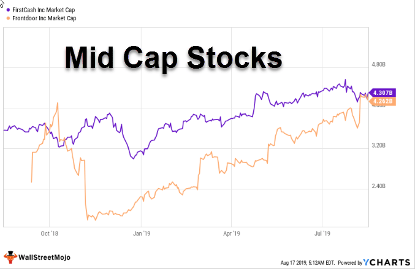

The stock market offers a plethora of investment opportunities, each with its unique set of principles and potential rewards. However, navigating through these options can be daunting for even seasoned investors. Among the many strategies, value investing and mid-cap stocks stand out for their distinct, yet complementary characteristics. Value investing centers on identifying undervalued stocks—those believed to be trading below their intrinsic or book value. This approach requires careful analysis and patience but promises substantial long-term rewards when executed effectively.

Mid-cap stocks, on the other hand, represent companies with a market capitalization typically ranging from $2 billion to $10 billion. These stocks offer a balance between the growth potential of small-cap stocks and the stability of large-cap stocks. Investors gravitate towards mid-cap stocks for their moderate volatility and potential for growth, making them an attractive option for those seeking both growth and reduced risk.



This article will explore the synergy between value investing and mid-cap stocks, highlighting how these strategies are becoming increasingly intertwined to uncover lucrative investment opportunities. Additionally, we will discuss the burgeoning field of algorithmic trading, a technological innovation transforming investor interactions with the stock market. Algorithmic trading involves using automated software to execute trades based on predefined criteria, thereby minimizing human error and quickly capitalizing on market inefficiencies.

By integrating value investing with mid-cap stocks and incorporating algorithmic trading, investors can potentially form a cohesive and robust investment strategy. This integration allows for the discovery of undervalued stocks, access to mid-cap growth prospects, and efficient trade execution. By the end of this discussion, you will have a better grasp of how these elements can come together to maximize investment opportunities and returns in the ever-evolving stock market landscape.

## Table of Contents

## Understanding Value Investing

Value investing is an investment strategy that centers on selecting stocks trading below their intrinsic or book value. This method aims to identify undervalued stocks by the market with the potential for lucrative returns once their prices align with their true value over time. Key metrics fundamental to value investing include the price-to-book ratio and the price-to-earnings ratio, which help determine the relative value of a stock.

The intrinsic value of a stock is calculated using several methodologies, often involving financial metrics and qualitative factors, such as business model, management quality, and industry position. One popular method for gauging intrinsic value is the discounted cash flow (DCF) analysis, which estimates a company's future cash flows and discounts them back to their present value. 

The price-to-book (P/B) ratio is another crucial measure, comparing a company's market capitalization with its book value. A low P/B ratio may indicate that the stock is undervalued; however, it is essential to compare this ratio with industry peers to gain meaningful insights. Similarly, the price-to-earnings (P/E) ratio measures a company’s current share price relative to its per-share earnings, with a lower P/E potentially signaling undervaluation as long as the earnings are sustainable.

For value investors, thorough research and patience are essential. The market's inefficiencies or short-term misjudgments provide opportunities, but patience is crucial as price corrections can take time. Furthermore, diversification across value investments can mitigate risks associated with individual stocks. Historically, value investing has demonstrated the potential for significant gains over the long term, supported by the market correction toward intrinsic values.

In essence, value investing embodies the philosophy of buying stocks for less than they are worth, motivated by a fundamental understanding of the underlying business and ensuring a margin of safety. It offers a disciplined approach to stock selection centered on identifying true value amid market fluctuations.

## What Are Mid-Cap Stocks?

Mid-cap stocks represent a unique category of equities, characterized by companies that generally have a market capitalization ranging from $2 billion to $10 billion. This segment of the stock market occupies an advantageous position, balancing the rapid growth potential often seen in small-cap stocks with the greater stability typically associated with large-cap stocks.

Investors often find mid-cap stocks appealing due to their capacity for growth coupled with a reduced risk profile compared to their small-cap counterparts. Small-cap stocks, while offering significant potential rewards through high growth rates, can experience extreme [volatility](/wiki/volatility-trading-strategies), increasing the risk of substantial losses. In contrast, mid-cap stocks provide a more balanced risk-reward scenario, as they tend to exhibit less volatility than small-cap stocks while still harboring considerable room for business expansion and market presence.

The less-volatile nature of mid-cap stocks arises from their mature operational structures and often more diversified product portfolios, alleviating some of the financial risk seen in smaller, less diversified entities. Moreover, as mid-sized firms, these companies are often on the verge of reaching large-cap status, thereby offering potential for significant capital appreciation as they successfully execute growth strategies and expand their market shares.

Furthermore, the performance and potential of mid-cap stocks are frequently under-researched and under-analyzed by market analysts, which can result in the identification of undervalued stocks within this segment. This lack of extensive coverage can provide astute investors with opportunities to acquire shares before they reach broader market recognition and appreciation.

In evaluating mid-cap stocks, investors might consider employing financial metrics similar to those used in value investing, ensuring a comprehensive analysis of both growth potential and risk factors. This includes a deep dive into the company's earnings growth history, return on equity (ROE), and price-to-earnings (P/E) ratios relative to industry peers, providing insight into the stock's valuation and growth trajectory.

Overall, mid-cap stocks offer a compelling investment option for those seeking a balance between growth and stability, and they can serve as a strategic component within a diversified investment portfolio.

## The Advantages of Mid-Cap Value Investing

Combining mid-cap stocks with a value investing strategy can uncover hidden gems in the stock market. Mid-cap value stocks, typically defined by a market capitalization range between $2 billion and $10 billion, often go unnoticed by analysts primarily focusing on large-cap stocks. This lack of attention can result in undervalued opportunities that astute investors can exploit for potentially significant returns.

Mid-cap stocks provide a unique balance, blending growth potential with relative stability. Unlike small-cap stocks, which can be highly volatile, mid-cap stocks maintain a steadier performance with room for expansion. This characteristic makes mid-cap value stocks particularly appealing for investors seeking both growth and stability in their portfolios. Their position allows them to capitalize on the growth phase typical of smaller companies while having established operations that mitigate some inherent risks.

Moreover, mid-cap value stocks are generally less susceptible to severe market swings than their large-cap counterparts. This resilience can be attributed to their moderate size, which minimizes exposure to the extreme fluctuations often experienced by smaller or emerging companies. Therefore, they offer a more stable return rate, a crucial [factor](/wiki/factor-investing) for long-term investors focused on value investing principles.

In terms of value investing metrics, mid-cap value stocks often exhibit favorable ratios, such as price-to-earnings (P/E) and price-to-book (P/B) ratios, indicative of undervaluation. Investors might employ financial ratios to assess how these stocks are priced relative to their intrinsic value, making them strong candidates for investment.

Overall, mid-cap value stocks stand as promising contenders in investment strategies, combining understated growth opportunities with reduced volatility. For those seeking to leverage the benefits of value investing, mid-cap stocks offer an advantageous position that can lead to commendable returns over time.

## Algorithmic Trading in the Stock Market

Algorithmic trading utilizes automated software systems to execute trades based on predefined criteria, allowing for rapid decision-making that minimizes human error and exploits market inefficiencies. This trading approach, also known as algo trading, leverages sophisticated mathematical models and algorithms to make trading decisions in microseconds.

Historically, [algorithmic trading](/wiki/algorithmic-trading) has been predominantly employed by institutional investors such as hedge funds, investment banks, and proprietary trading firms due to the significant resources required, including advanced technology and skilled staff. However, recent technological advancements and increased accessibility to sophisticated software have allowed individual investors to delve into this domain.

One of the key advantages of algorithmic trading is its ability to execute orders at optimal prices. By analyzing vast amounts of market data, these algorithms can identify trading patterns and inefficiencies that would be impossible for a human trader to detect. For example, algorithms can follow trends, implement market-maker strategies, execute [arbitrage](/wiki/arbitrage) opportunities, or conduct mean reversion trades.

Here is a simple illustration of a basic trading algorithm using Python:

```python
import numpy as np
import pandas as pd

def moving_average_strategy(prices, short_window=40, long_window=100):
    signals = pd.DataFrame(index=prices.index)
    signals['price'] = prices
    signals['short_mavg'] = prices.rolling(window=short_window, min_periods=1).mean()
    signals['long_mavg'] = prices.rolling(window=long_window, min_periods=1).mean()

    signals['signal'] = 0.0
    signals['signal'][short_window:] = np.where(signals['short_mavg'][short_window:] 
                                > signals['long_mavg'][short_window:], 1.0, 0.0)

    signals['positions'] = signals['signal'].diff()

    return signals

# Example usage
# Note: 'data' should be a Series with datetime index and stock prices as its values
# signals = moving_average_strategy(data)
```

Incorporating algorithmic trading into a value investing strategy can be particularly powerful. By using algorithms, investors can quickly identify underpriced mid-cap stocks, optimize portfolio rebalance, and react more efficiently to market news or price shifts. Traders can employ screens to filter stocks based on key metrics such as low price-to-earnings ratios or price-to-book ratios—indicative of value stocks.

Additionally, algorithmic trading is progressing towards the utilization of [artificial intelligence](/wiki/ai-artificial-intelligence) and [machine learning](/wiki/machine-learning), providing even deeper insights and predictive capabilities. Machine learning algorithms can adapt and improve over time, potentially increasing profitability by learning from historical data to anticipate future stock movements.

As technology continues to evolve, algorithmic trading will likely become even more intertwined with various investment strategies, offering a robust tool for enhancing returns and managing risks in the stock market.

## The Synergy of Value Investing, Mid-Cap Stocks, and Algorithmic Trading

Integrating value investing, mid-cap stocks, and algorithmic trading creates a comprehensive strategy that maximizes each component's strengths, offering the potential for targeted, efficient, and effective investment opportunities. Investors can harness this synergy by blending traditional investment analysis with modern technological advancements.

Value investing, at its core, involves identifying stocks that are undervalued compared to their inherent or intrinsic value. By focusing on mid-cap stocks, investors tap into companies that offer growth potential with a balance of stability, which small-caps often lack. Mid-cap stocks are typically less volatile than small caps but present more room for growth than large-cap stocks. This segment of the market is fertile ground for value investors who can spot companies with strong fundamentals undervalued by the broader market.

Algorithmic trading introduces a precise and automated approach to executing investment strategies. Using stock screeners and algorithmic models enables the efficient monitoring and analysis of mid-cap stocks. These models can screen thousands of stocks to identify those meeting specific value investing criteria, such as favorable price-to-earnings or price-to-book ratios. The speed and accuracy provided by algorithmic trading are unparalleled, reducing human error and leveraging opportunities that manual analysis might miss.

Automated trading systems are particularly advantageous as they can swiftly respond to market conditions. When an algorithm identifies an undervalued mid-cap stock that meets specified criteria, the system can place trades at an optimal time, capturing potential gains with pinpoint accuracy. This ability to instantly respond to price movements and other market signals gives investors a significant edge, ensuring that they can enter or [exit](/wiki/exit-strategy) positions in a timely manner.

In practice, an investor might use a Python-based algorithm to analyze real-time data, constantly scanning for mid-cap stocks that show strong value potential. Python libraries such as Pandas for data manipulation and NumPy for numerical calculations can efficiently process large datasets, while tools like TA-Lib may be used for technical analysis. Here's a basic example of using Python to identify potential stocks:

```python
import pandas as pd
import numpy as np

# Assume stock_data is a DataFrame containing mid-cap stock data with columns: 'Ticker', 'PE_Ratio', 'PB_Ratio'
stock_data = pd.read_csv('midcap_stocks.csv')

# Define value investing criteria
pe_threshold = 15  # Example threshold for P/E ratio
pb_threshold = 1.5  # Example threshold for P/B ratio

# Filter stocks meeting value criteria
value_stocks = stock_data[(stock_data['PE_Ratio'] < pe_threshold) & (stock_data['PB_Ratio'] < pb_threshold)]

print(value_stocks)
```

To capitalize on this synergy, investors must integrate algorithmic capabilities with their value investment thesis, ensuring their models are adaptable and their data inputs are accurate and timely. The combination of human insight in identifying value potential and the computational power of algorithms represents a sophisticated approach to stock market investing, potentially yielding both stable and profitable outcomes.

## Real-World Applications and Examples

Integrating value investing, mid-cap stocks, and algorithmic trading has been a successful strategy for various investors. One prominent example is the case of Renaissance Technologies, founded by James Simons. Although primarily known for its Medallion Fund, which utilizes algorithmic trading, the firm has applied a hybrid approach by investing in undervalued securities across different market capitalizations, including mid-caps.

Investors have reported notable successes by employing algorithmic trading platforms that incorporate value investing metrics. Tools such as QuantConnect and Alpaca offer these capabilities by enabling users to create and test custom trading algorithms. These platforms provide data and API access, allowing investors to programmatically screen for undervalued mid-cap stocks using criteria like price-to-earnings (P/E) and price-to-book (P/B) ratios.

An example of a Python script that may be used on such platforms for screening purposes is as follows:

```python
import alpaca_trade_api as tradeapi
import pandas as pd

api = tradeapi.REST('YOUR_API_KEY', 'YOUR_SECRET_KEY', 'https://paper-api.alpaca.markets')

# Defining parameters
min_market_cap = 2e9  # $2 billion
max_market_cap = 10e9  # $10 billion

# Fetching stock universe
assets = api.list_assets()
mid_caps = []

for asset in assets:
    if asset.tradable:
        market_cap = get_market_cap(asset.symbol)
        if min_market_cap <= market_cap <= max_market_cap:
            p_e_ratio = get_pe_ratio(asset.symbol)
            p_b_ratio = get_pb_ratio(asset.symbol)

            if p_e_ratio < 15 and p_b_ratio < 1.5:  # Value investing criteria
                mid_caps.append(asset.symbol)

# Return list of promising mid-cap stocks
print(mid_caps)
```

This script uses Alpaca's API to screen stocks by market capitalization and subsequently evaluates them through value investing metrics, selecting those that meet desired thresholds.

In terms of promising mid-cap stocks identified through this hybrid approach, several companies stand out as potential value investments. For instance, companies like Ulta Beauty, Inc. (ULTA) and Cintas Corporation (CTAS) have been recognized for their solid market positioning and growth potential, while maintaining attractive valuation metrics. These stocks typically fly under the radar, allowing informed investors to tap into their growth prospects before broader market adjustments elevate prices.

Real-world applications also extend to portfolio management strategies that use algorithmic trading to dynamically balance and diversify holdings. This is often implemented through robo-advisors, which automate asset allocation and rebalancing based on algorithmic evaluations of market conditions and risk preferences, incorporating mid-cap value stocks into a diversified portfolio.

In summary, the confluence of value investing principles, a focus on mid-cap stocks, and the precision of algorithmic trading creates a robust framework for achieving substantial returns. As technology continues to evolve, investors equipped with the right tools can capitalize on undervalued opportunities in the stock market with greater efficiency and accuracy.

## Conclusion

In an ever-evolving stock market, adopting a flexible and informed strategy is vital for any investor aiming to achieve sustained success. Combining value investing with mid-cap stocks and algorithmic trading creates a formidable investment approach that maximizes both opportunities and returns. Value investing allows the identification of undervalued stocks, often providing significant long-term gains when the market adjusts to reflect intrinsic values. By focusing on mid-cap stocks, investors can tap into a segment that balances growth potential and stability. These stocks often present unique opportunities due to their market position, offering less volatility than small-caps and greater growth opportunities than large-caps.

Algorithmic trading brings a layer of sophistication and precision to the investment process. By employing automated systems, investors can rapidly identify and react to market inefficiencies, executing trades at optimal times with minimal human error. This efficiency is particularly advantageous when targeting mid-cap value stocks, as algorithms can quickly screen and analyze vast amounts of data to pinpoint promising opportunities. Moreover, the synergy of these strategies requires ongoing education and adaptation to remain effective. Investors must stay informed about market trends, technological advancements, and economic indicators to optimize their strategies continuously.

In summary, the combination of value investing, mid-cap stocks, and algorithmic trading offers a robust investment strategy that can enhance both opportunity and consistency in returns. Remaining educated and adaptive will be crucial for investors looking to fully leverage these strategies in a dynamic market environment.

## References & Further Reading

[1]: Graham, B. (2003). ["The Intelligent Investor: The Definitive Book on Value Investing."](https://www.amazon.com/Intelligent-Investor-3rd-Ed/dp/0063356724) Harper Business.

[2]: Damodaran, A. (2012). ["Investment Valuation: Tools and Techniques for Determining the Value of Any Asset."](https://books.google.com/books/about/Investment_Valuation.html?id=5SRHAAAAQBAJ) John Wiley & Sons.

[3]: Chan, E. (2009). ["Quantitative Trading: How to Build Your Own Algorithmic Trading Business."](https://github.com/ftvision/quant_trading_echan_book) John Wiley & Sons.

[4]: Pardo, R. (2008). ["The Evaluation and Optimization of Trading Strategies."](https://onlinelibrary.wiley.com/doi/book/10.1002/9781119196969) Wiley Trading.

[5]: Lopez de Prado, M. (2018). ["Advances in Financial Machine Learning."](https://www.amazon.com/Advances-Financial-Machine-Learning-Marcos/dp/1119482089) Wiley.

[6]: Jansen, S. (2020). ["Machine Learning for Algorithmic Trading: Predictive Models to Extract Signals from Market and Alternative Data for Systematic Trading Strategies with Python."](https://github.com/stefan-jansen/machine-learning-for-trading) Packt Publishing.

[7]: ["Fama, E. F., & French, K. R. (1992). The Cross-Section of Expected Stock Returns."](https://onlinelibrary.wiley.com/doi/full/10.1111/j.1540-6261.1992.tb04398.x) The Journal of Finance, 47(2), 427-465.