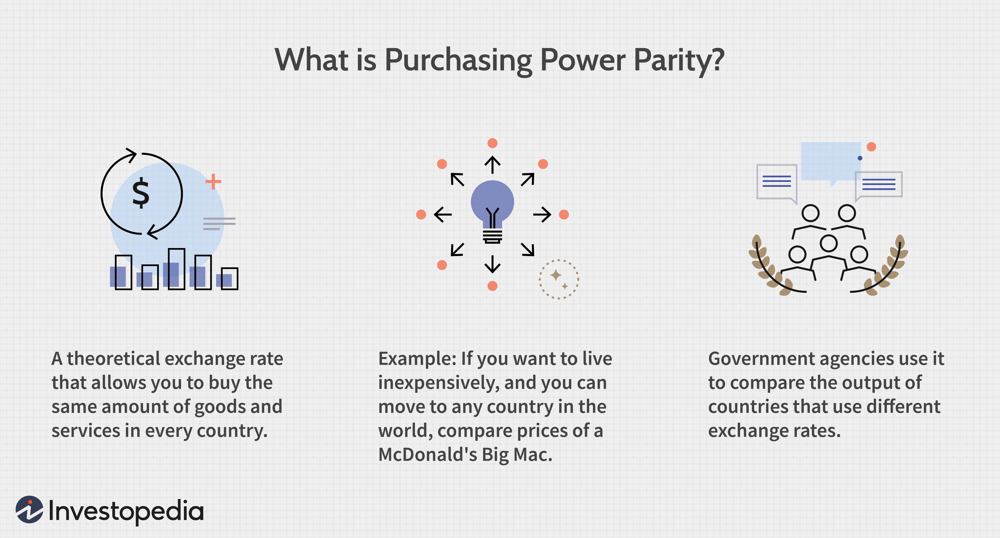

## Table of Contents

## What is the mid price in financial markets?

The mid price in financial markets is the average of the best bid and the best ask prices for a particular asset. The best bid is the highest price a buyer is willing to pay, while the best ask is the lowest price a seller is willing to accept. By taking the midpoint between these two, the mid price gives a fair estimate of the current market value of the asset.

This price is useful for traders and investors because it helps them understand the market's perception of the asset's value at any given moment. It's often used in calculations for various trading strategies and can be a helpful reference point for making decisions about buying or selling. Since the mid price reflects both the buying and selling sides of the market, it provides a balanced view that can be more informative than looking at bid or ask prices alone.

## How is the mid price calculated?

The mid price is found by taking the average of the best bid price and the best ask price. The best bid price is the highest price someone is willing to pay for an asset, and the best ask price is the lowest price someone is willing to sell it for. To calculate the mid price, you add the best bid and the best ask together, then divide by two.

This calculation gives you a number that sits right in the middle of what buyers and sellers think the asset is worth at that moment. It's like finding a fair price that is halfway between what people want to pay and what people want to receive. The mid price helps traders and investors see a balanced view of the market, making it easier to decide if they should buy or sell.

## Why is the mid price important for traders and investors?

The mid price is important for traders and investors because it gives them a good idea of what an asset is really worth at any moment. It's like a fair price that sits right in the middle of what people want to pay and what people want to get for selling the asset. By looking at the mid price, traders can see if the asset is a good deal or if it's overpriced, which helps them decide whether to buy or sell.

This middle price also helps traders make better choices about their trading strategies. Since the mid price shows both what buyers and sellers think, it gives a balanced view of the market. Traders can use this information to plan their moves, like figuring out when to enter or [exit](/wiki/exit-strategy) a trade, and it can help them make smarter decisions to hopefully make more money.

## Can you explain the difference between the mid price and the market price?

The mid price and the market price are two different things that can help people understand what an asset is worth. The mid price is the average of the best bid price, which is the highest price someone is willing to pay, and the best ask price, which is the lowest price someone is willing to sell. This gives you a fair idea of what the asset might be worth right in the middle of what buyers and sellers think.

The market price, on the other hand, is the actual price at which a trade happens. It's the price you see when someone buys or sells the asset. This price can change from one trade to the next and can be different from the mid price because it depends on what people are actually willing to pay or accept at that exact moment. So, the mid price is a kind of estimate, while the market price is what really happens in the market.

## How does the mid price affect the bid-ask spread?

The mid price and the bid-ask spread are closely related. The bid-ask spread is the difference between the highest price someone is willing to pay (the best bid) and the lowest price someone is willing to sell (the best ask). The mid price, which is the average of these two, sits right in the middle of the spread. If the bid-ask spread is small, the mid price will be close to both the bid and ask prices, showing that buyers and sellers agree more on what the asset is worth.

On the other hand, if the bid-ask spread is large, the mid price will be further away from both the bid and ask prices. This means there's a bigger difference between what buyers and sellers think the asset is worth. Traders and investors look at the mid price to see how big the spread is because a smaller spread can make it easier and cheaper to buy and sell the asset. A larger spread might mean it's harder to trade without losing money on the difference between buying and selling prices.

## What are the common uses of mid price in trading strategies?

Traders often use the mid price to help them decide when to buy or sell an asset. Because the mid price is the average of the best bid and the best ask, it gives a good idea of what the market thinks the asset is worth right now. If a trader sees that the current market price is a lot lower than the mid price, they might think it's a good time to buy because the asset seems like a bargain. On the other hand, if the market price is much higher than the mid price, a trader might decide to sell because the asset seems overpriced.

The mid price is also useful for setting up trading strategies that involve stop-loss orders and take-profit levels. A stop-loss order is like a safety net that tells the computer to sell the asset if its price drops to a certain level, to stop losing more money. A take-profit level is the opposite; it tells the computer to sell when the price goes up to a certain point, to lock in profits. Traders might set these levels around the mid price to make sure they're not too far from what the market thinks the asset is worth, helping them manage their trades better.

## How does the mid price relate to order book dynamics?

The mid price is important when we look at the [order book](/wiki/order-book-trading-strategies), which is like a list showing all the buy and sell orders for an asset. The order book shows the best bid and the best ask prices, and the mid price is the average of these two. As the order book changes with new orders coming in or old ones being taken away, the best bid and best ask prices can change too. When this happens, the mid price changes to reflect the new average, giving traders a fresh view of what the market thinks the asset is worth.

The mid price helps traders understand the order book dynamics because it shows the balance between buying and selling interest. If there are a lot of buy orders at high prices and not many sell orders, the best bid might go up, making the mid price go up too. This tells traders that demand for the asset is strong. On the other hand, if there are more sell orders at low prices, the best ask might go down, and the mid price will go down as well, showing that there's more supply than demand. By watching how the mid price moves with the order book, traders can make better decisions about when to buy or sell.

## What are the limitations of using mid price as a reference in trading?

Using the mid price as a reference in trading can be helpful, but it has some limitations. One big problem is that the mid price is just an average, and it might not show the real price at which trades are happening. The market price, which is the price at which someone actually buys or sells the asset, can be different from the mid price. This means that if a trader only looks at the mid price, they might think the asset is worth more or less than what people are really paying for it.

Another limitation is that the mid price can change quickly as the order book changes. The order book shows all the buy and sell orders, and if new orders come in or old ones are taken away, the best bid and best ask prices can shift. This can make the mid price move around a lot, which can be confusing for traders. They might see the mid price go up or down and think the value of the asset is changing a lot, but it might just be because of small changes in the order book.

Lastly, the mid price doesn't show how easy or hard it is to actually trade the asset. If the bid-ask spread is very wide, meaning there's a big difference between the best bid and the best ask, it might be hard to buy or sell without losing money on the difference. The mid price doesn't tell you about this spread, so traders need to look at other things too to understand the full picture of the market.

## How can mid price be used in algorithmic trading?

In [algorithmic trading](/wiki/algorithmic-trading), the mid price is often used as a key reference point for making trading decisions. Algorithms can be programmed to buy an asset when its current market price is lower than the mid price, indicating that the asset might be undervalued. Similarly, they can be set to sell when the market price is higher than the mid price, suggesting the asset might be overvalued. This approach helps the algorithm to aim for buying low and selling high, which is the basic goal of trading.

Another way the mid price is used in algorithmic trading is in setting stop-loss and take-profit levels. A stop-loss order can be placed just below the mid price to limit losses if the price falls too much. A take-profit order might be set just above the mid price to lock in profits when the price rises. By using the mid price as a guide, algorithms can manage trades more effectively, helping traders to make decisions based on a fair estimate of the asset's value.

## What impact do market conditions have on the stability of the mid price?

Market conditions can change the stability of the mid price a lot. When the market is calm and there aren't big changes in how people want to buy or sell, the mid price stays pretty steady. This is because the best bid and the best ask prices don't move around much, so their average, which is the mid price, stays the same too. Traders like this because it makes it easier to plan their trades without worrying about sudden price changes.

But when the market gets wild, like during big news events or when everyone is buying or selling a lot, the mid price can jump around a lot. This happens because the best bid and the best ask prices change quickly as new orders come in or old ones go away. Traders have to be careful in these times because the mid price might not be a good guide for what the asset is really worth, and they might end up buying or selling at the wrong time.

## How do high-frequency trading strategies utilize mid price?

High-frequency trading ([HFT](/wiki/high-frequency-trading-strategies)) strategies use the mid price to make quick trades and take advantage of small price changes. HFT traders often look at the mid price to see if they can buy an asset at a lower price and sell it at a higher price in a very short time. They use powerful computers and special software to watch the mid price all the time. When the mid price moves even a little bit, their algorithms can decide to buy or sell the asset in milliseconds, hoping to make a small profit on each trade.

Sometimes, HFT strategies also use the mid price to figure out if the market is going up or down. If the mid price keeps going up, the algorithms might keep buying the asset, thinking the price will keep rising. If the mid price starts to go down, they might sell the asset quickly to avoid losing money. By using the mid price, HFT traders can make a lot of trades very fast and try to make money from the tiny changes in the market.

## What advanced statistical models are used to predict changes in mid price?

Advanced statistical models like autoregressive integrated moving average (ARIMA) and [machine learning](/wiki/machine-learning) algorithms such as neural networks are used to predict changes in the mid price. These models look at past data to find patterns and trends. For example, ARIMA can help forecast future mid prices by understanding how the mid price has moved in the past and how it might move in the future. Machine learning models, like neural networks, can learn from lots of data, including not just past prices but also other things like trading [volume](/wiki/volume-trading-strategy) or news events, to make better predictions.

These models are really helpful for traders because they can give a heads-up on what might happen next with the mid price. By using these predictions, traders can make smarter decisions about when to buy or sell. But, it's important to remember that these models aren't perfect. The market can be unpredictable, and even the best models can get it wrong sometimes. So, traders often use these predictions along with other information to make their trading choices.

## What is Understanding Mid-price?

The mid-price is fundamentally defined as the average of the ask price and the bid price in a trading scenario. Mathematically, it can be expressed as:

$$
\text{Mid-price} = \frac{\text{Ask Price} + \text{Bid Price}}{2}
$$

This metric provides a crucial point of reference in financial markets as it offers a balanced, unbiased view of current market prices. The mid-price acts as a benchmark that traders can use to gauge the fair value of assets, whether they are trading stocks, commodities, or other financial instruments. By assessing the mid-price, traders gain insights into the equilibrium or consensus price around which current market activity congregates.

Although mid-price is conceptually straightforward, several intricacies surround its calculation and application. In certain cases, the mid-price may be adjusted to the nearest tick size specific to the traded asset, which refers to the smallest allowable price movement for the security. This adjustment can cause minor deviations from the exact arithmetic average of the bid and ask prices. For instance, if the exact mid-price falls between two ticks, it may be rounded up or down to the nearest valid trading increment, affecting the precision of the calculation.

These adjustments are essential in live trading environments where precision is crucial for decision-making and execution. For practitioners, understanding this rounding convention is important to avoid misjudging the significance of mid-price changes, especially in highly liquid markets where the tick size can have a noticeable impact on trading outcomes.

Moreover, since markets are perpetually in motion, the bid and ask prices — and consequently the mid-price — can change rapidly, reflecting the dynamics of supply and demand. By keeping a pulse on these shifts, traders and automated trading systems can refine their strategies, placing buy and sell orders in alignment with their desired pricing outcomes.

Thus, while the mid-price is a simple yet powerful trading tool, successful utilization requires awareness of its nuances, including rounding conventions and the inherent fluidity of market prices.

## References & Further Reading

[1]: Bergstra, J., Bardenet, R., Bengio, Y., & Kégl, B. (2011). ["Algorithms for Hyper-Parameter Optimization."](https://papers.nips.cc/paper/4443-algorithms-for-hyper-parameter-optimization) Advances in Neural Information Processing Systems 24.

[2]: ["Advances in Financial Machine Learning"](https://www.amazon.com/Advances-Financial-Machine-Learning-Marcos/dp/1119482089) by Marcos Lopez de Prado

[3]: ["Evidence-Based Technical Analysis: Applying the Scientific Method and Statistical Inference to Trading Signals"](https://www.amazon.com/Evidence-Based-Technical-Analysis-Scientific-Statistical/dp/0470008741) by David Aronson

[4]: ["Machine Learning for Algorithmic Trading"](https://github.com/stefan-jansen/machine-learning-for-trading) by Stefan Jansen

[5]: ["Quantitative Trading: How to Build Your Own Algorithmic Trading Business"](https://books.google.com/books/about/Quantitative_Trading.html?id=j70yEAAAQBAJ) by Ernest P. Chan