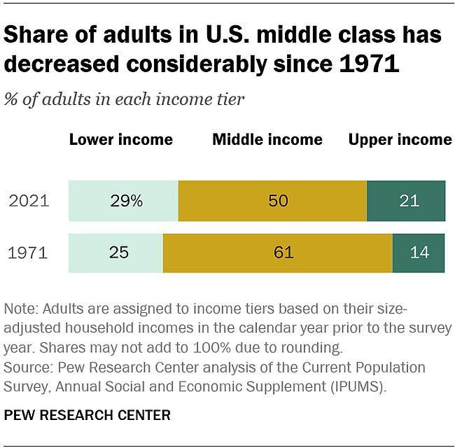

The modern economic landscape is subject to rapid transformations driven by technological advancements, globalization, and shifting socio-economic paradigms. In this dynamic environment, understanding income thresholds and economic trends is crucial for comprehending their impacts on social structures, particularly the middle class. The middle class has traditionally played a central role in economic vitality, acting as both a consumer base and a source of labor. Analyzing the status and fluctuations of the middle class provides valuable insights into broader economic trends, including the rise and fall of various income tiers.

Income thresholds define the boundaries between economic classes, categorizing individuals and households into lower, middle, and upper classes. These thresholds are not static; they evolve with inflation, cost of living adjustments, and changes in median income levels. Over the past few decades, shifts in these thresholds have reflected broader economic changes including wage stagnation, technological disruption, and policy alterations.



Moreover, emerging financial strategies such as algorithmic trading are reshaping financial markets. This development signifies a pivotal shift in how economic opportunities are accessed and utilized. Algorithmic trading leverages computational algorithms to execute trades at speeds and frequencies beyond human capability, offering opportunities for capital growth and financial market participation.

This article investigates into the intricate connections between income thresholds, economic trends, and middle class income status. It also explores how algorithmic trading, as a burgeoning financial strategy, might influence economic stratification and offer new opportunities, especially for the middle class. Understanding these interconnected elements is essential for navigating the future economic landscape effectively and fostering strategic innovations to sustain and perhaps expand the middle class.

## Table of Contents

## Understanding Income Thresholds

Income thresholds play a pivotal role in defining economic categories, such as the lower, middle, and upper classes. These thresholds are often determined by analyzing household income data, considering factors such as cost of living, inflation rates, and regional economic conditions. Organizations such as the U.S. Census Bureau and the Pew Research Center routinely provide guidelines and statistical data to establish these limits, considering both nominal and real income adjustments.

The concept of income thresholds is not just academic; it has profound implications for economic mobility and class definition. Essentially, they set the parameters for financial classification, directly impacting public policy, taxation, and social services. A household categorized within the middle class may have access to certain tax benefits, subsidies, and social programs that aim to bolster economic stability and growth. Conversely, misclassification or shifting thresholds can lead to economic disparities and influence individual opportunities for upward mobility.

Defining the middle class can be particularly challenging due to its dynamic nature. Historically, middle-class income ranges have been shaped by a multitude of socioeconomic factors, including industrial growth, wage dynamics, and educational advancements. According to Pew Research, the middle-class income range typically falls between two-thirds to double the national median income. However, this classification can shift significantly with broader economic changes. In recent decades, fluctuations in median income levels, inflation, and policy adjustments have prompted reevaluations of what constitutes middle-class earnings. 

For example, the middle-class threshold has experienced realignment due to stagnant wage growth despite rising living costs, placing economic pressure on families once firmly within this category. Historical data from the U.S. Census Bureau reveals a shrinking middle-class percentage, as income growth for upper-echelon brackets outpaces that of middle-income earners. This shift underlines the importance of continually reassessing income thresholds to reflect true economic conditions.

In conclusion, understanding income thresholds illuminates key economic challenges and opportunities. It encourages reflective public discourse on how policy adjustments and economic strategies can be leveraged to enhance economic mobility and ensure a robust middle class.

## The Shrinking Middle Class: A Historical Overview

The middle class has traditionally served as the backbone of the United States economy, driving both consumption and growth. However, recent trends highlight a troubling decline in the proportion of individuals classified as middle class. Analyzing data from leading sources such as Pew Research and the U.S. Census Bureau reveals this pattern more explicitly.

A Pew Research study indicates a significant decrease in the middle-class population from 61% in 1971 to approximately 51% in recent years. This shift underscores a pivotal change in economic dynamics and raises concerns about economic inequality. The U.S. Census Bureau further supports these findings, illustrating that household income distribution is increasingly polarized, with more households moving into the lower- and upper-income tiers.

Several factors contribute to this contraction of the middle class. Economic policies play a critical role, with tax laws and government regulations disproportionately favoring higher income brackets. For instance, tax reforms have historically provided significant benefits to the wealthy, thereby exacerbating income disparity.

Demographic changes also contribute to middle-class shrinkage. The U.S. is experiencing an aging population, with more individuals retiring and shifting from wage-[earning](/wiki/earning-announcement) to fixed incomes, impacting their economic status. Additionally, increased diversity has brought new workforce dynamics, yet systemic barriers often hinder equal income opportunities for minority groups, suppressing their ascent into the middle class.

Wage stagnation remains another prominent [factor](/wiki/factor-investing). Despite increases in productivity, wage growth has been sluggish, failing to keep pace with the cost of living. This stagnation restricts economic mobility, making it difficult for individuals to maintain or achieve middle-class status.

```python
import matplotlib.pyplot as plt

# Data from Pew Research
years = [1971, 1981, 1991, 2001, 2011, 2021]
middle_class_percentages = [61, 59, 56, 53, 51, 51]

plt.plot(years, middle_class_percentages, marker='o')
plt.title('Shrinking Middle Class Over Time')
plt.xlabel('Year')
plt.ylabel('Middle Class Percentage')
plt.xticks(years)
plt.grid(True)
plt.show()
```

The above Python code utilizes matplotlib to present a visual representation of the middle-class decline over recent decades, based on data derived from Pew Research. This trend not only highlights the numerical reduction but also raises questions about the broader socio-economic implications. Addressing this issue requires multifaceted strategies encompassing policy reform, educational advancement, and economic diversification to revitalize the middle class and bolster economic stability.

## Economic Trends and Their Impact on Income Distribution

Recent economic trends have underscored a significant widening of the income divide, a phenomenon often colloquially termed as the rich getting richer while the poor get poorer. This section addresses the root causes and implications of these trends on income distribution.

One of the profound influences on income distribution is demographic changes. Aging populations, particularly in developed countries, pose challenges to economic growth and subsequently affect income distribution patterns. As the workforce ages, there is a potential mismatch in skills, leading to wage disparities and a possible increase in reliance on social security systems, which can strain public finances and affect economic inequalities. Furthermore, increased diversity within the workforce, driven by globalization and migration, has altered labor dynamics. While diversity can drive innovation and growth, it also necessitates inclusive economic policies to ensure equitable income distribution.

Several economic policies and global events have also influenced these trends. For instance, tax regimes favoring capital gains over labor income have contributed to wealth concentrating among those who can invest, exacerbating income inequalities. Similarly, deregulation in certain sectors has sometimes prioritized corporate profits over equitable wage distribution, further expanding the income gap. Additionally, global events such as financial crises have historically impacted wealth distribution, often resulting in greater burden-sharing by lower-income households, while recovery benefits might disproportionately favor the affluent.

Technological advancements have played a dual role; they have fostered economic efficiencies and created high-income opportunities within tech-driven sectors, but have also led to job displacement in traditional industries, often affecting lower and middle-income workers. Addressing these disparities requires strategic policy interventions and adaptive economic systems that harness technological growth while safeguarding equal opportunities across various income classes.

Understanding these factors is vital for designing policies that effectively address and mitigate income inequality, thus fostering a more equitable economic environment.

## Algorithmic Trading: Reshaping the Financial Market

Algorithmic trading has become a fundamental component of the modern financial landscape, leveraging advanced computational tools and models to execute trades at speeds and frequencies that are impossible for human traders. It involves the use of algorithms—precise sequences of instructions—to automate trading decisions. This form of trading is particularly prevalent in high-frequency trading ([HFT](/wiki/high-frequency-trading-strategies)), where algorithms make transactions in fractions of a second, capitalizing on minute price discrepancies in the market.

Technological advancements have played a significant role in democratizing access to trading platforms that were once the exclusive domain of large financial institutions. Today, both individual and institutional investors can utilize powerful algorithmic tools and platforms that provide access to real-time data and sophisticated analytics. Open-source languages like Python, with libraries such as Pandas for data manipulation and Scikit-learn for predictive analytics, have lowered the barriers for entry into [algorithmic trading](/wiki/algorithmic-trading). This democratization of technology has enabled more participants to benefit from the efficiencies and opportunities presented by automated trading systems.

Algorithmic trading substantially influences various aspects of market dynamics:

1. **Liquidity**: Algorithms can provide liquidity by constantly making buy and sell offers, ensuring that there are sufficient opportunities for other market participants to engage in trades. With the presence of numerous algorithmic players in the market, the bid-ask spread often narrows, making it cheaper and easier for traders to conduct transactions.

2. **Volatility**: While algorithmic trading can contribute to market liquidity, it can also lead to increased volatility, particularly if many algorithms respond similarly to market signals. For instance, in times of market stress, algorithms might amplify price swings by triggering a cascade of trades based on predefined risk management rules.

3. **Accessibility**: By making use of technological infrastructure, algorithmic trading has enhanced market accessibility. Traders worldwide can participate in markets without the need for significant physical infrastructure or large teams. Cloud computing and APIs (Application Programming Interfaces) allow traders to deploy their strategies globally, connecting to exchanges and data providers from anywhere.

Algorithmic trading continues to evolve, with [machine learning](/wiki/machine-learning) and [artificial intelligence](/wiki/ai-artificial-intelligence) increasingly integrated into trading algorithms to enhance their predictive capabilities. As these technologies advance, they promise to further reshape the financial markets, offering new challenges and opportunities for traders of all backgrounds. These developments underscore the importance of robust risk management practices and continuous learning for all market participants.

In summary, algorithmic trading is reshaping the financial markets by enhancing [liquidity](/wiki/liquidity-risk-premium), potentially affecting [volatility](/wiki/volatility-trading-strategies), and improving accessibility for traders. As technology continues to progress, the role of algorithmic trading is poised to expand, necessitating adaptations by individuals and institutions aiming to capitalize on these advancements efficiently and effectively.

## The Middle Class and Algorithmic Trading: Opportunities and Challenges

Algorithmic trading has emerged as a powerful tool that individuals, including those from the middle class, can harness to enhance their financial return on investment (ROI). By utilizing algorithms to make trading decisions, investors can capitalize on the speed and efficiency that technology offers, potentially leveling the playing field between institutional and retail investors.

One of the primary opportunities for middle-class individuals lies in the accessibility of algorithmic trading platforms and tools. These platforms provide sophisticated algorithms that can analyze and execute trades faster than humanly possible, allowing individual investors to take advantage of market opportunities that were once accessible only to professionals. With these tools, middle-class investors can diversify their portfolios, manage risks more effectively, and potentially achieve higher returns.

However, algorithmic trading is not without its challenges, particularly for non-expert traders. One significant risk is market volatility. Algorithmic trading strategies, especially those involving high-frequency trading, can exacerbate market volatility, leading to increased risk during periods of rapid market movements. Moreover, the complexity of algorithms and the need for continuous monitoring can pose barriers for individuals lacking technical expertise.

To mitigate these risks, middle-class traders can begin by using simplified algorithmic tools provided by online brokerage firms. These tools often come with user-friendly interfaces and pre-built algorithms that require minimal customization, thus reducing the technical entry barrier. Additionally, individuals can start with [backtesting](/wiki/backtesting) algorithms using historical data to understand potential performance and risks without committing real capital. Educational resources and community forums can also aid in building knowledge and proficiency in the use of these technologies.

The democratization of wealth generation through algorithmic trading carries significant potential for contributing to the stability of the middle class. As more individuals gain access to these advanced trading tools, there is an opportunity for wealth gap reduction. By facilitating more independent financial decision-making, algorithmic trading can empower the middle class to build and sustain wealth over the long term. However, achieving this potential requires not just access to tools, but also an emphasis on financial literacy and education to ensure middle-class investors can use these technologies responsibly and effectively.

## The Future of Income Classes in an Algorithmic Era

The evolution of income classes in an era dominated by algorithmic technologies presents both challenges and opportunities. As technological advancements continue to reshape the financial sector, the disparities and dynamics among different income classes are likely to transform significantly.

The integration of algorithmic trading into the financial markets has the potential to redefine income classes by offering new avenues for wealth generation. This evolution is anticipated to result in a more fluid and potentially expansive definition of the middle class, assuming equitable access to algorithmic tools and resources is achieved. The democratization of trading, facilitated by algorithms, can empower middle-class investors to participate more actively in wealth-building activities traditionally dominated by higher-income classes.

To ensure these technologies benefit all segments of society equitably, several policy recommendations are necessary. Governments and regulatory bodies should focus on creating inclusive financial policies that promote unrestricted access to algorithmic trading platforms for all income classes. Additionally, subsidies or incentives could be introduced for lower-income individuals to engage with these technologies, reducing the initial entry barriers.

Moreover, establishing robust educational frameworks to enhance financial literacy is crucial. Financial institutions, in collaboration with educational bodies, should develop comprehensive training programs that focus on imparting essential trading skills and knowledge of algorithmic platforms. This educational effort should emphasize critical thinking, risk management, and the ethical implications of using automated systems.

Furthermore, there must be a coordinated effort by policymakers to foster a fair regulatory environment that mitigates the risks associated with high-frequency and algorithmic trading. This includes safeguarding measures against market manipulation and ensuring system transparency. By doing so, financial markets can maintain integrity while supporting diverse participation.

A call to action is thus extended to all stakeholders, including policymakers, financial institutions, and educational bodies, to prioritize financial literacy and adaptability. It is imperative that these organizations work together to deliver programs and initiatives that not only educate but empower individuals to navigate the complexities of algorithmic financial systems effectively.

In conclusion, the future configuration of income classes, particularly the middle class, in an algorithmic era will be largely determined by the level of inclusivity and accessibility afforded by technological advancements in the financial sector. Strategic policies and educational innovations are vital to ensure that all individuals, irrespective of their current economic status, can realize the benefits of these innovations and contribute to a more stable and equitable economic landscape.

## Conclusion

The dynamic interplay between income thresholds, economic trends, and algorithmic trading represents a crucial framework for understanding current and future economic landscapes. Income thresholds, which define the economic categories of lower, middle, and upper classes, serve as a fundamental basis for analyzing economic mobility and distribution. These thresholds have experienced shifts due to factors such as inflation, policy changes, and technological advancements, all of which influence the economic positioning of various groups, particularly the middle class.

Recent decades have shown a notable contraction of the middle class, traditionally a stabilizing force in many economies. This trend is exacerbated by economic policies that often favor the affluent, demographic shifts, and wage stagnation. Consequently, the 'middle' segment increasingly faces pressures that threaten its viability. Understanding these trends is essential as they affect purchasing power, economic stability, and social equality.

Algorithmic trading emerges as a significant development in this context, providing both challenges and opportunities. With its ability to democratize access to financial markets, algorithmic trading can potentially provide middle-class investors with tools to enhance financial returns. However, effective exploitation of these tools requires a substantial understanding of financial markets and risk management strategies.

To navigate these complexities, strategic innovations and policy interventions are imperative. Ensuring equitable access to financial education and resources is critical for harnessing the potential of algorithmic trading to benefit a diverse array of income classes. Furthermore, policies that promote income equality, sustain economic growth, and encourage technological inclusion are pivotal in supporting the middle class.

In conclusion, proactively addressing these interconnected elements through informed strategies and policies will be essential to foster economic resilience and growth. Striking a balance between innovation and equitable resource distribution ensures that advancements, like algorithmic trading, contribute positively to the socio-economic fabric, sustaining a robust middle class and securing future economic stability.

## References & Further Reading

[1]: U.S. Census Bureau. [Income and Poverty in the United States: 2020](https://www.census.gov/library/publications/2021/demo/p60-273.html).

[2]: Pew Research Center. [The American Middle Class Is Losing Ground](https://www.pewresearch.org/social-trends/2015/12/09/the-american-middle-class-is-losing-ground/).

[3]: Autor, D. H. (2015). ["Why Are There Still So Many Jobs? The History and Future of Workplace Automation."](https://www.aeaweb.org/articles?id=10.1257/jep.29.3.3) Journal of Economic Perspectives, 29(3), 3-30.

[4]: Gomber, P., Arndt, B., Lutat, M., & Uhle, T. (2011). ["High-Frequency Trading."](https://www.semanticscholar.org/paper/High-Frequency-Trading-Gomber-Arndt/3d0ba8179934e0a45e85a184d1ec526616e2e213) In: Wirtschaftsinformatik. Physica-Verlag HD.

[5]: Hendershott, T., Jones, C. M., & Menkveld, A. J. (2011). ["Does Algorithmic Trading Improve Liquidity?"](https://onlinelibrary.wiley.com/doi/full/10.1111/j.1540-6261.2010.01624.x) The Journal of Finance, 66(1), 1-33.

[6]: Shiller, R. J. (2012). ["Finance and the Good Society"](https://press.princeton.edu/books/hardcover/9780691154886/finance-and-the-good-society) Princeton University Press.

[7]: Brynjolfsson, E., & McAfee, A. (2014). ["The Second Machine Age: Work, Progress, and Prosperity in a Time of Brilliant Technologies"](https://psycnet.apa.org/record/2014-07087-000) W.W. Norton & Company.