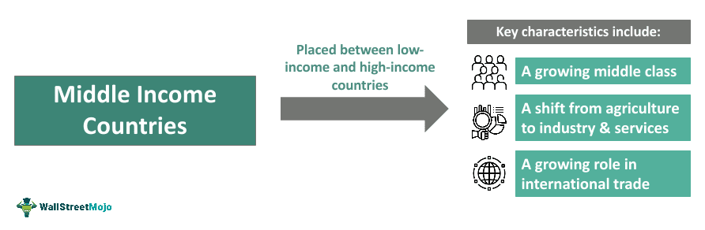

## Table of Contents

## What is the definition of a middle-income country?

A middle-income country is a nation that has an economy that is not as rich as high-income countries, but not as poor as low-income countries. The World Bank classifies countries into different income groups based on their gross national income (GNI) per capita. Middle-income countries are further divided into two groups: lower-middle income and upper-middle income. This classification helps in understanding the economic situation of a country and in planning development strategies.

Lower-middle income countries have a GNI per capita between $1,036 and $4,045, while upper-middle income countries have a GNI per capita between $4,046 and $12,535. These ranges are updated every year by the World Bank to reflect changes in the global economy. Many middle-income countries are working to improve their economies and move into the high-income category. Examples of middle-income countries include India, which is in the lower-middle income group, and China, which is in the upper-middle income group.

## How are middle-income countries classified by the World Bank?

The World Bank sorts countries into different groups based on how much money people in those countries earn on average. This average is called gross national income (GNI) per person. Middle-income countries are countries where people earn more money than in low-income countries but less than in high-income countries. The World Bank splits middle-income countries into two smaller groups: lower-middle income and upper-middle income.

Lower-middle income countries are places where the average person earns between $1,036 and $4,045 each year. Upper-middle income countries are where the average person earns between $4,046 and $12,535 each year. These numbers change a little bit every year because the World Bank wants to keep up with changes in the world's economy. This way of grouping helps people understand where a country stands economically and plan ways to help it grow.

## What are the key economic characteristics of middle-income countries?

Middle-income countries have economies that are growing but still face many challenges. They often have industries that are developing, like manufacturing and services, which help create jobs and increase the money people earn. However, these countries might still have a lot of people working in farming, which doesn't always pay well. They also might struggle with things like not having enough good schools or hospitals, which can make it hard for people to improve their lives.

Another important thing about middle-income countries is that they are trying to move up to become high-income countries. This means they need to keep their economies growing and make sure more people can get good jobs. Sometimes, they get help from other countries or big organizations like the World Bank to build better roads, schools, and hospitals. But it's not easy, and they have to work hard to keep improving and avoid problems like too much debt or not enough jobs for everyone.

## What are the social indicators typically seen in middle-income countries?

In middle-income countries, you often see a mix of good and bad social indicators. On one hand, people might have better access to things like schools and hospitals compared to low-income countries. More kids might be going to school, and more people might be able to see a doctor when they're sick. But on the other hand, there can still be big problems. For example, not everyone might be able to go to school or get good healthcare, especially if they live in rural areas or don't have much money.

Another common social indicator in middle-income countries is the level of poverty. While fewer people might be living in extreme poverty compared to low-income countries, there can still be a lot of people who struggle to make ends meet. Inequality can be a big issue too, with some people getting much richer while others stay poor. This can lead to problems like crime or social unrest. Overall, middle-income countries are working to improve these social indicators, but it takes time and effort to make sure everyone can live a better life.

## How do middle-income countries contribute to global economic growth?

Middle-income countries play a big role in helping the world's economy grow. They do this by making more things and providing more services. For example, countries like China and India make a lot of products that people all over the world buy. This means more money is moving around the world, which helps everyone's economy. Also, when middle-income countries grow, they need to buy things from other countries, like machines or technology, which helps those countries' economies too.

Another way middle-income countries help global economic growth is by having more people who can spend money. As these countries get richer, more people can buy things they need or want, like cars, phones, or clothes. This spending helps businesses in their own country and in other countries too. Plus, when middle-income countries grow, they often invest in other places around the world, which can create jobs and help other economies grow. So, middle-income countries are really important for making the whole world's economy stronger.

## What challenges do middle-income countries face in achieving sustainable development?

Middle-income countries face many challenges when trying to achieve sustainable development. One big challenge is balancing economic growth with taking care of the environment. As these countries grow, they often use more resources and create more pollution. This can harm the environment and make it hard to keep growing in a way that is good for the planet. They need to find ways to grow their economies without using up all their resources or making the air and water dirty.

Another challenge is making sure that everyone benefits from the growth. In many middle-income countries, there is a big gap between rich and poor people. This means that even though the country is growing, not everyone is getting richer. It's important for these countries to make sure that everyone has access to good jobs, schools, and healthcare. If they don't, it can lead to problems like crime or people being unhappy with their government. Middle-income countries need to work hard to make sure that their growth helps everyone, not just a few people.

## What role do middle-income countries play in international trade?

Middle-income countries are very important in international trade. They make a lot of things that people all over the world buy, like cars, electronics, and clothes. For example, countries like China and Mexico are big in making these things. When they sell these products to other countries, it helps their own economy grow and also helps the economies of the countries that buy their products. This trading back and forth makes the whole world's economy stronger.

Another way middle-income countries help with international trade is by buying things from other countries. As they grow richer, they need more stuff like machines, technology, and raw materials. This means they import a lot of goods, which helps the countries that sell these things. For instance, a middle-income country might buy oil from a high-income country or machinery from another middle-income country. This buying and selling helps keep the flow of money and goods moving around the world, which is good for everyone's economy.

## How do middle-income countries manage the transition from lower to upper middle-income status?

Middle-income countries work hard to move from lower to upper middle-income status. They do this by making their economies bigger and better. They often focus on making more things and providing more services. For example, they might build more factories or start new businesses. They also try to make it easier for companies to do business by improving roads, ports, and other things that help trade. This helps them sell more stuff to other countries and make more money. But it's not easy. They have to be careful not to grow too fast and end up with problems like too much debt or not enough jobs for everyone.

Another important part of moving up is making sure people get better education and healthcare. When people are healthier and more educated, they can work better and help the economy grow. Middle-income countries often get help from other countries or big organizations like the World Bank to build better schools and hospitals. But they still have to make sure that everyone, not just a few people, can go to these schools and hospitals. It's a big challenge, but if they can do it, they can keep growing and move up to upper middle-income status. This helps everyone in the country live a better life.

## What are the common strategies used by middle-income countries to avoid the middle-income trap?

Middle-income countries often try to avoid the middle-income trap by focusing on making their economies more competitive. They do this by investing in things like education and technology, which help people learn new skills and create better products. They also try to make it easier for businesses to start and grow by improving things like roads, ports, and laws that help trade. By doing these things, they hope to keep growing and move up to high-income status without getting stuck in the middle.

Another strategy is to make sure that growth benefits everyone, not just a few people. This means making sure that everyone has access to good jobs, schools, and healthcare. If only a few people get richer, it can lead to problems like crime or people being unhappy with their government. So, middle-income countries work to spread the wealth around by helping small businesses and making sure that people in rural areas can also benefit from growth. This way, they can keep growing without getting stuck in the middle-income trap.

## How do political and institutional factors influence development in middle-income countries?

Political and institutional factors play a big role in how middle-income countries grow and develop. Good government and strong rules help these countries move forward. If the government is stable and honest, it can make good plans for the country. It can build roads, schools, and hospitals that everyone can use. Also, if the laws are fair and easy to follow, businesses can start and grow, which creates jobs and helps the economy. But if the government is not good, or if there is a lot of corruption, it can make it hard for the country to grow. People might not trust the government, and businesses might not want to invest in the country.

Another important thing is how the government works with other countries and big organizations. If a middle-income country has good relationships with other countries, it can get help and money to grow. For example, the World Bank or other rich countries might give money to build schools or roads. But if the country has bad relationships or if there are a lot of fights with other countries, it can be harder to get this help. Also, if the government is not good at working with others, it can miss out on chances to learn new things and grow. So, having a good government and strong institutions is really important for middle-income countries to keep developing and avoid problems.

## What is the impact of technological advancement on middle-income countries?

Technological advancement can really help middle-income countries grow. When these countries use new technology, they can make things faster and better. For example, if they use new machines in factories, they can make more products and sell them to other countries. This helps their economy grow. Also, technology can help people learn new skills. If people can use computers and the internet, they can learn a lot and get better jobs. This makes the whole country richer and helps it move up to a higher income level.

But there are also some challenges with technology. Not everyone in middle-income countries can use new technology. Some people might not have enough money to buy computers or phones, or they might live in places where there is no internet. This can make the gap between rich and poor people even bigger. Also, if a country uses a lot of new technology, it might need to change its laws and rules to keep up. If the government is not good at doing this, it can slow down growth. So, while technology can help middle-income countries a lot, they need to make sure everyone can use it and that their laws keep up with the changes.

## How do middle-income countries influence global environmental policies and sustainability efforts?

Middle-income countries have a big role in shaping global environmental policies and sustainability efforts. As they grow, they use more resources and create more pollution. This means they need to be part of the talks about how to take care of the environment. They can push for rules that help them grow in a way that is good for the planet. For example, they might support plans to use more clean energy like wind or solar power. This helps them keep growing without making the air and water dirty. They also have a say in big meetings where countries decide how to fight climate change. Their ideas and actions can make a big difference in what the whole world does to protect the environment.

At the same time, middle-income countries face challenges in meeting global environmental goals. They need to balance growing their economies with taking care of the environment. This can be hard because they might not have a lot of money to spend on things like clean energy or protecting forests. But they can work with other countries and big organizations to get help. For example, they might get money or technology from richer countries to use less harmful ways of growing. By working together, middle-income countries can help the world move towards a more sustainable future. Their actions and policies are important for making sure that everyone can live well without hurting the planet.

## References & Further Reading

[1]: World Bank. ["Country and Lending Groups."](https://datahelpdesk.worldbank.org/knowledgebase/articles/906519-world-bank-country-and-lending-groups) Accessed 2023.

[2]: Kearney, A. T. (2012). ["Winning in the Fastest Growing Cities: Capitalizing on Urbanization Trends in Emerging Markets."](https://www.kearney.com/documents/291362523/291366933/Global+Cities+2012.pdf/56dd6e26-688a-5e38-5636-828e83f89e1a?t=1500535707000) A.T. Kearney.

[3]: Lopez de Prado, M. (2018). ["Advances in Financial Machine Learning."](https://www.amazon.com/Advances-Financial-Machine-Learning-Marcos/dp/1119482089) John Wiley & Sons.

[4]: Farrell, R. (2019). ["An Introduction to Machine Learning in Finance."](https://link.springer.com/book/10.1007/978-3-030-81935-4) Cambridge University Press.

[5]: Gomber, P., Arndt, B., Lutat, M., & Uhle, T. (2011). ["High-Frequency Trading."](https://www.researchgate.net/publication/271631628_High-Frequency-Trading) WI - Wirtschaftsinformatik. 

[6]: Financial Stability Board. (2017). ["Artificial Intelligence and Machine Learning in Financial Services."](https://www.fsb.org/2017/11/artificial-intelligence-and-machine-learning-in-financial-service/)

[7]: Gurría, A. (2011). ["Leveraging Higher Education to Foster Economic Growth."](https://en.wikipedia.org/wiki/Jos%C3%A9_%C3%81ngel_Gurr%C3%ADa) Organisation for Economic Co-operation and Development (OECD).

[8]: Mallaby, S. (2022). ["The Power Law: Venture Capital and the Making of the New Future."](https://www.amazon.com/Power-Law-Venture-Capital-Making/dp/052555999X) Penguin Press.

[9]: Schwab, K. (2016). ["The Fourth Industrial Revolution."](https://www.weforum.org/about/the-fourth-industrial-revolution-by-klaus-schwab/) Penguin Books.