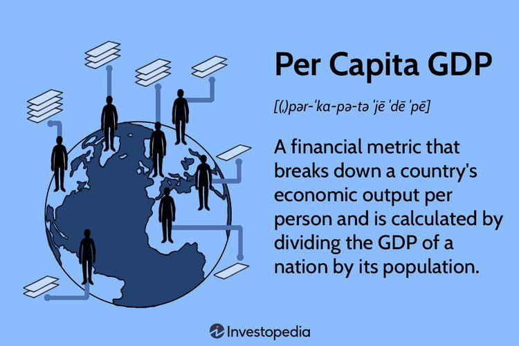

Middle-Income Countries (MICs) are integral contributors to the global economy, recognized for their significant economic and demographic presence. According to the World Bank classification, these nations have a Gross National Income (GNI) per capita ranging from $1,136 to $13,845. This diverse group includes countries from different regions, each exhibiting unique economic challenges and opportunities due to varying sizes and developmental needs.

MICs encompass a substantial portion of the global population and economic activity, housing over 75% of the world's population and contributing more than one-third of the global Gross Domestic Product (GDP). This makes understanding their economic dynamics and development trajectories crucial. These countries are not only essential markets for goods and services but also pivotal players in international trade and investment. Their robust economic growth rates over the past few decades have significantly impacted global supply chains and demand patterns, making them central to discussions on economic and developmental policies.

In today's technologically advanced world, algorithmic trading—a method of executing financial transactions using automated and pre-programmed trading instructions—has become influential in financial markets, including those in MICs. Algorithmic trading brings the promise of enhanced market efficiency through increased trading volumes and liquidity. However, its complexity and potential impact on market stability highlight the need for well-defined regulatory frameworks.

Through this article, we aim to investigate how algorithmic trading, alongside other economic factors, can influence development and stability in Middle-Income Countries. We will examine both the strengths and vulnerabilities of MICs as they navigate their roles on the global stage, emphasizing their growing influence and the implications for future economic landscapes.

## Table of Contents

## What are Middle-Income Countries?

Middle-Income Countries (MICs) are nations that the World Bank categorizes based on their Gross National Income (GNI) per capita. Specifically, these are nations with a GNI per capita between $1,136 and $13,845. The classification is further divided into two groups: lower-middle-income (GNI per capita between $1,136 and $4,465) and upper-middle-income economies (GNI per capita between $4,466 and $13,845). This classification is adjusted annually to account for inflation and changes in the cost of living.

Examples of nations falling under this classification include Turkey, Brazil, India, and China. These countries are significant in terms of economic power and global influence. China and India, in particular, stand out due to their large populations and rapid economic growth. Brazil and Turkey are also key players in their respective regions, contributing significantly to regional and global economic dynamics.

MICs encompass a vast demographic and are home to over 75% of the world's population. This demographic significance means that these countries are crucial markets for goods and services and are essential drivers of global demand. Furthermore, MICs contribute more than one-third of the global gross domestic product (GDP), underscoring their vital role in global economic output. Their economies are diverse, often blending elements from developing and developed countries, and they frequently serve as hubs of innovation and production.

Economically, MICs exhibit a wide range of economic activities and development levels. They often navigate the challenges of poverty reduction, infrastructure development, and industrialization. Many MICs have made substantial progress in reducing poverty levels and improving living standards over recent decades. However, the disparity in income distribution and access to resources remains a challenge.

The economic trajectory of MICs is critical for global economic stability. Their potential for growth provides opportunities for both domestic and international investments. However, this potential can only be fully realized with adequate governance, infrastructure, and policy frameworks tailored to their unique needs and challenges. Understanding these factors is crucial for any analysis of their role in the global economy.

## Characteristics and Challenges of MICs

Middle-Income Countries (MICs) are marked by notable economic diversity, encapsulating a broad spectrum from small nations with limited populations to expansive, populous states such as India and China. This diversity presents unique economic landscapes and challenges specific to their categorization within middle-income brackets.

Lower-middle-income countries primarily grapple with the delivery of essential services to their populations. These services encompass healthcare, education, infrastructure, and access to clean water and sanitation. The limited fiscal capacity constrains these nations' ability to enhance service quality and coverage. Additionally, lower-middle-income countries often face hurdles in terms of technological advancement and industrial diversification, impeding their growth potential.

In contrast, upper-middle-income countries frequently encounter challenges related to governance and corruption. These issues can stifle economic performance and deter foreign investment, which is crucial for sustaining growth and development. Moreover, as these countries advance economically, they experience pressures to transition from labor-intensive to more capital-intensive industries, which requires a skilled workforce and robust institutional frameworks.

Despite the challenges, MICs remain pivotal in driving global economic growth and development. They account for a significant portion of the world's production and consumption, acting as crucial markets for goods and services from around the globe. As these countries progress, their economic policies and growth trajectories can have profound impacts on international markets and global financial stability. By addressing the aforementioned challenges, MICs can harness their potential effectively, further solidifying their role as central engines in the global economic landscape.

## Importance of MICs in the Global Economy

Middle-Income Countries (MICs) are integral to maintaining global economic stability and fostering growth worldwide. These countries, classified by the World Bank based on their Gross National Income (GNI) per capita, span both lower-middle-income and upper-middle-income economies. As a group, MICs constitute a significant portion of the global population and contribute extensively to the world’s Gross Domestic Product (GDP).

The development of MICs is directly tied to poverty reduction and improving financial stability on a global scale. As these countries advance economically, they generate substantial employment opportunities, improve social welfare, and enhance living standards for large segments of the global population. This, in turn, leads to a reduction in poverty levels, propelling more inclusive growth and development across regions. For example, countries like China and India have lifted millions out of poverty by transforming their economic structures, thereby serving as models for other MICs.

Moreover, the economic activities within MICs have substantial spillover effects on international markets. Many of these countries have large consumer bases and are emerging as significant players in trade and investment arenas, thus influencing global supply chains and cross-border economic dynamics. The integration of MICs into the global economy results in more diversified markets and provides consumers and businesses worldwide with a broader array of products and services.

MICs also play a pivotal role in addressing global challenges such as climate change and sustainable development. As they continue to industrialize and urbanize, these countries face unique environmental challenges that necessitate sustainable development practices. By adopting green technologies and renewable energy solutions, MICs have the potential to significantly curb global carbon emissions, thereby contributing to global climate goals.

The economic policies and growth patterns of MICs affect international markets by influencing commodity prices, trade flows, and investment portfolios. For instance, changes in economic policies within a large MIC can impact global commodity demand, thereby affecting prices and export levels from commodity-rich countries. Moreover, these countries' engagement in global value chains can alter the competitive dynamics of industries at the international level.

In addition, regional and bilateral trade agreements involving MICs often reshape global trade landscapes and cross-border relations. By participating in trade blocs and agreements, MICs can facilitate greater economic integration, reduce trade barriers, and promote shared economic interests across nations, fostering a more interconnected global economy.

In summary, the significance of Middle-Income Countries in the global economy cannot be overstated. Their continued growth and development are crucial for achieving global economic stability, poverty eradication, and sustainable development. As MICs further integrate into the global economic framework, attention to their policies and development trajectories remains essential for maximizing their positive impact on the world stage.

## Algorithmic Trading and Economic Development in MICs

Algorithmic trading is increasingly integrating into the financial markets of Middle-Income Countries (MICs), providing opportunities to enhance market efficiency and economic stability. Algorithmic trading utilizes advanced mathematical models and computational algorithms to execute trades rapidly and efficiently. Its adoption within MICs promises to reshape financial markets by increasing transparency, minimizing human error, and reducing transaction costs. 

One significant benefit of [algorithmic trading](/wiki/algorithmic-trading) is the improvement in [liquidity](/wiki/liquidity-risk-premium). By automating the trading process, market participants can engage in high-frequency trading, thereby ensuring that markets remain liquid and prices reflect current information promptly. This liquidity can attract international investors, fostering greater capital inflow into MICs, which is essential for economic development and stability.

Despite these advantages, the adoption of algorithmic trading requires robust regulatory frameworks. Without appropriate regulations, MICs might encounter market manipulation and systemic risks, such as "flash crashes," where markets experience rapid sell-offs followed by a quick recovery. Regulatory bodies must establish guidelines that promote transparency and fair trading practices while monitoring automated trading activities to prevent market abuse.

Algorithmic trading also holds the potential to democratize financial markets in MICs. By enabling smaller market players to participate in trading activities typically dominated by large institutions, it fosters a more inclusive financial environment. However, this democratization demands adequate technological infrastructure and education to ensure equitable access to trading technologies across the population.

Moreover, integrating algorithmic trading within MICs can spur technological innovation and development. Financial institutions are likely to invest in cutting-edge technologies and data analytics to remain competitive, creating a ripple effect across various sectors, including information technology and telecommunications. This investment can drive job creation and skill development, critical for the economic progression of MICs.

While offering numerous advantages, algorithmic trading also presents potential risks. Market [volatility](/wiki/volatility-trading-strategies), algorithmic errors, and cybersecurity threats could undermine market confidence and economic stability. Therefore, it is imperative that MICs not only adopt sophisticated technology but also bolster their regulatory frameworks to mitigate these risks effectively. 

In summary, algorithmic trading can serve as a catalyst for economic development in Middle-Income Countries by enhancing financial market efficiency and inclusivity. However, to harness its full potential, these countries must prioritize developing comprehensive regulatory measures and investing in technological infrastructure. By doing so, MICs can leverage this technological advancement for sustainable economic growth and financial stability.

## Conclusion

Middle-Income Countries (MICs) are indispensable to global economic progress due to their substantial economic influence, potential for growth, and demographic weight. These nations face unique challenges and opportunities that shape their role in the global economy. On one hand, MICs confront issues such as infrastructure deficits, governance constraints, and social inequalities. On the other, they present immense opportunities for innovation, urbanization, and market expansion, positioning them as vital contributors to economic dynamism and growth. 

In terms of technological advancements, algorithmic trading holds promise for enhancing economic development in MICs. This form of trading can enhance market efficiency by leveraging data analytics and algorithmic strategies to optimize trading decisions. However, it also poses challenges that must be carefully managed, such as ensuring financial stability and preventing market manipulation. Effective governance frameworks are essential to oversee the implementation of algorithmic trading, minimizing risks while fostering innovation.

As MICs continue to evolve, their influence on the global economic landscape is expected to grow. This growth trajectory highlights the importance of understanding and supporting their development. Investment in education, infrastructure, and regulatory capacity is crucial to ensuring that these countries can effectively navigate the complexities of the global economy. By addressing these factors, MICs can harness their economic potential and contribute significantly to sustainable development worldwide.

## References & Further Reading

[1]: World Bank. ["Country and Lending Groups."](https://datahelpdesk.worldbank.org/knowledgebase/articles/906519-world-bank-country-and-lending-groups) Accessed 2023.

[2]: Kearney, A. T. (2012). ["Winning in the Fastest Growing Cities: Capitalizing on Urbanization Trends in Emerging Markets."](https://www.kearney.com/documents/291362523/291366933/Global+Cities+2012.pdf/56dd6e26-688a-5e38-5636-828e83f89e1a?t=1500535707000) A.T. Kearney.

[3]: Lopez de Prado, M. (2018). ["Advances in Financial Machine Learning."](https://www.amazon.com/Advances-Financial-Machine-Learning-Marcos/dp/1119482089) John Wiley & Sons.

[4]: Farrell, R. (2019). ["An Introduction to Machine Learning in Finance."](https://link.springer.com/book/10.1007/978-3-030-81935-4) Cambridge University Press.

[5]: Gomber, P., Arndt, B., Lutat, M., & Uhle, T. (2011). ["High-Frequency Trading."](https://www.researchgate.net/publication/271631628_High-Frequency-Trading) WI - Wirtschaftsinformatik. 

[6]: Financial Stability Board. (2017). ["Artificial Intelligence and Machine Learning in Financial Services."](https://www.fsb.org/2017/11/artificial-intelligence-and-machine-learning-in-financial-service/)

[7]: Gurría, A. (2011). ["Leveraging Higher Education to Foster Economic Growth."](https://en.wikipedia.org/wiki/Jos%C3%A9_%C3%81ngel_Gurr%C3%ADa) Organisation for Economic Co-operation and Development (OECD).

[8]: Mallaby, S. (2022). ["The Power Law: Venture Capital and the Making of the New Future."](https://www.amazon.com/Power-Law-Venture-Capital-Making/dp/052555999X) Penguin Press.

[9]: Schwab, K. (2016). ["The Fourth Industrial Revolution."](https://www.weforum.org/about/the-fourth-industrial-revolution-by-klaus-schwab/) Penguin Books.