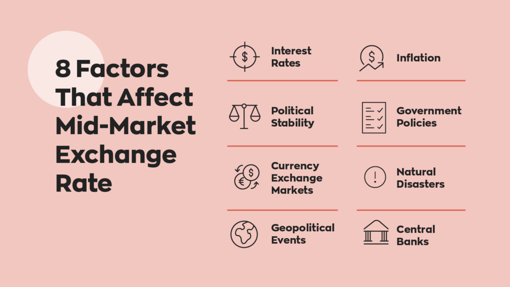

## Table of Contents

## What is the middle rate in foreign exchange trading?

In foreign exchange trading, the middle rate is the average of the buying and selling rates for a currency pair. When you see a currency exchange rate quoted, it usually has two numbers: one for buying and one for selling. The middle rate is right in between these two numbers. It's like finding the midpoint between what banks or dealers are willing to pay for a currency and what they are asking for it.

The middle rate is important because it gives a fair idea of the value of a currency without the influence of the buying and selling spread. Traders and businesses often use the middle rate to understand the real value of their transactions. It helps them make better decisions about when to buy or sell currencies, as it shows the market's current view of the currency's worth without the extra costs that come from the difference between buying and selling prices.

## How is the middle rate calculated?

The middle rate is found by taking the buying rate and the selling rate of a currency pair, adding them together, and then dividing by two. This gives you the average, or middle, rate. For example, if the buying rate for USD/EUR is 0.85 and the selling rate is 0.87, you add 0.85 and 0.87 to get 1.72, and then divide by 2 to get the middle rate of 0.86.

This calculation is important because it shows the true value of the currency without the extra costs that come from the difference between buying and selling prices. The middle rate helps traders and businesses understand the market's view of the currency's worth. It's like finding the fair price that's right in the middle of what people are willing to pay and what they're asking for.

## Why is the middle rate important for traders?

The middle rate is important for traders because it shows them the true value of a currency. When traders know the middle rate, they can see what the market thinks a currency is really worth, without the extra costs that come from the difference between buying and selling prices. This helps traders make better decisions about when to buy or sell currencies.

Traders use the middle rate to plan their trades. If they think a currency's value will go up, they might buy it when it's close to the middle rate. If they think it will go down, they might sell it near the middle rate. Knowing the middle rate helps traders avoid paying too much or selling for too little, which can save them money and help them make more profit.

## What is the difference between the middle rate, bid rate, and ask rate?

The middle rate, bid rate, and ask rate are all important numbers in foreign exchange trading, but they mean different things. The bid rate is the price that someone is willing to pay to buy a currency. It's what you see if you want to sell your currency. The ask rate, on the other hand, is the price that someone is asking to sell a currency. It's what you see if you want to buy a currency. The difference between the bid rate and the ask rate is called the spread, and it's how banks and dealers make money.

The middle rate is the average of the bid rate and the ask rate. You find it by adding the bid rate and the ask rate together and then dividing by two. This number shows the true value of a currency without the extra costs from the spread. Traders use the middle rate to understand what the market thinks a currency is really worth. It helps them make better decisions about buying and selling, because they can see the fair price that's right in the middle of what people are willing to pay and what they're asking for.

## How does the middle rate affect currency conversion costs?

The middle rate affects currency conversion costs by showing the true value of a currency without the extra costs from the spread. When you convert money, you usually have to pay a little more than the middle rate if you're buying a currency, or get a little less if you're selling. This difference is the spread, and it's how banks and money changers make money. Knowing the middle rate helps you see how much you're really paying in extra costs.

For example, if the middle rate for USD to EUR is 0.86, but the bank's buying rate is 0.85 and selling rate is 0.87, you're paying 0.87 to buy euros, which is more than the middle rate. If you're selling dollars, you're getting 0.85, which is less than the middle rate. The difference between the middle rate and the rate you actually get is the extra cost you pay for the conversion. By understanding the middle rate, you can see how these extra costs add up and make better choices about when and where to convert your money.

## Can the middle rate be used as a benchmark for currency valuation?

Yes, the middle rate can be used as a benchmark for currency valuation. It shows the true value of a currency without the extra costs that come from the difference between buying and selling prices. When people want to know how much a currency is really worth, they look at the middle rate. It helps them understand what the market thinks about the currency's value, without the influence of the spread.

Traders and businesses often use the middle rate to make decisions about buying and selling currencies. By knowing the middle rate, they can see if they are getting a good deal or if they are paying too much. It's like a fair price that's right in the middle of what people are willing to pay and what they're asking for. This helps them plan their trades and manage their money better.

## How do financial institutions determine the middle rate?

Financial institutions determine the middle rate by looking at the current market prices for buying and selling a currency. They find the bid rate, which is the price someone is willing to pay to buy the currency, and the ask rate, which is the price someone is asking to sell the currency. To get the middle rate, they add the bid rate and the ask rate together and then divide by two. This gives them the average, or middle, rate.

This process helps financial institutions understand the true value of a currency without the extra costs from the difference between buying and selling prices. By using the middle rate, they can see what the market thinks the currency is really worth. This helps them make better decisions about when to buy or sell currencies, and it gives them a fair price to use as a benchmark for their transactions.

## What factors influence fluctuations in the middle rate?

Fluctuations in the middle rate are influenced by many things that affect how people see the value of a currency. One big thing is the economy of a country. If the economy is doing well, with lots of jobs and people spending money, the currency's value might go up. But if the economy is not doing so well, with fewer jobs and less spending, the currency's value might go down. Other things that can change the middle rate are interest rates set by a country's central bank. If interest rates go up, it might make the currency more valuable because people want to invest in that country. If interest rates go down, it might make the currency less valuable.

Another thing that can influence the middle rate is what's happening around the world. If there's a lot of uncertainty or trouble in other countries, people might want to move their money to a safer place, which can change currency values. Also, the price of things like oil and gold can affect the middle rate. If these prices go up or down a lot, it can change how much people think a currency is worth. All these things together make the middle rate go up and down as people's ideas about the value of a currency change.

## How can traders use the middle rate to make informed trading decisions?

Traders can use the middle rate to understand the true value of a currency without the extra costs from the difference between buying and selling prices. By knowing the middle rate, traders can see if they are getting a good deal or if they are paying too much. If the middle rate is lower than the buying rate they are offered, they might decide to wait for a better price. If the middle rate is higher than the selling rate they are offered, they might decide to sell their currency right away.

Traders also use the middle rate to plan their trades. If they think a currency's value will go up, they might buy it when it's close to the middle rate. This way, they can buy at a fair price and hopefully sell it later for more. If they think the currency's value will go down, they might sell it near the middle rate to avoid losing too much money. By using the middle rate as a guide, traders can make better decisions and try to make more profit.

## What are the limitations of relying solely on the middle rate for trading strategies?

Relying only on the middle rate for trading strategies can be tricky because it doesn't tell the whole story about a currency's value. The middle rate is just an average of the buying and selling prices, but it doesn't show other important things that can affect how much a currency is worth. For example, the middle rate doesn't tell you about big events happening in the world or changes in a country's economy that can make a currency go up or down quickly. If traders only look at the middle rate, they might miss these important signs and make bad choices about buying and selling.

Also, the middle rate changes all the time because the buying and selling prices are always moving. If traders only use the middle rate, they might not be ready for these quick changes. They could buy or sell at the wrong time if they don't pay attention to other things like interest rates, news, and the prices of things like oil and gold. So, while the middle rate is helpful, traders need to look at more than just that one number to make smart trading decisions.

## How does the middle rate vary across different financial markets and platforms?

The middle rate can be different across various financial markets and platforms because each place might have its own way of figuring out the buying and selling prices. For example, a big bank might have a different middle rate for a currency than a small money changer because they have different costs and ways of making money. Also, the middle rate can change depending on where you are in the world. If you look at the middle rate for USD/EUR in New York, it might be a little different from the middle rate in London because the trading times and the people buying and selling are different.

Another reason the middle rate can vary is because of the type of platform you use. Online trading platforms might show a different middle rate than the rates you see at a physical bank or money exchange office. This is because online platforms can have lower costs and might offer better rates to attract more traders. Also, some platforms might update their rates more often, so the middle rate you see there can change more quickly than the rates at a bank, which might update less often. So, it's good to check the middle rate on different platforms and markets to make sure you're getting the best deal.

## What advanced techniques can be applied to predict future middle rate movements?

To predict future middle rate movements, traders often use something called technical analysis. This means they look at past prices and charts to find patterns that might tell them what will happen next. They might use tools like moving averages, which show the average price of a currency over time, or trend lines, which show if a currency is going up or down. By studying these patterns, traders can guess if the middle rate will go up or down. But, this method is not perfect because past patterns don't always repeat in the same way.

Another way to predict middle rate movements is by using fundamental analysis. This means looking at big things that can change the value of a currency, like a country's economy, interest rates, and big news events. Traders might look at reports about how many people have jobs, how much people are spending, and what the central bank is doing with interest rates. By understanding these things, traders can guess how the middle rate might change. But, this method can be hard because it's not easy to predict what will happen in the economy or what news will come out next. So, traders often use both technical and fundamental analysis together to make better guesses about future middle rate movements.

## What is the Concept of Middle Rate in FX Trading?

The middle rate, commonly referred to as the mid-market rate, is a fundamental concept in foreign exchange (FX) trading, serving as the arithmetic midpoint between a currency pair's bid and ask prices. This rate is not typically available to retail traders, but it is instrumental in assessing the fair value at which two currencies might be exchanged. 

Mathematically, the middle rate can be expressed as:

$$
\text{Middle Rate} = \frac{\text{Bid Price} + \text{Ask Price}}{2}
$$

This measure provides an unbiased estimation of a currency pair's value, devoid of the intrinsic premiums applied by market makers to profit from the spread. As such, the middle rate acts as a benchmark for both buyers and sellers.

In less liquid markets, where bid-ask spreads can be considerably wider, the middle rate assumes greater importance. Wide spreads often indicate higher transaction costs, stemming from lower market efficiency or reduced competition among liquidity providers. By focusing on the middle rate, traders can navigate these inefficiencies to achieve more favorable trading outcomes. 

For instance, if the bid-ask prices for a currency pair are given as follows:

- Bid Price: 1.1000
- Ask Price: 1.1050

The middle rate would be calculated as:

$$
\frac{1.1000 + 1.1050}{2} = 1.1025
$$

This calculated middle rate helps traders in formulating strategies that target executing trades closer to this fair value, thereby minimizing costs associated with wider spreads.

Understanding and leveraging the middle rate allows traders to optimize their execution strategies, particularly in environments of varying liquidity. By aligning transactions closer to the middle rate, traders reduce slippage and improve the profitability of their trades. Proficiency in utilizing the middle rate is crucial for maximizing price efficiency and minimizing potential losses in a complex and dynamic FX trading landscape.

## References & Further Reading

[1]: Lyons, Richard K. (2001). ["The Microstructure Approach to Exchange Rates."](https://direct.mit.edu/books/monograph/2004/The-Microstructure-Approach-to-Exchange-Rates) MIT Press.

[2]: Aldridge, Irene. (2013). ["High-Frequency Trading: A Practical Guide to Algorithmic Strategies and Trading Systems."](https://www.amazon.com/High-Frequency-Trading-Practical-Algorithmic-Strategies/dp/1118343506) Wiley Finance.

[3]: Narang, Rishi K. (2009). ["Inside the Black Box: The Simple Truth About Quantitative Trading."](https://www.amazon.com/Inside-Black-Box-Quantitative-Trading/dp/0470432063) John Wiley & Sons.

[4]: Avellaneda, Marco & Stoikov, Sasha. (2008). ["High-frequency Trading in a Limit Order Book."](https://people.orie.cornell.edu/sfs33/LimitOrderBook.pdf) Quantitative Finance.

[5]: Harris, Larry. (2003). ["Trading and Exchanges: Market Microstructure for Practitioners."](https://www.amazon.com/Trading-Exchanges-Market-Microstructure-Practitioners/dp/0195144708) Oxford University Press.