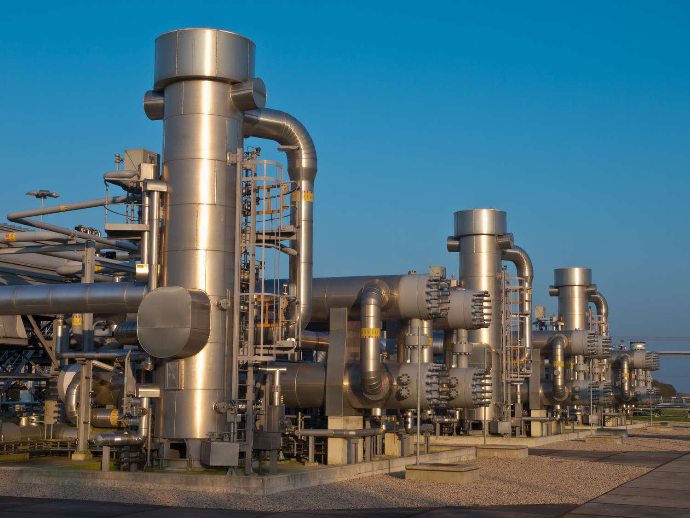

The energy sector, particularly the oil and gas industries, plays a crucial role in fueling the global economy. These sectors are foundational to a myriad of industries by providing the primary source of energy that powers transportation, industrial activities, and residential needs. Historically, oil and gas have been characterized by complex operations that encompass exploration, production, transportation, and refining processes. Each of these stages involves intricate logistical and technical challenges, requiring advanced technology and expertise.

Recent advancements in technology, specifically algorithmic trading, are reshaping how the midstream sector operates. Algorithmic trading refers to the use of advanced algorithms to automate trading decisions, enhancing the efficiency and accuracy of trades. In the context of the midstream oil and gas sectors, algorithmic trading promises to optimize trading strategies, reduce human error, and improve the speed of execution, thereby transforming traditional market dynamics.



This article examines the impact of algorithmic trading in the midstream oil and gas sectors, highlighting efficiency and innovation as key benefits. By employing sophisticated data analytics and predictive modeling, market participants can make informed decisions swiftly, reacting to fluctuating market conditions with precision. The integration of algorithmic trading not only changes how midstream operations are conducted but also influences market dynamics and investment strategies.

Through this exploration, the article aims to provide insights into the various facets of this technological integration. Understanding these developments is essential for industry stakeholders—ranging from traders to policymakers—who seek to navigate the increasingly complex energy markets of today. The implications for market dynamics are significant, offering both opportunities and challenges in developing robust investment strategies.

## Table of Contents

## Understanding the Oil and Gas Midstream Sector

Midstream activities in the oil and gas industry encompass the processing, transportation, and marketing of petroleum products. These operations serve as critical links between the upstream sector, which focuses on exploration and production, and the downstream sector, which is concerned with refining and distribution. The midstream sector ensures that resources flow seamlessly from extraction sites to refineries and ultimately to end consumers, making it an indispensable component of the oil and gas supply chain.

Key players in the midstream market include pipeline operators, storage facilities, and marketers, each playing a vital role in maintaining the reliability and safety of petroleum supply chains. Pipeline operators are responsible for the transportation infrastructure that moves crude oil, natural gas, and refined products over vast distances. This network of pipelines is crucial for maintaining steady supply flows and minimizing transit times and costs. Storage facilities, on the other hand, offer strategic accumulative spaces that balance the supply and demand dynamics of the market. These facilities ensure there is enough inventory to handle market fluctuations and disruptions. Lastly, marketers in the midstream sector work to effectively manage the trade and sale of petroleum products, often capitalizing on geographical and temporal price differences to maximize profits.

Operating within the midstream sector presents distinct opportunities and challenges. One opportunity lies in the growing demand for energy infrastructure, driven by increasing global energy consumption and the expansion of oil and gas extraction activities. As more resources are extracted, there is a concomitant need for enhanced midstream capabilities to process, store, and transport these resources efficiently.

However, companies in this segment also face challenges, such as regulatory pressures and environmental concerns. The transportation and storage of petroleum products are subject to stringent regulations aimed at minimizing spills and accidents, which can lead to costly compliance requirements. Additionally, the sector must address environmental concerns related to greenhouse gas emissions and the ecological impacts of infrastructure development.

In summary, the midstream oil and gas sector functions as a vital intermediary, facilitating the movement of resources from extraction to end use. Despite the challenges of regulatory compliance and environmental accountability, the sector offers promising opportunities for growth, driven by the essential nature of its services and the increasing demand for energy worldwide.

## The Role of Algorithmic Trading in the Midstream Sector

Algorithmic trading automates trading decisions in the energy markets by using sophisticated algorithms capable of processing vast datasets in real time. This automated approach provides significant advantages in the midstream oil and gas sector, as it optimizes both the timing and pricing of commodity trades, thus enhancing market [liquidity](/wiki/liquidity-risk-premium) and operational efficiency.

In midstream operations, a crucial component is the ability to connect upstream extraction sites with downstream consumers through efficient commodity movement. Algorithmic trading systems can process a variety of data inputs, including market prices, supply chain logistics, and geopolitical developments, to make informed trading decisions. This capability allows the optimization of trade timing and pricing, ensuring that trades are executed under favorable conditions, which can significantly impact profitability and resource allocation.

Moreover, algorithms are designed to react swiftly to market changes, offering a competitive edge in the dynamic and intricate energy markets. By employing [machine learning](/wiki/machine-learning) techniques, these algorithms continuously adapt to the rapidly shifting market conditions, providing market participants with the flexibility to adjust their trading strategies dynamically. This adaptability is particularly beneficial as it ensures that midstream operations remain agile and responsive to external fluctuations, thereby mitigating potential risks.

As the energy landscape evolves with the increasing integration of renewable energy sources, [algorithmic trading](/wiki/algorithmic-trading) plays a pivotal role in managing market [volatility](/wiki/volatility-trading-strategies) and balancing supply-demand dynamics. Renewables introduce variability in energy supply, which can be challenging to manage. Algorithmic systems can forecast energy supply variations and optimize energy storage and distribution, thereby enhancing grid reliability and minimizing wastage.

In addition to enhancing responsiveness and adaptability, algorithmic trading aids midstream companies in capitalizing on short-term and spot trading opportunities. These opportunities arise from price differentials and [arbitrage](/wiki/arbitrage) possibilities across various markets and geographies. Through the precise analytics enabled by these algorithms, midstream operators can identify and exploit pricing inefficiencies, thus improving profit margins.

Consider a simple Python snippet to illustrate how a basic algorithm could use historical price data to identify arbitrage opportunities:

```python
import numpy as np

def identify_arbitrage(prices):
    """
    Identifies potential time periods where buying low and selling high could yield profit.

    prices : list
        A list of historical commodity prices.

    Returns: 
        list of tuples containing buy and sell day indices
    """
    arbitrage_opportunities = []
    for buy_day in range(len(prices) - 1):
        for sell_day in range(buy_day + 1, len(prices)):
            if prices[sell_day] > prices[buy_day]:
                arbitrage_opportunities.append((buy_day, sell_day))
    return arbitrage_opportunities

prices = [10, 7, 5, 8, 11, 9, 6, 12]
print(identify_arbitrage(prices))
```

In this example, the function scans to detect days where the purchase and subsequent sale could yield a profit, thus illustrating a basic form of price differential strategy.

Overall, the implementation of algorithmic trading within the midstream sector of oil and gas is transforming operations by providing swift decision-making capabilities, enhancing efficiency, and creating opportunities within volatile and complex market environments.

## Benefits and Risks of Algorithmic Trading in Midstream

Algorithmic trading has significantly transformed the midstream sector of the oil and gas industry, offering several benefits but also posing certain risks. Among the key advantages of algorithmic trading is its ability to enhance market efficiency by minimizing the need for manual intervention, thereby facilitating fast and accurate trades. This automation allows market participants to respond swiftly to market signals and execute large volumes of trades within fractions of a second.

Furthermore, algorithmic trading systems can process and analyze vast datasets, providing enhanced data analysis capabilities. This leads to better price forecasting and more effective risk management strategies. By identifying and capitalizing on market trends and inefficiencies, algorithms can optimize trading strategies, maximizing profits potential.

Despite these advantages, algorithmic trading in the midstream sector also introduces certain risks. One significant concern is the potential for increased market volatility. Algorithmic trading can amplify price swings, particularly when similar trading strategies are employed by numerous participants simultaneously. This can lead to systemic instability, where rapid and significant price changes occur within a short period.

Additionally, algorithmic trading systems predominantly rely on historical data to make trading decisions. This reliance poses the risk of poor decision-making during unforeseen market events or when market conditions deviate significantly from historical patterns. Algorithms may fail to accommodate sudden market shocks, leading to substantial financial losses.

Regulatory scrutiny is crucial in mitigating these risks and ensuring the integrity and transparency of algorithmic trading activities in energy markets. Regulatory frameworks are designed to monitor and control the deployment of algorithmic trading systems, preventing abusive practices and safeguarding market stability. This includes measures to ensure the robustness of trading systems, stress testing under various market conditions, and the implementation of circuit breakers to control excessive volatility.

In conclusion, while algorithmic trading offers significant advantages in terms of efficiency, speed, and data-driven insights, market participants need to be mindful of its associated risks. By adhering to regulatory requirements and employing robust risk management strategies, they can harness the benefits of algorithmic trading while minimizing potential adverse impacts on market dynamics.

## Regulatory Considerations and Market Impact

Algorithmic trading within the midstream oil and gas sector is heavily regulated to ensure the stability and integrity of financial markets. These regulations are crucial for preventing market abuse and safeguarding the interests of all participants.

In the European Union, two primary regulatory frameworks govern algorithmic trading: the Markets in Financial Instruments Directive II (MiFID II) and the Regulation on Wholesale Energy Market Integrity and Transparency (REMIT II). MiFID II, implemented in 2018, expands regulatory oversight by requiring algorithmic trading firms to be properly authorized and to maintain systematic risk controls. It also encompasses a wide range of financial instruments, ensuring a consistent level of oversight across European markets. REMIT II further ensures transparency and prohibits insider trading and market manipulation specifically in the energy markets, adding another layer of protection for market participants.

In the United States, the Commodity Futures Trading Commission (CFTC) plays a pivotal role in regulating algorithmic trading. The CFTC enforces rules that mandate the registration of trading firms and adherence to prescribed compliance measures aimed at promoting ethical trading practices. These rules help mitigate the risks associated with high-frequency trading and aim to prevent potential systemic disruptions.

As algorithmic trading becomes increasingly sophisticated with the integration of [artificial intelligence](/wiki/ai-artificial-intelligence) (AI) and machine learning, regulatory frameworks are evolving to address these novel challenges. AI-driven algorithms pose unique risks such as unintended market manipulation due to autonomous decision-making capabilities. Consequently, regulators are exploring new strategies to ensure these AI systems operate within ethical boundaries and do not compromise market integrity.

Compliance with these evolving regulations is crucial for market participants. Adhering to these rules not only mitigates legal and financial risks but also contributes to maintaining trust and stability within trading operations. As technology continues to advance, market participants must stay informed about regulatory changes and ensure their trading systems are aligned with the latest requirements. This vigilance is essential for fostering a reliable and transparent trading environment that benefits both the industry and consumers.

## The Future of Algo Trading in the Energy Sector

The demand for algorithmic trading solutions in the energy sector is expected to rise significantly, driven by advances in artificial intelligence (AI) and big data analytics. These technologies are transforming how vast amounts of data are processed, leading to smarter and more efficient trading strategies. Algorithmic trading, with its ability to quickly analyze market data and execute trades at optimal pricing, is becoming indispensable in managing the complexities of energy markets.

As the energy sector increasingly incorporates renewable energy sources like solar and wind, which have inherently fluctuating supply patterns, the need for dynamic trading systems becomes even more critical. Algo trading can adjust to these fluctuations promptly, optimizing the integration of renewable energy into existing grids and balancing supply-demand mismatches in real-time. This adaptability is essential for maintaining market stability and efficiency.

AI and machine learning technologies enhance algorithm precision and adaptability. By employing machine learning models, algorithms can predict market movements with greater accuracy. Techniques such as natural language processing (NLP) can be employed to analyze market sentiment from news articles and social media, providing additional insights for trading decisions. The integration of such advanced computational methods can create predictive models that learn and adapt over time, thereby improving overall market efficacy.

The evolution of future trading frameworks will likely see a harmonization between regulation and technological innovation. Regulatory bodies are continually adjusting policies to account for the rapidly changing technology landscape. Ensuring compliance with these evolving regulations is vital for market participants, as it safeguards both market stability and fairness. As AI technologies continue to innovate, regulators will need to address emerging challenges, particularly around transparency and ethical trading practices.

For market participants, staying informed and adaptable will be essential to leveraging the full potential of algorithmic trading. This involves not only keeping up with technological advancements but also understanding the regulatory environment and how it impacts trading operations. By investing in continuous learning and adaptive strategies, companies can better position themselves to capitalize on the benefits offered by these technologies, ensuring competitive advantage in the increasingly complex global energy market.

## Conclusion

Algorithmic trading is revolutionizing the efficiency and dynamics of midstream operations in the oil and gas sector. By automating the decision-making process and employing data-driven insights, algorithmic trading enables midstream enterprises to streamline their operations and enhance their capability to respond to market fluctuations. This technological advancement allows for more precise execution of trades, minimizing human error, and enabling faster response times, significantly boosting overall market operations.

The benefits of algorithmic trading are clear: increased pricing accuracy, optimized trading strategies, and improved risk management. However, while these advantages offer substantial improvements, market participants must remain vigilant about the inherent risks and compliance requirements. The reliance on historical data and the complexity of algorithms can occasionally lead to poor decision-making, especially during unexpected market events. This risk necessitates robust risk management frameworks and continuous updates to algorithmic models to adapt to evolving market conditions.

Regulatory bodies have a crucial role in maintaining the integrity and fairness of algorithmic trading activities. Stringent regulations ensure that the benefits of algorithmic trading are harnessed while mitigating risks such as market volatility and systemic instability. The frameworks established by regulatory authorities, such as MiFID II and REMIT II in the European Union and the CFTC in the United States, are pivotal in guiding market players towards ethical and transparent trading practices.

Algorithmic trading is increasingly becoming an indispensable component of the global energy markets. Its promise of enhanced efficacy and continuous innovation aligns with the growing complexity and speed of today's trading environments. For market participants, staying informed and adaptable is key to capitalizing on the potential benefits offered by algorithmic trading, while ensuring compliance with evolving regulatory standards. As the landscape of energy trading evolves, so too will the strategies and technologies that drive it forward, ensuring that algorithmic trading continues to be a cornerstone of efficiency and progress in the industry.

## References & Further Reading

[1]: Bergstra, J., Bardenet, R., Bengio, Y., & Kégl, B. (2011). ["Algorithms for Hyper-Parameter Optimization."](https://dl.acm.org/doi/10.5555/2986459.2986743) Advances in Neural Information Processing Systems 24.

[2]: ["Advances in Financial Machine Learning"](https://www.amazon.com/Advances-Financial-Machine-Learning-Marcos/dp/1119482089) by Marcos Lopez de Prado

[3]: ["Evidence-Based Technical Analysis: Applying the Scientific Method and Statistical Inference to Trading Signals"](https://www.amazon.com/Evidence-Based-Technical-Analysis-Scientific-Statistical/dp/0470008741) by David Aronson

[4]: ["Machine Learning for Algorithmic Trading"](https://github.com/stefan-jansen/machine-learning-for-trading) by Stefan Jansen

[5]: ["Quantitative Trading: How to Build Your Own Algorithmic Trading Business"](https://www.amazon.com/Quantitative-Trading-Build-Algorithmic-Business/dp/1119800064) by Ernest P. Chan