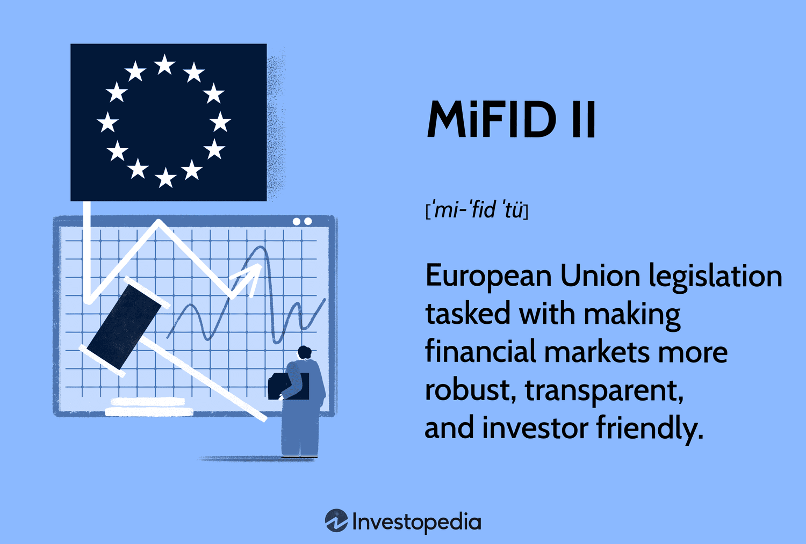

## Table of Contents

## What is MiFID II and why was it introduced?

MiFID II stands for Markets in Financial Instruments Directive II. It is a set of rules that the European Union introduced to make financial markets more transparent and to protect investors. These rules apply to banks, investment firms, and other financial organizations that operate within the EU. The main goal of MiFID II is to create a safer and more open financial environment for everyone.

MiFID II was introduced because the financial world was becoming more complex and there were concerns about how safe and fair it was for investors. After the 2008 financial crisis, many people lost trust in the financial system. The European Union wanted to rebuild this trust by setting stricter rules. These rules help make sure that financial companies give clear and honest information to their clients and that they act in the clients' best interests.

## Who does MiFID II apply to?

MiFID II applies to banks, investment firms, and other financial organizations that work in the European Union. This includes companies that help people buy and sell stocks, bonds, and other financial products. It also covers firms that give investment advice or manage money for clients.

The rules are meant to make sure these companies treat their clients fairly and give them clear information. This helps people make better choices about their investments. MiFID II also applies to trading venues like stock exchanges and other places where financial products are bought and sold.

## What are the main components of MiFID II?

MiFID II has several important parts that work together to make financial markets safer and more open. One key part is about giving clear information. Companies have to tell their clients about the costs and risks of investing. This helps people understand what they are getting into before they invest their money. Another part is about making sure that financial firms act in their clients' best interests. This means they should give advice that is good for the client, not just for the company.

Another important part of MiFID II is about how trading happens. The rules say that more trades should happen on public markets, like stock exchanges, instead of in private deals. This makes trading more open and fair for everyone. MiFID II also has rules about how companies report their trades. They have to give detailed information about each trade to the authorities. This helps keep an eye on the market and stop any bad behavior.

Overall, MiFID II aims to make the financial world more transparent and protect investors. By setting strict rules for financial companies and trading, it tries to build trust and make sure that everyone is treated fairly.

## How does MiFID II aim to improve transparency in financial markets?

MiFID II aims to improve transparency in financial markets by making sure that more trading happens on public markets, like stock exchanges, instead of in private deals. When trades happen in public, everyone can see them. This means that it's harder for big companies to make secret deals that might not be fair to other people. By having more trades in the open, MiFID II helps make sure that the prices of stocks and other financial products are fair and reflect what's really happening in the market.

Another way MiFID II improves transparency is by requiring financial companies to report detailed information about their trades to the authorities. This includes things like the price, the amount, and who was involved in the trade. By collecting all this information, regulators can keep a close eye on the market and spot any unusual or suspicious activity. This helps prevent bad behavior and makes the market safer for everyone. In the end, MiFID II's focus on transparency helps build trust and confidence in the financial system.

## What are the key differences between MiFID and MiFID II?

MiFID, or the Markets in Financial Instruments Directive, was first introduced in 2007 to make financial markets in the European Union more open and safe. It set rules for banks and investment firms about how they should treat their clients and report their trades. MiFID II, which came into effect in 2018, is an updated version of these rules. It was introduced because the financial world had become more complex and there were new concerns about how safe and fair it was for investors.

The main differences between MiFID and MiFID II are that MiFID II has stricter rules and covers more areas. For example, MiFID II requires more trades to happen on public markets, like stock exchanges, instead of in private deals. This makes trading more open and fair for everyone. MiFID II also has more detailed rules about how companies should report their trades and give information to their clients. These changes help make the financial markets more transparent and protect investors better than the original MiFID did.

## How does MiFID II affect investment firms and their operations?

MiFID II affects investment firms by making them follow stricter rules about how they work with clients and report their trades. Investment firms now have to give their clients clear information about the costs and risks of investing. This means they have to explain everything in a way that's easy to understand, so people know exactly what they're getting into before they invest their money. Also, investment firms have to act in their clients' best interests, which means they should give advice that's good for the client, not just for the company. If they don't follow these rules, they could get in trouble with the authorities.

Another big change for investment firms because of MiFID II is that more of their trades have to happen on public markets, like stock exchanges, instead of in private deals. This makes trading more open and fair for everyone. Investment firms also have to report detailed information about each trade to the authorities. This includes things like the price, the amount, and who was involved in the trade. By doing this, regulators can keep a close eye on the market and stop any bad behavior. Overall, MiFID II makes investment firms work in a more transparent and fair way, which helps build trust in the financial system.

## What are the reporting requirements under MiFID II?

MiFID II has strict rules about what investment firms need to report. They have to give detailed information about every trade they make to the authorities. This includes things like the price, the amount, who was involved in the trade, and when it happened. By collecting all this information, regulators can watch the market closely and spot any unusual or suspicious activity. This helps prevent bad behavior and keeps the market safe for everyone.

Another important part of the reporting requirements is that investment firms need to tell their clients about the costs and risks of investing. They have to explain everything in a clear and simple way so that people can understand what they are getting into before they invest their money. This helps people make better choices about their investments and makes sure that financial companies are acting in their clients' best interests. Overall, the reporting requirements under MiFID II help make the financial markets more transparent and protect investors.

## How does MiFID II impact the cost and charges of investment products?

MiFID II makes investment firms tell their clients about all the costs and charges of investment products. This means that when someone wants to invest, the firm has to explain everything in a clear and simple way. They have to show the total cost, including any fees or charges that might not be obvious. This helps people see exactly how much they will have to pay and understand if the investment is worth it for them.

By making these costs clear, MiFID II helps people make better choices about their investments. It also makes investment firms think more about how they charge for their services. If the costs are too high or not clear, people might choose to invest somewhere else. This can lead to lower costs overall, as firms try to offer better deals to attract clients. In the end, MiFID II aims to make the investment world fairer and more open for everyone.

## What are the implications of MiFID II for algorithmic and high-frequency trading?

MiFID II has big effects on algorithmic and high-frequency trading. These types of trading use computers to buy and sell things very quickly. MiFID II makes rules that say these trades have to happen in a way that everyone can see. This means that high-frequency trading companies have to report their trades to the authorities, just like everyone else. This helps make sure that the market is fair and that no one can use secret tricks to make money.

Also, MiFID II wants to stop any bad behavior in high-frequency trading. It has rules to stop people from messing with the market on purpose. For example, it stops people from putting in fake orders to trick others. By making these rules, MiFID II tries to keep the market safe and honest for everyone. This helps build trust in the financial system and makes sure that everyone plays by the same rules.

## How has MiFID II changed the way research is paid for and consumed?

MiFID II has changed how investment firms pay for and use research. Before MiFID II, firms often got research for free as part of their trading deals. But now, MiFID II says that research and trading have to be paid for separately. This means that firms have to pay for research out of their own pockets or charge their clients for it. This change makes everything more clear and fair, because firms can't hide the cost of research in their trading fees anymore.

Because of these new rules, some firms have started to use less research or look for cheaper options. They might use research from smaller companies or even do their own research. This can make the market more open, because more people can offer research services. But it can also make it harder for smaller firms to get good research, because they might not have as much money to spend on it. Overall, MiFID II's rules on research aim to make the financial world more honest and fair for everyone.

## What challenges have firms faced in implementing MiFID II?

Firms have faced a lot of challenges when trying to follow MiFID II rules. One big challenge is dealing with all the new reporting requirements. Firms have to give detailed information about every trade they make, which can be hard and take a lot of time. They need to set up new systems and hire people to make sure they do this right. Another challenge is making sure they give clear information to their clients about costs and risks. This means they have to change how they talk to their clients and make sure everything is easy to understand.

Another challenge is the change in how research is paid for. Before MiFID II, firms often got research for free as part of their trading deals. Now, they have to pay for research out of their own pockets or charge their clients for it. This can be hard for smaller firms because they might not have as much money to spend on research. Also, firms have to make sure more of their trades happen on public markets instead of in private deals. This can be tricky because it means changing how they do business and might cost them more money. Overall, MiFID II has made firms work harder to be more open and fair, but it has also brought a lot of new challenges.

## What are the future prospects and potential revisions to MiFID II?

The future of MiFID II might see some changes to make it work better. Some people think the rules are too hard to follow and might want to make them simpler. Others believe that the rules need to be stronger to protect investors even more. There could be changes to how research is paid for, because the current way can be hard for smaller firms. Also, there might be new rules to keep up with new technology and ways of trading, like more use of computers in trading.

There is talk about making MiFID II easier to understand and follow. This could help firms spend less time and money on keeping up with the rules. But any changes would need to make sure that the main goals of MiFID II, like making the market fair and safe, are still met. The European Union is always looking at how well the rules are working and might make updates to keep the financial markets strong and trustworthy.

## References & Further Reading

[1]: Hendershott, T., & Riordan, R. (2013). ["Algorithmic Trading and the Market for Liquidity."](https://www.jstor.org/stable/43303831) The Review of Financial Studies, 26(8), 2267-2303.

[2]: O'Hara, M. (2015). ["High Frequency Market Microstructure."](https://www.sciencedirect.com/science/article/pii/S0304405X15000045) Journal of Financial Economics, 116(2), 257-270.

[3]: Belvedere, V., & Grillo, M. (2013). ["Managing and Measuring Performance in Public and Nonprofit Organizations: An Integrated Approach."](https://www.researchgate.net/publication/315654470_Managing_and_Measuring_Performance_in_Public_and_Nonprofit_Organizations_An_Integrated_Approach) Jossey-Bass.

[4]: Pagano, M., & Roell, A. (1996). ["Transparency and Liquidity: A Comparison of Auction and Dealer Markets with Informed Trading."](https://www.jstor.org/stable/2329372) The Review of Economic Studies, 63(3), 679-709.

[5]: European Securities and Markets Authority (ESMA). ["MiFID II Overview."](https://www.esma.europa.eu/trading/mifid-ii-and-mifir-review)

[6]: Gomber, P., Arndt, B., Lutat, M., & Uhle, T. (2011). ["High-frequency trading."](https://papers.ssrn.com/sol3/papers.cfm?abstract_id=1858626) Financial Markets and Portfolio Management, 25, 217-239.