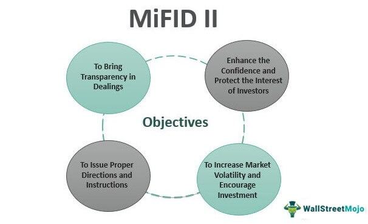

The European Union's financial markets have been subject to notable changes following the implementation of MiFID II (Markets in Financial Instruments Directive II) in 2018. MiFID II marks a substantial reform aimed at fostering greater transparency, bolstering investor protection, and enhancing the overall fairness and efficiency of financial markets within the EU. This directive serves as a successor to the original MiFID framework, addressing various regulatory gaps and challenges exposed by the 2008 financial crisis.

A central aspect of MiFID II is its focus on algo trading, or algorithmic trading, an area subject to specific regulatory measures. Algorithmic trading involves the use of computer algorithms to execute trades at high speed and volume, often across multiple markets. Given its growing influence on market dynamics and its potential implications for market stability, MiFID II has established a set of stringent regulations aimed at overseeing and controlling the execution of algorithmic trades. This regulatory framework addresses concerns about market abuse and aims to ensure that trading activities do not undermine market integrity.

This article examines the effects of MiFID II on algorithmic trading, providing an analysis of the key regulations and modifications introduced within this framework to ensure market transparency and protect investors.

## Table of Contents

## Understanding MiFID II

MiFID II, or the Markets in Financial Instruments Directive II, represents a comprehensive overhaul of the original MiFID framework. The directive was implemented to address various inadequacies revealed by the 2008 financial crisis, emphasizing the necessity for enhanced regulatory harmonization across the European Union's financial markets. By standardizing financial practices, MiFID II aims to foster a unified and stable market environment across member states.

MiFID II significantly broadens the scope of the original framework by introducing more detailed and extensive regulations. It applies not only to traditional financial instruments such as stocks and bonds but also to a vast array of other financial services and products, including derivatives and currency exchanges. This comprehensive coverage makes MiFID II one of the most exhaustive regulatory structures in the EU, ensuring that all aspects of financial trading and investment are regulated under a singular, harmonized directive.

The extensive nature of MiFID II is designed to ensure that all financial activities conducted within the EU are subject to robust oversight. This is intended to mitigate systemic risks and protect markets from instability by ensuring transparency and accountability in financial operations. Overall, MiFID II's expansive regulatory reach underscores its critical role in safeguarding the integrity and efficiency of the EU's financial markets.

## Key Regulations Impacting Algo Trading

MiFID II aims to enhance market transparency and curtail unregulated trading by establishing organized trading facilities. This regulatory framework introduces comprehensive requirements for firms engaged in [algorithmic trading](/wiki/algorithmic-trading), focusing on the robustness and transparency of their operations.

To ensure the resilience of trading systems, algo trading firms under MiFID II are mandated to implement stringent risk controls and perform detailed record-keeping. These provisions are designed to ensure that the algorithms deployed are capable of maintaining market stability and can withstand operational stresses without leading to systemic risks. Algo trading firms must apply stress tests on their systems, ensuring they can manage extreme market [volatility](/wiki/volatility-trading-strategies) and avoid contributing to market disruptions.

High-frequency trading ([HFT](/wiki/high-frequency-trading-strategies)) firms are subject to additional regulatory scrutiny under MiFID II. Given their substantial influence on market dynamics through rapid transactions, these firms are required to demonstrate fair trading practices. This includes measures to prevent market manipulation and ensure that the speed advantage inherent in HFT does not compromise market integrity. MiFID II mandates that HFT firms maintain comprehensive documentation of their strategies and trading activities to allow for effective regulatory oversight.

A key aspect of MiFID II is the requirement for thorough testing of trading algorithms. This is essential to prevent the execution of erroneous orders that could potentially disrupt markets. Algo trading firms must employ testing environments that replicate real market conditions to validate the performance and reliability of their algorithms before deployment. This process involves creating realistic market scenarios and assessing algorithm responses to these conditions, ensuring readiness for live market operations.

Through these regulations, MiFID II seeks to cultivate a fairer, more transparent trading environment, mitigating risks associated with algorithmic and high-frequency trading practices.

## Transparency and Investor Protection

MiFID II mandates increased transparency in the European Union's financial markets by requiring trading venues and financial firms to disclose critical market information. This includes the continuous disclosure of bid and offer prices, as well as the separate reporting of transaction costs. Such measures are designed to ensure market participants have access to comprehensive and comparable data, thereby promoting informed decision-making and enhancing market efficiency.

One significant aspect of MiFID II's transparency initiative is the unbundling of research costs from trading fees. Prior to MiFID II, it was common for investment firms to receive bundled services, where research was often offered as part of trading commission arrangements. This practice potentially led to conflicts of interest, as firms might favor brokers that provided extensive research irrespective of execution quality. By enforcing unbundling, MiFID II aims to improve the quality of research and align costs more directly with value provided, fostering a more competitive and transparent environment for research services.

Furthermore, investor protection is a central goal of MiFID II. The directive imposes strict limitations on third-party inducements. Financial advisors and service providers must prioritize the client's best interests, ensuring that recommendations and advice are unbiased and not influenced by external incentives. Restricting third-party inducements helps protect investors from potentially biased advice driven by the advisor's financial gain rather than the client's needs.

Overall, the transparency and investor protection measures introduced by MiFID II are fundamental in cultivating trust and confidence within the financial markets. By mandating detailed disclosure and minimizing conflicts of interest, MiFID II contributes to a fairer and more effective financial system, safeguarding investors and enhancing market integrity.

## Reporting and Compliance Requirements

MiFID II markedly enhances the reporting obligations for algorithmic trading firms, placing a strong emphasis on transparency and regulatory compliance. Under this directive, these firms are required to submit detailed transaction data to the relevant authorities by the next business day. This rapid reporting requirement ensures closer monitoring of market activities and helps identify any anomalies or potential misconduct swiftly.

Record-keeping is another crucial aspect enforced under MiFID II. Firms engaging in algorithmic trading are obligated to maintain exhaustive records, extending beyond mere transaction logs. These records include comprehensive details of algorithmic strategies, testing procedures, updates, and modifications. This requirement serves to facilitate regulatory oversight and ensures that firms can demonstrate compliance with the directive's provisions.

Algorithmic strategies must be thoroughly documented, encompassing all decision-making processes and parameters deployed within an algorithm. This necessitates a level of transparency that allows regulatory bodies to understand not only the outcomes of trading decisions but also the underlying logic and rationale. Firms are expected to maintain an audit trail that can be scrutinized during regulatory inspections or investigations.

Furthermore, MiFID II mandates stress tests and regular evaluations of trading algorithms to mitigate the risk of erroneous orders or market disruptions. Firms must demonstrate that their systems are resilient and capable of withstanding extreme market conditions. This involves simulating various scenarios to ensure that algorithms can maintain performance and manage risks effectively.

The directive's stringent reporting and record-keeping requirements underscore the EU's commitment to fostering a more transparent and resilient financial market. By imposing such comprehensive obligations, MiFID II aims to prevent market abuse, enhance investor confidence, and ensure the integrity of automated trading systems across the European markets.

## Future Trends and Developments

A review of MiFID II is in progress, centered around addressing existing challenges and adapting to technological advancements in the financial markets. One significant area of focus is the consolidation of data feeds across the European Union. Currently, disparate data systems can lead to fragmented market data, making it difficult for market participants to receive a complete view of trading activities. By harmonizing data feeds, MiFID II aims to enhance market transparency and create a more uniform trading environment.

Another key consideration is the reduction of conflicts of interest, particularly concerning the practice of payment for order flow. This practice involves brokers receiving compensation from third parties to route client orders to a particular venue or market maker, potentially compromising the obligation to achieve the best execution for clients. By scrutinizing and possibly restricting payment for order flow, upcoming revisions to MiFID II may ensure that client interests are prioritized, thereby reinforcing investor protection.

Potential changes envisioned under the MiFID II review also include further streamlining of regulatory processes. This could involve simplifying compliance protocols to reduce the administrative burden on firms, enabling them to allocate resources more efficiently. Furthermore, with the rapid evolution of financial technologies and trading strategies, MiFID II may incorporate more agile regulatory measures that can adapt to new market developments. 

As these potential adjustments are considered, MiFID II seeks to retain its core objective of safeguarding financial stability while fostering a competitive and fair trading ecosystem. The ongoing review reflects the EU's commitment to evolving its regulatory framework to respond to global financial trends and technological progression, thereby maintaining robust and efficient markets.

## Conclusion

MiFID II represents a significant evolution in European Union financial regulation, fundamentally altering the landscape of algorithmic trading by bolstering transparency and enhancing investor protection. The directive addresses critical weaknesses revealed during the financial crises, instituting robust rules designed to mitigate risks and foster market integrity. Key measures include stringent reporting obligations, unbundling research from trading fees, and mandating thorough algorithm testing, which collectively aim to create a more open and reliable trading environment.

As financial markets innovate and expand, the longevity and effectiveness of MiFID II hinge on its ability to adapt and address emerging challenges. The ongoing review process highlights potential improvements, such as harmonizing data feeds and further reducing systemic conflicts like payment for order flow. These prospective enhancements underscore the directive's responsive framework, ensuring it remains aligned with its foundational goals amidst changing market dynamics.

MiFID II's comprehensive approach serves as a cornerstone in the EU's quest to uphold fair trading practices. As trading technologies and consumer expectations progress, maintaining a regulatory framework that balances innovation with stringent oversight will be crucial. The directive’s forward-thinking provisions position it well to accommodate future shifts, safeguarding investor interests while maintaining competitive, efficient markets.

## References & Further Reading

[1]: Hendershott, T., & Riordan, R. (2013). ["Algorithmic Trading and the Market for Liquidity."](https://www.jstor.org/stable/43303831) The Review of Financial Studies, 26(8), 2267-2303.

[2]: O'Hara, M. (2015). ["High Frequency Market Microstructure."](https://www.sciencedirect.com/science/article/pii/S0304405X15000045) Journal of Financial Economics, 116(2), 257-270.

[3]: Belvedere, V., & Grillo, M. (2013). ["Managing and Measuring Performance in Public and Nonprofit Organizations: An Integrated Approach."](https://www.researchgate.net/publication/315654470_Managing_and_Measuring_Performance_in_Public_and_Nonprofit_Organizations_An_Integrated_Approach) Jossey-Bass.

[4]: Pagano, M., & Roell, A. (1996). ["Transparency and Liquidity: A Comparison of Auction and Dealer Markets with Informed Trading."](https://www.jstor.org/stable/2329372) The Review of Economic Studies, 63(3), 679-709.

[5]: European Securities and Markets Authority (ESMA). ["MiFID II Overview."](https://www.esma.europa.eu/trading/mifid-ii-and-mifir-review)

[6]: Gomber, P., Arndt, B., Lutat, M., & Uhle, T. (2011). ["High-frequency trading."](https://papers.ssrn.com/sol3/papers.cfm?abstract_id=1858626) Financial Markets and Portfolio Management, 25, 217-239.